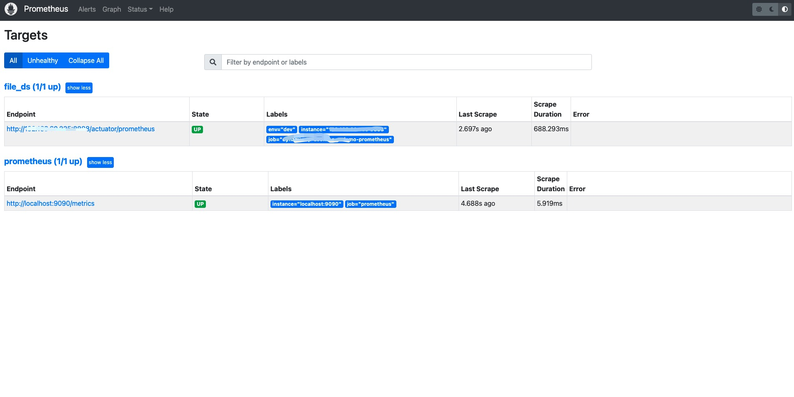
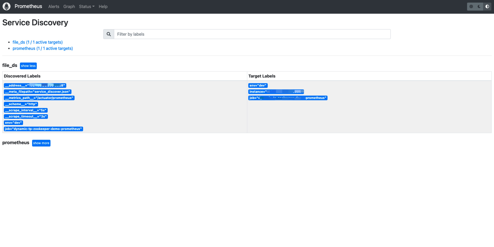

# Prometheus基于文件的服务发现 <!-- {docsify-ignore-all} -->

## 前言

&nbsp; &nbsp; 最近在做一些应用程序内部的一些组件的监控工作，比如`线程池`的监控，我这里要把监控线程池的指标暴露出去，能够让`Prometheus`抓取到，然后修改`Prometheus`的配置文件，监控的服务信息配置好，重启`Prometheus`，`Prometheus`就能够抓取数据了；这就存在一个问题，就是每次我新增监控的实例时都需要修改`Prometheus`配置，并且重启`Prometheus`，非常不方便。所以就引出了一个概念`服务发现`，`Prometheus`也支持`服务发现`，`Prometheus`支持`Kubernetes`的服务发现，并且也支持服务注册软件`Consul`，但是我们并没有使用这两个系统，所以我这里选择不依赖第三方的软件的方式，基于文件来实现服务发现。

## 基于文件的服务发现

&nbsp; &nbsp; 在`Prometheus`支持的众多服务发现的实现方式中，基于文件的服务发现是最通用的方式。这种方式不需要依赖于任何的平台或者第三方服务。对于`Prometheus`而言也不可能支持所有的平台或者环境。通过基于文件的服务发现方式下，`Prometheus`会定时从文件中读取最新的`Target`信息，因此，你可以通过任意的方式将监控Target的信息写入即可，不需要重启`Prometheus`。

用户可以通过`JSON`或者`YAML`格式的文件，定义所有的监控目标。下面是我调试过程中创建的服务发现配置文件中内容，数据是`JSON`格式的，定义了要采集的目标`Target`，如果采集的有多个，配置多个即可，具体内容如下：

```json
[
  {
    "targets": [ "192.168.60.235:8888"],
    "labels": {
      "env": "dev",
      "job": "dynamic-tp-zookeeper-demo-prometheus"
    }
  }
]
```

之后修改`Prometheus`的配置文件，修改以下内容：增加`基于文件服务发现的job`

```yml
# my global config
global:
  # 全局采集周期
  scrape_interval: 5s # Set the scrape interval to every 5 seconds. Default is every 1 minute.
  scrape_timeout: 3s
  evaluation_interval: 15s # Evaluate rules every 15 seconds. The default is every 1 minute.

scrape_configs:
  # 基于文件服务发现的job名
  - job_name: 'file_ds'
    # 指标采集接口
    metrics_path: '/actuator/prometheus'
    file_sd_configs:
    # 服务发现的文件
    - files:
      - service_discover.json
  # The job name is added as a label `job=<job_name>` to any timeseries scraped from this config.
  - job_name: "prometheus"

    # metrics_path defaults to '/metrics'
    # scheme defaults to 'http'.

    static_configs:
      - targets: ["localhost:9090"]
```

`Prometheus`默认每5m重新读取一次文件内容，当需要修改时，可以通过refresh_interval进行设置，例如：

```yml
# 基于文件服务发现的job名
  - job_name: 'file_ds'
    # 指标采集接口
    metrics_path: '/actuator/prometheus'
    file_sd_configs:
    - refresh_interval: 1m # 一分钟读取一次文件
      # 服务发现的文件
      files:
      - service_discover.json
```

`Prometheus UI`的`Targets`下就可以看到服务发现的json文件中动态获取的监控的实例信息，以及监控任务采集状态，和自定义的标签等，如下图所示：



`Prometheus UI`的`Service Discovery`中可以看到文件方式服务发现的`Discovered Label`和`Target Labels`，如下图：

