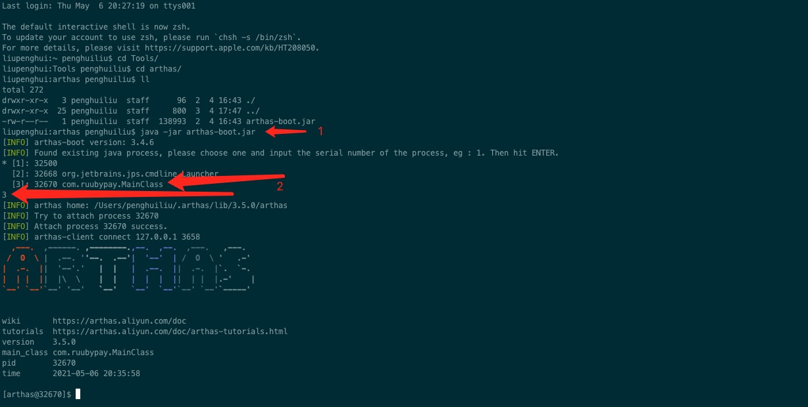

# 性能测试使用Arthas定位接口TPS极低问题

## 起因

&nbsp; &nbsp; 公司的APP后台服务有一个接口在压测时，接口的吞吐量极低，观察接口处理日志发现接口耗时很长，达到秒级的响应时间。接口中主要影响接口的处理时间初步分析时数据库查询和RPC调用，因为RPC调用时使用的以前的接口，以前的接口已经经过了压测，确认没问题，所以极有可能就是数据库操作导致的，但是接口中业务逻辑比较多，数据库的操作比较多，没办法直观的确认某一行代码某一个sql的执行速度，针对此问题，我是用Arthas来进行分析，Arthas的trace命令可以分析具体某行代码的耗时，这样就一目了然了。


## 性能测试环境安装Arthas（离线安装）

由于公司性能测试服务器的网络环境因素，不能够在线安装Arthas，所以只能离线安装，离线安装也很简单，首先我们在可以访问公网的机器上下载完整的Arthas包，包的内容如下：


将上图中的所有文件打包上传到服务器解压即可


## 启动Arthas并探测服务

Arthas的启动并探测目标服务如下图：



## trace命令定位问题

### trace com.ruubypay.service.impl.RuubyPayImpl preOpenPayCard

命令的格式是  trace 类的全路径名 方法名，所以我们线检测`preOpenPayCard`接口，监测该方法中各行代码的执行耗时，性能测试环境监测日志如下：

```
`---[3677.653272ms] com.ruubypay.service.impl.RuubyPayImpl$$EnhancerBySpringCGLIB$$1cd9b171:preOpenPayCard()
        `---[3677.607709ms] org.springframework.cglib.proxy.MethodInterceptor:intercept() #95
            `---[3676.904607ms] com.ruubypay.service.impl.RuubyPayImpl:preOpenPayCard()
                +---[0.01118ms] com.ruubypay.model.HttpModel.ModelsRuubyPay.ModelsPreOpenPayCardResponse:<init>() #137
                +---[0.007641ms] com.ruubypay.model.HttpModel.ModelsRuubyPay.ModelsPreOpenPayCardRequest:getUserID() #144
                +---[0.023187ms] com.ruubypay.model.HttpModel.ModelsRuubyPay.ModelsPreOpenPayCardRequest:getMerchantNo() #95
                +---[16.83438ms] com.ruubypay.function.RuubyPayService:validCardNum() #95
                +---[0.009433ms] org.apache.commons.lang3.StringUtils:isBlank() #145
                +---[0.00801ms] com.ruubypay.model.HttpModel.ModelsRuubyPay.ModelsPreOpenPayCardRequest:getUserID() #163
                +---[0.006257ms] com.ruubypay.model.HttpModel.ModelsRuubyPay.ModelsPreOpenPayCardRequest:getCityNo() #164
                +---[0.006201ms] com.ruubypay.model.HttpModel.ModelsRuubyPay.ModelsPreOpenPayCardRequest:getMerchantNo() #165
                +---[0.006674ms] com.ruubypay.model.HttpModel.ModelsRuubyPay.ModelsPreOpenPayCardRequest:getIndustryNo() #166
                +---[0.006329ms] com.ruubypay.model.HttpModel.ModelsRuubyPay.ModelsPreOpenPayCardRequest:getPassDeviceType() #167
                +---[0.022481ms] com.ruubypay.model.HttpModel.ModelsRuubyPay.ModelsPreOpenPayCardRequest:getSystemType() #168
                +---[0.0066ms] com.ruubypay.model.HttpModel.ModelsRuubyPay.ModelsPreOpenPayCardRequest:getCardCarrier() #169
                +---[0.006319ms] com.ruubypay.model.HttpModel.ModelsRuubyPay.ModelsPreOpenPayCardRequest:getSystem() #170
                +---[0.006672ms] com.ruubypay.model.HttpModel.ModelsRuubyPay.ModelsPreOpenPayCardRequest:getBizFlag() #172
                +---[0.006223ms] com.ruubypay.model.HttpModel.ModelsRuubyPay.ModelsPreOpenPayCardRequest:getBizFlag() #95
                +---[0.017184ms] com.ruubypay.util.CommonUtil:return8Hex() #173
                +---[4.608101ms] com.ruubypay.function.RuubyPayService:getSumByUser() #174
                +---[8.018831ms] com.ruubypay.function.UserCenterFunction:getConsumerInfo() #177
                +---[0.00756ms] com.ruubypay.model.HttpModel.ModelsUserCenter.ModelsGetUserInfoResponse:getPhone_num() #179
                +---[0.008136ms] org.apache.commons.lang3.StringUtils:isBlank() #95
                +---[0.006035ms] com.ruubypay.model.HttpModel.ModelsUserCenter.ModelsGetUserInfoResponse:getPhone_num() #182
                +---[3616.455808ms] com.ruubypay.function.RuubyPayService:getItpcsSubCardOrder() #188
                +---[0.006811ms] com.ruubypay.common.enumpackage.rubbyPayEnum.RubbyPayEnum:getNumber() #198
                +---[15.959296ms] com.ruubypay.function.RiskFunction:moveBlackList() #209
                +---[0.006277ms] com.ruubypay.miss.obpsbwl.model.ModelReturn:getResCode() #211
                +---[0.056657ms] com.ruubypay.util.DateUtil:getCurrentDateTimeStr() #216
                +---[0.091439ms] com.ruubypay.util.DateUtil:parseStrDateTime() #95
                +---[14.253102ms] com.ruubypay.function.RuubyPayService:insertManage() #220
                +---[0.011491ms] org.apache.commons.lang3.StringUtils:isBlank() #222
                +---[0.007352ms] com.ruubypay.model.HttpModel.ModelsRuubyPay.ModelsPreOpenPayCardResponse:setCardNum() #226
                +---[0.006296ms] com.ruubypay.model.HttpModel.ModelsRuubyPay.ModelsPreOpenPayCardResponse:setSubCardNum() #227
                +---[0.006419ms] com.ruubypay.model.HttpModel.ModelsRuubyPay.ModelsPreOpenPayCardResponse:setPassNo() #228
                +---[0.006321ms] com.ruubypay.model.HttpModel.ModelsRuubyPay.ModelsPreOpenPayCardResponse:setOrderNo() #229
                `---[0.013463ms] com.ruubypay.common.util.ErrorCodeHelperT:getErrorReturn() #230
```

从日志中可以看到`[3616.455808ms] com.ruubypay.function.RuubyPayService:getItpcsSubCardOrder() #188`，188行的的代码执行耗时为3616.455808ms，下面我们监测这个方法

### trace com.ruubypay.function.RuubyPayService getItpcsSubCardOrder

```
`---ts=2021-04-28 20:06:20;thread_name=http-nio-8085-exec-5;id=c8;is_daemon=true;priority=5;TCCL=sun.misc.Launcher$AppClassLoader@18b4aac2
    `---[3678.072965ms] com.ruubypay.function.RuubyPayService$$EnhancerBySpringCGLIB$$46a1392:getItpcsSubCardOrder()
        `---[3678.046596ms] org.springframework.cglib.proxy.MethodInterceptor:intercept() #95
            `---[3678.002673ms] com.ruubypay.function.RuubyPayService:getItpcsSubCardOrder()
                +---[0.007042ms] com.ruubypay.db.model.ItpcsSubCardOrderExample:<init>() #575
                +---[0.010887ms] com.ruubypay.db.model.ItpcsSubCardOrderExample:createCriteria() #576
                +---[0.010411ms] com.ruubypay.db.model.ItpcsSubCardOrderExample$Criteria:andMerchantNoEqualTo() #577
                +---[0.008367ms] com.ruubypay.db.model.ItpcsSubCardOrderExample$Criteria:andCardNumEqualTo() #578
                +---[0.005579ms] com.ruubypay.common.enumpackage.rubbyPayEnum.RubbyPayStatusEnum:getNumber() #579
                +---[0.009797ms] com.ruubypay.db.model.ItpcsSubCardOrderExample$Criteria:andOrderStatusEqualTo() #95
                +---[0.006532ms] com.ruubypay.common.enumpackage.rubbyPayEnum.RubbyPayEnum:getNumber() #580
                +---[0.008665ms] com.ruubypay.db.model.ItpcsSubCardOrderExample$Criteria:andOrderTypeEqualTo() #95
                +---[0.00974ms] com.ruubypay.db.model.ItpcsSubCardOrderExample$Criteria:andTaskIdIsNull() #581
                `---[3677.81058ms] com.ruubypay.db.mapper.ItpcsSubCardOrderMapper:selectByExample() #582
```

根据监测日志可以看到``---[3677.81058ms] com.ruubypay.db.mapper.ItpcsSubCardOrderMapper:selectByExample() #582`这行代码耗时3677.81058ms，这是一个数据库的查询sql，可以肯定就是这个sql执行时间长导致了极低的吞吐量，将sql与拿出来查看执行计划，发现该sql虽然是有索引命中，但是由于sql中条件语句的的条件范围覆盖了所有数据，导致了每次查询其实还是全表扫描，最后修改sql条件顺序并添加新的索引解决问题。

## 总结

&nbsp; &nbsp; 对于这种吞吐量极低的问题，一开始我们就能判断出数据库慢查询或者RPC调用导致，对于一个业务复杂的接口可能涉及到多次RPC调用和多次数据库的操作，这时我们要是一点一点的去进行排查肯定是非常浪费时间，所以使用Arthas监测代码耗时非常方便直观，大大的提高工作效率。