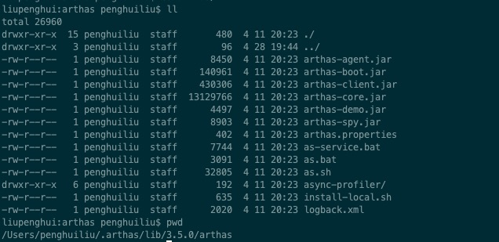

# 性能测试使用Arthas定位接口TPS极低问题

## 起因

&nbsp; &nbsp; 公司的APP后台服务有一个接口在压测时，接口的吞吐量极低，观察接口处理日志发现接口耗时很长，达到秒级的响应时间。接口中主要影响接口的处理时间初步分析时数据库查询和RPC调用，因为RPC调用时使用的以前的接口，以前的接口已经经过了压测，确认没问题，所以极有可能就是数据库操作导致的，但是接口中业务逻辑比较多，数据库的操作比较多，没办法直观的确认某一行代码某一个sql的执行速度，针对此问题，我是用Arthas来进行分析，Arthas的trace命令可以分析具体某行代码的耗时，这样就一目了然了。

## 性能测试环境安装Arthas（离线安装）

&nbsp; &nbsp; 由于公司性能测试服务器的网络环境因素，不能够在线安装Arthas，所以只能离线安装，离线安装也很简单，首先我们在可以访问公网的机器上下载完整的Arthas包，包的内容如下：

