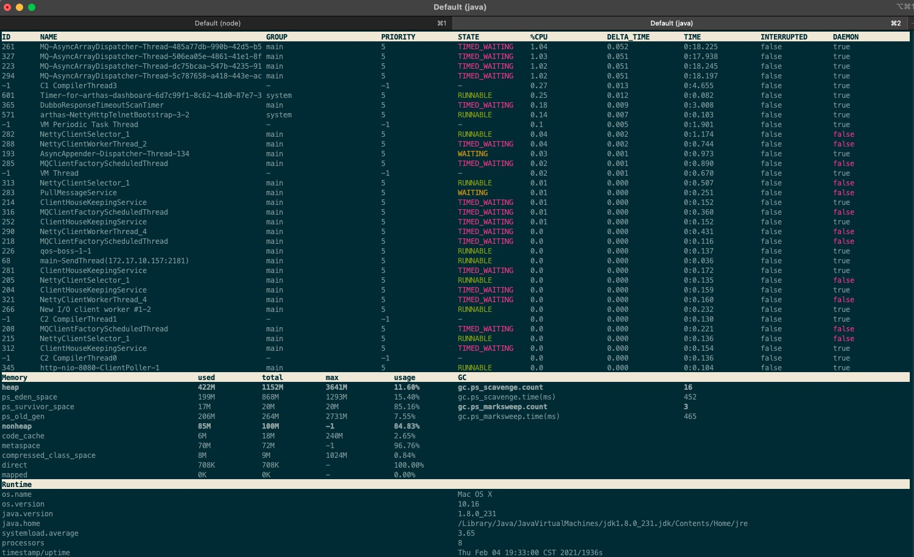

# Arthas初探

## Arthas简介

Arthas 是Alibaba开源的Java诊断工具，深受开发者喜爱。

当你遇到以下类似问题而束手无策时，Arthas可以帮助你解决：

- 这个类从哪个 jar 包加载的？为什么会报各种类相关的 Exception？
- 我改的代码为什么没有执行到？难道是我没 commit？分支搞错了？
- 遇到问题无法在线上 debug，难道只能通过加日志再重新发布吗？
- 线上遇到某个用户的数据处理有问题，但线上同样无法 debug，线下无法重现！
- 是否有一个全局视角来查看系统的运行状况？
- 有什么办法可以监控到JVM的实时运行状态？
- 怎么快速定位应用的热点，生成火焰图？

 &nbsp;

Arthas支持JDK 6+，支持Linux/Mac/Windows，采用命令行交互模式，同时提供丰富的 Tab 自动补全功能，进一步方便进行问题的定位和诊断。

## 安装Arthas

### 快速安装

- 下载`arthas-boot.jar`，然后用`java -jar`的方式启动：

```
curl -O https://arthas.aliyun.com/arthas-boot.jar
// 注意，启动的时候要确保有java应用进程，或者指定java应用进程ID
java -jar arthas-boot.jar

如果下载的慢也可以用下面的命令：
java -jar arthas-boot.jar --repo-mirror aliyun --use-http
```

### 快速入门

- **启动arthas**

```
liupenghui:arthas penghuiliu$ java -jar arthas-boot.jar
[INFO] arthas-boot version: 3.4.6
[INFO] Found existing java process, please choose one and input the serial number of the process, eg : 1. Then hit ENTER.
* [1]: 72483 com.ruubypay.miss.core.TransDisposeConsumer
  [2]: 72482 org.jetbrains.jps.cmdline.Launcher
  [3]: 72338
  [4]: 72367 org.jetbrains.idea.maven.server.RemoteMavenServer36
  [5]: 72366 org.jetbrains.idea.maven.server.RemoteMavenServer36
```
- **选择应用的Java进程**

  例如，`pid`为72483的进程，我们打 `1` 然后 `回车`即可

- **查看dashboard**

    

- **通过thread命令来获取到应用进程的Main Class**

thread 1会打印线程ID 1的栈，通常是main函数的线程

- **通过jad来反编译Main Class**

jad com.ruubypay.miss.core.TransDisposeConsumer

- **watch 命令可以查看函数返回值**

- **退出Arthas**

如果只是退出当前的连接，可以用`quit`或者`exit`命令。Attach到目标进程上的arthas还会继续运行，端口会保持开放，下次连接时可以直接连接上。

如果想完全退出arthas，可以执行`stop`命令。

## 进阶使用

### 基础命令

- help——查看命令帮助信息
- [cat](https://arthas.gitee.io/cat.html)——打印文件内容，和linux里的cat命令类似
- [echo](https://arthas.gitee.io/echo.html)–打印参数，和linux里的echo命令类似
- [grep](https://arthas.gitee.io/grep.html)——匹配查找，和linux里的grep命令类似
- [base64](https://arthas.gitee.io/base64.html)——base64编码转换，和linux里的base64命令类似
- [tee](https://arthas.gitee.io/tee.html)——复制标准输入到标准输出和指定的文件，和linux里的tee命令类似
- [pwd](https://arthas.gitee.io/pwd.html)——返回当前的工作目录，和linux命令类似
- cls——清空当前屏幕区域
- session——查看当前会话的信息
- [reset](https://arthas.gitee.io/reset.html)——重置增强类，将被 Arthas 增强过的类全部还原，Arthas 服务端关闭时会重置所有增强过的类
- version——输出当前目标 Java 进程所加载的 Arthas 版本号
- history——打印命令历史
- quit——退出当前 Arthas 客户端，其他 Arthas 客户端不受影响
- stop——关闭 Arthas 服务端，所有 Arthas 客户端全部退出
- [keymap](https://arthas.gitee.io/keymap.html)——Arthas快捷键列表及自定义快捷键

### jvm相关

- [dashboard](https://arthas.gitee.io/dashboard.html)——当前系统的实时数据面板
- [thread](https://arthas.gitee.io/thread.html)——查看当前 JVM 的线程堆栈信息
- [jvm](https://arthas.gitee.io/jvm.html)——查看当前 JVM 的信息
- [sysprop](https://arthas.gitee.io/sysprop.html)——查看和修改JVM的系统属性
- [sysenv](https://arthas.gitee.io/sysenv.html)——查看JVM的环境变量
- [vmoption](https://arthas.gitee.io/vmoption.html)——查看和修改JVM里诊断相关的option
- [perfcounter](https://arthas.gitee.io/perfcounter.html)——查看当前 JVM 的Perf Counter信息
- [logger](https://arthas.gitee.io/logger.html)——查看和修改logger
- [getstatic](https://arthas.gitee.io/getstatic.html)——查看类的静态属性
- [ognl](https://arthas.gitee.io/ognl.html)——执行ognl表达式
- [mbean](https://arthas.gitee.io/mbean.html)——查看 Mbean 的信息
- [heapdump](https://arthas.gitee.io/heapdump.html)——dump java heap, 类似jmap命令的heap dump功能

### class/classloader相关

- [sc](https://arthas.gitee.io/sc.html)——查看JVM已加载的类信息
- [sm](https://arthas.gitee.io/sm.html)——查看已加载类的方法信息
- [jad](https://arthas.gitee.io/jad.html)——反编译指定已加载类的源码
- [mc](https://arthas.gitee.io/mc.html)——内存编译器，内存编译`.java`文件为`.class`文件
- [retransform](https://arthas.gitee.io/retransform.html)——加载外部的`.class`文件，retransform到JVM里
- [redefine](https://arthas.gitee.io/redefine.html)——加载外部的`.class`文件，redefine到JVM里
- [dump](https://arthas.gitee.io/dump.html)——dump 已加载类的 byte code 到特定目录
- [classloader](https://arthas.gitee.io/classloader.html)——查看classloader的继承树，urls，类加载信息，使用classloader去getResource

### monitor/watch/trace相关

> 请注意，这些命令，都通过字节码增强技术来实现的，会在指定类的方法中插入一些切面来实现数据统计和观测，因此在线上、预发使用时，请尽量明确需要观测的类、方法以及条件，诊断结束要执行 `stop` 或将增强过的类执行 `reset` 命令。

- [monitor](https://arthas.gitee.io/monitor.html)——方法执行监控
- [watch](https://arthas.gitee.io/watch.html)——方法执行数据观测
- [trace](https://arthas.gitee.io/trace.html)——方法内部调用路径，并输出方法路径上的每个节点上耗时
- [stack](https://arthas.gitee.io/stack.html)——输出当前方法被调用的调用路径
- [tt](https://arthas.gitee.io/tt.html)——方法执行数据的时空隧道，记录下指定方法每次调用的入参和返回信息，并能对这些不同的时间下调用进行观测

### profiler/火焰图

- [profiler](https://arthas.gitee.io/profiler.html)–使用[async-profiler](https://github.com/jvm-profiling-tools/async-profiler)对应用采样，生成火焰图

### options

- [options](https://arthas.gitee.io/options.html)——查看或设置Arthas全局开关

### 管道

Arthas支持使用管道对上述命令的结果进行进一步的处理，如`sm java.lang.String * | grep 'index'`

- grep——搜索满足条件的结果
- plaintext——将命令的结果去除ANSI颜色
- wc——按行统计输出结果

### 后台异步任务

当线上出现偶发的问题，比如需要watch某个条件，而这个条件一天可能才会出现一次时，异步后台任务就派上用场了，详情请参考[这里](https://arthas.gitee.io/async.html)

- 使用 > 将结果重写向到日志文件，使用 & 指定命令是后台运行，session断开不影响任务执行（生命周期默认为1天）
- jobs——列出所有job
- kill——强制终止任务
- fg——将暂停的任务拉到前台执行
- bg——将暂停的任务放到后台执行