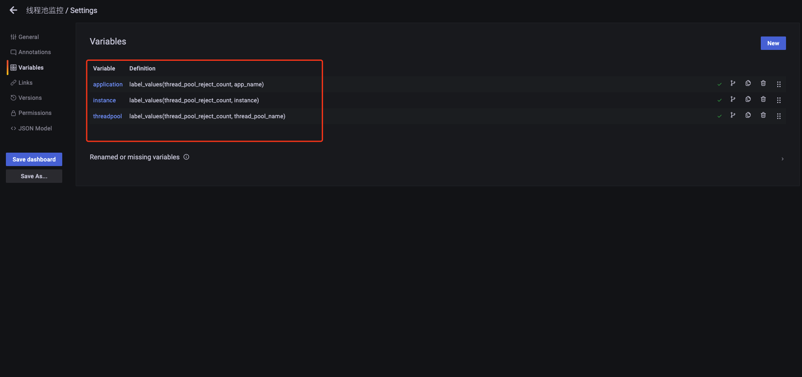
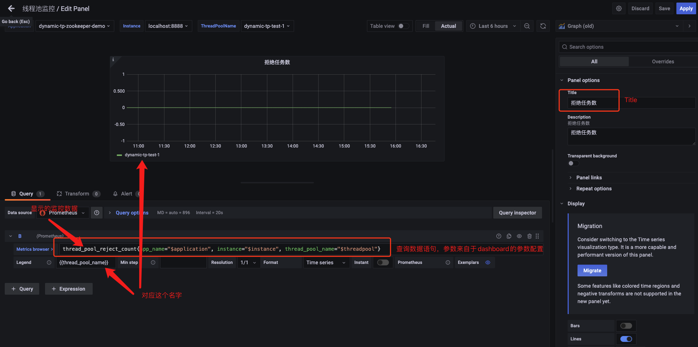
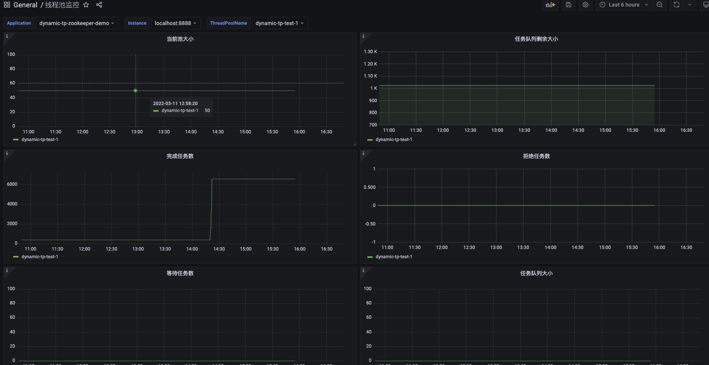

# 动态线程池dynamic-tp快速接入 <!-- {docsify-ignore-all} -->

## 前言

&nbsp; &nbsp; `dynamic-tp`是一个轻量级的动态线程池插件，它是一个基于配置中心的动态线程池，线程池的参数可以通过配置中心配置进行动态的修改，目前支持的配置中心有`Apollo`,`Nacos`和`Zookeeper`，同时`dynamic-tp`支持线程池的监控和报警，具体特性如下：

- 基于`Spring`框架，现只支持`SpringBoot`项目使用，轻量级，引入 starter 即可使用

- 基于配置中心实现线程池参数动态调整，实时生效；集成主流配置中心，已支持 Nacos、Apollo，Zookeeper， 同时也提供 SPI 接口可自定义扩展实现

- 内置通知报警功能，提供多种报警维度（配置变更通知、活性报警、容量阈值报警、拒绝策略触发报警）， 默认支持企业微信、钉钉报警，同时提供 SPI 接口可自定义扩展实现

- 内置线程池指标采集功能，支持通过 MicroMeter、JsonLog 日志输出、Endpoint 三种方式，可通过 SPI 接口自定义扩展实现

- 集成管理常用第三方组件的线程池，已集成 SpringBoot 内置 WebServer（tomcat、undertow、jetty）的线程池管理

- Builder 提供`TTL`包装功能，生成的线程池支持上下文信息传递

[具体介绍及使用方式](https://github.com/lyh200/dynamic-tp)可以参考官网

&nbsp; &nbsp; 为了方便用户快速接入，笔者这里对`Zookeeper`配置中心接入做一个详细的介绍，其他配置中心的demo示例可以参考项目的`example`，该模块也是笔者贡献的。这里我会详细的介绍`Zookeeper`配置中心的接入和对接监控平台`Prometheus`和`Grafana`。

## 快速开始

#### pom依赖

&nbsp; &nbsp; `dynamic-tp-spring-boot-starter-zookeeper`是集成`dynamic-tp`的starter，这里引入了`micrometer-registry-prometheus`和`spring-boot-starter-actuator`用于对接`Prometheus`。

```xml
    <dependencies>
        <dependency>
            <groupId>org.springframework.boot</groupId>
            <artifactId>spring-boot-starter-web</artifactId>
        </dependency>
        <dependency>
            <groupId>org.springframework.boot</groupId>
            <artifactId>spring-boot-starter-logging</artifactId>
        </dependency>
        <dependency>
            <groupId>io.github.lyh200</groupId>
            <artifactId>dynamic-tp-spring-boot-starter-zookeeper</artifactId>
            <version>1.0.2</version>
        </dependency>
        <dependency>
            <groupId>io.micrometer</groupId>
            <artifactId>micrometer-registry-prometheus</artifactId>
            <version>1.6.4</version>
        </dependency>
        <dependency>
            <groupId>org.springframework.boot</groupId>
            <artifactId>spring-boot-starter-actuator</artifactId>
        </dependency>
    </dependencies>
```

#### YML配置

```yaml
server:
  port: 8888

spring:
  application:
    name: dynamic-tp-zookeeper-demo
  # 下面是接入zk配置中心的配置  
  dynamic:
    tp:
      config-type: properties # zookeeper只支持properties配置
      zookeeper:
        config-version: 1.0.0 # 配置版本号
        zk-connect-str: 127.0.0.1:2181 # zk配置中心，如果是集群用逗号分开
        root-node: /configserver/userproject # 项目节点
        node: dynamic-tp-zookeeper-demo # 配置文件节点
# 对接prometheus
management:
  metrics:
    tags:
      application: ${spring.application.name}
  endpoints:
    web:
      exposure:
        include: '*'
```

#### 配置中心dynamic-tp-zookeeper-demo配置文件配置

注：Zookeeper配置中心只支持`properties`类型配置，配置示例如下：

`spring.dynamic.tp.executors`部分是对线程池的配置，该配置是数组类型，可以定义多个线程池
`spring.dynamic.tp.executors[1].notifyItems`部分配置是对线程池报警平台的配置，可以配置多个报警平台


```properties
# 开启动态线程池
spring.dynamic.tp.enabled=true
# 打印动态线程池banner
spring.dynamic.tp.enabledBanner=true
# 开启线程池监控指标收集
spring.dynamic.tp.enabledCollect=true
# 线程池监控指标收集类型 logging-日志文件 micrometer-采集到第三方平台 
spring.dynamic.tp.collectorType=logging
# 采集监控数据时间间隔 5s
spring.dynamic.tp.monitorInterval=5
spring.dynamic.tp.executors[0].threadPoolName=dynamic-tp-test-1
spring.dynamic.tp.executors[0].corePoolSize=50
spring.dynamic.tp.executors[0].maximumPoolSize=50
spring.dynamic.tp.executors[0].queueCapacity=3000
spring.dynamic.tp.executors[0].queueType=VariableLinkedBlockingQueue
spring.dynamic.tp.executors[0].rejectedHandlerType=CallerRunsPolicy
spring.dynamic.tp.executors[0].keepAliveTime=50
spring.dynamic.tp.executors[0].allowCoreThreadTimeOut=false
spring.dynamic.tp.executors[0].threadNamePrefix=test1
spring.dynamic.tp.executors[0].notifyItems[0].type=capacity
spring.dynamic.tp.executors[0].notifyItems[0].enabled=false
spring.dynamic.tp.executors[0].notifyItems[0].threshold=80
spring.dynamic.tp.executors[0].notifyItems[0].platforms[0]=ding
spring.dynamic.tp.executors[0].notifyItems[0].platforms[1]=wechat
spring.dynamic.tp.executors[0].notifyItems[0].interval=120
spring.dynamic.tp.executors[0].notifyItems[1].type=change
spring.dynamic.tp.executors[0].notifyItems[1].enabled=false
spring.dynamic.tp.executors[0].notifyItems[2].type=liveness
spring.dynamic.tp.executors[0].notifyItems[2].enabled=false
spring.dynamic.tp.executors[0].notifyItems[2].threshold=80
spring.dynamic.tp.executors[0].notifyItems[3].type=reject
spring.dynamic.tp.executors[0].notifyItems[3].enabled=false
spring.dynamic.tp.executors[0].notifyItems[3].threshold=1
spring.dynamic.tp.executors[1].threadPoolName=dynamic-tp-test-2
spring.dynamic.tp.executors[1].corePoolSize=20
spring.dynamic.tp.executors[1].maximumPoolSize=30
spring.dynamic.tp.executors[1].queueCapacity=1000
spring.dynamic.tp.executors[1].queueType=VariableLinkedBlockingQueue
spring.dynamic.tp.executors[1].rejectedHandlerType=CallerRunsPolicy
spring.dynamic.tp.executors[1].keepAliveTime=50
spring.dynamic.tp.executors[1].allowCoreThreadTimeOut=false
spring.dynamic.tp.executors[1].threadNamePrefix=test2
spring.dynamic.tp.executors[1].notifyItems[0].type=capacity
spring.dynamic.tp.executors[1].notifyItems[0].enabled=false
spring.dynamic.tp.executors[1].notifyItems[0].threshold=80
spring.dynamic.tp.executors[1].notifyItems[0].platforms[0]=ding
spring.dynamic.tp.executors[1].notifyItems[0].platforms[1]=wechat
spring.dynamic.tp.executors[1].notifyItems[0].interval=120
spring.dynamic.tp.executors[1].notifyItems[1].type=change
spring.dynamic.tp.executors[1].notifyItems[1].enabled=false
spring.dynamic.tp.executors[1].notifyItems[2].type=liveness
spring.dynamic.tp.executors[1].notifyItems[2].enabled=false
spring.dynamic.tp.executors[1].notifyItems[2].threshold=80
spring.dynamic.tp.executors[1].notifyItems[3].type=reject
spring.dynamic.tp.executors[1].notifyItems[3].enabled=false
spring.dynamic.tp.executors[1].notifyItems[3].threshold=1
```

#### 创建线程池

&nbsp; &nbsp; 创建线程池，会注册到`dynamic-tp`

```java
@Configuration
public class ThreadPoolConfiguration {

    @Bean
    public DtpExecutor dtpExecutor() {

        return ThreadPoolCreator.createDynamicFast("dynamic-tp-test-1");
    }

    @Bean
    public ThreadPoolExecutor threadPoolExecutor() {
        return ThreadPoolBuilder.newBuilder()
                .threadPoolName("dynamic-tp-test-2")
                .corePoolSize(10)
                .maximumPoolSize(15)
                .keepAliveTime(15000)
                .timeUnit(TimeUnit.MILLISECONDS)
                .workQueue(QueueTypeEnum.SYNCHRONOUS_QUEUE.getName(), null, false)
                .buildDynamic();
    }
}
```

#### 使用

&nbsp; &nbsp; 初次使用不注意官网文档的话可能会通过`@Autowired`的方式使用，目前版本这么使用是不正确的，因为当读取配置文件后，配置文件生成的线程池对象就会把`@Bean`创建的线程池覆盖了，所以目前版本只能根据名字从`DtpRegistry`获取线程池对象了，笔者也和项目作者沟通过，项目作者也觉得通过`@Autowired`方式更好一些，后面版本也会优化。

```java
@Slf4j
@RestController
@SuppressWarnings("all")
public class TestController {

    @GetMapping("/dtp-zookeeper-example/test")
    public String test() {
        new Thread(() -> {
            try {
                task();
            } catch (InterruptedException e) {
                e.printStackTrace();
            }
        }).start();
        return "success";
    }

    public void task() throws InterruptedException {
        DtpExecutor dtpExecutor1 = DtpRegistry.getExecutor("dynamic-tp-test-1");
        DtpExecutor dtpExecutor2 = DtpRegistry.getExecutor("dynamic-tp-test-2");
        for (int i = 0; i < 100; i++) {
            Thread.sleep(100);
            dtpExecutor1.execute(() -> {
                log.info("i am dynamic-tp-test-1 task");
            });
            dtpExecutor2.execute(() -> {
                log.info("i am dynamic-tp-test-2 task");
            });
        }
    }
}
```

## 监控数据和第三方平台对接

#### logging方式

&nbsp; &nbsp; `spring.dynamic.tp.collectorType=logging`,logging方式的监控数据，采集日志文件中，文件的位置可以通过`spring.dynamic.tp.logPath`配置，默认 ${user.home}/logs，日志内容如下：

```log
2022-03-07 13:48:31.585 INFO [dtp-monitor1:D.M.LOG] {"activeCount":0,"queueSize":0,"largestPoolSize":0,"poolSize":0,"rejectHandlerName":"CallerRunsPolicy","queueCapacity":0,"fair":false,"rejectCount":0,"waitTaskCount":0,"taskCount":0,"queueRemainingCapacity":0,"corePoolSize":40,"queueType":"SynchronousQueue","completedTaskCount":0,"dtpName":"dynamic-tp-test-2","maximumPoolSize":55}
2022-03-07 13:48:31.585 INFO [dtp-monitor1:D.M.LOG] {"activeCount":0,"queueSize":0,"largestPoolSize":0,"poolSize":0,"queueCapacity":2147483647,"fair":false,"rejectCount":0,"waitTaskCount":0,"taskCount":0,"queueRemainingCapacity":2147483647,"corePoolSize":10,"queueType":"TaskQueue","completedTaskCount":0,"dtpName":"tomcatWebServerTp","maximumPoolSize":200}
2022-03-07 13:48:36.590 INFO [dtp-monitor1:D.M.LOG] {"activeCount":0,"queueSize":0,"largestPoolSize":0,"poolSize":0,"rejectHandlerName":"CallerRunsPolicy","queueCapacity":1024,"fair":false,"rejectCount":0,"waitTaskCount":0,"taskCount":0,"queueRemainingCapacity":1024,"corePoolSize":50,"queueType":"VariableLinkedBlockingQueue","completedTaskCount":0,"dtpName":"dynamic-tp-test-1","maximumPoolSize":50}
2022-03-07 13:48:36.590 INFO [dtp-monitor1:D.M.LOG] {"activeCount":0,"queueSize":0,"largestPoolSize":0,"poolSize":0,"rejectHandlerName":"CallerRunsPolicy","queueCapacity":0,"fair":false,"rejectCount":0,"waitTaskCount":0,"taskCount":0,"queueRemainingCapacity":0,"corePoolSize":40,"queueType":"SynchronousQueue","completedTaskCount":0,"dtpName":"dynamic-tp-test-2","maximumPoolSize":55}
2022-03-07 13:48:36.590 INFO [dtp-monitor1:D.M.LOG] {"activeCount":0,"queueSize":0,"largestPoolSize":0,"poolSize":0,"queueCapacity":2147483647,"fair":false,"rejectCount":0,"waitTaskCount":0,"taskCount":0,"queueRemainingCapacity":2147483647,"corePoolSize":10,"queueType":"TaskQueue","completedTaskCount":0,"dtpName":"tomcatWebServerTp","maximumPoolSize":200}
```

#### MicroMeter方式

&nbsp; &nbsp; `spring.dynamic.tp.collectorType=micrometer` 采集数据到第三方平台，这里使用的是`Prometheus`。可视化展示需要在`Grafana`平台配置，数据源选择`Prometheus`，然后创建`Dashboard`，先要在`Dashboard`配置动态的参数`Variables`，如下图：



&nbsp; &nbsp; 配置完参数后，我们创建`Panel`，可以创建多个`Panel`，然后配置`Panel`的数据查询，报警显示等等，如下图：



&nbsp; &nbsp; 最终的Dashboard如下图：




## 总结

&nbsp; &nbsp; 促使我使用`dynamic-tp`的一个最主要的点就是它轻量级，提供了线程池监控、报警、基于配置中心修改线程池参数功能，完全满足了我在业务中的需要，同时监控数据能够对接公司现有的监控平台（Prometheus+Grafana），并且在使用上也十分方便，我在刚接触这个插件的时候它还不支持`Zookeeper`，恰好我司使用的配置中心就是`Zookeeper`，因为我在此基础上把`Zookeeper`配置中心集成到了`dynamic-tp`并贡献给社区，希望可以帮到更多的人，下一篇简单介绍下`dynamic-tp`支持`Zookeeper`的实现细节。