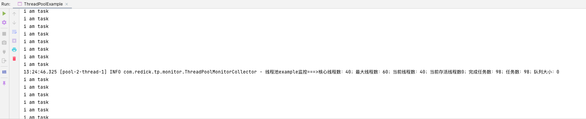

# Java实现简单的线程池监控 <!-- {docsify-ignore-all} -->

## 前言

&nbsp; &nbsp; 在平时的开发当中都会接触到多线程的程序，通常我们都是使用线程池而不是直接的创建线程；在使用线程池的时候总给我的感觉就是像一个黑盒子，线程池内部的情况都不清楚，但其实线程池的实现都为我们提供了在运行时查看线程池数据的方法，所以针对于此，来简单的实现一个线程池监控，能够定时上报线程池的情况。

## 大致思路

&nbsp; &nbsp; 实现一个简单的线程池监控，我一开始梳理了以下几个流程

- 定义一个容器，用于在应用程序初始化线程池的时候将线程池缓存到容器中，用于后续从中拿线程池做监控
- 基于线程池做一层封装，用于创建动态线程池
- 定义一个定时任务，定时的收集容器中线程池的参数

&nbsp; &nbsp; 我这里边只是做了最简单的实现监控数据也只是打印到日志中了，数据可以存起来以便于做展示，报警等，还可以提供一些API用于动态的修改线程池的参数。

## 线程池容器定义

&nbsp; &nbsp; 一个简单的map用来存储线程池

```java
public class ThreadPoolContainer {

    private static final Map<String, ThreadPoolExecutor> container = new ConcurrentHashMap<>(16);

    public static void addThreadPool(String key, ThreadPoolExecutor executor) {
        container.put(key, executor);
    }

    public static Map<String, ThreadPoolExecutor> getContainer() {
        return container;
    }
}
```

## 线程池封装

&nbsp; &nbsp; 使用建造者模式封装线程池，基于LinkedBlockingQueue自定义动态队列

```java
public interface Builder<T> extends Serializable {

    /**
     * build
     * @return T
     */
    T build();
}
```

&nbsp; &nbsp; 基于LinkedBlockingQueue和反射实现动态队列

```java
public class ResizableCapacityLinkedBlockIngQueue<E> extends LinkedBlockingQueue<E> {

    public ResizableCapacityLinkedBlockIngQueue(int capacity) {
        super(capacity);
    }

    public synchronized void setCapacity(int capacity) {
        int oldCapacity = (int) ReflectUtil.getFieldValue(this, "capacity");
        AtomicInteger count = (AtomicInteger) ReflectUtil.getFieldValue(this, "count");
        int size = count.get();

        ReflectUtil.setFieldValue(this, "capacity", capacity);
        if (capacity > size && size >= oldCapacity) {
            ReflectUtil.invoke(this, "signalNotFull");
        }
    }
}
```

&nbsp; &nbsp; 创建完线程后将线程放到容器中，这里如果不实用封装线程池也是可以的，使用原生线程池也只要将线程池注册到容器中就可以了

```java
public class ThreadPoolBuilder implements Builder<ThreadPoolExecutor> {

    public static ThreadPoolBuilder builder() {
        return new ThreadPoolBuilder();
    }

    private Integer corePoolSize = defaultCorePoolSize();

    private Integer defaultCorePoolSize() {
        int cpuCoreNum = Runtime.getRuntime().availableProcessors();
        return new BigDecimal(cpuCoreNum).divide(new BigDecimal("0.2")).intValue();
    }

    private Integer maxPoolSize = corePoolSize + (corePoolSize >> 1);

    private Long keepAliveTime = 30000L;

    private TimeUnit timeUnit = TimeUnit.MILLISECONDS;

    private RejectedExecutionHandler handler = new ThreadPoolExecutor.AbortPolicy();

    private Integer queueCapacity = 1000;

    private String threadFactoryPrefix;

    public ThreadPoolBuilder corePoolSize(int corePoolSize){
        this.corePoolSize = corePoolSize;
        return this;
    }

    public ThreadPoolBuilder maxPoolSize(int maxPoolSize){
        this.maxPoolSize = maxPoolSize;
        return this;
    }

    public ThreadPoolBuilder keepAliveTime(Long keepAliveTime) {
        this.keepAliveTime = keepAliveTime;
        return this;
    }

    public ThreadPoolBuilder timeUnit(TimeUnit timeUnit) {
        this.timeUnit = timeUnit;
        return this;
    }

    public ThreadPoolBuilder handler(RejectedExecutionHandler handler) {
        this.handler = handler;
        return this;
    }

    public ThreadPoolBuilder queueCapacity(Integer queueCapacity) {
        this.queueCapacity = queueCapacity;
        return this;
    }

    public ThreadPoolBuilder threadFactoryPrefix(String threadFactoryPrefix) {
        this.threadFactoryPrefix = threadFactoryPrefix;
        return this;
    }


    @Override
    public ThreadPoolExecutor build() {
        return buildDynamicThreadPool(this);
    }

    private ThreadPoolExecutor buildDynamicThreadPool(ThreadPoolBuilder threadPoolBuilder) {
        ThreadPoolExecutor executor = new ThreadPoolExecutor(threadPoolBuilder.corePoolSize, threadPoolBuilder.maxPoolSize,
                threadPoolBuilder.keepAliveTime, threadPoolBuilder.timeUnit, new ResizableCapacityLinkedBlockIngQueue<>(threadPoolBuilder.queueCapacity),
                new ThreadFactoryBuilder().setNameFormat(threadPoolBuilder.threadFactoryPrefix).build(), threadPoolBuilder.handler);
        // 初始化线程池到容器中
        ThreadPoolContainer.addThreadPool(threadPoolBuilder.threadFactoryPrefix, executor);
        return executor;
    }
}
```

## 线程池数据收集

```java
@Slf4j
public class ThreadPoolMonitorCollector implements Collector {

    private final ScheduledExecutorService scheduledExecutorService = Executors.newScheduledThreadPool(1);

    @Override
    public void collect() {
        scheduledExecutorService.scheduleWithFixedDelay(this::monitor, 2, 10000, TimeUnit.MILLISECONDS);
    }

    public void monitor() {
        Map<String, ThreadPoolExecutor> threadPoolExecutorMap = ThreadPoolContainer.getContainer();

        threadPoolExecutorMap.forEach((k, executor) -> {
            int corePoolSize = executor.getCorePoolSize();
            int maxPoolSize = executor.getMaximumPoolSize();
            int poolSize = executor.getPoolSize();
            int activeCount= executor.getActiveCount();
            long completedTaskCount = executor.getCompletedTaskCount();
            long taskCount = executor.getTaskCount();
            int queueSize = executor.getQueue().size();
            log.info("线程池" + k + "监控===>" + "核心线程数：" + corePoolSize + "；最大线程数：" + maxPoolSize + "；当前线程数："
                    + poolSize + "；当前存活线程数" + activeCount + "；完成任务数：" + completedTaskCount + "；任务数："
                    + taskCount + "；队列大小：" + queueSize);
        });
    }
}
```

## 测试

```java
public class ThreadPoolExample {

    public static void main(String[] args) throws InterruptedException {
        ThreadPoolExecutor executor = ThreadPoolBuilder.builder().threadFactoryPrefix("example").build();

        Collector collector = new ThreadPoolMonitorCollector();
        collector.collect();
        // 任务线程
        for (int i = 0; i < 10000; i++) {
            Thread.sleep(100);
            Thread t = new Thread(() -> {
                System.out.println("i am task");
            });
            executor.execute(t);
        }
    }
}
```

&nbsp; &nbsp; 测试结果

