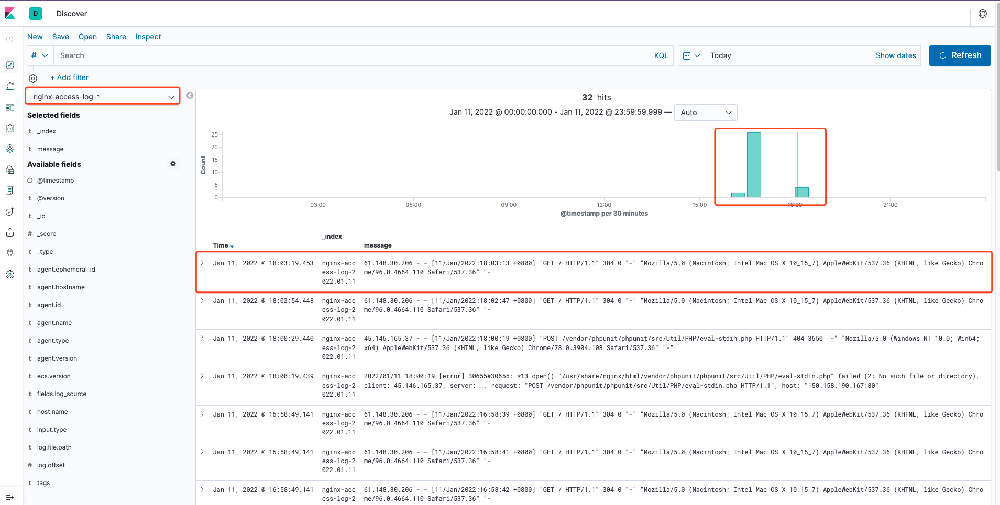

# Docker搭建ELK <!-- {docsify-ignore-all} -->


## ELK+Filebeat几种架构

[架构参考](https://beckjin.com/2017/12/10/elk/)


## Docker部署ElasticSearch

&nbsp; &nbsp; 这里基于`Docker`简单单机部署，普通部署和集群部署可以参考[官方文档](https://docs.es.shiyueshuyi.xyz/#/setup/install/linux)。

#### 拉取镜像

```shell
docker pull elasticsearch:7.6.2
```

#### 指定单机启动


<span style="color:red;">注：通过ES_JAVA_OPTS设置ES初始化内存，否则在验证时可能会起不来</span>

```shell
docker run --restart=always -p 9200:9200 -p 9300:9300 -e "discovery.type=single-node" \
-e ES_JAVA_OPTS="-Xms512m -Xmx512m" \
--name='elasticsearch' --cpuset-cpus="1" -m 2G -d elasticsearch:7.6.2
```

#### 验证es安装成功

&nbsp; &nbsp; 浏览器地址栏输入：http://127.0.0.1:9200/，浏览器页面显示如下内容：

```json
{
  "name" : "6eebe74f081b",
  "cluster_name" : "docker-cluster",
  "cluster_uuid" : "jgCr_SQbQXiimyAyOEqk9g",
  "version" : {
    "number" : "7.6.2",
    "build_flavor" : "default",
    "build_type" : "docker",
    "build_hash" : "ef48eb35cf30adf4db14086e8aabd07ef6fb113f",
    "build_date" : "2020-03-26T06:34:37.794943Z",
    "build_snapshot" : false,
    "lucene_version" : "8.4.0",
    "minimum_wire_compatibility_version" : "6.8.0",
    "minimum_index_compatibility_version" : "6.0.0-beta1"
  },
  "tagline" : "You Know, for Search"
}
```

## Docker部署Kibana

#### 拉取镜像

```shell
docker pull kibana:7.4.1
```

#### 指定一个路径创建一个config目录,用于存放kibana.yml

```shell
mkdir -p /usr/local/kibana/config
```

#### 配置kibana.yml文件，指定elasticsearch的访问路径

```yml
server.host: '0.0.0.0'
elasticsearch.hosts: ["http://ip:9200"]
# elasticsearch.url: 'http://ip:9200'
xpack:
  apm.ui.enabled: false
  graph.enabled: false
  ml.enabled: false
  monitoring.enabled: false
  reporting.enabled: false
  security.enabled: false
  grokdebugger.enabled: false
  searchprofiler.enabled: false
```

#### 运行容器

```shell
docker run --restart=always  --privileged=true --name=kibana -p 5601:5601  -v /usr/local/kibana/config/kibana.yml:/usr/share/kibana/config/kibana.yml kibana:7.4.1
```

## Docker安装Logstash

#### 拉取镜像

```shell
docker pull logstash:7.16.2
```

#### 创建挂载文件等

创建文件夹，并且在这个文件夹下创建启动容器的配置文件

```shell
mkidr /data/service/docker/logstash -p
cd /data/service/docker/logstash/
vim logstash.yml    ##新建文件，添加如下两行
 path.config: /usr/share/logstash/conf.d/*.conf     ##注意这行是表示容器里面配置文件的路径，照写就行，不要写成自己本地新建的路径
 path.logs: /var/log/logstash
```

#### 创建日志输入输出配置

在`/data/service/docker/logstash/`文件夹下创建`conf.d`文件夹，并且创建一个输入输出的测试配置摁键`test.conf`

```shell
mkdir conf.d
cd conf.d
vim test.conf

## 配置内容
input {
    beats {
      port => 5044
      codec => "json"
   }
}

output {
  elasticsearch {
        hosts => ["http://esip:9200"] # 如果是es集群，配置集群即可。如：["http://esip1:9200", "http://esip2:9200", "http://esip3:9200"] 
        index => "nginx-access-log-%{+YYYY.MM.dd}"
  }
  stdout { codec => rubydebug }
}
```

#### 启动容器

```shell
docker run -it -d -p 5044:5044 --name logstash -v /data/service/docker/logstash/logstash.yml:/usr/share/logstash/config/logstash.yml -v /data/service/docker/logstash/conf.d/:/usr/share/logstash/conf.d/ logstash:7.16.2
```

## Docker部署Filebeat

#### 拉取镜像

```shell
docker pull store/elastic/filebeat:7.16.2
```

#### 创建配置文件

```shell
mkdir /data/service/docker/filebeat
cd /data/service/docker/filebeat/
wget https://raw.githubusercontent.com/elastic/beats/7.1/deploy/docker/filebeat.docker.yml   ##获取官网默认配置文件
vim filebeat.docker.yml

# 配置修改如下：

# filebeat.config:
#   modules:
#     path: ${path.config}/modules.d/*.yml
#     reload.enabled: false

# filebeat.autodiscover:
#   providers:
#     - type: docker
#       hints.enabled: true

# processors:
# - add_cloud_metadata: ~

# output.elasticsearch:
#   hosts: '${ELASTICSEARCH_HOSTS:elasticsearch:9200}'
#   username: '${ELASTICSEARCH_USERNAME:}'
#   password: '${ELASTICSEARCH_PASSWORD:}'
#
filebeat.inputs:
- type: log
  enabled: true
  paths: # 日志匹配，这里使用nginx的日志
  - /var/log/nginx/*.log
  fields:
    log_source: nginx

output.logstash:
  hosts: ["logstash的ip:5044"]
```

#### 启动容器

```shell
docker run --name filebeat --user=root -d -v /var/log/nginx/:/var/log/nginx/ -v /data/service/docker/filebeat/filebeat.docker.yml:/usr/share/filebeat/filebeat.yml:ro -v /var/lib/docker/containers:/var/lib/docker/containers:ro -v /var/run/docker.sock:/var/run/docker.sock:ro store/elastic/filebeat:7.16.2
```

## 验证测试

#### 查看logstash的日志，如下正常：

```shell
docker logs -f logstash
```

日志：

```json
{
          "tags" => [
        [0] "_jsonparsefailure",
        [1] "beats_input_codec_json_applied"
    ],
    "@timestamp" => 2022-01-11T10:03:19.453Z,
       "message" => "61.148.30.206 - - [11/Jan/2022:18:03:13 +0800] \"GET / HTTP/1.1\" 304 0 \"-\" \"Mozilla/5.0 (Macintosh; Intel Mac OS X 10_15_7) AppleWebKit/537.36 (KHTML, like Gecko) Chrome/96.0.4664.110 Safari/537.36\" \"-\"",
        "fields" => {
        "log_source" => "nginx"
    },
           "ecs" => {
        "version" => "1.12.0"
    },
         "agent" => {
                "name" => "de0c1259b416",
             "version" => "7.16.2",
                  "id" => "cc05af57-5a25-4b40-b0eb-6a526b12d7ff",
        "ephemeral_id" => "dec9ee27-c65e-437d-a46d-8e3628c7eb72",
            "hostname" => "de0c1259b416",
                "type" => "filebeat"
    },
           "log" => {
          "file" => {
            "path" => "/var/log/nginx/access.log"
        },
        "offset" => 6789
    },
          "host" => {
        "name" => "de0c1259b416"
    },
      "@version" => "1",
         "input" => {
        "type" => "log"
    }
}
```

#### 查看Kibana



## 总结

&nbsp; &nbsp; 本篇主要介绍了通过docker部署ELK日志查询系统，搭建的架构是使用filebeat收集日志并输出到logstash，logstash负责解析，格式化日志发送到elastic-search，用户通过Kibana进行日志查询。使用filebeat收集日志足够快并且系统资源占用较少。