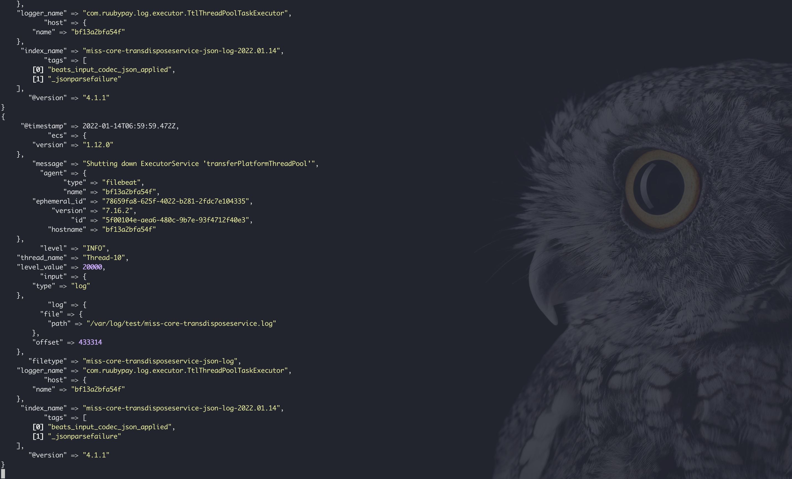
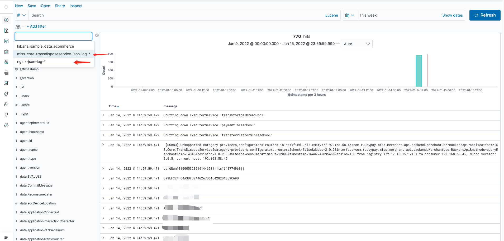

# Filebeat+Logstash收集多个日志发送到ES的不同索引 <!-- {docsify-ignore-all} -->

&nbsp; &nbsp; 在[Docker搭建ELK](/docs/blog/Middleware/elk/elk-1.md)章节中简单的介绍了基于Docker搭建ELK系统，并提供一个例子，将nginx日志收集，存储到ES，然后通过kibana进行查询日志；本篇来介绍下，如何收集多个日志并发送到ES的不同索引。

<span style="color:red;">注：本篇的实现方案都是基于docker，普通的部署方式配置也可参考；</span>


<span style="color:red;">注：ES环境已经具备，filebeat和logstash的镜像已经存在</span>

&nbsp; &nbsp; 在filebeat配置input时添加索引字段，然后传动logstash，logstash直接用这个字段当作es的索引字段发送到es。

### 日志文件准备

在/var/log/test/导入事先准备好的日志文件miss-core-transdisposeservice.log,，内容这里忽略，可以自行写日志内容；

在/var/log/nginx/目录下为nginx日志

### Filebeat端配置

- **filebeat.docker.yml作为docker部署Filebeat的配置文件**

```yml
filebeat.inputs:
- type: log
  enabled: true
  backoff: "1s"
  tail_files: false
  paths:
    - /var/log/test/*.log # 日志文件1
  fields:
    filetype: "miss-core-transdisposeservice-json-log" # 新加字段，用于es索引
  fields_under_root: true
- type: log
  enable: true
  backoff: "1s"
  tail_files: false
  paths:
    - /var/log/nginx/*.log # 日志文件2
  fields:
    filetype: "nginx-json-log" # 新加字段，用于es索引
  fields_under_root: true

output.logstash:
  enable: true
  hosts: ["150.158.190.167:5044"] # logstash ip端口
```

### Logstash端配置

- **logstash.yml作为docker部署Logstash的配置文件**

```yml
path.config: /usr/share/logstash/conf.d/*.conf     ##注意这行是表示容器里面配置文件的路径，照写就行，不要写成自己本地新建的路径
path.logs: /var/log/logstash
```

- **Logstash配置**

```conf
input {
    beats {
      port => 5044
      codec => "json"
   }
}

filter {
  json {
    source => "message"
  }
  if [filetype] { # filebeat端新增的字段
    mutate {
      add_field => {
        "index_name" => "%{filetype}-%{+YYYY.MM.dd}" # 添加index_name 字段，格式是filetype字段值+日期
      }
    }
  } else {
    mutate {
      add_field => {
        "index_name" => "no-index-%{+YYYY.MM.dd}"
      }
    }
  }
}

output {
  elasticsearch {
        hosts => ["http://150.158.190.167:9200"]
        index => "%{index_name}" # index_name 字段作为es索引
  }
  stdout { codec => rubydebug }
}
```

### 测试

- **启动Logstash**

```shell
docker run -it -d -p 5044:5044 --name logstash -v /data/service/docker/logstash/logstash.yml:/usr/share/logstash/config/logstash.yml -v /data/service/docker/logstash/conf.d/:/usr/share/logstash/conf.d/ logstash:7.16.2
```

- **启动Filebeat**

<span style="color:red;">注：将存在于宿主机的日志文件也要挂到容器中的配置的指定位置，如：-v /var/log/nginx/:/var/log/nginx/ -v /var/log/test/:/var/log/test/</span>


```shell
docker run --name filebeat --user=root -d -v /var/log/nginx/:/var/log/nginx/ -v /var/log/test/:/var/log/test/ -v /data/service/docker/filebeat/filebeat.docker.yml:/usr/share/filebeat/filebeat.yml:ro -v /var/lib/docker/containers:/var/lib/docker/containers:ro -v /var/run/docker.sock:/var/run/docker.sock:ro store/elastic/filebeat:7.16.2
```

- **查看Logstash端日志**

```shell
docker logs -f logstash 
```

出现以下内容：



- **Kibana查看日志**


