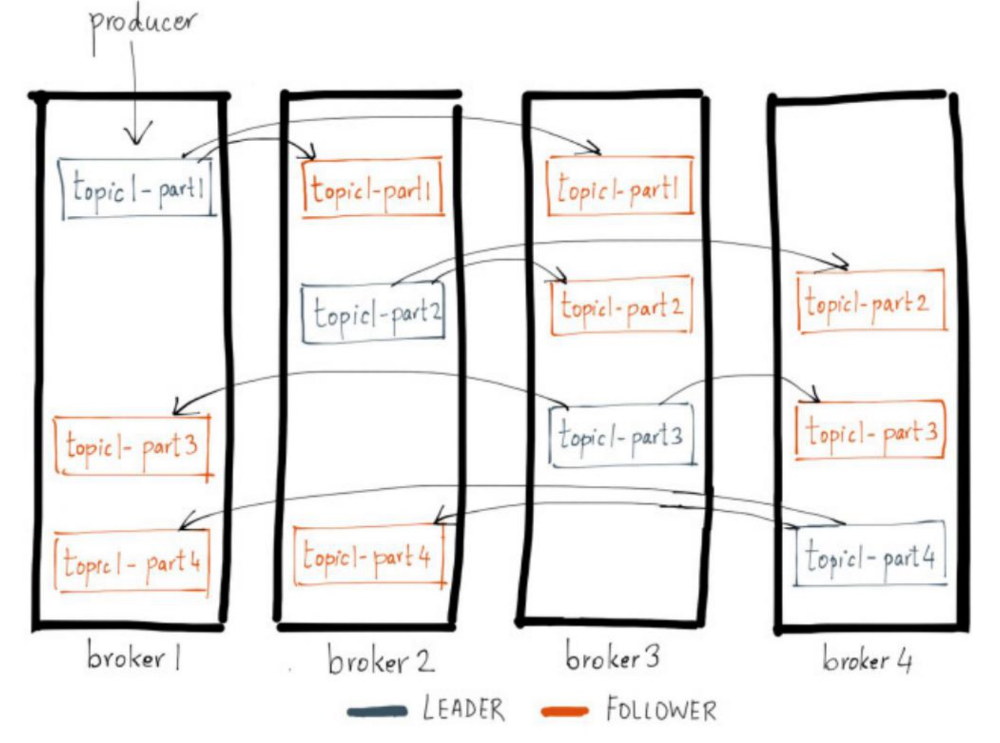
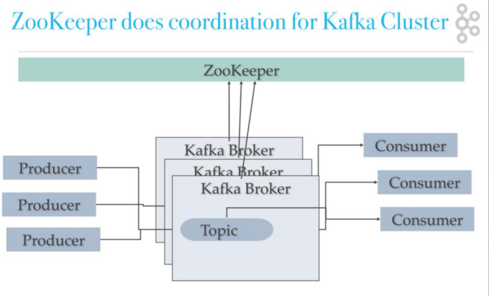
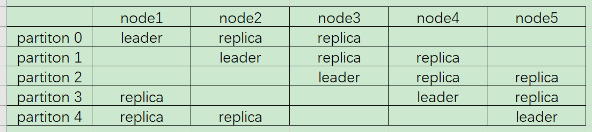
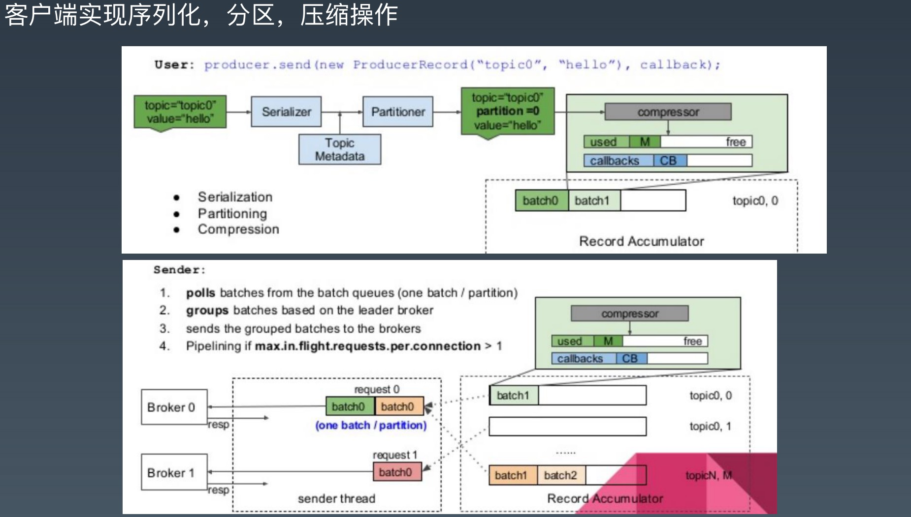
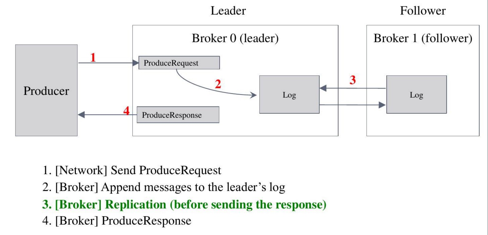
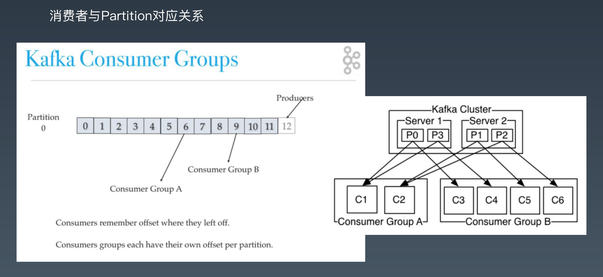
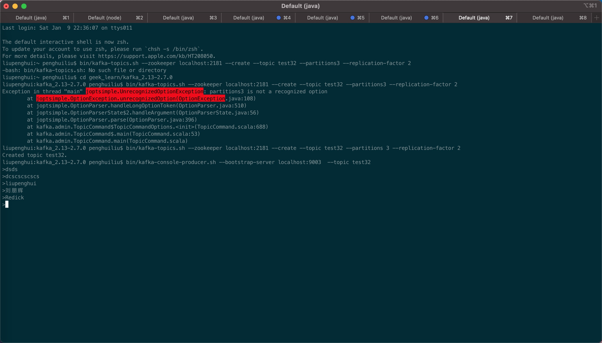
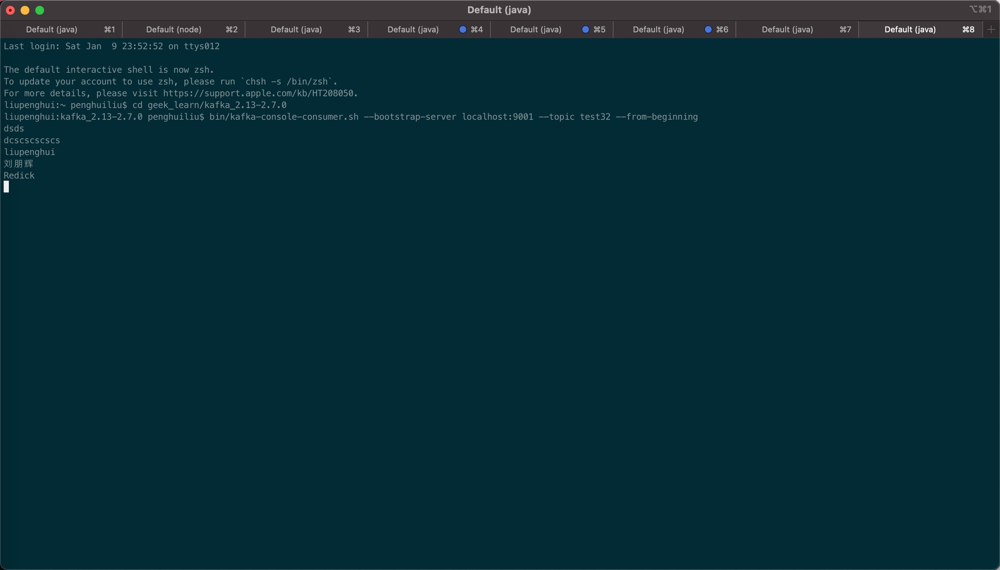

# Kafka消息中间件

## Kafka概念与入门

### 什么是Kafka
        Kafka是一个消息系统，由LinkedIn于2011年设计开发，用作LinkedIn的活动流（ActivityStream）和运营数据处理管道（Pipeline）的基础。

Kafka是一种分布式的，基于发布/订阅的消息系统。主要设计目标如下：

    1.以时间复杂度为O(1)的方式提供消息持久化能力，即使对TB级以上数据也能保证常数时间复杂度的访问性能。
    2.高吞吐率。即使在非常廉价的商用机器上也能做到单机支持每秒100K条以上消息的出传输
    3.支持KafkaServer间的消息分区，及分布式消费，同时保证每个Partition内的消息传输
    4.同时支持离线数据处理和实时数据处理。
    5.Scaleout：支持在线水平扩展。

### Kafka的基本概念
- Broker：Kafka集群包含一个或多个服务器，这种服务器被称为broker。
- Topic：每条发布到Kafka集群的消息都有一个类别，这个类别被称为Topic。（物理上不同Topic的消息分开存储，逻辑上一个Topic的消息虽然保存于一个或多个broker上，但用户只需指定消息的Topic即可生产或消费数据而不必关心数据存于何处）。
- Partition：Partition是物理上的概念，每个Topic包含一个或多个Partition。
- Producer：负责发布消息到Kafkabroker。
- Consumer：消息消费者，向Kafkabroker读取消息的客户端。
- ConsumerGroup：每个Consumer属于一个特定的ConsumerGroup（可为每个Consumer指定groupname，若不指定groupname则属于默认的group）。

### Partition和Topic
    多Partition支持水平扩展和并行处理，顺序写入提升吞吐性能，创建Topic时要制定Partition

### Partition和Replica
    每个partition可以通过副本因子添加多个副本
    

### Kafka单机结构

&emsp;&emsp;单机结构，kafka提供基于发布-订阅模式的消息模式，在单机部署时通常不建议有大量的partition，也不建议有大量的topic，因为partition和topic对应着一个数据文件，大量的partition或topic意味着大量的数据文件，会产生随机io读写。


### Kafka集群部署结构
```
    Kafka集群部署需要一个zk来记录状态信息
```


### Topic特性

    1.通过partition增加可扩展性，线上操作会引起性能抖动
    2.通过顺序写入达到高吞吐
    3.多副本增加容错性

### 集群与多副本说明

#### Kafka一致性重要机制之ISR(kafka replica)
- 1.Kafka副本(replica)

  - 1.当某个topic的replication-factor为N且N大于1时，每个Partition都会有N个副本(Replica)。kafka的replica包含leader与follower。

  - 2.Replica的个数小于等于Broker的个数，也就是说，对于每个Partition而言，每个Broker上最多只会有一个Replica，因此可以使用Broker id 指定Partition的Replica。

  - 3.所有Partition的Replica默认情况会均匀分布到所有Broker上。



- 2.Data Replication如何Propagate(扩散出去)消息

&emsp;&emsp;每个Partition有一个leader与多个follower，producer往某个Partition中写入数据是，只会往leader中写入数据，然后数据才会被复制进其他的Replica中。

&emsp;&emsp;kafka是由follower周期性或者尝试去pull(拉)过来(其实这个过程与consumer消费过程非常相似)，写是都往leader上写，但是读并不是任意flower上读都行，读也只在leader上读，flower只是数据的一个备份，保证leader被挂掉后顶上来，并不往外提供服务。


- 3.Data Replication何时Commit

  - 同步复制： 只有所有的follower把数据拿过去后才commit，一致性好，可用性不高。

  - 异步复制： 只要leader拿到数据立即commit，等follower慢慢去复制，可用性高，立即返回，一致性差一些。

  - Commit：是指leader告诉客户端，这条数据写成功了。kafka尽量保证commit后立即leader挂掉，其他flower都有该条数据。

  - kafka不是完全同步，也不是完全异步，是一种ISR机制：
    1. leader会维护一个与其基本保持同步的Replica列表，该列表称为ISR(in-sync Replica)，每个Partition都会有一个ISR，而且是由leader动态维护
    2. 如果一个flower比一个leader落后太多，或者超过一定时间未发起数据复制请求，则leader将其重ISR中移除
    3. 当ISR中所有Replica都向Leader发送ACK时，leader才commit

  - 既然所有Replica都向Leader发送ACK时，leader才commit，那么flower怎么会leader落后太多？
    1. producer往kafka中发送数据，不仅可以一次发送一条数据，还可以发送message的数组；批量发送，同步的时候批量发送，异步的时候本身就是就是批量；底层会有队列缓存起来，批量发送，对应broker而言，就会收到很多数据(假设1000)，这时候leader发现自己有1000条数据，flower只有500条数据，落后了500条数据，就把它从ISR中移除出去，这时候发现其他的flower与他的差距都很小，就等待；如果因为内存等原因，差距很大，就把它从ISR中移除出去。

  - commit策略：
    - server配置：

    ```
    rerplica.lag.time.max.ms=10000
    # 如果leader发现flower超过10秒没有向它发起fech请求，那么leader考虑这个flower是不是程序出了点问题
    # 或者资源紧张调度不过来，它太慢了，不希望它拖慢后面的进度，就把它从ISR中移除。

    rerplica.lag.max.messages=4000 # 相差4000条就移除
    # flower慢的时候，保证高可用性，同时满足这两个条件后又加入ISR中，
    # 在可用性与一致性做了动态平衡   亮点
    ```
    - topic配置：

    ```
      min.insync.replicas=1 # 需要保证ISR中至少有多少个replica
    ```
    - Producer配置：

    ```
    request.required.asks=0
    # 0:相当于异步的，不需要leader给予回复，producer立即返回，发送就是成功,
        那么发送消息网络超时或broker crash(1.Partition的Leader还没有commit消息 2.Leader与Follower数据不同步)，
        既有可能丢失也可能会重发
    # 1：当leader接收到消息之后发送ack，丢会重发，丢的概率很小
    # -1：当所有的follower都同步消息成功后发送ack.  丢失消息可能性比较低
    ```

- 4.Data Replication如何处理Replica恢复

    ```
    leader挂掉了，从它的follower中选举一个作为leader，并把挂掉的leader从ISR中移除，继续处理数据。一段时间后该leader重新启动
    了，它知道它之前的数据到哪里了，尝试获取它挂掉后leader处理的数据，获取完成后它就加入了ISR。
    ```

- 5.Data Replication如何处理Replica全部宕机

- - 1.等待ISR中任一Replica恢复,并选它为Leader


```
    1.等待时间较长,降低可用性
    2.或ISR中的所有Replica都无法恢复或者数据丢失,则该Partition将永不可用
```


- - 2.选择第一个恢复的Replica为新的Leader,无论它是否在ISR中
    

```
    1.并未包含所有已被之前Leader Commit过的消息,因此会造成数据丢失
    2.可用性较高
 ```

#### Kafka服务端rebalance

- 一个consumer挂掉
- 新加入一个consumer
- 新的partition加入一个topic
- 一个新的topic匹配已有的订阅正则

### Kafka的高级特性

#### 生产者高级特性

- 1.生产者执行步骤



- 2.生产者-确认模式
  
  ```
  ack=0 : 只发送不管有没有写入到broker 
  ack=1：写入到leader就认为成功 
  ack=all：写入到最小的复本数则认为成功
  ```


- 3.生产者特性-同步发送

```
KafkaProducer kafkaProducer = new KafkaProducer(pro); 
ProducerRecord record = new ProducerRecord("topic", "key", "value"); 
Future future = kafkaProducer.send(record); 
//同步发送方法1
Object o = future.get(); 
//同步发送方法2 
kafkaProducer.flush();
```

- 4.生产者特性-异步发送

```
pro.put("linger.ms", “1"); 
pro.put("batch.size", "10240"); 
KafkaProducer kafkaProducer = new KafkaProducer(pro); 
ProducerRecord record = new ProducerRecord("topic", "key", "value"); 
Future future = kafkaProducer.send(record); 
//异步发送方法1 
kafkaProducer.send(record, (metadata, exception) -> { if (exception == null) System.out.println("record = " + record); }); 
//异步发送方法2 
kafkaProducer.send(record);
```

- 5.生产者特性-顺序保证

```
顺序保证 
pro.put("max.in.flight.requests.per.connection", “1"); 
KafkaProducer kafkaProducer = new KafkaProducer(pro); 
ProducerRecord record = new ProducerRecord("topic", "key", "value"); 
Future future = kafkaProducer.send(record); 
//同步发送 
kafkaProducer.send(record); 
kafkaProducer.flush();
```

- 5.生产者特性-消息可靠性传递

```
pro.put("enable.idempotence","true"); 
// 此时就会默认把acks设置为all 
pro.put("transaction.id","tx0001"); 
try {
    kafkaProducer.beginTransaction(); ProducerRecord record = new ProducerRecord("topic", "key", "value"); 
    for (int i = 0; i < 100; i++) { 
        kafkaProducer.send(record, (metadata, exception) -> { if (exception != null) { kafkaProducer.abortTransaction(); 
        throw new KafkaException(exception.getMessage() + " , data: " + record); } }); 
    } 
        kafkaProducer.commitTransaction(); 
    } catch (Throwable e) { 
        kafkaProducer.abortTransaction(); 
    }
```

#### 消费者高级特性



- 1.offset同步提交

```
props.put("enable.auto.commit","false"); 
while (true) { 
    //拉取数据 
    ConsumerRecords poll = consumer.poll(Duration.ofMillis(100)); 
    poll.forEach(o -> { 
        ConsumerRecord<String, String> record = (ConsumerRecord) 
        o; Order order = JSON.parseObject(record.value(), Order.class); 
        System.out.println("order = " + order); }); 
    consumer.commitSync(); 
}
```

- 2.offset异步提交

```
props.put(“enable.auto.commit","false"); 
while (true) { 
    //拉取数据 
    ConsumerRecords poll = consumer.poll(Duration.ofMillis(100)); 
    poll.forEach(o -> { 
        ConsumerRecord<String, String> record = (ConsumerRecord) o; 
        Order order = JSON.parseObject(record.value(), Order.class); 
        System.out.println("order = " + order); 
    }); 
    consumer.commitAsync(); 
}
```

- 3.offset自动提交

```
props.put("enable.auto.commit","true"); 
props.put(“auto.commit.interval.ms”,”5000"); 
while (true) { 
    //拉取数据 
    ConsumerRecords poll = consumer.poll(Duration.ofMillis(100)); 
    poll.forEach(o -> { 
        ConsumerRecord<String, String> record = (ConsumerRecord) o; 
        Order order = JSON.parseObject(record.value(), Order.class); 
        System.out.println("order = " + order); 
    }); 
}
```

- 3.offset Seek
  
```
props.put("enable.auto.commit","true"); 
//订阅topic 
consumer.subscribe(Arrays.asList("demo-source"), new ConsumerRebalanceListener() { 
    @Override 
    public void onPartitionsRevoked(Collection<TopicPartition> partitions) { 
        commitOffsetToDB(); 
    }
    @Override 
    public void onPartitionsAssigned(Collection<TopicPartition> partitions) { 
        partitions.forEach(topicPartition -> consumer.seek(topicPartition, getOffsetFromDB(topicPartition)));
    } 
});

while (true) { 
    //拉取数据 
    ConsumerRecords poll = consumer.poll(Duration.ofMillis(100)); 
    poll.forEach(o -> { 
        ConsumerRecord<String, String> record = (ConsumerRecord) o; 
        processRecord(record); saveRecordAndOffsetInDB(record, record.offset());
    }); 
}
```

## Kafka简单使用

### Kafka单机安装、部署、测试

- 1.安装kafka

下载2.6.0或2.7.0版本的kafka，下载地址：http://kafka.apache.org/downloads，并解压进入kafka目录，修改server.properties配置文件，放开listeners=PLAINTEXT://localhost:9092

- 2.启动kafka

```
liupenghui:kafka_2.13-2.7.0 penghuiliu$ ./bin/zookeeper-server-start.sh config/zookeeper.properties
```

```
liupenghui:kafka_2.13-2.7.0 penghuiliu$ ./bin/kafka-server-start.sh config/server.properties
```
启动后有如下日志启动成功
```
[2021-01-09 21:01:32,570] INFO [TransactionCoordinator id=0] Starting up. (kafka.coordinator.transaction.TransactionCoordinator)
[2021-01-09 21:01:32,571] INFO [Transaction Marker Channel Manager 0]: Starting (kafka.coordinator.transaction.TransactionMarkerChannelManager)
[2021-01-09 21:01:32,571] INFO [TransactionCoordinator id=0] Startup complete. (kafka.coordinator.transaction.TransactionCoordinator)
[2021-01-09 21:01:32,612] INFO Updated cache from existing <empty> to latest FinalizedFeaturesAndEpoch(features=Features{}, epoch=0). (kafka.server.FinalizedFeatureCache)
[2021-01-09 21:01:32,615] INFO [ExpirationReaper-0-AlterAcls]: Starting (kafka.server.DelayedOperationPurgatory$ExpiredOperationReaper)
[2021-01-09 21:01:32,636] INFO [/config/changes-event-process-thread]: Starting (kafka.common.ZkNodeChangeNotificationListener$ChangeEventProcessThread)
[2021-01-09 21:01:32,668] INFO [SocketServer brokerId=0] Starting socket server acceptors and processors (kafka.network.SocketServer)
[2021-01-09 21:01:32,674] INFO [SocketServer brokerId=0] Started data-plane acceptor and processor(s) for endpoint : ListenerName(PLAINTEXT) (kafka.network.SocketServer)
[2021-01-09 21:01:32,675] INFO [SocketServer brokerId=0] Started socket server acceptors and processors (kafka.network.SocketServer)
[2021-01-09 21:01:32,686] INFO Kafka version: 2.7.0 (org.apache.kafka.common.utils.AppInfoParser)
[2021-01-09 21:01:32,686] INFO Kafka commitId: 448719dc99a19793 (org.apache.kafka.common.utils.AppInfoParser)
[2021-01-09 21:01:32,686] INFO Kafka startTimeMs: 1610197292675 (org.apache.kafka.common.utils.AppInfoParser)
[2021-01-09 21:01:32,689] INFO [KafkaServer id=0] started (kafka.server.KafkaServer)
[2021-01-09 21:01:32,839] INFO [broker-0-to-controller-send-thread]: Recorded new controller, from now on will use broker 0 (kafka.server.BrokerToControllerRequestThread)
```
- 3.命令行操作kafka

```
1.查看topic列表
liupenghui:kafka_2.13-2.7.0 penghuiliu$ bin/kafka-topics.sh --zookeeper localhost:2181 --list

2.创建topic（Created topic testr.代表创建成功）
liupenghui:kafka_2.13-2.7.0 penghuiliu$ bin/kafka-topics.sh --zookeeper localhost:2181 --create --topic testr --partitions 4 --replication-factor 1
Created topic testr.

3.查看partition的情况
liupenghui:kafka_2.13-2.7.0 penghuiliu$ bin/kafka-topics.sh --zookeeper localhost:2181 --describe --topic testr
Topic: testr	PartitionCount: 4	ReplicationFactor: 1	Configs:
	Topic: testr	Partition: 0	Leader: 0	Replicas: 0	Isr: 0
	Topic: testr	Partition: 1	Leader: 0	Replicas: 0	Isr: 0
	Topic: testr	Partition: 2	Leader: 0	Replicas: 0	Isr: 0
	Topic: testr	Partition: 3	Leader: 0	Replicas: 0	Isr: 0

4.启动consumer客户端
liupenghui:kafka_2.13-2.7.0 penghuiliu$ bin/kafka-console-consumer.sh --bootstrap-server localhost:9092 --from-beginning --topic testr

5.启动producer
liupenghui:kafka_2.13-2.7.0 penghuiliu$ bin/kafka-console-producer.sh --bootstrap-server localhost:9092 --topic testr

6.测试消息生产与消费
    生产者：
    >www
    >eeee
    >e
    >
    >fd
    >ds
    >s
    >as
    >q
    >
    消费者：
    www
    eeee
    e

    fd
    ds
    s
    as
    q

```
- 4.简单性能测试


bin/kafka-producer-perf-test.sh --topic testr --num-records 10000000 --record-size 10000 --throughput 2000000 --producer-props bootstrap.servers=localhost:9092 

bin/kafka-consumer-perf-test.sh ---bootstrap-server localhost:9092 --topic testr --fetch-size 1048576 --messages 100000 --threads1


### Kafka集群配置

- 1.准备三个Kafka server的配置文件

```
-rw-r--r--@   1 penghuiliu  staff   6907  1  9 22:13 server9001.properties
-rw-r--r--@   1 penghuiliu  staff   6907  1  9 22:14 server9002.properties
-rw-r--r--@   1 penghuiliu  staff   6907  1  9 22:15 server9003.properties
```

- 2.修改三个配置文件，主要修改三个地方

```
broker.id=1 # 保证三个broker的id不一样
listeners=PLAINTEXT://:9001 # 保证broker监听端口号不一样
log.dirs=/tmp/kafka-logs1 # 保证broker的数据文件不是一样的
broker.list=localhost:9001,localhost:9002,localhost:9003 # 添加的
```

- 3.清除zk上的所有数据

- 4.启动三个broker
  
```
./bin/kafka-server-start.sh server9001.properties
./bin/kafka-server-start.sh server9002.properties
./bin/kafka-server-start.sh server9003.properties
```

- 5.执行测试

```
创建带有副本的topic：
bin/kafka-topics.sh --zookeeper localhost:2181 --create --topic test32 --partitions 3 --replication-factor 2 
bin/kafka-console-producer.sh --bootstrap-server localhost:9003  --topic test32 
bin/kafka-console-consumer.sh --bootstrap-server localhost:9001 --topic test32 --from-beginning
```
测试结果：
- producer


- consumer


- 6.执行性能测试

```
liupenghui:kafka_2.13-2.7.0 penghuiliu$ bin/kafka-producer-perf-test.sh --topic test32 --num-records 1000000 --record-size 100 --throughput 200000 --producer-props bootstrap.servers=localhost:9002
999600 records sent, 199920.0 records/sec (19.07 MB/sec), 10.3 ms avg latency, 490.0 ms max latency.
1000000 records sent, 199401.794616 records/sec (19.02 MB/sec), 10.34 ms avg latency, 490.00 ms max latency, 1 ms 50th, 77 ms 95th, 87 ms 99th, 94 ms 99.9th

liupenghui:kafka_2.13-2.7.0 penghuiliu$ bin/kafka-consumer-perf-test.sh --bootstrap-server localhost:9002 --topic test32 --fetch-size 10000 --messages 100000 -threads 1
WARNING: option [threads] and [num-fetch-threads] have been deprecated and will be ignored by the test
start.time, end.time, data.consumed.in.MB, MB.sec, data.consumed.in.nMsg, nMsg.sec, rebalance.time.ms, fetch.time.ms, fetch.MB.sec, fetch.nMsg.sec
2021-01-10 00:05:50:869, 2021-01-10 00:06:04:741, 6093.5631, 439.2707, 100000, 7208.7659, 1610208351476, -1610208337604, -0.0000, -0.0001
```
