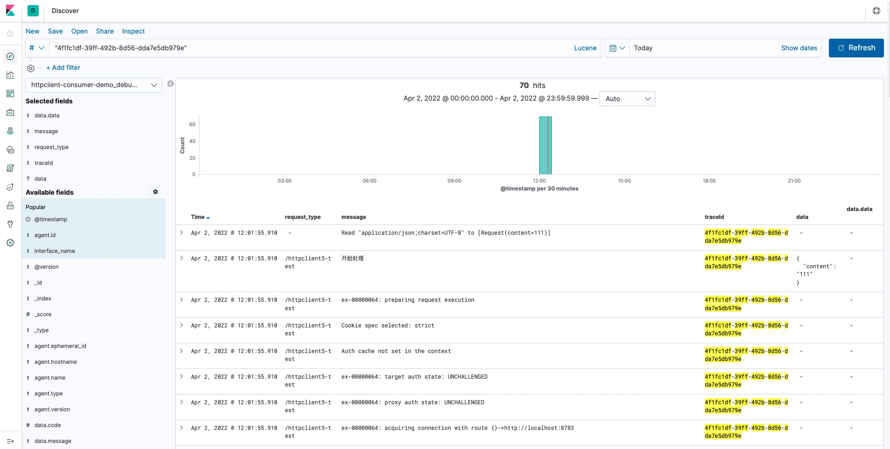
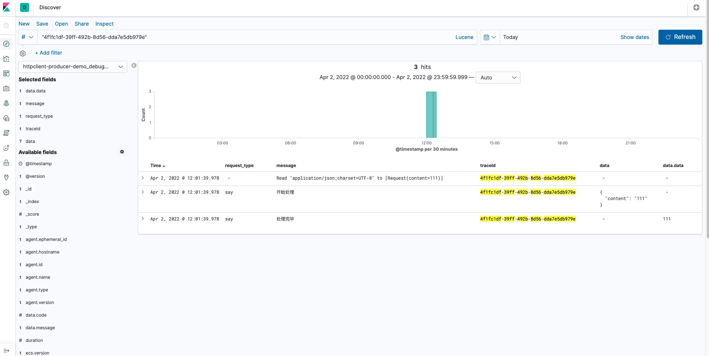

# Java日志链路追踪工具LogHelper在ELK系统上的效果

&nbsp; &nbsp; **🔥🔥🔥轻量级日志链路追踪工具，结合logstash-logback-encoder实现日志输出json格式化；支持Sykwalking traceId，支持Apache Dubbo，Alibaba Dubbo，SpringCloud微服务框架日志链路追踪；支持异步线程日志链路追踪；支持OkHttp，HttpClient，RestTemplate Http客户端工具日志链路追踪；提供分布式消息队列日志链路追中解决方案；支持简单的敏感字段脱敏打印**

**项目地址：**[https://github.com/Redick01/log-helper](https://github.com/Redick01/log-helper)  欢迎交流👏🏻

**项目目前使用规模：**服务数`200+` 服务器实例`300+`

## 背景

###### &nbsp; &nbsp; 公司的日志系统ELK（ElasticSearch、Logstash、Kibana）搭建的，其架构是Filebeat收集日志传输到Logstash，Logstash解析日志然后将日志存储到Elasticsearch中，最后通过Kibana查询展示日志，最初公司各个系统没有对日志的打印形成规范，导致了日志打印的形式各种各样，这无疑使得Logstash解析日志的配置变得十分复杂，并且一开始公司的日志也没有链路追踪的能力，所以为了解决如下问题决定开发一个日志标准化工具。待解决问题如下：

- **1.日志内容格式不统一，ELK系统解析日志麻烦**
- **2.单体服务接口日志链路踪能力缺失**
- **3.微服务RPC中间件跨进程日志链路追踪能力缺失**
- **4.无法统一做到接口传递参数脱敏**
- **5.分布式消息队列链路追踪能力缺失**
- **6.异步线程，线程池链路追踪能力缺失**
- **7.无法配合APM工具（Skywalking）生成的traceId作为日志链路追踪的traceId**

&nbsp; &nbsp; 
&nbsp; &nbsp; 
&nbsp; &nbsp; 

## 支持内容

##### 1.0-RELEASE版本

- **日志json格式打印**
- **统一切面，提供切面注解打印切面入口输入参数和输出参数以及执行时间**
- **支持以MDC的方式打印traceId以及切面业务描述**
- **支持java bean，集合类型，HttpServletRequest等参数类型的日志打印**
- **异步线程日志链路追踪，支持java线程池和spring线程池的异步日志链路追踪**
- **支持Alibaba Dubbo和Apache Dubbo中间件日志链路追踪**
- **支持Spring Cloud OpenFeign中间件日志链路追踪**
- **支持HttpClient，OkHttp，RestTemplate客户端日志链路追踪**
- **提供Apache RocketMQ，Aliyun RocketMQ日志链路追踪解决方案**
- **支持以SkyWalking traceId作为服务日志traceId**
- **提供简单的字段脱敏解决方案**
- **提供接口参数解析接口，支持自定义接口参数的解析，只需要按SPI规范实现即可**
- **提供Spring命名空间和SpringBoot两种接入方式**

&nbsp; &nbsp; 
&nbsp; &nbsp; 
&nbsp; &nbsp; 

## 快速接入

&nbsp; &nbsp; 参考之前的快速接入文章[快速接入](https://blog.csdn.net/qq_31279701/article/details/123900584?spm=1001.2014.3001.5501)

&nbsp; &nbsp; 
&nbsp; &nbsp; 
&nbsp; &nbsp; 

## ELK系统接入效果

##### **服务消费者端日志效果**

##### **服务提供者端日志效果**

