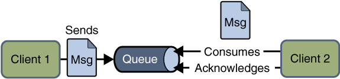
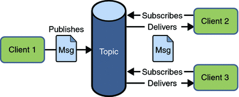
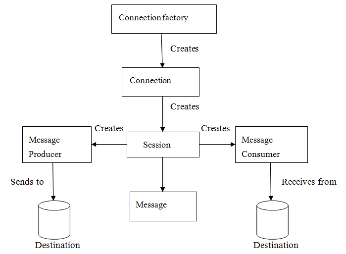

# Java消息队列 JMS

## 什么是JMS
&emsp;&emsp;JMS即Java消息服务（Java Message Service）应用程序接口，是一个Java平台中关于面向消息中间件（MOM）的API，用于在两个应用程序之间，或分布式系统中发送消息，进行异步通信。Java消息服务是一个与具体平台无关的API，绝大多数MOM提供商都对JMS提供支持。我们可以简单的理解：两个应用程序之间需要进行通信，我们使用一个JMS服务，进行中间的转发，通过JMS的使用，我们可以解除两个程序之间的耦合。

## JMS的优势

- 1.Asynchronous（异步）

     JMS原本就是一个异步的消息服务，客户端获取消息的时候，不需要主动发送请求，消息会自动发送给可用的客户端。

- 2.Reliable（可靠）

     JMS保证消息只会递送一次。大家都遇到过重复创建消息问题，而JMS能帮你避免该问题。

## JMS消息模型
JMS具有两种通信模式：

1、Point-to-Point Messaging Domain （点对点）

2、Publish/Subscribe Messaging Domain （发布/订阅模式）

　　　在JMS API出现之前，大部分产品使用“点对点”和“发布/订阅”中的任一方式来进行消息通讯。JMS定义了这两种消息发送模型的规范，它们相互独立。任何JMS的提供者可以实现其中的一种或两种模型，这是它们自己的选择。JMS规范提供了通用接口保证我们基于JMS API编写的程序适用于任何一种模型。

- (1)、Point-to-Point Messaging Domain（点对点通信模型）
  - 模式图

    

  - 概念

    &emsp;&emsp;在点对点通信模式中，应用程序由消息队列，发送方，接收方组成。每个消息都被发送到一个特定的队列，接收者从队列中获取消息。队列保留着消息，直到他们被消费或超时。

  - 特点

    &emsp;&emsp;a.每个消息只要一个消费者

    &emsp;&emsp;b.发送者和接收者在时间上是没有时间的约束，也就是说发送者在发送完消息之后，不管接收者有没有接受消息，都不会影响发送方发送消息到消息队列中。

    &emsp;&emsp;c.发送方不管是否在发送消息，接收方都可以从消息队列中去到消息（The receiver can fetch message whether it is running or not when the sender sends the message）

    &emsp;&emsp;d.接收方在接收完消息之后，需要向消息队列应答成功

- (2)、Publish/Subscribe Messaging Domain（发布/订阅通信模型）

  - 模式图

    

  - 概念

    &emsp;&emsp;在发布/订阅消息模型中，发布者发布一个消息，该消息通过topic传递给所有的客户端。该模式下，发布者与订阅者都是匿名的，即发布者与订阅者都不知道对方是谁。并且可以动态的发布与订阅Topic。Topic主要用于保存和传递消息，且会一直保存消息直到消息被传递给客户端。

  - 特点

    &emsp;&emsp;a.一个消息可以传递个多个订阅者（即：一个消息可以有多个接受方）

    &emsp;&emsp;b.发布者与订阅者具有时间约束，针对某个主题（Topic）的订阅者，它必须创建一个订阅者之后，才能消费发布者的消息，而且为了消费消息，订阅者必须保持运行的状态。
    
    &emsp;&emsp;c.为了缓和这样严格的时间相关性，JMS允许订阅者创建一个可持久化的订阅。这样，即使订阅者没有被激活（运行），它也能接收到发布者的消

## JMS接收消息

&emsp;&emsp;在JMS中，消息的产生和消息是异步的。对于消费来说，JMS的消息者可以通过两种方式来消费消息。

　　（1）、同步（Synchronous）

&emsp;&emsp;在同步消费信息模式模式中，订阅者/接收方通过调用 receive（）方法来接收消息。在receive（）方法中，线程会阻塞直到消息到达或者到指定时间后消息仍未到达。

　　（2）、异步（Asynchronous）

&emsp;&emsp;使用异步方式接收消息的话，消息订阅者需注册一个消息监听者，类似于事件监听器，只要消息到达，JMS服务提供者会通过调用监听器的onMessage()递送消息。

## JMS编程模型

- 管理对象（Administered objects）-连接工厂（Connection Factories）和目的地（Destination）
- 连接对象（Connections）
- 会话（Sessions）
- 消息生产者（Message Producers）
- 消息消费者（Message Consumers）
- 消息监听者（Message Listeners）

&emsp;&emsp;具体代码可以参考：https://redick01.github.io/redick.github.io/#/blog/%E4%B8%AD%E9%97%B4%E4%BB%B6/mq/activemq_1?id=activemq%e7%ae%80%e5%8d%95%e4%bd%bf%e7%94%a8