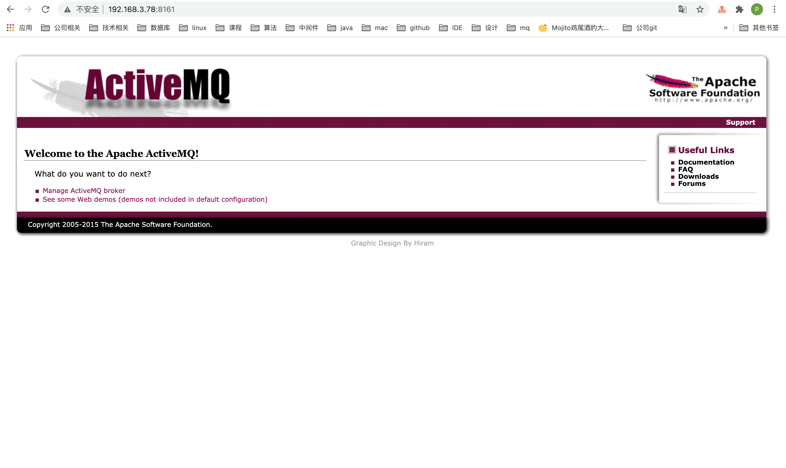

# ActiveMQ

## ActiveMQ介绍
    ActiveMQ是Apache软件基金下的一个开源软件，它遵循JMS1.1规范（Java Message Service），是消息驱动中间件软件（MOM）。它为企业消息传递提供高可用，出色性能，可扩展，稳定和安全保障。

## ActiveMQ的消息传递模式


- P2P （点对点）消息域使用 queue 作为 Destination，消息可以被同步或异步的发送和接收，每个消息只会给一个 Consumer 传送一次。
- Pub/Sub（发布/订阅，Publish/Subscribe）消息域使用 topic 作为 Destination，发布者向 topic 发送消息，订阅者注册接收来自 topic 的消息。发送到 topic 的任何消息都将自动传递给所有订阅者。接收方式（同步和异步）与 P2P 域相同。

## 搭建ActiveMQ服务，这里还是使用Docker搭建ActiveMQ服务

### 1.查找ActiveMQ镜像并下载
    docker search activemq


    docker pull rmohr/activemq

### 2.运行容器
    docker run --name activemq -d -p 61616:61616 -p 8161:8161 rmohr/activemq

    说明：
    --name通常容器名称和镜像名称一致，
    -p命令端口最好宿主机和应用一致
    61616：客户端连接ActiveMQ的端口
    8161：管理界面端口

### 3.查看运行状态
    docker ps

    CONTAINER ID        IMAGE               COMMAND                  CREATED             STATUS              PORTS                                                                                   NAMES
    8f412fb4580f        rmohr/activemq      "/bin/sh -c 'bin/act…"   4 seconds ago       Up 3 seconds        1883/tcp, 5672/tcp, 0.0.0.0:8161->8161/tcp, 61613-61614/tcp, 0.0.0.0:61616->61616/tcp   activemq

### 4.访问监控页面

    http://192.168.3.78:8161/



### 5.至此，ActiveMQ服务搭建完毕

## ActiveMQ简单使用

### 基于Queue模式

- 一.队列模式特点
  
```
1.客户端包括生产者和消费者
2.队列中的消息只能被一个消费者消费
3.消费者可以随时消费队列中的消息
```

- 二.创建过程

```
1.创建连接Connection
2.创建会话Session
3.通过Session来创建其它的（MessageProducer、MessageConsumer、Destination、TextMessage）
4.将生产者 MessageProducer 和消费者 MessageConsumer 都会指向目标 Destination
5.生产者向目标发送TextMessage消息send()
6.消费者设置监听器，监听消息。


```   


- 三.代码实现

maven依赖
```
    <dependency>
        <groupId>org.apache.activemq</groupId>
        <artifactId>activemq-all</artifactId>
        <version>5.15.14</version>
    </dependency>
```

生产者
```
public class ActiveMQProducer<T> {

    private static final String URL = "tcp://192.168.3.78:61616";

    private static final String QUEUE_NAME = "queue-demo";

    public void sendQueue(T t) throws JMSException {
        Connection connection = null;
        Session session = null;
        try {
            //1.创建ConnectionFactory
            ConnectionFactory connectionFactory = new ActiveMQConnectionFactory(URL);
            //2.创建连接
            connection = connectionFactory.createConnection();
            //3.启动连接
            connection.start();
            //4.创建会话
            session = connection.createSession(Boolean.FALSE, Session.AUTO_ACKNOWLEDGE);
            //5.创建一个目标
            Destination destination = session.createQueue(QUEUE_NAME);
            // 6.创建生产者
            MessageProducer producer = session.createProducer(destination);
            String message = JSON.toJSONString(t);
            TextMessage textMessage = session.createTextMessage(message);
            System.out.println("发送Queue消息：" + message);
            producer.send(textMessage);
        } finally {
            if (null != session) {
                session.close();
            }
            if (null != connection) {
                connection.stop();
                connection.close();
            }
        }
    }
}
```
消费者
```
public class ActiveMQConsumer {

    private static final String URL = "tcp://192.168.3.78:61616";

    private static final String QUEUE_NAME = "queue-demo";

    public void consumerQueue() throws JMSException {
        //1.创建ConnectionFactory
        ConnectionFactory connectionFactory = new ActiveMQConnectionFactory(URL);

        //2.创建连接
        Connection connection = connectionFactory.createConnection();

        //3.启动连接
        connection.start();
        //4.创建会话
        Session session = connection.createSession(false, Session.AUTO_ACKNOWLEDGE);

        //5.创建一个目标
        Destination destination = session.createQueue(QUEUE_NAME);

        //6.创建消费者
        MessageConsumer consumer = session.createConsumer(destination);

        //7.创建消息监听器
        consumer.setMessageListener(new MessageListener() {
            @Override
            public void onMessage(Message message) {
                TextMessage textMessage= (TextMessage) message;
                try {
                    System.out.println("消费Queue消息：" + textMessage.getText());
                } catch (JMSException e) {
                    e.printStackTrace();
                }
            }
        });
    }
}
```
### 基于Topic（主题）模式

主题模式又名发布订阅模式（Pub/Sub）

- 一.主题模式特点

```
1.客户端包括发布者和订阅者
2.Topic（主题）中消息被所有订阅者消费
3.消费者不能消费在订阅之前就发送到主题中的消息，也就是说，消费者要先于生产者启动
```

- 二.创建过程

```
1.创建连接Connection
2.创建会话Session
3.通过Session来创建其它的（MessageProducer、MessageConsumer、Destination、TextMessage）
4.将生产者 MessageProducer 和消费者 MessageConsumer 都会指向目标 Destination
5.生产者向目标发送TextMessage消息send()
6.消费者设置监听器，监听消息。
```


- 三.代码实现

生产者
```
public class ActiveMQProducer<T> {

    private static final String URL = "tcp://192.168.3.78:61616";

    private static final String TOPIC_NAME = "topic-demo";

    public void sendTopic(T t) throws JMSException {
        Connection connection = null;
        Session session = null;
        try {
            //1.创建ConnectionFactory
            ActiveMQConnectionFactory connectionFactory = new ActiveMQConnectionFactory(URL);
            //2.创建连接
            connection = connectionFactory.createConnection();
            //3.启动连接
            connection.start();
            //4.创建会话
            session = connection.createSession(Boolean.TRUE, Session.AUTO_ACKNOWLEDGE);
            //5.创建topic
            Destination destination = session.createTopic(TOPIC_NAME);
            // 6.创建生产者
            MessageProducer producer = session.createProducer(destination);
            String message = JSON.toJSONString(t);
            TextMessage textMessage = session.createTextMessage(message);
            System.out.println("发送Topic消息：" + message);
            producer.send(textMessage);
            session.commit();
        } finally {
            if (null != session) {
                session.close();
            }
            if (null != connection) {
                connection.stop();
                connection.close();
            }
        }
    }
}
```

消费者
```
public class ActiveMQConsumer {

    private static final String URL = "tcp://192.168.3.78:61616";

    private static final String TOPIC_NAME = "topic-demo";

    public void consumerTopic() throws JMSException {
        //1.创建ConnectionFactory
        ActiveMQConnectionFactory connectionFactory = new ActiveMQConnectionFactory(URL);

        //2.创建连接
        Connection connection = connectionFactory.createConnection();

        //3.启动连接
        connection.start();

        //4.创建会话
        Session session = connection.createSession(Boolean.FALSE, Session.AUTO_ACKNOWLEDGE);
        //5.创建一个目标
        Destination destination = session.createTopic(TOPIC_NAME);
        //6.创建消费者
        MessageConsumer consumer = session.createConsumer(destination);

        //7.创建消息监听器
        consumer.setMessageListener(new MessageListener() {
            @Override
            public void onMessage(Message message) {
                TextMessage textMessage= (TextMessage) message;
                try {
                    System.out.println("消费Topic消息：" + textMessage.getText());
                } catch (JMSException e) {
                    e.printStackTrace();
                }
            }
        });
    }
}
```