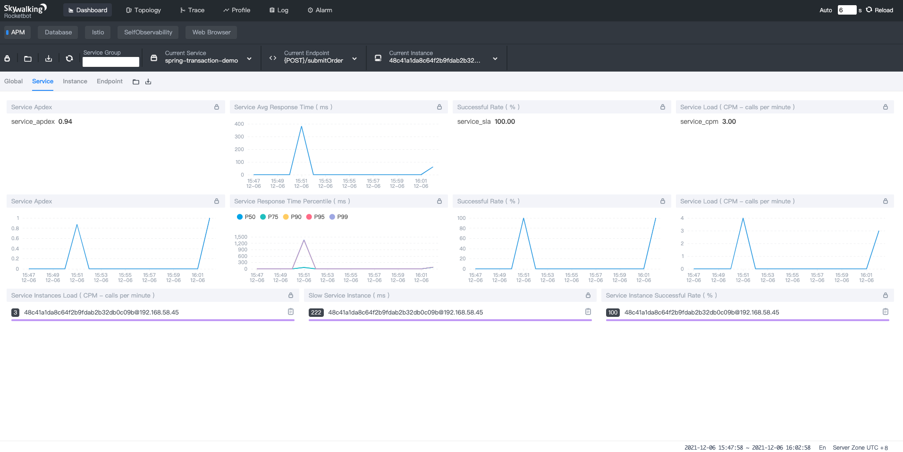

# 基于Docker部署Skywalking - 单机版 <!-- {docsify-ignore-all} -->

## Skywalking简介

&nbsp; &nbsp; `Skywalking`是分布式系统的应用程序性能监视工具，专为微服务、云原生架构和基于容器（Docker、K8s）架构而设计。提供分布式追踪、服务网格遥测分析、度量聚合和可视化一体化解决方案。

## Docker部署Skywalking步骤

- **部署Elasticsearch**
- **部署Skywalking OAP**
- **部署Skywalking UI**
- **应用程序配合Skywalking Agent部署**

## 部署Elasticsearch

&nbsp; &nbsp; 这里基于`Docker`简单单机部署，普通部署和集群部署可以参考[官方文档](https://docs.es.shiyueshuyi.xyz/#/setup/install/linux)。

#### 拉取镜像

```shell
docker pull elasticsearch:7.6.2
```

#### 指定单机启动


<span style="color:red;">注：通过ES_JAVA_OPTS设置ES初始化内存，否则在验证时可能会起不来</span>

```shell
docker run --restart=always -p 9200:9200 -p 9300:9300 -e "discovery.type=single-node" \
-e ES_JAVA_OPTS="-Xms512m -Xmx512m" \
--name='elasticsearch' --cpuset-cpus="1" -m 2G -d elasticsearch:7.6.2
```

#### 验证es安装成功

&nbsp; &nbsp; 浏览器地址栏输入：http://127.0.0.1:9200/，浏览器页面显示如下内容：

```json
{
  "name" : "6eebe74f081b",
  "cluster_name" : "docker-cluster",
  "cluster_uuid" : "jgCr_SQbQXiimyAyOEqk9g",
  "version" : {
    "number" : "7.6.2",
    "build_flavor" : "default",
    "build_type" : "docker",
    "build_hash" : "ef48eb35cf30adf4db14086e8aabd07ef6fb113f",
    "build_date" : "2020-03-26T06:34:37.794943Z",
    "build_snapshot" : false,
    "lucene_version" : "8.4.0",
    "minimum_wire_compatibility_version" : "6.8.0",
    "minimum_index_compatibility_version" : "6.0.0-beta1"
  },
  "tagline" : "You Know, for Search"
}
```


## 部署Skywalking OAP

#### 拉取镜像

```shell
docker pull apache/skywalking-oap-server:8.3.0-es7
```

#### 启动Skywalking OAP

<span style="color:red;">注：--link后面的第一个参数和elasticsearch容器名一致； -e SW_STORAGE_ES_CLUSTER_NODES：es7也可改为你es服务器部署的Ip地址，即ip:9200</span>

```shell
docker run --name oap --restart always -d --restart=always -e TZ=Asia/Shanghai -p 12800:12800 -p 11800:11800 --link elasticsearch:elasticsearch -e SW_STORAGE=elasticsearch7 -e SW_STORAGE_ES_CLUSTER_NODES=elasticsearch:9200 apache/skywalking-oap-server:8.3.0-es7
```

## 部署Skywalking UI

#### 拉取镜像

```shell
docker pull apache/skywalking-ui:8.3.0
```

#### 启动Skywalking UI

<span style="color:red;">注：--link后面的第一个参数和skywalking OAP容器名一致；</span>

```shell
docker run -d --name skywalking-ui \
--restart=always \
-e TZ=Asia/Shanghai \
-p 8088:8080 \
--link oap:oap \
-e SW_OAP_ADDRESS=oap:12800 \
apache/skywalking-ui:8.3.0
```


## 应用程序配合Skywalking Agent部署

#### 官网下载skywalking-agent

&nbsp; &nbsp; 下载地址：https://archive.apache.org/dist/skywalking/8.3.0/

&nbsp; &nbsp; 这里有一点需要注意，一定要下载对应的skywalking-oap版本的skywalking-agent，否则就有可能会导致agent无法上报，笔者一开始觉得agent可以做到向下兼容，下载了8.8版本，导致上传监控数据失败了，报错原因是oap-server端返回的方法不存在`grpc-message: Method not found: skywalking.v3.JVMMetricReportService/collect`，日志如下：


#### javaagent运行

&nbsp; &nbsp; spring-transaction-2.2.6.RELEASE.jar是笔者写的一个测试程序，感兴趣的可以从笔者github下载：https://github.com/Redick01/my-transaction.git `spring-transaction`工程就是测试代码

```shell
java -jar -javaagent:/Users/penghuiliu/geek_learn/skywalking-agent/skywalking-agent.jar=agent.service_name=fw-gateway,collector.backend_service=127.0.0.1:11800 -jar spring-transaction-2.2.6.RELEASE.jar
```

&nbsp; &nbsp; 服务启动成功调用接口，skywalking UI显示结果如下：

#### 仪表盘



#### 拓扑


#### 链路


