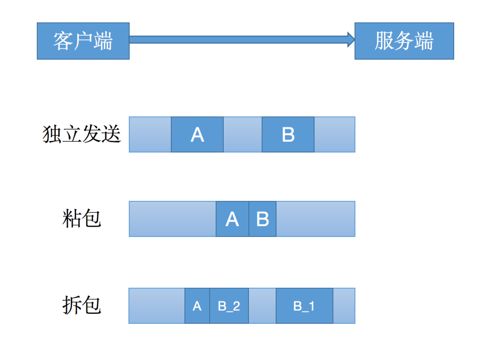

# Netty粘包、拆包问题及解决方案

- 粘包、拆包问题的产生
- Netty粘包、拆包解决方案
- 参考：https://my.oschina.net/zhangxufeng/blog/3023794

## 粘包、拆包问题的产生

&nbsp; &nbsp; 产生粘包和拆包问题的主要原因是，操作系统在发送TCP数据的时候，底层会有一个缓冲区，例如1024个字节大小，如果一次请求发送的数据量比较小，没达到缓冲区大小，TCP则会将多个请求合并为同一个请求进行发送，这就形成了粘包问题；如果一次请求发送的数据量比较大，超过了缓冲区大小，TCP就会将其拆分为多次发送，这就是拆包，也就是将一个大的包拆分为多个小包进行发送。



上图中展示了粘包，拆包的三种情况：

- A和B两个包都刚好满足TCP缓冲区的大小，或者说其等待时间已经达到TCP等待时长，从而还是使用两个独立的包进行发送；
- A和B两笔请求时间较短，并且数据包较小，故合并成一个包发送；
- B数据包比较大，将其拆成B_1，B_2发送，并且B_2恰好满足要求与数据包A合并一起发送。

## Netty粘包、拆包解决方案

### 常见的解决方案

- 数据包固定长度：客户端在发送数据包时，每个包都固定长度，比如1024字节，如果数据长度不够1024字节使用空格补全；
- 分隔符：客户端在每个数据包末尾加上分隔符，例如\r\n，如果一个数据包被拆分，则下一个数据包到来时找到分隔符\r\n，然后进行拆分，并与前一个数据包拆分去掉头的剩余部分进行合并，这样就得到了完整的数据；

例如：0000\r\n111111    1111\r\n222222  拆分得到的完整数据包 1111111111

- 消息分为消息头和消息题：将数据包分成消息头和消息题两个部分，消息头保存着整个消息的长度，只有读够指定长度的消息体后才算读到一个完整的消息；
- 自定义协议进行粘包和拆包的处理。

### Netty提供的解决方案

#### 使用固定长度粘包和拆包FixedLengthFrameDecoder

&nbsp; &nbsp; 使用固定长度的粘包和拆包场景，可以使用`FixedLengthFrameDecoder`   ，该解码器会每次读取固定长度的消息，如果当前读取到的消息不足指定长度，那么就会等待下一个消息到达后进行补足。其使用也比较简单，只需要在构造函数中指定每个消息的长度即可。这里需要注意的是，`FixedLengthFrameDecoder`只是一个解码器，Netty也只提供了一个解码一器，这是因为对于解码是需要等待下一个包的进行补全的，代码相对复杂，而对于编码器，用户可以自行编写，因为编码时只需要将不足指定长度的部分进行补全即可，大致代码如下：

```
public class EchoServer {

    private final int port;

    public EchoServer(int port) {
        this.port = port;
    }

    public static void main(String[] args) throws Exception {
        if (args.length != 1) {
            System.out.println();
        }
        int port = 8080;

        new EchoServer(port).start();

        System.out.println("netty server is running, listening " + port);
    }

    public void start() throws Exception {
        EventLoopGroup group = new NioEventLoopGroup();
        try {
            ServerBootstrap serverBootstrap = new ServerBootstrap();
            serverBootstrap.group(group)
                    .channel(NioServerSocketChannel.class)
                    .localAddress(new InetSocketAddress(port))
                    .childHandler(new ChannelInitializer<SocketChannel>() {
                        @Override
                        protected void initChannel(SocketChannel socketChannel) throws Exception {
                            // 解码器，指定长度数据包长度20
                            socketChannel.pipeline().addLast(new FixedLengthFrameDecoder(20));
                            // 解码成字符串
                            socketChannel.pipeline().addLast(new StringDecoder());
                            // 编码器，自己实现
                            socketChannel.pipeline().addLast(new FixedLengthFrameEncoder(20));
                            socketChannel.pipeline().addLast(new EchoServerHandler());
                        }
                    });
            ChannelFuture channelFuture = serverBootstrap.bind().sync();
            channelFuture.channel().closeFuture().sync();
        } catch (Exception e) {
            e.printStackTrace();
        } finally {
            group.shutdownGracefully().sync();
        }
    }
}

public class FixedLengthFrameEncoder extends MessageToByteEncoder<String> {

    private Integer length;

    public FixedLengthFrameEncoder(Integer length) {
        this.length = length;
    }

    @Override
    protected void encode(ChannelHandlerContext channelHandlerContext, String s, ByteBuf byteBuf) throws Exception {
        // 判断数据长度

        // 长度超过，异常

        // 长度不足，补空格

        // ...
    }
}
```
以上是服务端代码，客户端代码与之类似，这里省略。