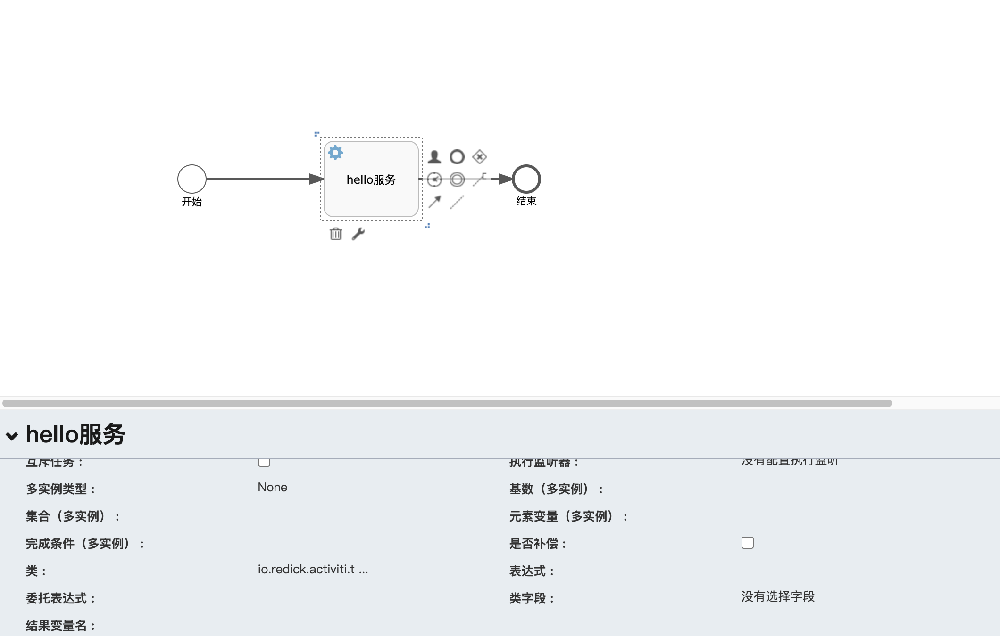

# 第一个Activiti程序-Hello World <!-- {docsify-ignore-all} -->


## 设计流程模型

&nbsp; &nbsp; 如图通过流程设计器设计如下的流程，是一个特别简单的流程，一个开始事件，一个服务任务，一个结束事件，然后配置服务事件中的类选项，这样就可以指定该任务索要处理的业务逻辑的实现类了，我这里配置`io.redick.activiti.test.helloworld.HelloDelegate`

 

## 编码

#### 编写服务任务处理类

&nbsp; &nbsp; 服务任务处理类HelloDelegate代码如下：

```java
package io.redick.activiti.test.helloworld;

import org.activiti.engine.delegate.DelegateExecution;
import org.activiti.engine.delegate.JavaDelegate;

/**
 * @author Redick01
 */
public class HelloDelegate implements JavaDelegate {

    @Override
    public void execute( DelegateExecution execution ) {
        System.out.println(execution.getId() + "Hello World");
    }
}
```

#### 编写启动类

```java
public class HelloWorldTest {

    public static void main( String[] args ) {
        String key = "helloworld";
        // 部署流程定义
        RepositoryService repositoryService = Engine.repositoryService();
        ProcessDefinition processDefinition = repositoryService
                .createProcessDefinitionQuery()
                .processDefinitionKey(key)
                .singleResult();
        if (processDefinition == null) {
            repositoryService
                    .createDeployment()
                    .name(key)
                    .addClasspathResource("bpmn/helloworld.bpmn")
                    .deploy();
        }
        processDefinition = repositoryService.createProcessDefinitionQuery()
                .processDefinitionKey(key)
                .singleResult();
        System.out.println("部署流程定义KEY：" + processDefinition.getKey());
        // 获取RuntimeService
        RuntimeService runtimeService = ProcessEngines.getDefaultProcessEngine().getRuntimeService();
        // 通过流程key启动流程
        ProcessInstance pi = runtimeService.startProcessInstanceByKey(processDefinition.getKey());
        System.out.println(pi.getId());
    }
}
```

#### 执行结果

```
部署流程定义KEY：helloworld
57502Hello World
57501
```
