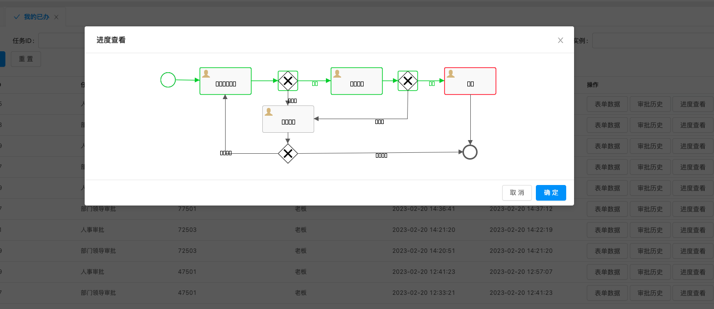
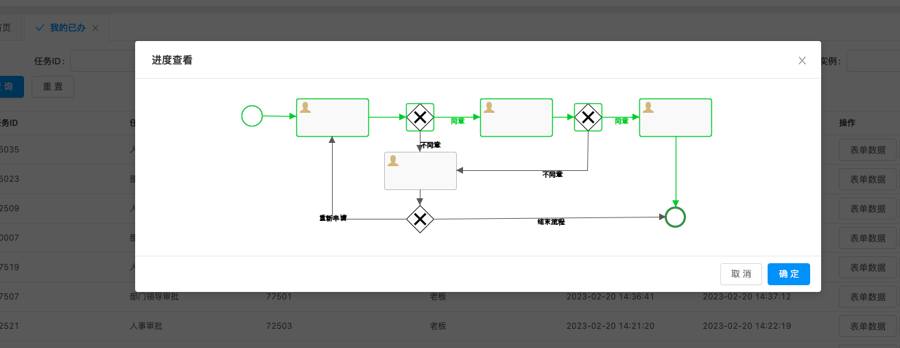

# Spring Boot集成Activiti 6.0流程设计器（二）-问题解决<!-- {docsify-ignore-all} -->

## 部署流程定义文件上传跨域问题解决

&nbsp; &nbsp; 在集成流程设计器的过程中，想要实现一个流程文件上传的功能，就是上传bnpm文件，直接就部署流程定义了，这就涉及到文件上传的功能，因为我将流程设计器集成到了公司的客服管理平台，该平台是前后端分离的，在使用ant Design的`a-upload`组件是遇到了跨域问题，解决办法如下：

`:action="uploadAction"`为上传图片属性，通过`:headers`设置上传图片请求的请求头结局跨域问题

```html
            <a-upload
              name="file"
              v-decorator="['file',{rules: [{ required: true, message: '文件不能为空！' }]}]"
              :multiple="true"
              :file-list="uploadfileList"
              :action="uploadAction"
              :headers="headers"
              :before-upload="uploadBeforeUpload"
              @change="handleChange"
            >
              <a-button size="small"> <a-icon type="upload" /> 点击上传 </a-button>
            </a-upload>
```

headers内容：

```
      headers: {
        "authorization": 'authorization-text',
        //指定允许其他域名访问
        "Access-Control-Allow-Origin": '*',
        "Access-Control-Allow-Credentials": true,
        "X-Requested-With": null
      },
```

## 解决文件上传,临时文件夹被程序自动删除问题

&nbsp; &nbsp; 在上传文件的时候会报一个异常，异常的意思就是上传文件的临时文件夹不存在，这里我们自己提前创建好临时的文件夹，并且配置上传文件的临时文件夹解决此问题，配置在application.properties，配置内容如下：

```properties
# 临时上传文件，临时文件夹
temporary.path=/Users/penghuiliu/ruoyi
```

## 解决前端上传文件没有进度条问题

&nbsp; &nbsp; 通过`@change="handleChange"`事件实现进度条功能，具体代码如下：

```javascript
    handleChange(info) {
      let fileList = [...info.fileList];

      // 1. Limit the number of uploaded files
      //    Only to show two recent uploaded files, and old ones will be replaced by the new
      fileList = fileList.slice(-2);

      // 2. read from response and show file link
      fileList = fileList.map(file => {
        if (file.response) {
          // Component will show file.url as link
          file.url = file.response.url;
        }
        return file;
      });
      // uploadfileList在data中定义，是个数组，代表文件列表
      this.uploadfileList = fileList;
    },
```

## 解决流程模型图片中文乱码

&nbsp; &nbsp; 导致图片中中文乱码的可能有两个原因，一个是Activiti源码中默认字体配置是`Arial`，这里我们通过继承`DefaultProcessDiagramCanvas`并将字体设置为`宋体`，并在使用使用重写的类去处理图片就可以了，代码如下：

- - CustomProcessDiagramCanvas

```java
public class CustomProcessDiagramCanvas extends DefaultProcessDiagramCanvas {

    protected static Color LABEL_COLOR = new Color(0, 0, 0);

    //font
    protected String activityFontName = "宋体";
    protected String labelFontName = "宋体";
    protected String annotationFontName = "宋体";

    private static volatile boolean flag = false;

    public CustomProcessDiagramCanvas(int width, int height, int minX, int minY, String imageType) {
        super(width, height, minX, minY, imageType);
    }

    public CustomProcessDiagramCanvas(int width, int height, int minX, int minY, String imageType,
            String activityFontName, String labelFontName, String annotationFontName, ClassLoader customClassLoader) {
        super(width, height, minX, minY, imageType, activityFontName, labelFontName, annotationFontName,
                customClassLoader);
    }

    public void drawHighLight(boolean isStartOrEnd, int x, int y, int width, int height, Color color) {
        Paint originalPaint = g.getPaint();
        Stroke originalStroke = g.getStroke();

        g.setPaint(color);
        g.setStroke(MULTI_INSTANCE_STROKE);
        if (isStartOrEnd) {// 开始、结束节点画圆
            g.drawOval(x, y, width, height);
        } else {// 非开始、结束节点画圆角矩形
            RoundRectangle2D rect = new RoundRectangle2D.Double(x, y, width, height, 5, 5);
            g.draw(rect);
        }
        g.setPaint(originalPaint);
        g.setStroke(originalStroke);
    }

    public void drawSequenceflow(int[] xPoints, int[] yPoints, boolean conditional, boolean isDefault,
            boolean highLighted, double scaleFactor, Color color) {
        drawConnection(xPoints, yPoints, conditional, isDefault, "sequenceFlow", AssociationDirection.ONE, highLighted,
                scaleFactor, color);
    }

    public void drawConnection(int[] xPoints, int[] yPoints, boolean conditional, boolean isDefault,
            String connectionType, AssociationDirection associationDirection, boolean highLighted, double scaleFactor,
            Color color) {

        Paint originalPaint = g.getPaint();
        Stroke originalStroke = g.getStroke();

        g.setPaint(CONNECTION_COLOR);
        if (connectionType.equals("association")) {
            g.setStroke(ASSOCIATION_STROKE);
        } else if (highLighted) {
            g.setPaint(color);
            g.setStroke(HIGHLIGHT_FLOW_STROKE);
        }

        for (int i = 1; i < xPoints.length; i++) {
            Integer sourceX = xPoints[i - 1];
            Integer sourceY = yPoints[i - 1];
            Integer targetX = xPoints[i];
            Integer targetY = yPoints[i];
            Line2D.Double line = new Line2D.Double(sourceX, sourceY, targetX, targetY);
            g.draw(line);
        }

        if (isDefault) {
            Line2D.Double line = new Line2D.Double(xPoints[0], yPoints[0], xPoints[1], yPoints[1]);
            drawDefaultSequenceFlowIndicator(line, scaleFactor);
        }

        if (conditional) {
            Line2D.Double line = new Line2D.Double(xPoints[0], yPoints[0], xPoints[1], yPoints[1]);
            drawConditionalSequenceFlowIndicator(line, scaleFactor);
        }

        if (associationDirection.equals(AssociationDirection.ONE)
                || associationDirection.equals(AssociationDirection.BOTH)) {
            Line2D.Double line = new Line2D.Double(xPoints[xPoints.length - 2], yPoints[xPoints.length - 2],
                    xPoints[xPoints.length - 1], yPoints[xPoints.length - 1]);
            drawArrowHead(line, scaleFactor);
        }
        if (associationDirection.equals(AssociationDirection.BOTH)) {
            Line2D.Double line = new Line2D.Double(xPoints[1], yPoints[1], xPoints[0], yPoints[0]);
            drawArrowHead(line, scaleFactor);
        }
        g.setPaint(originalPaint);
        g.setStroke(originalStroke);
    }

    public void drawLabel(boolean highLighted, String text, GraphicInfo graphicInfo, boolean centered) {
        float interline = 1.0f;

        // text
        if (text != null && text.length() > 0) {
            Paint originalPaint = g.getPaint();
            Font originalFont = g.getFont();
            if (highLighted) {
                g.setPaint(WorkflowConstants.COLOR_NORMAL);
            } else {
                g.setPaint(LABEL_COLOR);
            }
            g.setFont(new Font(labelFontName, Font.BOLD, 10));

            int wrapWidth = 100;
            int textY = (int) graphicInfo.getY();

            // TODO: use drawMultilineText()
            AttributedString as = new AttributedString(text);
            as.addAttribute(TextAttribute.FOREGROUND, g.getPaint());
            as.addAttribute(TextAttribute.FONT, g.getFont());
            AttributedCharacterIterator aci = as.getIterator();
            FontRenderContext frc = new FontRenderContext(null, true, false);
            LineBreakMeasurer lbm = new LineBreakMeasurer(aci, frc);

            while (lbm.getPosition() < text.length()) {
                TextLayout tl = lbm.nextLayout(wrapWidth);
                textY += tl.getAscent();
                Rectangle2D bb = tl.getBounds();
                double tX = graphicInfo.getX();
                if (centered) {
                    tX += (int) (graphicInfo.getWidth() / 2 - bb.getWidth() / 2);
                }
                tl.draw(g, (float) tX, textY);
                textY += tl.getDescent() + tl.getLeading() + (interline - 1.0f) * tl.getAscent();
            }

            // restore originals
            g.setFont(originalFont);
            g.setPaint(originalPaint);
        }
    }

    @Override
    public BufferedImage generateBufferedImage(String imageType) {
        if (closed) {
            throw new ActivitiImageException("ProcessDiagramGenerator already closed");
        }

        // Try to remove white space
        minX = (minX <= WorkflowConstants.PROCESS_PADDING) ? WorkflowConstants.PROCESS_PADDING : minX;
        minY = (minY <= WorkflowConstants.PROCESS_PADDING) ? WorkflowConstants.PROCESS_PADDING : minY;
        BufferedImage imageToSerialize = processDiagram;
        if (minX >= 0 && minY >= 0) {
            imageToSerialize = processDiagram.getSubimage(
                    minX - WorkflowConstants.PROCESS_PADDING,
                    minY - WorkflowConstants.PROCESS_PADDING,
                    canvasWidth - minX + WorkflowConstants.PROCESS_PADDING,
                    canvasHeight - minY + WorkflowConstants.PROCESS_PADDING);
        }
        return imageToSerialize;
    }

    @Override
    public void initialize(String imageType) {
        this.processDiagram = new BufferedImage(canvasWidth, canvasHeight, BufferedImage.TYPE_INT_ARGB);
        this.g = processDiagram.createGraphics();

        g.setRenderingHint(RenderingHints.KEY_ANTIALIASING, RenderingHints.VALUE_ANTIALIAS_ON);
        g.setPaint(Color.black);

        Font font = new Font(activityFontName, Font.BOLD, FONT_SIZE);
        g.setFont(font);
        this.fontMetrics = g.getFontMetrics();

        LABEL_FONT = new Font(labelFontName, Font.ITALIC, 10);
        ANNOTATION_FONT = new Font(annotationFontName, Font.PLAIN, FONT_SIZE);
        //优化加载速度
        if(flag) {
            return;
        }
        try {
            USERTASK_IMAGE = ImageIO.read(ReflectUtil.getResource("org/activiti/icons/userTask.png", customClassLoader));
            SCRIPTTASK_IMAGE = ImageIO.read(ReflectUtil.getResource("org/activiti/icons/scriptTask.png", customClassLoader));
            SERVICETASK_IMAGE = ImageIO.read(ReflectUtil.getResource("org/activiti/icons/serviceTask.png", customClassLoader));
            RECEIVETASK_IMAGE = ImageIO.read(ReflectUtil.getResource("org/activiti/icons/receiveTask.png", customClassLoader));
            SENDTASK_IMAGE = ImageIO.read(ReflectUtil.getResource("org/activiti/icons/sendTask.png", customClassLoader));
            MANUALTASK_IMAGE = ImageIO.read(ReflectUtil.getResource("org/activiti/icons/manualTask.png", customClassLoader));
            BUSINESS_RULE_TASK_IMAGE = ImageIO.read(ReflectUtil.getResource("org/activiti/icons/businessRuleTask.png", customClassLoader));
            SHELL_TASK_IMAGE = ImageIO.read(ReflectUtil.getResource("org/activiti/icons/shellTask.png", customClassLoader));
            CAMEL_TASK_IMAGE = ImageIO.read(ReflectUtil.getResource("org/activiti/icons/camelTask.png", customClassLoader));
            MULE_TASK_IMAGE = ImageIO.read(ReflectUtil.getResource("org/activiti/icons/muleTask.png", customClassLoader));

            TIMER_IMAGE = ImageIO.read(ReflectUtil.getResource("org/activiti/icons/timer.png", customClassLoader));
            COMPENSATE_THROW_IMAGE = ImageIO.read(ReflectUtil.getResource("org/activiti/icons/compensate-throw.png", customClassLoader));
            COMPENSATE_CATCH_IMAGE = ImageIO.read(ReflectUtil.getResource("org/activiti/icons/compensate.png", customClassLoader));
            ERROR_THROW_IMAGE = ImageIO.read(ReflectUtil.getResource("org/activiti/icons/error-throw.png", customClassLoader));
            ERROR_CATCH_IMAGE = ImageIO.read(ReflectUtil.getResource("org/activiti/icons/error.png", customClassLoader));
            MESSAGE_THROW_IMAGE = ImageIO.read(ReflectUtil.getResource("org/activiti/icons/message-throw.png", customClassLoader));
            MESSAGE_CATCH_IMAGE = ImageIO.read(ReflectUtil.getResource("org/activiti/icons/message.png", customClassLoader));
            SIGNAL_THROW_IMAGE = ImageIO.read(ReflectUtil.getResource("org/activiti/icons/signal-throw.png", customClassLoader));
            SIGNAL_CATCH_IMAGE = ImageIO.read(ReflectUtil.getResource("org/activiti/icons/signal.png", customClassLoader));
          flag = true;
        } catch (IOException e) {
          flag = false;
          LOGGER.warn("Could not load image for process diagram creation: {}", e.getMessage());
        }
    }
}
```

- - CustomProcessDiagramGenerator

```java
@Component
public class CustomProcessDiagramGenerator extends DefaultProcessDiagramGenerator implements
        ICustomProcessDiagramGenerator {
    //预初始化流程图绘制，大大提升了系统启动后首次查看流程图的速度
    static {
        new CustomProcessDiagramCanvas(10,10,0,0,"png", "宋体","宋体","宋体",null);
    }

    public CustomProcessDiagramCanvas generateProcessDiagram(BpmnModel bpmnModel, String imageType,
                                                             List<String> highLightedActivities, List<String> highLightedFlows, String activityFontName,
                                                             String labelFontName, String annotationFontName, ClassLoader customClassLoader, double scaleFactor,
                                                             Color[] colors, Set<String> currIds) {

        if(null == highLightedActivities) {
            highLightedActivities = Collections.<String>emptyList();
        }
        if(null == highLightedFlows) {
            highLightedFlows = Collections.<String>emptyList();
        }

        prepareBpmnModel(bpmnModel);

        CustomProcessDiagramCanvas processDiagramCanvas = initProcessDiagramCanvas(bpmnModel, imageType, activityFontName, labelFontName, annotationFontName, customClassLoader);

        // Draw pool shape, if process is participant in collaboration
        for (Pool pool : bpmnModel.getPools()) {
          GraphicInfo graphicInfo = bpmnModel.getGraphicInfo(pool.getId());
          processDiagramCanvas.drawPoolOrLane(pool.getName(), graphicInfo);
        }

        // Draw lanes
        for (Process process : bpmnModel.getProcesses()) {
          for (Lane lane : process.getLanes()) {
            GraphicInfo graphicInfo = bpmnModel.getGraphicInfo(lane.getId());
            processDiagramCanvas.drawPoolOrLane(lane.getName(), graphicInfo);
          }
        }

        // Draw activities and their sequence-flows
        for (Process process: bpmnModel.getProcesses()) {
            List<FlowNode> flowNodeList= process.findFlowElementsOfType(FlowNode.class);
          for (FlowNode flowNode : flowNodeList) {
              drawActivity(processDiagramCanvas, bpmnModel, flowNode, highLightedActivities, highLightedFlows, scaleFactor, colors, currIds);
          }
        }

        // Draw artifacts
        for (Process process : bpmnModel.getProcesses()) {

          for (Artifact artifact : process.getArtifacts()) {
            drawArtifact(processDiagramCanvas, bpmnModel, artifact);
          }

          List<SubProcess> subProcesses = process.findFlowElementsOfType(SubProcess.class, true);
          if (subProcesses != null) {
            for (SubProcess subProcess : subProcesses) {
              for (Artifact subProcessArtifact : subProcess.getArtifacts()) {
                drawArtifact(processDiagramCanvas, bpmnModel, subProcessArtifact);
              }
            }
          }
        }

        return processDiagramCanvas;
    }

    protected void drawActivity(CustomProcessDiagramCanvas processDiagramCanvas, BpmnModel bpmnModel, FlowNode flowNode,
            List<String> highLightedActivities, List<String> highLightedFlows, double scaleFactor, Color[] colors, Set<String> currIds) {
        ActivityDrawInstruction drawInstruction = activityDrawInstructions.get(flowNode.getClass());
        if (drawInstruction != null) {

          drawInstruction.draw(processDiagramCanvas, bpmnModel, flowNode);

          // Gather info on the multi instance marker
          boolean multiInstanceSequential = false, multiInstanceParallel = false, collapsed = false;
          if (flowNode instanceof Activity) {
            Activity activity = (Activity) flowNode;
            MultiInstanceLoopCharacteristics multiInstanceLoopCharacteristics = activity.getLoopCharacteristics();
            if (multiInstanceLoopCharacteristics != null) {
              multiInstanceSequential = multiInstanceLoopCharacteristics.isSequential();
              multiInstanceParallel = !multiInstanceSequential;
            }
          }

          // Gather info on the collapsed marker
          GraphicInfo graphicInfo = bpmnModel.getGraphicInfo(flowNode.getId());
          if (flowNode instanceof SubProcess) {
            collapsed = graphicInfo.getExpanded() != null && !graphicInfo.getExpanded();
          } else if (flowNode instanceof CallActivity) {
            collapsed = true;
          }

          if (scaleFactor == 1.0) {
            // Actually draw the markers
            processDiagramCanvas.drawActivityMarkers((int) graphicInfo.getX(), (int) graphicInfo.getY(),(int) graphicInfo.getWidth(), (int) graphicInfo.getHeight(),
                    multiInstanceSequential, multiInstanceParallel, collapsed);
          }

          // Draw highlighted activities
          if (highLightedActivities.contains(flowNode.getId())) {
              if(!CollectionUtils.isEmpty(currIds)
                      &&currIds.contains(flowNode.getId())
                      && !(flowNode instanceof Gateway)) {//非结束节点，并且是当前节点
                  drawHighLight((flowNode instanceof StartEvent), processDiagramCanvas, bpmnModel.getGraphicInfo(flowNode.getId()), colors[1]);
              }else {//普通节点
                  drawHighLight((flowNode instanceof StartEvent)||(flowNode instanceof EndEvent),processDiagramCanvas, bpmnModel.getGraphicInfo(flowNode.getId()), colors[0]);
              }
          }

        }

        // Outgoing transitions of activity
        for (SequenceFlow sequenceFlow : flowNode.getOutgoingFlows()) {
            String flowId = sequenceFlow.getId();
          boolean highLighted = (highLightedFlows.contains(flowId));
          String defaultFlow = null;
          if (flowNode instanceof Activity) {
            defaultFlow = ((Activity) flowNode).getDefaultFlow();
          } else if (flowNode instanceof Gateway) {
            defaultFlow = ((Gateway) flowNode).getDefaultFlow();
          }

          boolean isDefault = false;
          if (defaultFlow != null && defaultFlow.equalsIgnoreCase(flowId)) {
            isDefault = true;
          }

          String sourceRef = sequenceFlow.getSourceRef();
          String targetRef = sequenceFlow.getTargetRef();
          FlowElement sourceElement = bpmnModel.getFlowElement(sourceRef);
          FlowElement targetElement = bpmnModel.getFlowElement(targetRef);
          List<GraphicInfo> graphicInfoList = bpmnModel.getFlowLocationGraphicInfo(flowId);
          if (graphicInfoList != null && graphicInfoList.size() > 0) {
            graphicInfoList = connectionPerfectionizer(processDiagramCanvas, bpmnModel, sourceElement, targetElement, graphicInfoList);
            int xPoints[]= new int[graphicInfoList.size()];
            int yPoints[]= new int[graphicInfoList.size()];

            for (int i=1; i<graphicInfoList.size(); i++) {
              GraphicInfo graphicInfo = graphicInfoList.get(i);
              GraphicInfo previousGraphicInfo = graphicInfoList.get(i-1);

              if (i == 1) {
                xPoints[0] = (int) previousGraphicInfo.getX();
                yPoints[0] = (int) previousGraphicInfo.getY();
              }
              xPoints[i] = (int) graphicInfo.getX();
              yPoints[i] = (int) graphicInfo.getY();

            }
            //画高亮线
            processDiagramCanvas.drawSequenceflow(xPoints, yPoints, false, isDefault, highLighted, scaleFactor, colors[0]);

            GraphicInfo lineCenter = getLineCenter(graphicInfoList);
                            processDiagramCanvas.drawLabel(highLighted, sequenceFlow.getName(), lineCenter, Math.abs(xPoints[1]-xPoints[0]) >= 5);
          }
        }

     // Nested elements
        if (flowNode instanceof FlowElementsContainer) {
          for (FlowElement nestedFlowElement : ((FlowElementsContainer) flowNode).getFlowElements()) {
            if (nestedFlowElement instanceof FlowNode) {
              drawActivity(processDiagramCanvas, bpmnModel, (FlowNode) nestedFlowElement,
                  highLightedActivities, highLightedFlows, scaleFactor);
            }
          }
        }
    }
    protected void drawHighLight(boolean isStartOrEnd, CustomProcessDiagramCanvas processDiagramCanvas, GraphicInfo graphicInfo, Color color) {
      processDiagramCanvas.drawHighLight(isStartOrEnd, (int) graphicInfo.getX(), (int) graphicInfo.getY(), (int) graphicInfo.getWidth(), (int) graphicInfo.getHeight(), color);
    }

    protected static CustomProcessDiagramCanvas initProcessDiagramCanvas(BpmnModel bpmnModel, String imageType,
              String activityFontName, String labelFontName, String annotationFontName, ClassLoader customClassLoader) {

            // We need to calculate maximum values to know how big the image will be in its entirety
            double minX = Double.MAX_VALUE;
            double maxX = 0;
            double minY = Double.MAX_VALUE;
            double maxY = 0;

            for (Pool pool : bpmnModel.getPools()) {
              GraphicInfo graphicInfo = bpmnModel.getGraphicInfo(pool.getId());
              minX = graphicInfo.getX();
              maxX = graphicInfo.getX() + graphicInfo.getWidth();
              minY = graphicInfo.getY();
              maxY = graphicInfo.getY() + graphicInfo.getHeight();
            }

            List<FlowNode> flowNodes = gatherAllFlowNodes(bpmnModel);
            for (FlowNode flowNode : flowNodes) {

              GraphicInfo flowNodeGraphicInfo = bpmnModel.getGraphicInfo(flowNode.getId());

              // width
              if (flowNodeGraphicInfo.getX() + flowNodeGraphicInfo.getWidth() > maxX) {
                maxX = flowNodeGraphicInfo.getX() + flowNodeGraphicInfo.getWidth();
              }
              if (flowNodeGraphicInfo.getX() < minX) {
                minX = flowNodeGraphicInfo.getX();
              }
              // height
              if (flowNodeGraphicInfo.getY() + flowNodeGraphicInfo.getHeight() > maxY) {
                maxY = flowNodeGraphicInfo.getY() + flowNodeGraphicInfo.getHeight();
              }
              if (flowNodeGraphicInfo.getY() < minY) {
                minY = flowNodeGraphicInfo.getY();
              }

              for (SequenceFlow sequenceFlow : flowNode.getOutgoingFlows()) {
                List<GraphicInfo> graphicInfoList = bpmnModel.getFlowLocationGraphicInfo(sequenceFlow.getId());
                if (graphicInfoList != null) {
                  for (GraphicInfo graphicInfo : graphicInfoList) {
                    // width
                    if (graphicInfo.getX() > maxX) {
                      maxX = graphicInfo.getX();
                    }
                    if (graphicInfo.getX() < minX) {
                      minX = graphicInfo.getX();
                    }
                    // height
                    if (graphicInfo.getY() > maxY) {
                      maxY = graphicInfo.getY();
                    }
                    if (graphicInfo.getY()< minY) {
                      minY = graphicInfo.getY();
                    }
                  }
                }
              }
            }

            List<Artifact> artifacts = gatherAllArtifacts(bpmnModel);
            for (Artifact artifact : artifacts) {

              GraphicInfo artifactGraphicInfo = bpmnModel.getGraphicInfo(artifact.getId());

              if (artifactGraphicInfo != null) {
                  // width
                  if (artifactGraphicInfo.getX() + artifactGraphicInfo.getWidth() > maxX) {
                    maxX = artifactGraphicInfo.getX() + artifactGraphicInfo.getWidth();
                  }
                  if (artifactGraphicInfo.getX() < minX) {
                    minX = artifactGraphicInfo.getX();
                  }
                  // height
                  if (artifactGraphicInfo.getY() + artifactGraphicInfo.getHeight() > maxY) {
                    maxY = artifactGraphicInfo.getY() + artifactGraphicInfo.getHeight();
                  }
                  if (artifactGraphicInfo.getY() < minY) {
                    minY = artifactGraphicInfo.getY();
                  }
              }

              List<GraphicInfo> graphicInfoList = bpmnModel.getFlowLocationGraphicInfo(artifact.getId());
              if (graphicInfoList != null) {
                  for (GraphicInfo graphicInfo : graphicInfoList) {
                      // width
                      if (graphicInfo.getX() > maxX) {
                        maxX = graphicInfo.getX();
                      }
                      if (graphicInfo.getX() < minX) {
                        minX = graphicInfo.getX();
                      }
                      // height
                      if (graphicInfo.getY() > maxY) {
                        maxY = graphicInfo.getY();
                      }
                      if (graphicInfo.getY()< minY) {
                        minY = graphicInfo.getY();
                      }
                  }
              }
            }

            int nrOfLanes = 0;
            for (Process process : bpmnModel.getProcesses()) {
              for (Lane l : process.getLanes()) {

                nrOfLanes++;

                GraphicInfo graphicInfo = bpmnModel.getGraphicInfo(l.getId());
                // // width
                if (graphicInfo.getX() + graphicInfo.getWidth() > maxX) {
                  maxX = graphicInfo.getX() + graphicInfo.getWidth();
                }
                if (graphicInfo.getX() < minX) {
                  minX = graphicInfo.getX();
                }
                // height
                if (graphicInfo.getY() + graphicInfo.getHeight() > maxY) {
                  maxY = graphicInfo.getY() + graphicInfo.getHeight();
                }
                if (graphicInfo.getY() < minY) {
                  minY = graphicInfo.getY();
                }
              }
            }

            // Special case, see https://activiti.atlassian.net/browse/ACT-1431
            if (flowNodes.isEmpty() && bpmnModel.getPools().isEmpty() && nrOfLanes == 0) {
              // Nothing to show
              minX = 0;
              minY = 0;
            }

            return new CustomProcessDiagramCanvas((int) maxX + 10,(int) maxY + 10, (int) minX, (int) minY,
                imageType, activityFontName, labelFontName, annotationFontName, customClassLoader);
          }

    @Override
    public InputStream generateDiagram(BpmnModel bpmnModel, String imageType, List<String> highLightedActivities,
            List<String> highLightedFlows, String activityFontName, String labelFontName, String annotationFontName,
            ClassLoader customClassLoader, double scaleFactor, Color[] colors, Set<String> currIds) {
        CustomProcessDiagramCanvas customProcessDiagramCanvas = generateProcessDiagram(bpmnModel, imageType, highLightedActivities, highLightedFlows,
                activityFontName, labelFontName, annotationFontName, customClassLoader, scaleFactor,colors, currIds);
        BufferedImage bufferedImage = customProcessDiagramCanvas.generateBufferedImage(imageType);
        ByteArrayOutputStream bs = new ByteArrayOutputStream();
        ImageOutputStream imOut;
        try {
            imOut = ImageIO.createImageOutputStream(bs);
            ImageIO.write(bufferedImage, "PNG", imOut);
        } catch (IOException e) {
            e.printStackTrace();
        }

        InputStream is = new ByteArrayInputStream(bs.toByteArray());
        return is;
    }
    @Override
    public InputStream generateDiagram(BpmnModel bpmnModel, String imageType, String activityFontName, String labelFontName, String annotationFontName, ClassLoader customClassLoader) {
        return generateDiagram(bpmnModel, imageType, Collections.<String>emptyList(), Collections.<String>emptyList(),
            activityFontName, labelFontName, annotationFontName, customClassLoader, 1.0, new Color[] {Color.BLACK, Color.BLACK}, null);
    }
}
```

&nbsp; &nbsp; 第二个原因就可能是和操作系统的字体库有关系，我这里遇到的就是操作系统字体库问题，服务器是CentOS，字体库中没有宋体，我把宋体的字体库文件导进去就可以了，服务器上的字体库文件存在`/usr/share/fonts/dejavu`，导入就可以了，下面是导入字体库前后的对比。

导入字体库文件前：
 


导入字体库文件后：
 