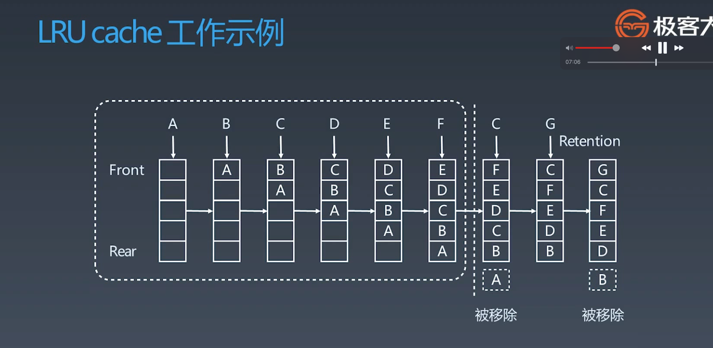

# 布隆过滤器和LRU算法 <!-- {docsify-ignore-all} -->

- 布隆过滤器
- LRU算法

## 布隆过滤器

&nbsp; &nbsp; 一个很长的`二进制`向量和一系列`随机映射函数`。布隆过滤器可以用于检索一个元素是否在一个集合中。

- 优点：空间效率和查询时间都远远超过一般算法
- 缺点：有一定的误识别率和删除困难

## Java实现

```java
public class BloomFilter {

    /**
     * 使用加法hash算法，所以定义了一个8个元素的质数数组
     */
    private static final int[] PRIMES = new int[]{2, 3, 5, 7, 11, 13, 17, 19};
    /**
     * 用八个不同的质数，相当于构建8个不同算法
     */
    private final Hash[] hashList = new Hash[PRIMES.length];
    /**
     * 创建一个长度为10亿的比特位
     */
    private final BitSet bits = new BitSet(256 << 22);

    public BloomFilter() {
        for (int i = 0; i < PRIMES.length; i++) {
            // 使用8个质数，创建八种算法
            hashList[i] = new Hash(PRIMES[i]);
        }
    }

    /**
     * 添加元素
     */
    public void add(String value) {
        for (Hash hash : hashList) {
            bits.set(hash.hash(value), true);
        }
    }

    public boolean contains(String value) {
        if (null == value) {
            return false;
        }
        boolean res = true;
        for (Hash hash :hashList) {
            res = res && bits.get(hash.hash(value));
        }
        return res;
    }

    /**
     * 加法hash算法
     */
    public static class Hash {

        private final int prime;

        public Hash(int prime) {
            this.prime = prime;
        }

        public int hash(String key) {
            int hash, i;
            for (hash = key.length(), i = 0; i < key.length(); i++) {
                hash += key.charAt(i);
            }
            // 保证不会哈希越界
            return (hash % prime);
        }
    }


    public static void main(String[] args) {
        BloomFilter filter = new BloomFilter();
        System.out.println(filter.contains("ssfsd"));
        filter.add("ssfsd");
        filter.add("devwe");
        System.out.println(filter.contains("ssfsd"));
    }
}
```

## LRU算法

- 两个要素：大小、替换策略
- Hash Table + Double LinkedList

O(1)查询，修改，删除

- LRU Cache工作示例




### LRU实现方案

#### 方案1 基于java LinkedHashMap

&nbsp; &nbsp; 其核心是重写`LinkedHashMap`的`removeEldestEntry`方法

```java
public class LRUCache {

    private final Map<Integer, Integer> map;

    public LRUCache(int capacity) {
        map = new LinkedCoppedHashMap<>(capacity);
    }

    public int get(int key) {
        return map.getOrDefault(key, -1);
    }

    public void put(int key, int value) {
        map.put(key, value);
    }

    private static class LinkedCoppedHashMap<K, V> extends LinkedHashMap<K, V> {

        int maximumCapacity;

        LinkedCoppedHashMap(int maximumCapacity) {
            super(16, 0.75f, true);
            this.maximumCapacity = maximumCapacity;
        }

        @Override
        protected boolean removeEldestEntry(Map.Entry entry) {
            return size() > maximumCapacity;
        }
    }
}
```

#### 方案2，手写哈希表+双向链表实现LRU

```java
class LRUCache {

    /**
     * 双向链表
     * 双向链表头节点数据是最近访问的数据
     * 双向链表尾节点数据是最近最少访问数据
     */
    static class DNode {

        int key;

        int val;

        DNode pre;

        DNode next;

        public DNode() {
        }

        public DNode(int key, int val) {
            this.key = key;
            this.val = val;
        }
    }

    /**
     * 哈希表
     */
    private final Map<Integer, DNode> cache = new HashMap<>();

    /**
     * 缓存容量
     */
    private final int capacity;

    /**
     * 当前缓存使用的大小
     */
    private int size;

    /**
     * 头节点，尾节点 这两个节点是dummy 哑节点
     */
    private final DNode head;
    private final DNode tail;

    public LRUCache(int capacity) {
        this.capacity = capacity;
        this.size = 0;
        this.head = new DNode();
        this.tail = new DNode();
        head.next = tail;
        tail.pre = head;
    }

    /**
     * 从缓存中根据key 查询
     * @param key 缓存key
     * @return 缓存数据
     */
    public int get(int key) {
        DNode node = cache.get(key);
        // 如果不存在返回 -1
        if (null == node) {
            return -1;
        }
        // 如果存在，操作双向链表，将缓存放到双向链表的头部
        moveToHead(node);
        return node.val;
    }

    /**
     * 插入缓存
     * @param key 缓存key
     * @param value 缓存数据
     */
    public void put(int key, int value) {
        DNode node = cache.get(key);
        // 缓存不存在，将其放到缓存中并放到头节点，判断缓存size是否大于容量，如果大于容量要从双向链表尾步删除尾节点
        if (null == node) {
            DNode dNode = new DNode(key, value);
            cache.put(key, dNode);
            // 添加到链表头部
            addNode(dNode);
            ++size;
            // 超出容量
            if (size > capacity) {
                // 移除尾节点
                DNode tailNode = removeTail();
                // 从缓存中移除
                cache.remove(tailNode.key);
                --size;
            }
        } else {
            // 缓存存在，更新val，并且将缓存放到双向链表头节点，将缓存从原来链表位置删除
            node.val = value;
            moveToHead(node);
        }
    }

    /**
     * 将节点移动到头节点，首先要在双向链表中删除节点，然后双向链表头部添加该节点
     * @param dNode 节点
     */
    public void moveToHead(DNode dNode) {
        removeNode(dNode);
        addNode(dNode);
    }

    /**
     * 从双向链表中删除节点
     * @param dNode 删除的节点
     */
    public void removeNode(DNode dNode) {
        dNode.pre.next = dNode.next;
        dNode.next.pre = dNode.pre;
    }

    public void addNode(DNode dNode) {
        dNode.pre = head;
        dNode.next = head.next;
        dNode.next.pre = dNode;
        head.next = dNode;
    }

    /**
     * 移除链表尾节点
     * @return 尾节点
     */
    public DNode removeTail() {
        DNode tailNode = tail.pre;
        removeNode(tailNode);
        return tailNode;
    }
}
```