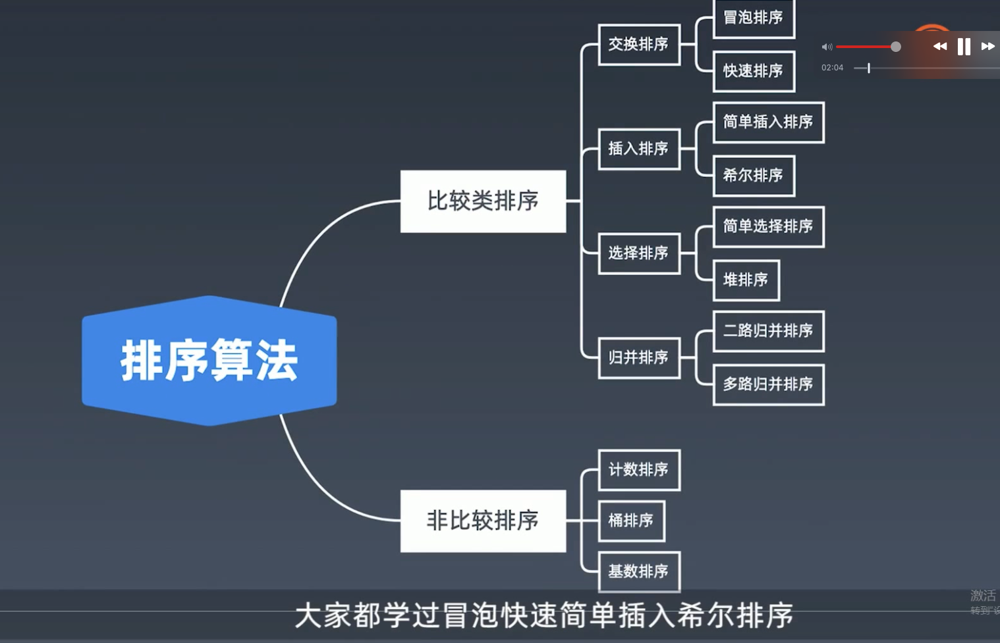
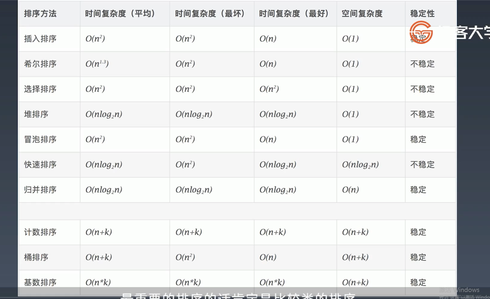

# 排序算法 <!-- {docsify-ignore-all} -->


## 比较类排序

&nbsp; &nbsp; 通过比较来决定元素间的相对次序，由于其时间复杂度不能突破0(nlogn)，因此也称为非线性时间比较类排序。

## 非比较类排序

&nbsp; &nbsp; 不通过比较来决定元素间的相对次序，他可以突破基于比较排序的时间下界，以线性时间运行，因此也称为线性时间非比较类排序。




时间及空间复杂度



## 初级排序-O(n^2)

> 选择排序：

每次找最小值，然后放到待排序数组的起始位置

```java

```

> 插入排序：

从前到后逐步构建有序序列；对于未排序数据，在已排序序列中从后向前扫描，找到相应位置并插入。

```java

```

> 冒泡排序：

嵌套循环，每次查看相邻的元素，如果逆序，则交换。

```java

```

## 高级排序-O(nlogn)

> 快速排序：

数组取标杆pivot，将小元素放到pivot左边，大元素放到pivot右边，然后一次对左边和右边的子数组继续快排，以达到整个序列有序。

```java
public static void quickSort(int[] array, int begin, int end) {
    if (end <= begin) {
        return;
    }
    int pivot = partition(array, begin, end);
    quickSort(array, begin, pivot - 1);
    quickSort(array, pivot + 1; end);
}

public static int partition(int[] a, int begin, int end) {
    // pivot标杆, counter小于pivot的元素个数
    int pivot = end, counter = begin;
    for (int i = begin; i < end; i++) {
        if (a[i] < a[pivot]) {
            int temp = a[counter]; a[counter] = a[i]; a[i] = temp;
            counter++;
        }
    }
    int temp = a[pivot]; a[pivot] = a[counter]; a[counter] = temp;
    return counter;
}
```

> 归并排序-分治

1. 把长度为n的输入序列分成两个长度为n/2的子序列；
2. 对这两个子序列分别采用归并排序；
3. 将两个排序好的子序列合并成一个最终的排序序列。

```java
    public void sort(int[] array) {
        mergeSort(array, 0, array.length - 1);
    }

    public void mergeSort(int[] array, int begin, int end) {
        if (begin >= end) {
            return;
        }
        int mid = (begin + end) >> 1;
        mergeSort(array, begin, mid);
        mergeSort(array, mid + 1, end);
        merge(array, begin, mid, end);
    }

    private void merge(int[] array, int begin, int mid, int end) {
        // 临时数组
        int[] temp = new int[end - begin + 1];
        int i = begin, j = mid + 1, k = 0;
        while (i <= mid && j <= end) {
            temp[k++] = array[i] <= array[j] ? array[i++] : array[j++];
        }
        while (i <= mid) {
            temp[k++] = array[i++];
        }
        while (j <= end) {
            temp[k++] = array[j++];
        }
        System.arraycopy(temp, 0, array, begin, temp.length);
    }
```
