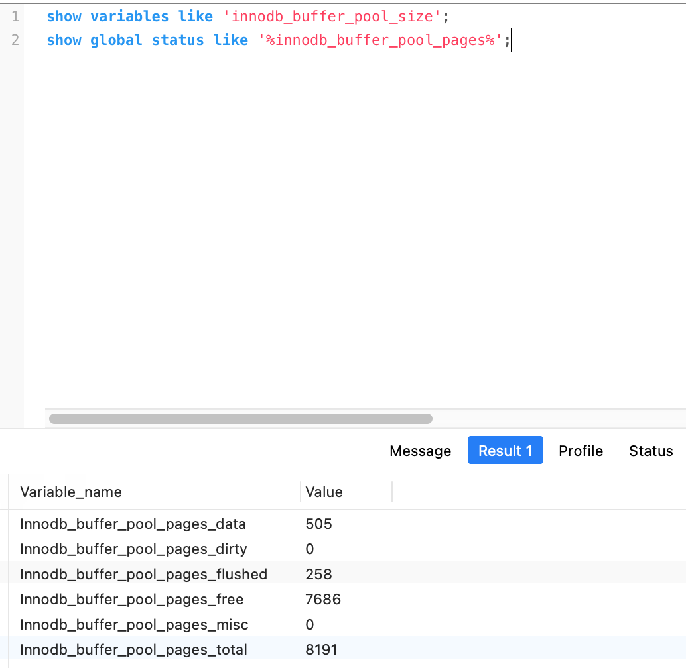

# MySQL5 InnoDB引擎 Server优化  <!-- {docsify-ignore-all} -->


## 内存优化

&nbsp; &nbsp; InnoDB引擎使用一块内存区作为IO缓存池，InnoDB的缓存池逻辑上是有`free list`、`flush list`、`LRU list`组成，free list是空闲缓存块列表，flush list是要刷新到磁盘的缓存块列表，LRU list是正在使用的缓存块列表。

&nbsp; &nbsp; LRU list氛围young sublist和old sublist的“中点”，即old sublist头部，经过一定时间的访问（由innodb_old_blocks_time参数决定），改数据块将会从old list转移到young list头部，也就是随着时间推移，访问少的数据块会移动到链表的尾部，需要做淘汰时会从尾部淘汰数据，，这么做的目的是，为了防止偶尔访问的数据块将访问频繁的热点数据块淘汰掉。

&nbsp; &nbsp; 脏页的刷新存在于flush list和LRU list两个链表中，LRU list中也可以刷新脏页，当缓存池（innodb_buffer_pool）中不存在可用的数据页时，会扫描LRU list的后多少页（innodb_lru_scan_depth参数控制）进行相关的刷新操作。从LRU list淘汰的数据页会立刻放入到free list中。

&nbsp; &nbsp; 通过调整InnoDB buffer pool的大小、改变young sublist，old sublist的分配比例、控制脏缓存的刷新活动、使用多个缓存池等方法来优化InnoDB性能。

#### innodb_buffer_pool_size

&nbsp; &nbsp; 决定InnoDB存储引擎表数据和索引数据的最大缓存区大小。在保证操作系统及其他程序有足够的内存可用的情况下，innodb_buffer_pool_size的值约到，缓存命中率越高，访问InnoDB表需要的磁盘IO就越少，性能就越高。在一个专用的数据库服务器上，可以将80%的物理内存分配给InnoDB buffer pool，但一定要注意避免设置过大而导致页交换。

通过以下命令查看buffer pool的使用情况：

buffer_pool_size大小
```sql
show variables like 'innodb_buffer_pool_size';
```
buffer_pool_size数据页使用情况
```sql
show global status like '%innodb_buffer_pool_pages%';
```



计算缓存命中率：
(1 - innodb_buffer_pool_reads/innodb_buffer_pool_request) * 100

如果命中率太低，则应考虑扩充内存，增加innodb_buffer_pool_size的值。

#### old sublist大小

&nbsp; &nbsp; 在LRU list中，old sublist的比例由系统参数innodb_old_blocks_pct决定，取值范围是5~95，默认值是37，通过下面命令查看当前设置：

```sql
mysql> show global VARIABLES like '%innodb_old_blocks_pct%';
+-----------------------+-------+
| Variable_name         | Value |
+-----------------------+-------+
| innodb_old_blocks_pct | 37    |
+-----------------------+-------+
1 row in set (0.15 sec)
```
&nbsp; &nbsp; 可以根据InnoDB Monitor的输出信息来调整innodb_old_blocks_pct的值。例如，在没有较大表扫描或索引扫描的情况下，如果young/s的值很低，可能就需要适当增大innodb_old_blocks_pct的值或减小innodb_old_blocks_time的值。

#### innodb_old_blocks_time

&nbsp; &nbsp; 该参数决定了缓存数据块由old sublist转移到young sublist的快慢，当一个数据块被插入到midpoint时还少要在old sublist停留超过innodb_old_blocks_time后，才有可能被转移到sub list。这么做的目的能够避免污染buffer pool。

&nbsp; &nbsp; 另外这个值是可以动态设置的，如果要进行大表的扫描操作，可以很方便的调整。

#### 调整缓存池数量，减少内部对缓存池数据结构的争用

&nbsp; &nbsp; MySQL内部不同线程对InnoDB缓存池的访问在某些阶段是互斥的，这种内部竞争也会产生性能问题，尤其是在高并发和bufffer pool较大的情况下，所以为了解决此问题，InnoDB的缓存系统引入了innodb_buffer_pool_instances配置参数，对于缓存池较大可以适当增大此参数的值，降低并发导致的内部缓存访问冲突，改善性能。InnoDB缓存系统会将参数innodb_buffer_pool_size指定大小的缓存平均分为innodb_buffer_pool_instances个buffer pool。

#### 控制innodb buffer刷新，延长数据缓存时间，减少磁盘IO

&nbsp; &nbsp; 在InnoDB找不到干净的可用的缓存页或者检查点被触发等情况下，InnoDB的后台线程就会开始把“脏的缓存页”回写到磁盘中，这个过程就叫缓存刷新。我们通常希望数据在缓存页中能够存在更长的时间，从而减少磁盘IO次数，InnoDB buffer pool的刷新快慢主要取决于两个参数：

- innodb_max_dirty_pages_pct
  控制缓存池中脏页的最大比例，默认是75%，如果脏页的数量达到或超过该值，InnoDB的后台线程将开始缓存刷新。

- innodb_io_capacity
  它代表磁盘系统的IO能力，其值在一定程度上代表磁盘美妙可完成IO的次数，默认值是200，对于转速较低的磁盘可降低此值，对于速度较快的磁盘可以适当调大此值。

#### InnoDB doublewrite

&nbsp; &nbsp; InnoDB采用双写机制进行脏页刷新。


#### 调整用户服务线程排序缓存区

&nbsp; &nbsp; 如果通过show global status看到sort_merge_message的值很大，可以考虑通过调整参数sort_buffer_size的值来增大排序缓存区，以改善带有order by子句或group子句的sql性能.


&nbsp; &nbsp; 对于无法通过索引进行连接操作的查询，可以尝试通过调大join_buffer_size的值来改善性能。

&nbsp; &nbsp; 需要注意的是，sort buffer和join buffer都是面向客户服务线程分配的，如果设置过大的话会导致内存浪费，甚至导致内存交换，尤其是join buffer，如果还是多表关联的复杂查询，还可能会分配多个join buffer，因此最好的策略是设置较小的全局join_buffer_size，而对需要做复杂链接操作的session单独设置较大的join_buffer_size。