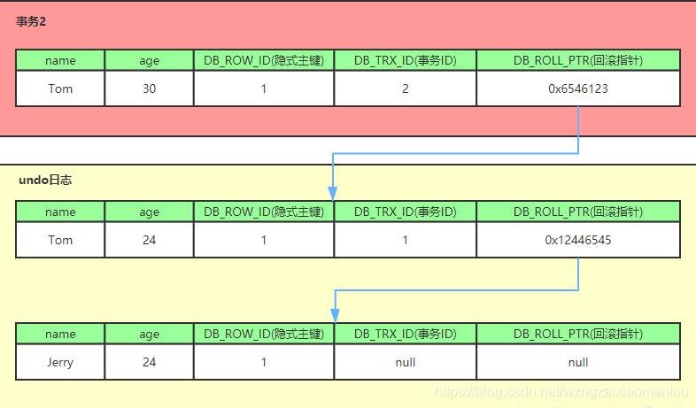
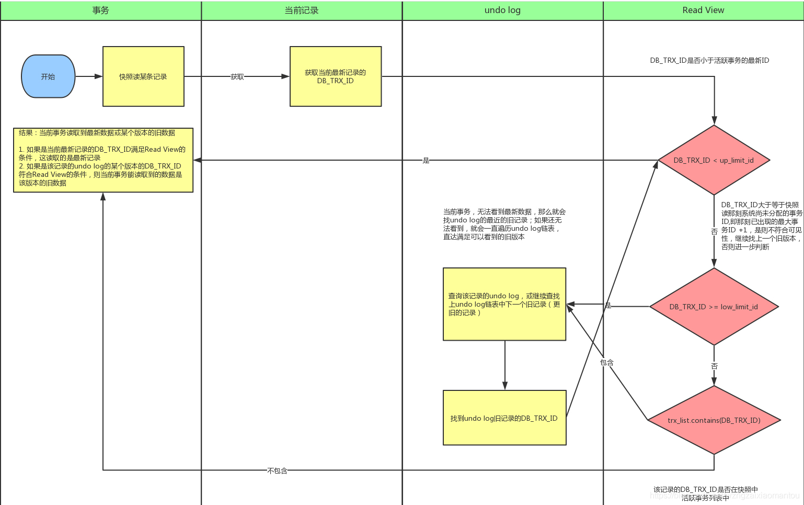

# MySQL MVCC多版本并发控制 <!-- {docsify-ignore-all} -->

多版本并发控制MVCC，利用3个隐式字段，undo日志 ，Read View 来实现的。

（1）隐式字段

        每行记录除了我们自定义的字段外，还有数据库隐式定义的DB_TRX_ID,DB_ROLL_PTR,DB_ROW_ID等字段

        DB_TRX_ID：最近修改(修改/插入)事务ID：记录创建这条记录/最后一次修改该记录的事务ID

        DB_ROLL_PTR：回滚指针，指向这条记录的上一个版本（存储于rollback segment里）

        DB_ROW_ID：隐含的自增ID（隐藏主键），如果数据表没有主键，InnoDB会自动以DB_ROW_ID产生一个聚簇索引

        实际还有一个删除flag隐藏字段, 既记录被更新或删除并不代表真的删除，而是删除flag变了

        如上图，DB_ROW_ID是数据库默认为该行记录生成的唯一隐式主键，DB_TRX_ID是当前操作该记录的事务ID,而DB_ROLL_PTR是一个回滚指针，用于配合undo日志，指向上一个旧版本。

（2）undo日志

        undo log主要分为两种：

        insert undo log，代表事务在insert新记录时产生的undo log, 只在事务回滚时需要，并且在事务提交后可以被立即丢弃

        update undo log，事务在进行update或delete时产生的undo log; 不仅在事务回滚时需要，在快照读时也需要，所以不能随便删除，只有在快速读或事务回滚不涉及该日志时，对应的日志才会被purge线程统一清除

        下图展示了1条记录经过多次事务修改的流程图

（3）Read View(读视图)

        Read View是事务进行快照读操作的时候生产的读视图(Read View)，在该事务执行的快照读的那一刻，会生成数据库系统当前的一个快照，记录并维护系统当前活跃事务的ID(当每个事务开启时，都会被分配一个ID, 这个ID是递增的，所以最新的事务，ID值越大)

        所以我们知道 Read View主要是用来做可见性判断的, 即当我们某个事务执行快照读的时候，对该记录创建一个Read View读视图，把它比作条件用来判断当前事务能够看到哪个版本的数据，既可能是当前最新的数据，也有可能是该行记录的undo log里面的某个版本的数据。

        Read View遵循一个可见性算法，主要是将要被修改的数据的最新记录中的DB_TRX_ID（即当前事务ID）取出来，与系统当前其他活跃事务的ID去对比（由Read View维护），如果DB_TRX_ID跟Read View的属性做了某些比较，不符合可见性，那就通过DB_ROLL_PTR回滚指针去取出Undo Log中的DB_TRX_ID再比较，即遍历链表的DB_TRX_ID（从链首到链尾，即从最近的一次修改查起），直到找到满足特定条件的DB_TRX_ID, 那么这个DB_TRX_ID所在的旧记录就是当前事务能看见的最新老版本

        readview有以下3个主要属性

        trx_list：一个数值列表，用来维护Read View生成时刻系统正活跃的事务ID）

        up_limit_id：记录trx_list列表中事务ID最小的ID）

        low_limit_id：ReadView生成时刻系统尚未分配的下一个事务ID，也就是目前已出现过的事务ID的最大值+1）

        （1）首先比较DB_TRX_ID < up_limit_id, 如果小于，则当前事务能看到DB_TRX_ID 所在的记录，如果大于等于进入下一个判断

        （2）接下来判断 DB_TRX_ID 大于等于 low_limit_id , 如果大于等于则代表DB_TRX_ID 所在的记录在Read View生成后才出现的，那对当前事务肯定不可见，如果小于则进入下一个判断。

        （3）判断DB_TRX_ID 是否在活跃事务之中，trx_list.contains(DB_TRX_ID)，如果在，则代表我Read View生成时刻，你这个事务还在活跃，

        还没有Commit，你修改的数据，我当前事务也是看不见的；如果不在，则说明，你这个事务在Read View生成之前就已经Commit了，你修改的结果，我当前事务是能看见的。

        简单总结一下，就是给每条记录增加3个隐藏字段，1个隐藏主键，1个标记当前事务ID（DB_TRX_ID），1个标记上本记录的上一个版本（DB_ROLL_PTR）。

        DB_ROLL_PTR指向的上一版本记录存储在undo log中,undo log中的每条记录也都有，DB_ROLL_PTR字段，于是每条记录的修改记录连在一起就形成了1个修改记录链表，最早的版本在链尾。

        当我们快照读时，对于readview中记录的活跃的事务，拿这条记录当前的DB_TRX_ID，比对他们的版本，再从undo log中找出符合可见性的记录版本，然后读取。
