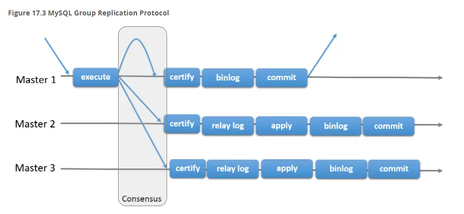

# Mysql集群与高可用之MGR（组复制） <!-- {docsify-ignore-all} -->

## 一.背景介绍

基于传统异步复制和半同步复制的缺陷——数据的一致性问题无法保证，MySQL官方在5.7.17版本正式推出组复制（MySQL Group Replication，简称MGR）。

由若干个节点共同组成一个复制组，一个事务的提交，必须经过组内大多数节点（N / 2 + 1）决议并通过，才能得以提交。如上图所示，由3个节点组成一个复制组，Consensus层为一致性协议层，在事务提交过程中，发生组间通讯，由2个节点决议(certify)通过这个事务，事务才能够最终得以提交并响应。

引入组复制，主要是为了解决传统异步复制和半同步复制可能产生数据不一致的问题。组复制依靠分布式一致性协议(Paxos协议的变体)，实现了分布式下数据的最终一致性，提供了真正的数据高可用方案(是否真正高可用还有待商榷)。其提供的多写方案，给我们实现多活方案带来了希望。



**1. MGR特点**

MySQL Group Replication（MGR）是MySQL官方在5.7.17版本引进的一个数据库高可用与高扩展的解决方案，以插件形式提供，实现了分布式下数据的最终一致性，总结MGR特点如下：

- 高一致性：基于分布式paxos协议实现组复制，保证数据一致性；
- 高容错性：自动检测机制，只要不是大多数节点都宕机就可以继续工作，内置防脑裂保护机制；
- 高扩展性：节点的增加与移除会自动更新组成员信息，新节点加入后，自动从其他节点同步增量数据，直到与其他节点数据一致；
- 高灵活性：提供单主模式和多主模式，单主模式在主库宕机后能够自动选主，所有写入都在主节点进行，多主模式支持多节点写入。

**2. 组复制故障检测**

&nbsp; &nbsp; 故障检测是提供关于哪些 server 可能已死的信息(猜测)的分布式服务。 某个 server 无响应时触发猜测，组中其余成员进行协调决定以排除给定成员。如果某个 server 与组的其余成员隔离,则它会怀疑所有其他 server 都失败了。由于无法与组达成协议(因为它无法确保仲裁成员数),其怀疑不会产生后果。当服务器以此方式与组隔离时,它无法执行任何本地事务。 在线 server 列表通常称为视图，新成员server的加入离开，无论是自愿还是被迫的离开，该组都会动态地重新规划其配置,并触发视图更新。

**3. 组复制的限制**

- 存储引擎必须为Innodb，即仅支持InnoDB表，并且每张表一定要有一个主键，用于做write set的冲突检测;
- 每个表必须提供主键;
- 只支持ipv4，网络需求较高;
- 必须打开GTID特性，二进制日志格式必须设置为ROW，用于选主与write set;
- COMMIT可能会导致失败，类似于快照事务隔离级别的失败场景;
- 目前一个MGR集群组最多支持9个节点;
- 不支持外键于save point特性，无法做全局间的约束检测与部分部分回滚;
- 二进制日志binlog不支持Replication event checksums;
- 多主模式(也就是多写模式) 不支持SERIALIZABLE事务隔离级别;
- 多主模式不能完全支持级联外键约束;
- 多主模式不支持在不同节点上对同一个数据库对象并发执行DDL(在不同节点上对同一行并发进行RW事务，后发起的事务会失败);

## 二.搭建Mysql 组复制

### 使用Docker搭建组复制

#### 创建3台MySQL环境

```
# 拉取镜像
docker pull mysql:8.0.20
# 创建专用网络
docker network create --subnet=172.72.0.0/24 mysql-network

# 创建目录存储数据
mkdir -p ~/docker-file/docker-mgr/mysql/lhrmgr15/conf.d
mkdir -p ~/docker-file/docker-mgr/mysql/lhrmgr15/data
mkdir -p ~/docker-file/docker-mgr/mysql/lhrmgr16/conf.d
mkdir -p ~/docker-file/docker-mgr/mysql/lhrmgr16/data
mkdir -p ~/docker-file/docker-mgr/mysql/lhrmgr17/conf.d
mkdir -p ~/docker-file/docker-mgr/mysql/lhrmgr17/data

# 创建3个节点的MySQL
docker run -d --name mysql8020mgr33365 \
   -h lhrmgr15 -p 33365:3336 --net=mysql-network --ip 172.72.0.15 \
   -v /Users/penghuiliu/docker-file/docker-mgr/mysql/lhrmgr15/conf.d:/etc/mysql/conf.d -v /Users/penghuiliu/docker-file/docker-mgr/mysql/lhrmgr15/data:/Users/penghuiliu/mysql/ \
   -e MYSQL_ROOT_PASSWORD=lhr \
   -e TZ=Asia/Shanghai \
   mysql:8.0.20

docker run -d --name mysql8020mgr33366 \
   -h lhrmgr16 -p 33366:3336 --net=mysql-network --ip 172.72.0.16 \
   -v /Users/penghuiliu/docker-file/docker-mgr/mysql/lhrmgr16/conf.d:/etc/mysql/conf.d -v /Users/penghuiliu/docker-file/docker-mgr/mysql/lhrmgr16/data:/Users/penghuiliu/mysql/ \
   -e MYSQL_ROOT_PASSWORD=lhr \
   -e TZ=Asia/Shanghai \
   mysql:8.0.20

docker run -d --name mysql8020mgr33367 \
   -h lhrmgr17 -p 33367:3336 --net=mysql-network --ip 172.72.0.17 \
   -v /Users/penghuiliu/docker-file/docker-mgr/mysql/lhrmgr17/conf.d:/etc/mysql/conf.d -v /Users/penghuiliu/docker-file/docker-mgr/mysql/lhrmgr17/data:/Users/penghuiliu/mysql/ \
   -e MYSQL_ROOT_PASSWORD=lhr \
   -e TZ=Asia/Shanghai \
   mysql:8.0.20
```

#### 修改MySQL参数

vim ~/docker-file/docker-mgr/mysql/lhrmgr15/conf.d/my.cnf
```
[mysqld]
user=mysql
port=3336
character_set_server=utf8mb4
secure_file_priv=''
server-id = 802033065
default-time-zone = '+8:00'
log_timestamps = SYSTEM
log-bin =
binlog_format=row
binlog_checksum=NONE
log-slave-updates=1
skip-name-resolve
auto-increment-increment=2
auto-increment-offset=1
gtid-mode=ON
enforce-gtid-consistency=on
default_authentication_plugin=mysql_native_password
max_allowed_packet = 500M

master_info_repository=TABLE
relay_log_info_repository=TABLE
relay_log=lhrmgr15-relay-bin-ip15


transaction_write_set_extraction=XXHASH64
loose-group_replication_group_name="aaaaaaaa-aaaa-aaaa-aaaa-aaaaaaaaaaaa"
loose-group_replication_start_on_boot=OFF
loose-group_replication_local_address= "172.72.0.15:33361"
loose-group_replication_group_seeds= "172.72.0.15:33361,172.72.0.16:33362,172.72.0.17:33363"
loose-group_replication_bootstrap_group=OFF
loose-group_replication_ip_whitelist="172.72.0.15,172.72.0.16,172.72.0.17"

report_host=172.72.0.15
report_port=3336
```

vim ~/docker-file/docker-mgr/mysql/lhrmgr16/conf.d/my.cnf
```
[mysqld]
user=mysql
port=3336
character_set_server=utf8mb4
secure_file_priv=''
server-id = 802033066
default-time-zone = '+8:00'
log_timestamps = SYSTEM
log-bin =
binlog_format=row
binlog_checksum=NONE
log-slave-updates=1
gtid-mode=ON
enforce-gtid-consistency=ON
skip_name_resolve
default_authentication_plugin=mysql_native_password
max_allowed_packet = 500M

master_info_repository=TABLE
relay_log_info_repository=TABLE
relay_log=lhrmgr16-relay-bin-ip16


transaction_write_set_extraction=XXHASH64
loose-group_replication_group_name="aaaaaaaa-aaaa-aaaa-aaaa-aaaaaaaaaaaa"
loose-group_replication_start_on_boot=OFF
loose-group_replication_local_address= "172.72.0.16:33362"
loose-group_replication_group_seeds= "172.72.0.15:33361,172.72.0.16:33362,172.72.0.17:33363"
loose-group_replication_bootstrap_group=OFF
loose-group_replication_ip_whitelist="172.72.0.15,172.72.0.16,172.72.0.17"

report_host=172.72.0.16
report_port=3336
```

vim ~/docker-file/docker-mgr/mysql/lhrmgr17/conf.d/my.cnf
```
[mysqld]
user=mysql
port=3336
character_set_server=utf8mb4
secure_file_priv=''
server-id = 802033067
default-time-zone = '+8:00'
log_timestamps = SYSTEM
log-bin =
binlog_format=row
binlog_checksum=NONE
log-slave-updates=1
gtid-mode=ON
enforce-gtid-consistency=ON
skip_name_resolve
default_authentication_plugin=mysql_native_password
max_allowed_packet = 500M


master_info_repository=TABLE
relay_log_info_repository=TABLE
relay_log=lhrmgr16-relay-bin-ip16


transaction_write_set_extraction=XXHASH64
loose-group_replication_group_name="aaaaaaaa-aaaa-aaaa-aaaa-aaaaaaaaaaaa"
loose-group_replication_start_on_boot=OFF
loose-group_replication_local_address= "172.72.0.17:33363"
loose-group_replication_group_seeds= "172.72.0.15:33361,172.72.0.16:33362,172.72.0.17:33363"
loose-group_replication_bootstrap_group=OFF
loose-group_replication_ip_whitelist="172.72.0.15,172.72.0.16,172.72.0.17"

report_host=172.72.0.17
report_port=3336
```

#### 启动Mysql环境
```
# 重启MySQL
docker restart mysql8020mgr33365 mysql8020mgr33366 mysql8020mgr33367
# 进入MySQL，可以选择以下几种方法
# 方法1
docker exec -it mysql8020mgr33365 bash
# 方法2
docker exec -it mysql8020mgr33365 mysql -uroot -plhr
# 方法3 远程连接MySQL
mysql -uroot -plhr -h192.168.1.35 -P33365 
mysql -uroot -plhr -h192.168.1.35 -P33366 
mysql -uroot -plhr -h192.168.1.35 -P33367 

# 查看MySQL日志
docker logs -f --tail 10 mysql8020mgr33365
docker logs -f --tail 10 mysql8020mgr33366
docker logs -f --tail 10 mysql8020mgr33367
```

```
# 打开三个终端，分别执行以下三组命令，查看MySQL的主机名、server_id和server_uuid

docker exec -it mysql8020mgr33365 bash
mysql -uroot -plhr -h192.168.3.78 -P33365 -e "select @@hostname,@@server_id,@@server_uuid"
+------------+-------------+--------------------------------------+
| @@hostname | @@server_id | @@server_uuid                        |
+------------+-------------+--------------------------------------+
| lhrmgr15   |   802033065 | a4616e18-5d54-11eb-9eae-0242ac48000f |
+------------+-------------+--------------------------------------+


docker exec -it mysql8020mgr33366 bash
mysql -uroot -plhr -h192.168.3.78 -P33366 -e "select @@hostname,@@server_id,@@server_uuid"
+------------+-------------+--------------------------------------+
| @@hostname | @@server_id | @@server_uuid                        |
+------------+-------------+--------------------------------------+
| lhrmgr16   |   802033066 | a4d4f827-5d54-11eb-b549-0242ac480010 |
+------------+-------------+--------------------------------------+

docker exec -it mysql8020mgr33367 bash
mysql -uroot -plhr -h192.168.3.78 -P33367 -e "select @@hostname,@@server_id,@@server_uuid"
+------------+-------------+--------------------------------------+
| @@hostname | @@server_id | @@server_uuid                        |
+------------+-------------+--------------------------------------+
| lhrmgr17   |   802033067 | a69321a3-5d54-11eb-98e4-0242ac480011 |
+------------+-------------+--------------------------------------+
```
#### 为所有节点安装MGR插件

```
liupenghui:~ penghuiliu$ docker exec -it mysql8020mgr33365 bash
root@lhrmgr15:/# mysql -uroot -plhr -P33365
mysql> INSTALL PLUGIN group_replication SONAME 'group_replication.so';
Query OK, 0 rows affected (0.03 sec)

liupenghui:~ penghuiliu$ docker exec -it mysql8020mgr33366 bash
root@lhrmgr15:/# mysql -uroot -plhr -P33366
mysql> INSTALL PLUGIN group_replication SONAME 'group_replication.so';
Query OK, 0 rows affected (0.03 sec)

liupenghui:~ penghuiliu$ docker exec -it mysql8020mgr33367 bash
root@lhrmgr15:/# mysql -uroot -plhr -P33367
mysql> INSTALL PLUGIN group_replication SONAME 'group_replication.so';
Query OK, 0 rows affected (0.03 sec)
```

#### 设置复制账号（所有节点执行）

进入到Mysql客户端，分别执行下面的步骤：

1. SET SQL_LOG_BIN=0;
2. CREATE USER repl@'%' IDENTIFIED BY 'lhr';
3. GRANT REPLICATION SLAVE ON *.* TO repl@'%';
4. FLUSH PRIVILEGES;
5. SET SQL_LOG_BIN=1;
6. CHANGE MASTER TO MASTER_USER='repl', MASTER_PASSWORD='lhr' FOR CHANNEL 'group_replication_recovery';

#### 启动MGR单主模式

在主库上启动MGR（172.72.0.15）
```
mysql> SET GLOBAL group_replication_bootstrap_group=ON;
Query OK, 0 rows affected (0.00 sec)

mysql> START GROUP_REPLICATION;
Query OK, 0 rows affected (3.17 sec)

mysql> SET GLOBAL group_replication_bootstrap_group=OFF;
Query OK, 0 rows affected (0.00 sec)

mysql> SELECT * FROM performance_schema.replication_group_members;
+---------------------------+--------------------------------------+-------------+-------------+--------------+-------------+----------------+
| CHANNEL_NAME              | MEMBER_ID                            | MEMBER_HOST | MEMBER_PORT | MEMBER_STATE | MEMBER_ROLE | MEMBER_VERSION |
+---------------------------+--------------------------------------+-------------+-------------+--------------+-------------+----------------+
| group_replication_applier | a4616e18-5d54-11eb-9eae-0242ac48000f | 172.72.0.15 |        3336 | ONLINE       | PRIMARY     | 8.0.20         |
+---------------------------+--------------------------------------+-------------+-------------+--------------+-------------+----------------+
1 row in set (0.01 sec)
```

其他节点加入MGR，在从库（172.72.0.16，172.72.0.17）上执行
```
START GROUP_REPLICATION;
-- 查看MGR组信息
SELECT * FROM performance_schema.replication_group_members;

MySQL [(none)]> SELECT * FROM performance_schema.replication_group_members;
+---------------------------+--------------------------------------+-------------+-------------+--------------+-------------+----------------+
| CHANNEL_NAME              | MEMBER_ID                            | MEMBER_HOST | MEMBER_PORT | MEMBER_STATE | MEMBER_ROLE | MEMBER_VERSION |
+---------------------------+--------------------------------------+-------------+-------------+--------------+-------------+----------------+
| group_replication_applier | a4616e18-5d54-11eb-9eae-0242ac48000f | 172.72.0.15 |        3336 | ONLINE       | PRIMARY     | 8.0.20         |
| group_replication_applier | a4d4f827-5d54-11eb-b549-0242ac480010 | 172.72.0.16 |        3336 | ONLINE       | SECONDARY   | 8.0.20         |
| group_replication_applier | a69321a3-5d54-11eb-98e4-0242ac480011 | 172.72.0.17 |        3336 | ONLINE       | SECONDARY   | 8.0.20         |
+---------------------------+--------------------------------------+-------------+-------------+--------------+-------------+----------------+
3 rows in set (0.01 sec)
```


### Linux搭建mysql组复制

#### 准备工作

1. 准备三台机器或虚拟机

- 192.168.109.101
- 192.168.109.102
- 192.168.109.103

2. 关闭所有节点的防火墙

```
# service iptables stop
```

3. 所有节点的selinux设置为disabled

4. 配置各主机名和ip映射，所有节点配置一样

说明：必须保证各个mysql节点的主机名不一致，并且能通过主机名找到各成员！则必须要在每个节点的/etc/hosts里面做主机名绑定，否则后续将节点加入group组会失败！报错RECOVERING！！

#### 安装步骤

1. 官网下载5.7安装包 mysql-5.7.28-linux-glibc2.12-x86_64.tar.gz，建立安装目录/mysql和数据目录/data/mysql,解压压缩包

```
[root@mysql01 ~]#mkdir /mysql
[root@mysql01 ~]#mkdir /data/mysql
[root@mysql01 ~]# cd /softwares/
[root@mysql01 softwares]#tar -zxvf  mysql-5.7.28-linux-glibc2.12-x86_64.tar.gz
[root@mysql01 softwares]# cd mysql-5.7.28-linux-glibc2.12-x86_64
[root@mysql01 mysql-5.7.28-linux-glibc2.12-x86_64]# cp -rf * /mysql
[root@mysql01 mysql-5.7.28-linux-glibc2.12-x86_64]#chown -R mysql.mysql /mysql /data/mysql
```

2. 配置环境变量（选做）

```
vi /root/.bash_profile
# .bash_profile

# Get the aliases and functions
if [ -f ~/.bashrc ]; then
    . ~/.bashrc
fi

# User specific environment and startup programs

#PATH=$PATH:$HOME/bin
PATH=$PATH:$HOME/bin:/mysql/bin:/mysql/lib:/mysql
export PATH
```

3. 配置my.cnf及参数说明

参数说明
组复制部分配置参数说明：

group_replication变量使用的loose-前缀是指示Server启用时尚未加载复制插件也将继续启动
transaction_write_set_extraction = XXHASH64
##指示Server必须为每个事务收集写集合，并使用XXHASH64哈希算法将其编码为散列
loose-group_replication_group_name="01e5fb97-be64-41f7-bafd-3afc7a6ab555"
##表示将加入或者创建的复制组命名为01e5fb97-be64-41f7-bafd-3afc7a6ab555
##可自定义(通过cat /proc/sys/kernel/random/uuid)
loose-group_replication_start_on_boot=off 
##设置为Server启动时不自动启动组复制
loose-group_replication_local_address="192.168.109.101:33061" 
##绑定本地的192.168.109.101及33061端口接受其他组成员的连接，IP地址必须为其他组成员可正常访问
loose-group_replication_group_seeds="192.168.109.101:33061,192.168.109.102:33061,192.168.109.103:33061"
##本行为告诉服务器当服务器加入组时，应当连接到192.168.109.101:33061,192.168.109.102:33061,192.168.109.101:33061
##这些种子服务器进行配置。本设置可以不是全部的组成员服务地址。
loose-group_replication_bootstrap_group = off 
##配置是否自动引导组
loose-group_replication_ip_whitelist=”10.30.0.0/16,10.31.0..0/16,10.27.0.0/16″
##配置白名单，默认情况下只允许192.168.109.x连接到复制组，如果是其他IP则需要配置。

mysql01
```
mysql01配置：
[mysqld]
datadir=/data/mysql
basedir=/mysql
port=3306
socket=/data/mysql/mysql.sock
server_id=1
gtid_mode=ON
enforce_gtid_consistency=ON
master_info_repository=TABLE
relay_log_info_repository=TABLE
binlog_checksum=NONE
log_slave_updates=ON
log_bin=binlog
binlog_format=ROW
transaction_write_set_extraction=XXHASH64
loose-group_replication_group_name="05153196-c2ab-43ae-b355-b9832eacf0b2"
loose-group_replication_start_on_boot=off
loose-group_replication_local_address="192.168.109.101:33061"
loose-group_replication_group_seeds="192.168.109.101:33061,192.168.109.102:33061,192.168.109.103:33061"
loose-group_replication_bootstrap_group=off
loose-group_replication_single_primary_mode=FALSE
loose-group_replication_enforce_update_everywhere_checks= TRUE
```
mysql02
```
mysql02配置：
[mysqld]
datadir=/data/mysql
basedir=/mysql
port=3306
socket=/data/mysql/mysql.sock
server_id=2
gtid_mode=ON
enforce_gtid_consistency=ON
master_info_repository=TABLE
relay_log_info_repository=TABLE
binlog_checksum=NONE
log_slave_updates=ON
log_bin=binlog
binlog_format=ROW
transaction_write_set_extraction=XXHASH64
loose-group_replication_group_name="05153196-c2ab-43ae-b355-b9832eacf0b2"
loose-group_replication_start_on_boot=off
loose-group_replication_local_address="192.168.109.102:33061"
loose-group_replication_group_seeds="192.168.109.101:33061,192.168.109.102:33061,192.168.109.103:33061"
loose-group_replication_bootstrap_group=off
loose-group_replication_single_primary_mode=FALSE
loose-group_replication_enforce_update_everywhere_checks= TRUE
```
mysql03
```
mysql03配置：
[mysqld]
datadir=/data/mysql
basedir=/mysql
port=3306
socket=/data/mysql/mysql.sock
server_id=3
gtid_mode=ON
enforce_gtid_consistency=ON
master_info_repository=TABLE
relay_log_info_repository=TABLE
binlog_checksum=NONE
log_slave_updates=ON
log_bin=binlog
binlog_format=ROW
transaction_write_set_extraction=XXHASH64
loose-group_replication_group_name="05153196-c2ab-43ae-b355-b9832eacf0b2"
loose-group_replication_start_on_boot=off
loose-group_replication_local_address="192.168.109.103:33061"
loose-group_replication_group_seeds="192.168.109.101:33061,192.168.109.102:33061,192.168.109.103:33061"
loose-group_replication_bootstrap_group=off
loose-group_replication_single_primary_mode=FALSE
loose-group_replication_enforce_update_everywhere_checks= TRUE
```

4. 初始化并启动各数据库节点

```
/mysql/bin/mysqld --initialize-insecure  --user=mysql --basedir=/data/mysql --datadir=/data/mysql

/mysql/bin/mysqld_safe --defaults-file=/etc/my.cnf &
```

5. 登录数据库，加载MGR插件，创建同步账号

```
[root@mysql01 ~]# mysql -uroot -p -S /data/mysql/mysql.sock
# 安装MGR插件
mysql>INSTALL PLUGIN group_replication SONAME 'group_replication.so';

#设置复制账号
mysql> SET SQL_LOG_BIN=0;
mysql> CREATE USER repl@'%' IDENTIFIED BY '123';
mysql> GRANT REPLICATION SLAVE ON *.* TO repl@'%';
mysql> FLUSH PRIVILEGES;
mysql> SET SQL_LOG_BIN=1;
mysql> CHANGE MASTER TO MASTER_USER='repl', MASTER_PASSWORD='123' FOR CHANNEL 'group_replication_recovery';
```

6. 启动MGR单主模式

```
# 启动MGR，在主库(192.168.109.101)上执行
mysql> SET GLOBAL group_replication_bootstrap_group=ON;
mysql> START GROUP_REPLICATION;
mysql> SET GLOBAL group_replication_bootstrap_group=OFF;
# 查看MGR组信息
mysql> SELECT * FROM performance_schema.replication_group_members;
+---------------------------+--------------------------------------+-------------+-------------+--------------+
| CHANNEL_NAME              | MEMBER_ID                            | MEMBER_HOST | MEMBER_PORT | MEMBER_STATE |
+---------------------------+--------------------------------------+-------------+-------------+--------------+
| group_replication_applier | 6972ca25-25ba-11ea-b9c7-000c29dde96d | mysql01     |        3306 | ONLINE       |

# 其他节点加入MGR，在从库（192.168.109.102，192.168.109.103）上执行
mysql> START GROUP_REPLICATION;

# 查看MGR组信息
mysql> SELECT * FROM performance_schema.replication_group_members;
+---------------------------+--------------------------------------+-------------+-------------+--------------+
| CHANNEL_NAME              | MEMBER_ID                            | MEMBER_HOST | MEMBER_PORT | MEMBER_STATE |
+---------------------------+--------------------------------------+-------------+-------------+--------------+
| group_replication_applier | 604a4cd6-25bb-11ea-8182-000c29378257 | mysql02     |        3306 | ONLINE       |
| group_replication_applier | 6972ca25-25ba-11ea-b9c7-000c29dde96d | mysql01     |        3306 | ONLINE       |
| group_replication_applier | ac6d7494-25bb-11ea-8409-000c29258d07 | mysql03     |        3306 | ONLINE       |
+---------------------------+--------------------------------------+-------------+-------------+--------------+
3 rows in set (0.00 sec)
```

7. 切换至多主模式

```
# 停止组复制(所有节点执行)：
mysql> stop group_replication;
mysql> set global group_replication_single_primary_mode=OFF;
mysql> set global group_replication_enforce_update_everywhere_checks=ON;

# 随便选择某个节点执行
mysql> SET GLOBAL group_replication_bootstrap_group=ON; 
mysql> START GROUP_REPLICATION; 
mysql> SET GLOBAL group_replication_bootstrap_group=OFF;

# 其他节点执行
mysql> START GROUP_REPLICATION; 

# 查看组信息，所有节点的 MEMBER_ROLE 都为 PRIMARY
mysql> SELECT * FROM performance_schema.replication_group_members;
+---------------------------+--------------------------------------+-------------+-------------+--------------+
| CHANNEL_NAME              | MEMBER_ID                            | MEMBER_HOST | MEMBER_PORT | MEMBER_STATE |
+---------------------------+--------------------------------------+-------------+-------------+--------------+
| group_replication_applier | 604a4cd6-25bb-11ea-8182-000c29378257 | mysql02     |        3306 | ONLINE       |
| group_replication_applier | 6972ca25-25ba-11ea-b9c7-000c29dde96d | mysql01     |        3306 | ONLINE       |
| group_replication_applier | ac6d7494-25bb-11ea-8409-000c29258d07 | mysql03     |        3306 | ONLINE       |
+---------------------------+--------------------------------------+-------------+-------------+--------------+
3 rows in set (0.00 sec)
```
可以看到所有节点状态都是online，角色都是PRIMARY，MGR多主模式搭建成功。

8. 切换回单主模式

```
# 所有节点执行
mysql> stop group_replication;
mysql> set global group_replication_enforce_update_everywhere_checks=OFF;
mysql> set global group_replication_single_primary_mode=ON;

# 主节点（192.168.109.101）执行
SET GLOBAL group_replication_bootstrap_group=ON; 
START GROUP_REPLICATION; 
SET GLOBAL group_replication_bootstrap_group=OFF;

# 从节点（192.168.109.102、192.168.109.103）执行
START GROUP_REPLICATION; 

# 查看MGR组信息
mysql> SELECT * FROM performance_schema.replication_group_members;
+---------------------------+--------------------------------------+-------------+-------------+--------------+
| CHANNEL_NAME              | MEMBER_ID                            | MEMBER_HOST | MEMBER_PORT | MEMBER_STATE |
+---------------------------+--------------------------------------+-------------+-------------+--------------+
| group_replication_applier | 604a4cd6-25bb-11ea-8182-000c29378257 | mysql02     |        3306 | ONLINE       |
| group_replication_applier | 6972ca25-25ba-11ea-b9c7-000c29dde96d | mysql01     |        3306 | ONLINE       |
| group_replication_applier | ac6d7494-25bb-11ea-8409-000c29258d07 | mysql03     |        3306 | ONLINE       |
+---------------------------+--------------------------------------+-------------+-------------+--------------+
3 rows in set (0.00 sec)
```