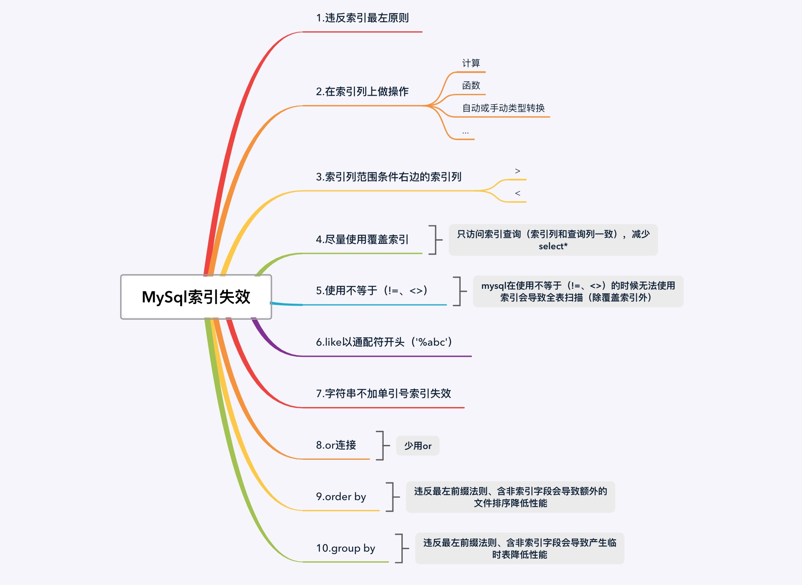

# MySql索引失效 <!-- {docsify-ignore-all} -->


## 简介

&nbsp; &nbsp; 索引对于MySql来说是相当重要的，合理的使用索引能够提高查询效率，MySql支持的所有有主键索引、唯一索引、联合索引、全文索引、普通索引，本篇文章简单分析一下MySql索引失效的几种情况，下面的图总结了索引失效一些情况，后面就针对图中的10点进行验证。




## MySql索引失效验证

### 测试用DDL和DML

```sql
/*
 Navicat Premium Data Transfer

 Source Server         : master
 Source Server Type    : MySQL
 Source Server Version : 50732
 Source Host           : localhost:3316
 Source Schema         : order

 Target Server Type    : MySQL
 Target Server Version : 50732
 File Encoding         : 65001

 Date: 23/03/2021 22:53:53
*/

SET NAMES utf8mb4;
SET FOREIGN_KEY_CHECKS = 0;

-- ----------------------------
-- Table structure for order
-- ----------------------------
DROP TABLE IF EXISTS `order`;
CREATE TABLE `order` (
  `id` bigint(20) NOT NULL AUTO_INCREMENT,
  `create_time` datetime NOT NULL,
  `number` varchar(20) COLLATE utf8mb4_bin NOT NULL,
  `status` tinyint(4) NOT NULL,
  `product_id` varchar(128) COLLATE utf8mb4_bin NOT NULL,
  `total_amount` decimal(10,0) NOT NULL,
  `count` int(4) NOT NULL,
  `user_id` varchar(128) COLLATE utf8mb4_bin NOT NULL,
  PRIMARY KEY (`id`),
  KEY `idx_1` (`number`,`status`,`total_amount`,`user_id`) USING BTREE COMMENT '测试索引'
) ENGINE=InnoDB AUTO_INCREMENT=8 DEFAULT CHARSET=utf8mb4 COLLATE=utf8mb4_bin;

-- ----------------------------
-- Records of order
-- ----------------------------
BEGIN;
INSERT INTO `order` VALUES (3, '2020-12-11 03:24:56', '543995759748632576', 1, '1', 100, 1, '10000');
INSERT INTO `order` VALUES (4, '2020-12-11 03:24:56', '543995759748632576', 1, '1', 100, 1, '10000');
INSERT INTO `order` VALUES (5, '2020-12-11 03:24:56', '543995759748632576', 1, '1', 100, 1, '10000');
INSERT INTO `order` VALUES (6, '2020-12-11 03:24:56', '543995759748632576', 1, '1', 100, 1, '10000');
INSERT INTO `order` VALUES (7, '2020-12-11 03:24:56', '543995759748632576', 1, '1', 100, 1, '10000');
COMMIT;

SET FOREIGN_KEY_CHECKS = 1;
```

### 全值匹配（索引最佳）

&nbsp; &nbsp; 顺序匹配所有的字段，走索引idx_1，扫描行数为1
```sql
mysql> explain select * from `order` where number='543995759748632576' and `status`=1 and total_amount=20 and user_id='10000';
+----+-------------+-------+------------+------+---------------+-------+---------+-------------------------+------+----------+-------+
| id | select_type | table | partitions | type | possible_keys | key   | key_len | ref                     | rows | filtered | Extra |
+----+-------------+-------+------------+------+---------------+-------+---------+-------------------------+------+----------+-------+
|  1 | SIMPLE      | order | NULL       | ref  | idx_1         | idx_1 | 602     | const,const,const,const |    1 |   100.00 | NULL  |
+----+-------------+-------+------------+------+---------------+-------+---------+-------------------------+------+----------+-------+
```

&nbsp; &nbsp; 索引顺序打乱了，仍然走索引，全值匹配和索引顺序无关，MySQL底层的优化器会进行优化，调整索引的顺序
```sql
mysql> explain select * from `order` where number='543995759748632576' and `status`=1 and user_id='10000' and total_amount=20;
+----+-------------+-------+------------+------+---------------+-------+---------+-------------------------+------+----------+-------+
| id | select_type | table | partitions | type | possible_keys | key   | key_len | ref                     | rows | filtered | Extra |
+----+-------------+-------+------------+------+---------------+-------+---------+-------------------------+------+----------+-------+
|  1 | SIMPLE      | order | NULL       | ref  | idx_1         | idx_1 | 602     | const,const,const,const |    1 |   100.00 | NULL  |
+----+-------------+-------+------------+------+---------------+-------+---------+-------------------------+------+----------+-------+
```

### 违反最左原则

&nbsp; &nbsp; 未匹配到联合索引最左边的索引，索引失效，全表扫描
```sql
mysql> explain select * from `order` where `status`=1 and total_amount=20;
+----+-------------+-------+------------+------+---------------+------+---------+------+------+----------+-------------+
| id | select_type | table | partitions | type | possible_keys | key  | key_len | ref  | rows | filtered | Extra       |
+----+-------------+-------+------------+------+---------------+------+---------+------+------+----------+-------------+
|  1 | SIMPLE      | order | NULL       | ALL  | NULL          | NULL | NULL    | NULL |    5 |    20.00 | Using where |
+----+-------------+-------+------------+------+---------------+------+---------+------+------+----------+-------------+
```

### 在索引列上做任何操作

&nbsp; &nbsp; number字段是`varchar`类型，这里去掉单引号就是`int`类型了，这时候索引失效，全表扫描；第二个sql对number字段进行了函数操作，索引也失效了，
```sql
mysql> explain select * from `order` where number=543995759748632576 and `status`=1 and user_id='10000' and total_amount=20;
+----+-------------+-------+------------+------+---------------+------+---------+------+------+----------+-------------+
| id | select_type | table | partitions | type | possible_keys | key  | key_len | ref  | rows | filtered | Extra       |
+----+-------------+-------+------------+------+---------------+------+---------+------+------+----------+-------------+
|  1 | SIMPLE      | order | NULL       | ALL  | idx_1         | NULL | NULL    | NULL |    5 |    20.00 | Using where |
+----+-------------+-------+------------+------+---------------+------+---------+------+------+----------+-------------+
mysql> explain select * from `order` where left(number,5)='543995759748632576' and `status`=1 and user_id='10000' and total_amount=20;
+----+-------------+-------+------------+------+---------------+------+---------+------+------+----------+-------------+
| id | select_type | table | partitions | type | possible_keys | key  | key_len | ref  | rows | filtered | Extra       |
+----+-------------+-------+------------+------+---------------+------+---------+------+------+----------+-------------+
|  1 | SIMPLE      | order | NULL       | ALL  | NULL          | NULL | NULL    | NULL |    5 |    20.00 | Using where |
+----+-------------+-------+------------+------+---------------+------+---------+------+------+----------+-------------+
```

### 索引范围条件右边的索引列会失效

&nbsp; &nbsp; 这条sql也匹配到了索引，但是索引范围条件右边的索引列失效了
```sql
mysql> explain select * from `order` where number='543995759748632576' and `status`=1  and total_amount>20 and user_id='10000';
+----+-------------+-------+------------+-------+---------------+-------+---------+------+------+----------+-----------------------+
| id | select_type | table | partitions | type  | possible_keys | key   | key_len | ref  | rows | filtered | Extra                 |
+----+-------------+-------+------------+-------+---------------+-------+---------+------+------+----------+-----------------------+
|  1 | SIMPLE      | order | NULL       | range | idx_1         | idx_1 | 88      | NULL |    1 |    20.00 | Using index condition |
+----+-------------+-------+------------+-------+---------------+-------+---------+------+------+----------+-----------------------+
```

### 尽量使用覆盖索引

&nbsp; &nbsp; 索引列和查询列一致，匹配到了索引，违反最左原则索引失效了
```sql
mysql> explain select number,`status`,total_amount,user_id  from `order` where `status`=1;
+----+-------------+-------+------------+-------+---------------+-------+---------+------+------+----------+--------------------------+
| id | select_type | table | partitions | type  | possible_keys | key   | key_len | ref  | rows | filtered | Extra                    |
+----+-------------+-------+------------+-------+---------------+-------+---------+------+------+----------+--------------------------+
|  1 | SIMPLE      | order | NULL       | index | NULL          | idx_1 | 602     | NULL |    5 |    20.00 | Using where; Using index |
+----+-------------+-------+------------+-------+---------------+-------+---------+------+------+----------+--------------------------+
```

### 使用不等于（!=、<>）（除覆盖索引外）

&nbsp; &nbsp; mysql在使用不等于（!=、<>）的时候无法使用索引会导致全表扫描
```sql
mysql> explain select *  from `order` where number!='543995759748632576' and `status`=1;
+----+-------------+-------+------------+------+---------------+------+---------+------+------+----------+-------------+
| id | select_type | table | partitions | type | possible_keys | key  | key_len | ref  | rows | filtered | Extra       |
+----+-------------+-------+------------+------+---------------+------+---------+------+------+----------+-------------+
|  1 | SIMPLE      | order | NULL       | ALL  | idx_1         | NULL | NULL    | NULL |    5 |    20.00 | Using where |
+----+-------------+-------+------------+------+---------------+------+---------+------+------+----------+-------------+
1 row in set, 1 warning (0.00 sec)

mysql> explain select *  from `order` where number<>'543995759748632576' and `status`=1;
+----+-------------+-------+------------+------+---------------+------+---------+------+------+----------+-------------+
| id | select_type | table | partitions | type | possible_keys | key  | key_len | ref  | rows | filtered | Extra       |
+----+-------------+-------+------------+------+---------------+------+---------+------+------+----------+-------------+
|  1 | SIMPLE      | order | NULL       | ALL  | idx_1         | NULL | NULL    | NULL |    5 |    20.00 | Using where |
+----+-------------+-------+------------+------+---------------+------+---------+------+------+----------+-------------+
1 row in set, 1 warning (0.01 sec)
```

- 下面是个反例

&nbsp; &nbsp; 下面sql条件虽然是<>，但是因为查询列覆盖索引了，索引索引未失效

```sql
mysql> explain select number,`status`,total_amount,user_id from `order` where number<>'543995759748632576' and `status`=1;
+----+-------------+-------+------------+-------+---------------+-------+---------+------+------+----------+--------------------------+
| id | select_type | table | partitions | type  | possible_keys | key   | key_len | ref  | rows | filtered | Extra                    |
+----+-------------+-------+------------+-------+---------------+-------+---------+------+------+----------+--------------------------+
|  1 | SIMPLE      | order | NULL       | range | idx_1         | idx_1 | 82      | NULL |    4 |    20.00 | Using where; Using index |
+----+-------------+-------+------------+-------+---------------+-------+---------+------+------+----------+--------------------------+
1 row in set, 1 warning (0.00 sec)
```

### like以通配符开头（'%abc'）

&nbsp; &nbsp; 通配符'%abc'索引失效，'abc%'索引不会失效
```sql
mysql> explain select * from `order` where number LIKE '%543995759748632' and `status`=1;
+----+-------------+-------+------------+------+---------------+------+---------+------+------+----------+-------------+
| id | select_type | table | partitions | type | possible_keys | key  | key_len | ref  | rows | filtered | Extra       |
+----+-------------+-------+------------+------+---------------+------+---------+------+------+----------+-------------+
|  1 | SIMPLE      | order | NULL       | ALL  | NULL          | NULL | NULL    | NULL |    5 |    20.00 | Using where |
+----+-------------+-------+------------+------+---------------+------+---------+------+------+----------+-------------+
1 row in set, 1 warning (0.00 sec)

mysql> explain select * from `order` where number LIKE '5759748632576%' and `status`=1;
+----+-------------+-------+------------+-------+---------------+-------+---------+------+------+----------+-----------------------+
| id | select_type | table | partitions | type  | possible_keys | key   | key_len | ref  | rows | filtered | Extra                 |
+----+-------------+-------+------------+-------+---------------+-------+---------+------+------+----------+-----------------------+
|  1 | SIMPLE      | order | NULL       | range | idx_1         | idx_1 | 83      | NULL |    1 |    20.00 | Using index condition |
+----+-------------+-------+------------+-------+---------------+-------+---------+------+------+----------+-----------------------+
1 row in set, 1 warning (0.00 sec)
```

### 字符串不加单引号索引失效（数据类型隐式转换）

```sql
mysql> explain select * from `order` where number =543995759748632576 and `status`=1;
+----+-------------+-------+------------+------+---------------+------+---------+------+------+----------+-------------+
| id | select_type | table | partitions | type | possible_keys | key  | key_len | ref  | rows | filtered | Extra       |
+----+-------------+-------+------------+------+---------------+------+---------+------+------+----------+-------------+
|  1 | SIMPLE      | order | NULL       | ALL  | idx_1         | NULL | NULL    | NULL |    5 |    20.00 | Using where |
+----+-------------+-------+------------+------+---------------+------+---------+------+------+----------+-------------+
1 row in set, 3 warnings (0.00 sec)
```

### or连接索引失效

&nbsp; &nbsp; 用`or`分割开的条件，如果`or`前的条件中的列有索引，而后面的列中没有索引，那么设计的索引不会被用到，因为`or`后面的条件列表中没有索引，那么后面的查询条件肯定要走全表扫描。在存在的全表扫描的情况下，就没有必要多一次索引扫描增加I/O访问，一次全表扫描过滤条件就足够了。

```sql
mysql> explain select * from `order` where number ='543995759748632576' or `count`=1;
+----+-------------+-------+------------+------+---------------+------+---------+------+------+----------+-------------+
| id | select_type | table | partitions | type | possible_keys | key  | key_len | ref  | rows | filtered | Extra       |
+----+-------------+-------+------------+------+---------------+------+---------+------+------+----------+-------------+
|  1 | SIMPLE      | order | NULL       | ALL  | idx_1         | NULL | NULL    | NULL |    5 |   100.00 | Using where |
+----+-------------+-------+------------+------+---------------+------+---------+------+------+----------+-------------+
1 row in set, 1 warning (0.00 sec)
```

### order by

&nbsp; &nbsp; 正常（索引参与了排序），索引未失效，索引有两个作用，排序和查找

```sql
mysql> explain select * from `order` where number ='543995759748632576' and `status`=1 ORDER BY total_amount;
+----+-------------+-------+------------+------+---------------+-------+---------+-------------+------+----------+-----------------------+
| id | select_type | table | partitions | type | possible_keys | key   | key_len | ref         | rows | filtered | Extra                 |
+----+-------------+-------+------------+------+---------------+-------+---------+-------------+------+----------+-----------------------+
|  1 | SIMPLE      | order | NULL       | ref  | idx_1         | idx_1 | 83      | const,const |    1 |   100.00 | Using index condition |
+----+-------------+-------+------------+------+---------------+-------+---------+-------------+------+----------+-----------------------+
1 row in set, 1 warning (0.00 sec)
```

&nbsp; &nbsp; 可以看到两个sql都走了索引，但是由于order by后边的子句没有匹配索引，`Extra`中有`Using filesort`代表额外的文件排序（会降低性能）

// 违反最左原则
explain select number,user_id from `order` where number ='543995759748632576' ORDER BY user_id;
// order by字段不是索引字段
explain select number,user_id from `order` where number ='543995759748632576' ORDER BY count;

```sql
+----+-------------+-------+------------+------+---------------+-------+---------+-------+------+----------+------------------------------------------+
| id | select_type | table | partitions | type | possible_keys | key   | key_len | ref   | rows | filtered | Extra                                    |
+----+-------------+-------+------------+------+---------------+-------+---------+-------+------+----------+------------------------------------------+
|  1 | SIMPLE      | order | NULL       | ref  | idx_1         | idx_1 | 82      | const |    1 |   100.00 | Using where; Using index; Using filesort |
+----+-------------+-------+------------+------+---------------+-------+---------+-------+------+----------+------------------------------------------+

+----+-------------+-------+------------+------+---------------+-------+---------+-------+------+----------+---------------------------------------+
| id | select_type | table | partitions | type | possible_keys | key   | key_len | ref   | rows | filtered | Extra                                 |
+----+-------------+-------+------------+------+---------------+-------+---------+-------+------+----------+---------------------------------------+
|  1 | SIMPLE      | order | NULL       | ref  | idx_1         | idx_1 | 82      | const |    1 |   100.00 | Using index condition; Using filesort |
+----+-------------+-------+------------+------+---------------+-------+---------+-------+------+----------+---------------------------------------+
```

### group by

&nbsp; &nbsp; 导致产生临时表（会降低性能）
```sql
mysql> explain select number,total_amount from `order` where number ='543995759748632576' GROUP BY total_amount;
+----+-------------+-------+------------+------+---------------+-------+---------+-------+------+----------+-----------------------------------------------------------+
| id | select_type | table | partitions | type | possible_keys | key   | key_len | ref   | rows | filtered | Extra                                                     |
+----+-------------+-------+------------+------+---------------+-------+---------+-------+------+----------+-----------------------------------------------------------+
|  1 | SIMPLE      | order | NULL       | ref  | idx_1         | idx_1 | 82      | const |    1 |   100.00 | Using where; Using index; Using temporary; Using filesort |
+----+-------------+-------+------------+------+---------------+-------+---------+-------+------+----------+-----------------------------------------------------------+
1 row in set, 1 warning (0.00 sec)

mysql>
mysql> explain select number,total_amount from `order` where number ='543995759748632576' GROUP BY total_amount,count;
+----+-------------+-------+------------+------+---------------+-------+---------+-------+------+----------+--------------------------------------------------------+
| id | select_type | table | partitions | type | possible_keys | key   | key_len | ref   | rows | filtered | Extra                                                  |
+----+-------------+-------+------------+------+---------------+-------+---------+-------+------+----------+--------------------------------------------------------+
|  1 | SIMPLE      | order | NULL       | ref  | idx_1         | idx_1 | 82      | const |    1 |   100.00 | Using index condition; Using temporary; Using filesort |
+----+-------------+-------+------------+------+---------------+-------+---------+-------+------+----------+--------------------------------------------------------+
1 row in set, 1 warning (0.00 sec)
```

## 查看索引使用情况

```sql
SHOW STATUS LIKE 'Handler_read%';
结果：
Handler_read_first	3
Handler_read_key	563
Handler_read_last	0
Handler_read_next	62
Handler_read_prev	0
Handler_read_rnd	478
Handler_read_rnd_next	27722
```
&nbsp; &nbsp; 如果索引工作，Handler_read_key的值将很高，这个值代表了一个行被索引值的次数，很低的值表明增加索引得到的性能改善不高，因为索引并不经常使用。

&nbsp; &nbsp; Handler_read_rnd_next的值高则意味着查询运行低效，并且应该建立索引补救。这个值的含义实在数据文件中读下一行的请求数，如果正在进行大量的表扫描，Handler_read_rnd_next的值较高，则通常说明表索引不正确或写入的查询没有利用索引。