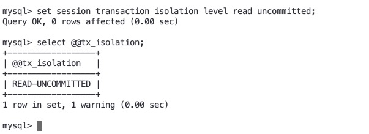

# Mysql InnoDB的事务隔离级别 <!-- {docsify-ignore-all} -->

- 参考：https://www.cnblogs.com/wyaokai/p/10921323.html

## 事务的基本要素（ACID）

- 原子性（Atomicity）：事务开始后所有操作，要么全部做完，要么全部不做，不可能停滞在中间环节。事务执行过程中出错，会回滚到事务开始前的状态，所有的操作就像没有发生一样。也就是说事务是一个不可分割的整体，就像化学中学过的原子，是物质构成的基本单位。

- 一致性（Consistency）：事务开始前和结束后，数据库的完整性约束没有被破坏 。比如A向B转账，不可能A扣了钱，B却没收到。

- 隔离性（Isolation）：同一时间，只允许一个事务请求同一数据，不同的事务之间彼此没有任何干扰。比如A正在从一张银行卡中取钱，在A取钱的过程结束前，B不能向这张卡转账。

- 持久性（Durability）：事务完成后，事务对数据库的所有更新将被保存到数据库，不能回滚。

## Mysql InnoDB的事务隔离级别

&nbsp; &nbsp; 事务的不同隔离级别会产生以下问题：

- 脏读：事务A读取了事务B更新的数据，然后B回滚操作，那么A读取到的数据是脏数据
- 不可重复读：事务 A 多次读取同一数据，事务 B 在事务A多次读取的过程中，对数据作了更新并提交，导致事务A多次读取同一数据时，结果不一致。
- 幻读：系统管理员A将数据库中所有学生的成绩从具体分数改为ABCDE等级，但是系统管理员B就在这个时候插入了一条具体分数的记录，当系统管理员A改结束后发现还有一条记录没有改过来，就好像发生了幻觉一样，这就叫幻读。

小结：不可重复读的和幻读很容易混淆，不可重复读侧重于修改，幻读侧重于新增或删除。解决不可重复读的问题只需锁住满足条件的行，解决幻读需要锁表

&nbsp; &nbsp; 事务隔离(Transaction isolation)是数据库的基础特征。隔离(Isolation)就是ACID中的I；隔离级别是⼀个可配置项, ⽤于在多个事务进⾏并发修改和并发查询时, 调节性能、可靠性(reliability)、⼀致性
(consistency)和可重复性(reproducibility)之间的平衡。InnoDB⽀持《SQL:1992标准》中定义的四个事务隔离级别:

- READ UNCOMMITTED（读未提交）：事务A和B操作同一数据，事务A能够读到事务B未提交的数据，会产生幻读，不可重复读，脏读
- READ COMMITTED（读已提交）：事务A和B操作同一数据，事务A能够读到事务B更新的数据，会产生幻读和不可重复度
- REPEATABLE READ（可重复读）：事务A和事务B操作同一数据，事务A不能读到事务B已经插入的数据，会产生幻读
- SERIALIZABLE（串行化）：所有事务都必须保证串行执行，不会产生脏读，幻读，不可重复度

## 列举隔离级别的四种情况

### READ UNCOMMITTED（读未提交）

- 设置mysql隔离级别为读未提交

```
set session transaction isolation level read uncommitted;
```



- 客户端1开启事务A，并执行查询语句，balance值是150000

```
mysql> start transaction;
Query OK, 0 rows affected (0.00 sec)

mysql> select * from account;
+----+---------+---------+---------------+---------------------+-------------+
| id | user_id | balance | freeze_amount | create_time         | update_time |
+----+---------+---------+---------------+---------------------+-------------+
|  1 | 10000   |  150000 |             0 | 2017-09-18 14:54:22 | NULL        |
+----+---------+---------+---------------+---------------------+-------------+
1 row in set (0.00 sec)
```

- 客户端2开启事务B，将balance更新到250000，不提交事务

```
mysql> start transaction;
Query OK, 0 rows affected (0.00 sec)

mysql> update account set balance=250000 where id = 1;
Query OK, 1 row affected (0.00 sec)
Rows matched: 1  Changed: 1  Warnings: 0
```

- 客户端A继续执行查询语句，balance值为250000，产生了不可重复读，这时如果事务B因某种原因rollback，那么事务A拿到的数据就变成了脏数据.

```
mysql> select * from account;
+----+---------+---------+---------------+---------------------+-------------+
| id | user_id | balance | freeze_amount | create_time         | update_time |
+----+---------+---------+---------------+---------------------+-------------+
|  1 | 10000   |  150000 |             0 | 2017-09-18 14:54:22 | NULL        |
+----+---------+---------+---------------+---------------------+-------------+
1 row in set (0.00 sec)

mysql> start transaction;
Query OK, 0 rows affected (0.00 sec)

mysql> select * from account;
+----+---------+---------+---------------+---------------------+-------------+
| id | user_id | balance | freeze_amount | create_time         | update_time |
+----+---------+---------+---------------+---------------------+-------------+
|  1 | 10000   |  150000 |             0 | 2017-09-18 14:54:22 | NULL        |
+----+---------+---------+---------------+---------------------+-------------+
1 row in set (0.00 sec)

mysql> select * from account;
+----+---------+---------+---------------+---------------------+-------------+
| id | user_id | balance | freeze_amount | create_time         | update_time |
+----+---------+---------+---------------+---------------------+-------------+
|  1 | 10000   |  250000 |             0 | 2017-09-18 14:54:22 | NULL        |
+----+---------+---------+---------------+---------------------+-------------+
1 row in set (0.00 sec)
```

- 客户端1开启事务A并更新balance不进行提交，客户端2开启事务B也更新balance，这时由于事务A没有提交，事务B的update会被锁住，如下：

客户端1事务A
```
mysql> start transaction;
Query OK, 0 rows affected (0.00 sec)

mysql> update account set balance=balance-100 where id=1;
Query OK, 1 row affected (0.00 sec)
Rows matched: 1  Changed: 1  Warnings: 0

mysql> commit;
Query OK, 0 rows affected (0.01 sec)
```

客户端2事务B

```
mysql> start transaction;
Query OK, 0 rows affected (0.00 sec)

<!-- 这里会被锁住，直到客户端1事务A commit或rollback -->
mysql> update account set balance = balance - 100 where id=1
    -> ;
Query OK, 1 row affected (7.91 sec)
Rows matched: 1  Changed: 1  Warnings: 0
```

- 总结

&nbsp; &nbsp; `READ COMMITTED（读未提交）`的隔离级别会产生脏读，幻读和不可重复读；在执行`update`会为其读取到的每⼀⾏先设置⼀个排他锁(exclusive lock), 然后再确定是否需要对其进⾏修改。 如果 InnoDB不需要修改, 则会释放该⾏的锁。 否则, InnoDB将保留这个⾏锁直到事务结束，所以在一个客户端事务中更新数据如果不commit或rollback，另一个客户端无法更新该航数据。


### READ COMMITTED（读已提交）

- 客户端1，2设置mysql隔离级别为读已提交

```
set session transaction isolation level read committed;
```

- 客户端1开启事务，客户端2也开启事务，客户端2更新数据和插入数据，客户端1读到的结果仍是开启事务时未更新和插入数据的结果，客户端2查到的结果是更新和插入后的数据结果

客户端2
```
mysql> start transaction;
Query OK, 0 rows affected (0.00 sec)

mysql> select * from account;
+----+---------+---------+---------------+---------------------+-------------+
| id | user_id | balance | freeze_amount | create_time         | update_time |
+----+---------+---------+---------------+---------------------+-------------+
|  1 | 10000   |     100 |             0 | 2017-09-18 14:54:22 | NULL        |
+----+---------+---------+---------------+---------------------+-------------+
1 row in set (0.00 sec)

mysql> update account set balance = 250000 where id=1
    -> ;
Query OK, 1 row affected (0.01 sec)
Rows matched: 1  Changed: 1  Warnings: 0

mysql> select * from account;
+----+---------+---------+---------------+---------------------+-------------+
| id | user_id | balance | freeze_amount | create_time         | update_time |
+----+---------+---------+---------------+---------------------+-------------+
|  1 | 10000   |  250000 |             0 | 2017-09-18 14:54:22 | NULL        |
+----+---------+---------+---------------+---------------------+-------------+
1 row in set (0.00 sec)

mysql> insert into account (user_id, balance, freeze_amount, create_time) value (10001, 1000, 0, '2021-05-25 19:54:00');
Query OK, 1 row affected (0.00 sec)

mysql> select * from account;
+----+---------+---------+---------------+---------------------+-------------+
| id | user_id | balance | freeze_amount | create_time         | update_time |
+----+---------+---------+---------------+---------------------+-------------+
|  1 | 10000   |  250000 |             0 | 2017-09-18 14:54:22 | NULL        |
|  3 | 10001   |    1000 |             0 | 2021-05-25 19:54:00 | NULL        |
+----+---------+---------+---------------+---------------------+-------------+
2 rows in set (0.00 sec)

```

客户端1的每次查询结果都是开启事务后的数据结果，产生不可重复读，导致了数据的不一致，如果是程序需要对查询到的所有结果集进行一个批量更新，那显然程序只会更新一条数据，客户端2commit事务后数据被覆盖，产生数据不一致。

```
mysql> select * from account;
+----+---------+---------+---------------+---------------------+-------------+
| id | user_id | balance | freeze_amount | create_time         | update_time |
+----+---------+---------+---------------+---------------------+-------------+
|  1 | 10000   |     100 |             0 | 2017-09-18 14:54:22 | NULL        |
+----+---------+---------+---------------+---------------------+-------------+
1 row in set (0.00 sec)

mysql> select * from account;
+----+---------+---------+---------------+---------------------+-------------+
| id | user_id | balance | freeze_amount | create_time         | update_time |
+----+---------+---------+---------------+---------------------+-------------+
|  1 | 10000   |     100 |             0 | 2017-09-18 14:54:22 | NULL        |
+----+---------+---------+---------------+---------------------+-------------+
1 row in set (0.00 sec)

mysql> select * from account;
+----+---------+---------+---------------+---------------------+-------------+
| id | user_id | balance | freeze_amount | create_time         | update_time |
+----+---------+---------+---------------+---------------------+-------------+
|  1 | 10000   |     100 |             0 | 2017-09-18 14:54:22 | NULL        |
+----+---------+---------+---------------+---------------------+-------------+
1 row in set (0.00 sec)
```

- 总结

&nbsp; &nbsp; `READ COMMITTED（读已提交）`解决了脏读的问题，但是在当事务B提交后，事务A再次读取数据时两次数据不一致，产生了不可重复读的问题；同样的此隔离级别在update数据时也会设置排它锁，与`READ UNCOMMITTED`相同。

### REPEATABLE READ（可重复读）

- 客户端1，2设置mysql隔离级别为可重复读

```
set session transaction isolation level repeatable read;
```

- 客户端1，开启事务并查询account表的所有内容

```
mysql> start transaction;
Query OK, 0 rows affected (0.00 sec)

mysql> select * from account;
+----+---------+---------+---------------+---------------------+-------------+
| id | user_id | balance | freeze_amount | create_time         | update_time |
+----+---------+---------+---------------+---------------------+-------------+
|  1 | 10000   |  250000 |             0 | 2017-09-18 14:54:22 | NULL        |
|  3 | 10001   |     800 |             0 | 2021-05-25 19:54:00 | NULL        |
+----+---------+---------+---------------+---------------------+-------------+
2 rows in set (0.01 sec)
```

- 客户端2，开启事务，更新id为1的balance并提交

```
mysql> start transaction;
Query OK, 0 rows affected (0.00 sec)

mysql> update account set balance=balance-100 where id =1;
Query OK, 1 row affected (0.00 sec)
Rows matched: 1  Changed: 1  Warnings: 0

mysql> commit;
Query OK, 0 rows affected (0.01 sec)
```

- 客户端1，再次查询account表的所有内容，可以看到第一次第二次查询的结果一致并没有出现不可重复读的现象

```
mysql> select * from account;
+----+---------+---------+---------------+---------------------+-------------+
| id | user_id | balance | freeze_amount | create_time         | update_time |
+----+---------+---------+---------------+---------------------+-------------+
|  1 | 10000   |  250000 |             0 | 2017-09-18 14:54:22 | NULL        |
|  3 | 10001   |     800 |             0 | 2021-05-25 19:54:00 | NULL        |
+----+---------+---------+---------------+---------------------+-------------+
2 rows in set (0.01 sec)

mysql> select * from account;
+----+---------+---------+---------------+---------------------+-------------+
| id | user_id | balance | freeze_amount | create_time         | update_time |
+----+---------+---------+---------------+---------------------+-------------+
|  1 | 10000   |  250000 |             0 | 2017-09-18 14:54:22 | NULL        |
|  3 | 10001   |     800 |             0 | 2021-05-25 19:54:00 | NULL        |
+----+---------+---------+---------------+---------------------+-------------+
2 rows in set (0.00 sec)
```

- 客户端1，更新id=1的balance，然后查询结果，结果并不是249900而是249800，保证了数据的一致性，可重复读的隔离级别下使用了MVCC机制，select操作不会更新版本号，是快照读（历史版本）；insert、update和delete会更新版本号，是当前读（当前版本）。

```
mysql> update account set balance=balance-100 where id=1;
Query OK, 1 row affected (0.00 sec)
Rows matched: 1  Changed: 1  Warnings: 0

mysql> select * from account;
+----+---------+---------+---------------+---------------------+-------------+
| id | user_id | balance | freeze_amount | create_time         | update_time |
+----+---------+---------+---------------+---------------------+-------------+
|  1 | 10000   |  249800 |             0 | 2017-09-18 14:54:22 | NULL        |
|  3 | 10001   |     800 |             0 | 2021-05-25 19:54:00 | NULL        |
+----+---------+---------+---------------+---------------------+-------------+
2 rows in set (0.00 sec)
```

- 客户端2，开启事务，并insert数据，客户端1并未commit，然后客户端1查询结果，后续如果客户端1要对结果集进行批量操作时无法处理insert的数据产生幻读。

客户端2
```
mysql> start transaction;
Query OK, 0 rows affected (0.00 sec)

mysql> insert into account (user_id, balance, freeze_amount, create_time) value (10001, 4000, 0, '2021-05-25 19:54:00');
Query OK, 1 row affected (0.00 sec)
```

客户端1
```
mysql> select * from account;
+----+---------+---------+---------------+---------------------+-------------+
| id | user_id | balance | freeze_amount | create_time         | update_time |
+----+---------+---------+---------------+---------------------+-------------+
|  1 | 10000   |  249800 |             0 | 2017-09-18 14:54:22 | NULL        |
|  3 | 10001   |     800 |             0 | 2021-05-25 19:54:00 | NULL        |
+----+---------+---------+---------------+---------------------+-------------+
2 rows in set (0.00 sec)
```

## 总结

&nbsp; &nbsp; `REPEATABLE READ（可重复读）`解决了脏读，不可重复度，并且使用MVCC机制保证了数据的一致性，但是再insert数据时还会产生幻读。


### SERIALIZABLE（串行化）

- 客户端1，2设置mysql隔离级别为可重复读

```
set session transaction isolation level serializable;
```

- 客户端1，开启事务A并查询结果

```
mysql> start transaction;
Query OK, 0 rows affected (0.00 sec)

mysql> select * from account;
+----+---------+---------+---------------+---------------------+-------------+
| id | user_id | balance | freeze_amount | create_time         | update_time |
+----+---------+---------+---------------+---------------------+-------------+
|  1 | 10000   |  249800 |             0 | 2017-09-18 14:54:22 | NULL        |
|  3 | 10001   |     800 |             0 | 2021-05-25 19:54:00 | NULL        |
|  4 | 10001   |    4000 |             0 | 2021-05-25 19:54:00 | NULL        |
+----+---------+---------+---------------+---------------------+-------------+
3 rows in set (0.00 sec)
```

- 客户端2，开启事务B并insert数据，结果是insert语句被阻塞住，以为我没操作超时了，不开启事务的结果和开启事务一样。

```
mysql> start transaction;
Query OK, 0 rows affected (0.00 sec)

mysql> select * from account;
+----+---------+---------+---------------+---------------------+-------------+
| id | user_id | balance | freeze_amount | create_time         | update_time |
+----+---------+---------+---------------+---------------------+-------------+
|  1 | 10000   |  249800 |             0 | 2017-09-18 14:54:22 | NULL        |
|  3 | 10001   |     800 |             0 | 2021-05-25 19:54:00 | NULL        |
|  4 | 10001   |    4000 |             0 | 2021-05-25 19:54:00 | NULL        |
+----+---------+---------+---------------+---------------------+-------------+
3 rows in set (0.00 sec)

mysql> insert into account (user_id, balance, freeze_amount, create_time) value (10001, 8000, 0, '2021-05-25 19:54:00');
ERROR 1205 (HY000): Lock wait timeout exceeded; try restarting transaction
```

### 总结

&nbsp; &nbsp; `SERIALIZABLE（串行化）`隔离级别会锁住表，所以保证了不会发生读脏数据，不可重复读和幻读，但是这种并发很低，应用很少。

## 补充

- 事务隔离级别为读提交时，写数据只会锁住相应的行

- 事务隔离级别为可重复读时，如果检索条件有索引（包括主键索引）的时候，默认加锁方式是next-key 锁；如果检索条件没有索引，更新数据时会锁住整张表。一个间隙被事务加了锁，其他事务是不能在这个间隙插入记录的，这样可以防止幻读。

- 事务隔离级别为串行化时，读写数据都会锁住整张表

- 隔离级别越高，越能保证数据的完整性和一致性，但是对并发性能的影响也越大。

- MYSQL MVCC实现机制参考链接：https://blog.csdn.net/whoamiyang/article/details/51901888

- 关于next-key 锁可以参考链接：https://blog.csdn.net/bigtree_3721/article/details/73731377