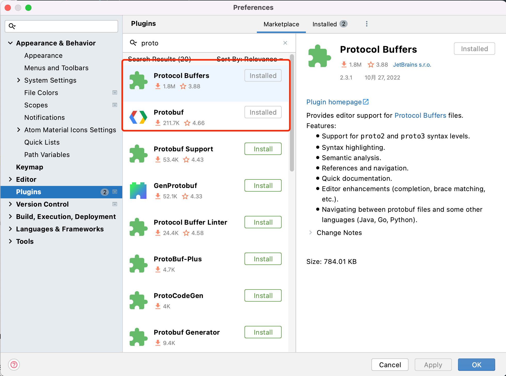
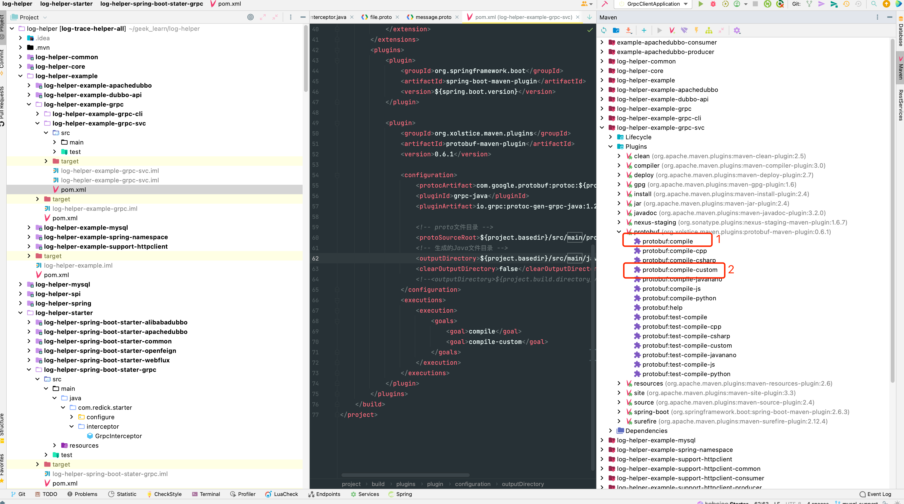
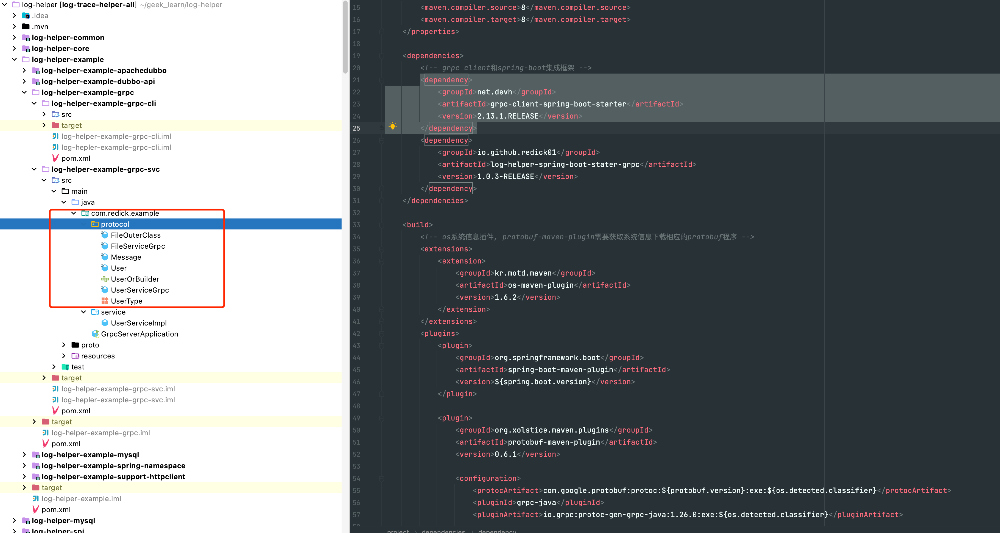

# SpringBoot + Grpc简单实现 <!-- {docsify-ignore-all} -->


## IDEA插件安装



## protobuf协议编写

在main文件夹下创建proto文件件，并编写protobuf协议文件，server和client端都要编写

- file.proto

```protobuf
syntax = "proto3";

package protocol;

option go_package = "protocol";
option java_package = "com.redick.example.protocol";

message File {
  string name = 1;
  int32 size = 2;
}
```

- message.proto

```protobuf
syntax = "proto3";
package protocol;

import "file.proto";

option go_package = "protocol";
option java_multiple_files = true;
option java_package = "com.redick.example.protocol";

message User {
  reserved 6 to 7;
  reserved "userId2";
  int32 userId = 1;
  string username = 2;
  oneof msg {
    string error = 3;
    int32 code = 4;
  }
  string name = 8;

  UserType userType = 9;
  repeated int32 roles = 10;

  protocol.File file = 11;
  map<string, string> hobbys = 12;
}

enum UserType {
  UNKNOW = 0;
  ADMIN = 1;
  BUSINESS_USER = 2;
};

service UserService {
  rpc getUser (User) returns (User) {}
  rpc getUsers (User) returns (stream User) {}
  rpc saveUsers (stream User) returns (User) {}
}

service FileService {
  rpc getFile(User) returns(File) {}
}
```

## maven插件

- maven依赖

```xml
    <dependency>
        <groupId>com.google.protobuf</groupId>
        <artifactId>protobuf-java</artifactId>
        <version>3.19.4</version>
    </dependency>
```

- maven中protobuf plugin

```xml
    <build>
        <!-- os系统信息插件, protobuf-maven-plugin需要获取系统信息下载相应的protobuf程序 -->
        <extensions>
            <extension>
                <groupId>kr.motd.maven</groupId>
                <artifactId>os-maven-plugin</artifactId>
                <version>1.6.2</version>
            </extension>
        </extensions>
        <plugins>
            <plugin>
                <groupId>org.springframework.boot</groupId>
                <artifactId>spring-boot-maven-plugin</artifactId>
                <version>${spring.boot.version}</version>
            </plugin>
            
            <plugin>
                <groupId>org.xolstice.maven.plugins</groupId>
                <artifactId>protobuf-maven-plugin</artifactId>
                <version>0.6.1</version>
                
                <configuration>
                    <protocArtifact>com.google.protobuf:protoc:${protobuf.version}:exe:${os.detected.classifier}</protocArtifact>
                    <pluginId>grpc-java</pluginId>
                    <pluginArtifact>io.grpc:protoc-gen-grpc-java:1.26.0:exe:${os.detected.classifier}</pluginArtifact>
                    
                    <!-- proto文件目录 -->
                    <protoSourceRoot>${project.basedir}/src/main/proto</protoSourceRoot>
                    <!-- 生成的Java文件目录 -->
                    <outputDirectory>${project.basedir}/src/main/java/</outputDirectory>
                    <clearOutputDirectory>false</clearOutputDirectory>
                    <!--<outputDirectory>${project.build.directory}/generated-sources/protobuf</outputDirectory>-->
                </configuration>
                <executions>
                    <execution>
                        <goals>
                            <goal>compile</goal>
                            <goal>compile-custom</goal>
                        </goals>
                    </execution>
                </executions>
            </plugin>
        </plugins>
    </build>
```

## 代码生成

命令行或idea插件，server和client端都要生成代码

- 命令行

```powershell
mvn clean compile
```

- idea插件

执行idea中的maven插件



- 生成代码文件如下



## 代码实现

- maven依赖

```xml
    <properties>
        <maven.compiler.source>8</maven.compiler.source>
        <maven.compiler.target>8</maven.compiler.target>
        <protobuf.version>3.19.4</protobuf.version>
        <grpc.version>1.46.0</grpc.version>
        <spring.boot.version>2.6.3</spring.boot.version>
        <grpc.starter.version>2.13.1.RELEASE</grpc.starter.version>
    </properties>
    <dependencies>
        <dependency>
            <groupId>org.springframework.boot</groupId>
            <artifactId>spring-boot-starter</artifactId>
            <version>${spring.boot.version}</version>
        </dependency>
        <dependency>
            <groupId>org.springframework.boot</groupId>
            <artifactId>spring-boot-starter-web</artifactId>
            <version>${spring.boot.version}</version>
        </dependency>
        <dependency>
            <groupId>org.springframework.boot</groupId>
            <artifactId>spring-boot-starter-aop</artifactId>
            <version>${spring.boot.version}</version>
        </dependency>
        <dependency>
            <groupId>net.devh</groupId>
            <artifactId>grpc-server-spring-boot-starter</artifactId>
            <version>${grpc.starter.version}</version>
        </dependency>
        <dependency>
            <groupId>net.devh</groupId>
            <artifactId>grpc-client-spring-boot-starter</artifactId>
            <version>2.13.1.RELEASE</version>
        </dependency>
        <dependency>
            <groupId>io.grpc</groupId>
            <artifactId>grpc-stub</artifactId>
            <version>1.46.0</version>
        </dependency>
        <dependency>
            <groupId>io.grpc</groupId>
            <artifactId>grpc-protobuf</artifactId>
            <version>1.46.0</version>
        </dependency>
        <dependency>
            <groupId>org.projectlombok</groupId>
            <artifactId>lombok</artifactId>
            <version>${lombok.version}</version>
        </dependency>
        <dependency>
            <groupId>com.google.protobuf</groupId>
            <artifactId>protobuf-java</artifactId>
            <version>${protobuf.version}</version>
        </dependency>
        <dependency>
            <groupId>com.fasterxml.jackson.core</groupId>
            <artifactId>jackson-databind</artifactId>
            <version>2.11.4</version>
        </dependency>
        <dependency>
            <groupId>com.fasterxml.jackson.core</groupId>
            <artifactId>jackson-core</artifactId>
            <version>2.11.4</version>
        </dependency>
    </dependencies>
```

## SpringBoot集成

#### 服务端代码开发

- application.yml

```yml
grpc:
  server:
    port: 9090

server:
  port: 8080
```

- 服务端业务代码

```java
@GrpcService
public class UserServiceImpl extends UserServiceGrpc.UserServiceImplBase {

    @Override
    public void getUser(User request, StreamObserver<User> responseObserver) {
        User user = User.newBuilder()
                .setName("response name")
                .build();
        responseObserver.onNext(user);
        responseObserver.onCompleted();
    }

    @Override
    public void getUsers(User request, StreamObserver<User> responseObserver) {
        User user = User.newBuilder()
                .setName("user1")
                .build();
        User user2 = User.newBuilder()
                .setName("user2")
                .build();
        responseObserver.onNext(user);
        responseObserver.onNext(user2);

        responseObserver.onCompleted();
    }

    @Override
    public StreamObserver<User> saveUsers(StreamObserver<User> responseObserver) {
        return new StreamObserver<User>() {
            @Override
            public void onNext(User user) {
            }

            @Override
            public void onError(Throwable throwable) {
            }

            @Override
            public void onCompleted() {
                User user = User.newBuilder()
                        .setName("saveUsers user1")
                        .build();
                responseObserver.onNext(user);
                responseObserver.onCompleted();
            }
        };
    }
}
```

#### 客户端代码开发

- application.yml

```yml
server:
  port: 8081
  servlet:
    context-path: /grpc

grpc:
  client:
    userClient:
      negotiationType: PLAINTEXT
      address: static://localhost:9090
```

- 客户端测试controller

```java
@RestController
public class TestController {

    @GrpcClient("userClient")
    private UserServiceGrpc.UserServiceBlockingStub userService;

    @Autowired
    private GrpcInterceptor grpcInterceptor;

    @GetMapping("/getUser")
    public String getUser()     {
        User user = User.newBuilder()
                .setUserId(100)
                .putHobbys("pingpong", "play pingpong")
                .setCode(200)
                .build();
        Channel channel = ClientInterceptors.intercept(userService.getChannel(), grpcInterceptor);
        userService = UserServiceGrpc.newBlockingStub(channel);
        User u = userService.getUser(user);
        return u.getName();
    }
}
```