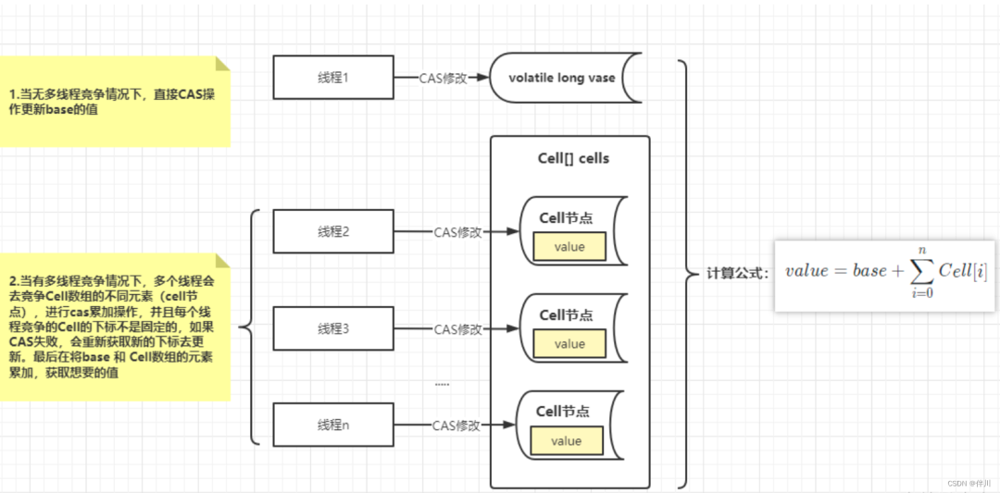
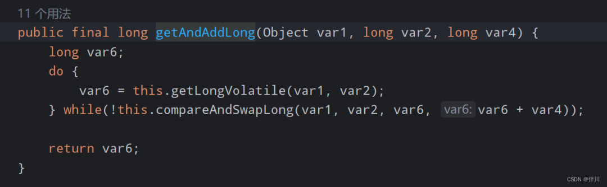

# 高并发下的计数器，推荐 LongAdder <!-- {docsify-ignore-all} -->

### 前言

在分布式系统中，计数器是一个常见的需求。为了实现高并发、高可用的计数器，我们需要选择一个合适的实现方式。

在 Java 中，有两种常见的计数器实现方式：AtomicLong 和 LongAdder。

阿里巴巴在一份技术报告中推荐使用 LongAdder ，而不是 AtomicLong。

本文将介绍这两种计数器的原理和优缺点，并分析为什么阿里巴巴推荐使用 LongAdder。

### CAS

全称：compare and swap，比较并交换。

虽然翻译过来是“比较并交换“，但它是一个原子性的操作，对应到 CPU 指令为 cmpxchg 。

##### 通俗理解

- CAS 有三个操作数:当前值 A、内存值 V、要修改的新值 B。
- 假设当前值A 跟 内存值V 相等，那就将内存值 V 改成 B。
- 假设当前值 A 跟 内存值V 不相等，要么就重试，要么就放弃更新。
- 将当前值与内存值进行对比，判断是否有被修改过，这就是 CAS 的核心。

##### CAS的问题

> CAS 有个缺点就是会带来 ABA 的问题。

从 CAS 更新的时候，我们可以发现它只比对当前值和内存值是否相等，这会带来个问题，下面我举例说明下:

- 假设线程 A 读到当前值是 10，可能线程 B 把值修改为 100，然后线程 C 又把值修改为 10。
- 等到线程 A 拿到执行权时，因为当前值和内存值是一致的，线程A是可以修改的!
- 站在线程 A 的角度来说，这个值是从未被修改的 。
- 这是不合理的，因为我们从上帝的角度来看，这个变量已经被线程 B 和线程 C 修改过了。

##### 解决ABA问题

要解决 ABA 的问题，Java 也提供了 AtomicStampedReference 类供我们用，说白了就是加了个版本，比对的就是内存值+版本是否一致。

- 疑问：

为什么阿里巴巴开发手册提及到推荐使用 LongAdder 对象，比 AtomicLong 性能更好(减少乐观锁的重试次数)？

- 原因：

因为 AtomicLong 做累加的时候实际上就是多个线程操作同一个目标资源。

在高并发时，只有一个线程是执行成功的，其他的线程都会失败，不断自旋(重试)，自旋会成为瓶颈。而 LongAdder 的思想就是把要操作的目标资源 分散，到数
组 Cell 中。每个线程对自己的 Cell 变量的 value 进行原子操作，大大降低了失败的次数。 这就是为什么在高并发场景下，推荐使用 LongAdder  的原因。

## LongAdder

##### 什么是LongAdder

LongAdder 是 JDK1.8 由 Doug Lea 大神新增的原子操作类，位于 java.util.concurrent.atomic 包下，LongAdder 在高并发的场景下会比 
AtomicLong 具有更好的性能，代价是消耗更多的内存空间。

LongAdder 是 Google 开源的一个高性能计数器实现。它采用了一种分段锁的策略，将一个 long 型的变量分割成多个 16 字节的段，每个段都使用一个独立
的 AtomicLong 进行更新。这样，在高并发场景下，多个线程可以同时对不同的段进行更新操作，互不干扰。

LongAdder 的优点是并发性能高，适用于高并发的场景。由于采用了分段锁的策略，LongAdder 可以避免 AtomicLong 中的竞争问题。此外，LongAdder 还
支持可扩展性，可以通过增加更多的段来提高性能。 但是，LongAdder的缺点是代码相对复杂一些，需要更多的维护成本。

##### 为什么推荐LongAdder

LongAdder 设计思想上，采用分段的方式降低并发冲突的概率。通过维护一个基准值 base 和 Cell 数组：

## AtomicLong

AtomicLong是Java提供的一个原子类，用于实现高并发的计数器。它利用了 CAS（Compare-and-Swap）操作来保证线程安全。在 AtomicLong 中，每次计
数操作都会先读取当前值，然后使用 CAS 操作更新值。如果值没有被其他线程修改过，则更新成功，否则需要重新尝试。

AtomicLong 的优点是简单易用，性能也不错。但是，在高并发场景下，AtomicLong 可能会出现竞争问题。因为多个线程可能同时读取和更新同一个 
AtomicLong 的当前值，导致数据不一致。此外，AtomicLong 的 CAS 操作也可能因为硬件和操作系统的原因出现失败的情况。

##### 为什么不推荐 AtomicLong

在 LongAdder 之前，当我们在进行计数统计的时，通常会使用 AtomicLong 来实现。AtomicLong 能保证并发情况下计数的准确性，其内部通过 CAS 来解决
并发安全性的问题。

如图所示：

图里可以看出在高并发情况下，当有大量线程同时去更新一个变量，任意一个时间点只有一个线程能够成功，绝大部分的线程在尝试更新失败后，会通过自旋的方式
再次进行尝试，这样严重占用了 CPU 的时间片，进而导致系统性能问题。

## 总结

阿里巴巴推荐使用 LongAdder 的原因主要有以下几点：

- 高并发性能：LongAdder 采用分段锁的策略，可以避免 AtomicLong 中的竞争问题，提高并发性能。在分布式系统中，高并发性能是非常重要的。

- 可扩展性：LongAdder 支持可扩展性，可以通过增加更多的段来提高性能。这对于需要处理大量请求的分布式系统来说是非常有利的。

- 代码简单易懂： 虽然LongAdder 的代码相对复杂一些，但是相对于 AtomicLong 来说更容易理解和维护。这对于开发人员来说是非常重要的。

- 更好的适用场景： 阿里巴巴推荐使用 LongAdder 主要是因为在分布式系统中需要一个高性能、高可用的计数器实现。而 LongAdder 正好符合这个需求。

总之，阿里巴巴推荐使用 LongAdder 的原因主要是因为它的高并发性能、可扩展性、代码简单易懂以及更好的适用场景。当然，在实际应用中还需要根据具体场
景和需求进行选择和优化。

