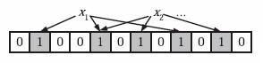

# Guava布隆过滤器简单应用 <!-- {docsify-ignore-all} -->

- 布隆过滤器概念
- 应用场景
- Guava实现布隆过滤器应用

## 布隆过滤器概念-来自于维基百科

&nbsp; &nbsp; 布隆过滤器（英语：Bloom Filter）是1970年由布隆提出的。它实际上是一个很长的二进制向量和一系列随机映射函数。布隆过滤器可以用于检索一个元素是否在一个集合中。它的优点是空间效率和查询时间都远远超过一般的算法，缺点是有一定的误识别率和删除困难。

### 基本概念

&nbsp; &nbsp; 如果想判断一个元素是不是在一个集合里，一般想到的是将集合中所有元素保存起来，然后通过比较确定。链表、树、散列表（又叫哈希表，Hash table）等等数据结构都是这种思路。但是随着集合中元素的增加，我们需要的存储空间越来越大。同时检索速度也越来越慢，上述三种结构的检索时间复杂度分别为O(n),O(\log n),O(1)。

&nbsp; &nbsp; 
&nbsp; &nbsp; 
&nbsp; &nbsp; 

&nbsp; &nbsp; 布隆过滤器的原理是，当一个元素被加入集合时，通过K个散列函数将这个元素映射成一个位数组中的K个点，把它们置为1。检索时，我们只要看看这些点是不是都是1就（大约）知道集合中有没有它了：如果这些点有任何一个0，则被检元素一定不在；如果都是1，则被检元素很可能在。这就是布隆过滤器的基本思想。


 


### 优点

&nbsp; &nbsp; 相比于其它的数据结构，布隆过滤器在空间和时间方面都有巨大的优势。布隆过滤器存储空间和插入/查询时间都是常数（O(k)）。另外，散列函数相互之间没有关系，方便由硬件并行实现。布隆过滤器不需要存储元素本身，在某些对保密要求非常严格的场合有优势。

&nbsp; &nbsp; 布隆过滤器可以表示全集，其它任何数据结构都不能；

&nbsp; &nbsp; k和m相同，使用同一组散列函数的两个布隆过滤器的交并[来源请求]运算可以使用位操作进行。

### 缺点

&nbsp; &nbsp; 但是布隆过滤器的缺点和优点一样明显。误算率是其中之一。随着存入的元素数量增加，误算率随之增加。但是如果元素数量太少，则使用散列表足矣。

&nbsp; &nbsp; 另外，一般情况下不能从布隆过滤器中删除元素。我们很容易想到把位数组变成整数数组，每插入一个元素相应的计数器加1, 这样删除元素时将计数器减掉就可以了。然而要保证安全地删除元素并非如此简单。首先我们必须保证删除的元素的确在布隆过滤器里面。这一点单凭这个过滤器是无法保证的。另外计数器回绕也会造成问题。

&nbsp; &nbsp; 在降低误算率方面，有不少工作，使得出现了很多布隆过滤器的变种。

### 应用场景

> 海量数据去重；

> 反垃圾邮件，从数十亿个垃圾邮件列表中判断某邮箱是否垃圾邮箱；

> 缓存击穿，将已存在的缓存放到布隆过滤器中，当黑客访问不存在的缓存时迅速返回避免缓存及DB挂掉。

### Guava实现布隆过滤器

```java
public class BloomFilterUtil {

    private static BloomFilterUtil instance;

    private BloomFilterUtil() {}


    public static class BloomFilterUtilInstance {
        private static final BloomFilterUtil INSTANCE = new BloomFilterUtil();
    }

    public static BloomFilterUtil getInstance() {
        return BloomFilterUtilInstance.INSTANCE;
    }

    /**
     * 预估数据量
     */
    private static final int INSERTIONS = 100000;

    /**
     * 判重错误率
     */
    private static final double FPP = 0.0001;

    private BloomFilter<String> bloomFilter = BloomFilter.create(Funnels.stringFunnel(Charset.defaultCharset()), INSERTIONS, FPP);

    public void addElement(String value) {
        bloomFilter.put(value);
    }

    public boolean containsElement(String value) {
        return bloomFilter.mightContain(value);
    }

    public static void main(String[] args) {
        BloomFilterUtil bloomFilterUtil = BloomFilterUtil.getInstance();

        bloomFilterUtil.addElement("lph");
        System.out.println(bloomFilterUtil.containsElement("lph"));

    }
}
```

## 总结

&nbsp; &nbsp; 布隆过滤器的实现关键在于位数组容量，判重错误率和哈希函数，在可以容忍一定的错误率的情况下，能够高效的处理海量数据判重。具体的API细节可以参考Guava的官方API文档，文档地址如下：https://guava.dev/releases/snapshot-jre/api/docs/com/google/common/hash/BloomFilter.html