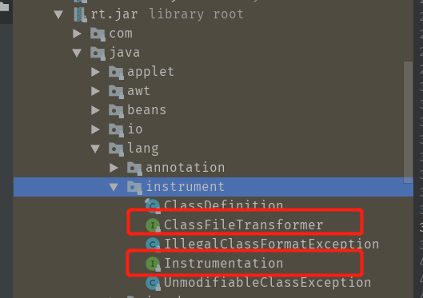
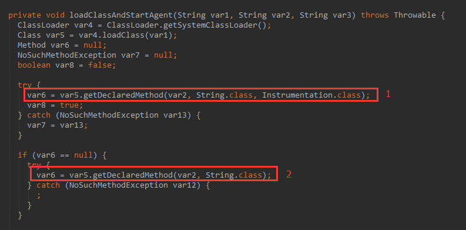
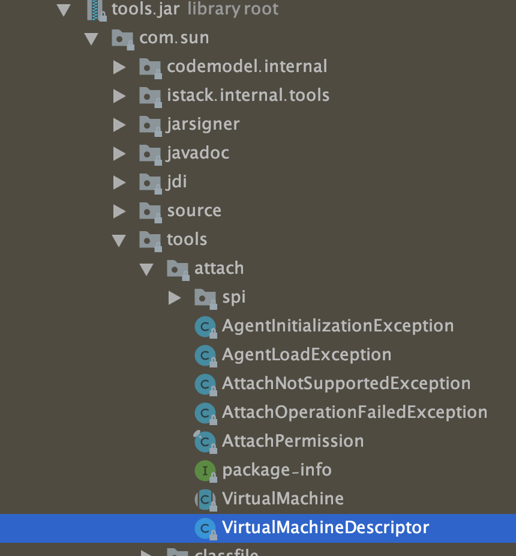
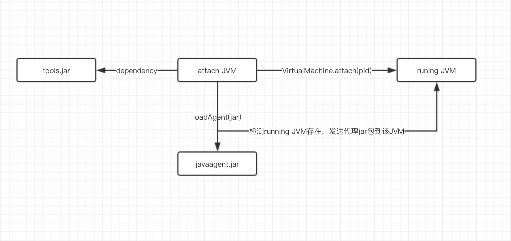
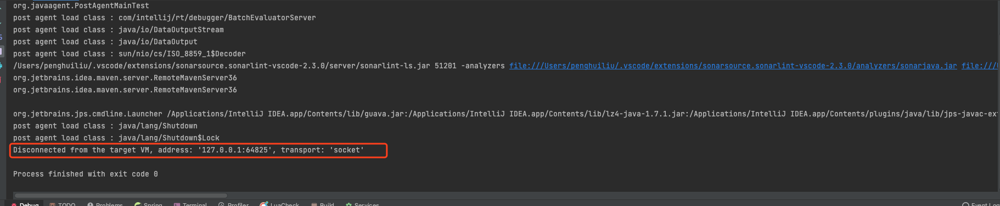

# Javaagent使用指南 <!-- {docsify-ignore-all} -->

## JVM启动前静态Instrument

### Javaagent是什么？

Javaagent是java命令的一个参数。参数javaagent可以用于指定一个jar包，并且对该java包有2个要求：

1. 这个jar包的MANIFEST.MF文件必须指定Premain-Class项。
2. Premain-Class指定的那个类必须实现premain()方法。

premain 方法，从字面上理解，就是运行在 main 函数之前的的类。当Java虚拟机启动时，在执行 main 函数之前，JVM会先运行-javaagent所指定jar包内Premain-Class这个类的premain方法 。

在命令行输入java可以看到相应的参数，其中有和java agent相关的：

```shell
-agentlib:<libname>[=<选项>] 加载本机代理库 <libname>, 例如 -agentlib:hprof
	另请参阅 -agentlib:jdwp=help 和 -agentlib:hprof=help
-agentpath:<pathname>[=<选项>]
	按完整路径名加载本机代理库
-javaagent:<jarpath>[=<选项>]
	加载 Java 编程语言代理, 请参阅 java.lang.instrument
```

在上面`-javaagent`参数中提到了参阅`java.lang.instrument`，这是在`rt.jar`中定义的一个包，该路径下有两个重要的类： 




该包提供了一些工具帮助开发人员在 Java 程序运行时，动态修改系统中的 Class 类型。其中，使用该软件包的一个关键组件就是 Javaagent。从名字上看，似乎是个 Java 代理之类的，而实际上，他的功能更像是一个Class 类型的转换器，他可以在运行时接受重新外部请求，对Class类型进行修改。

从本质上讲，Java Agent 是一个遵循一组严格约定的常规 Java 类。 上面说到 javaagent命令要求指定的类中必须要有premain()方法，并且对premain方法的签名也有要求，签名必须满足以下两种格式：

```java
public static void premain(String agentArgs, Instrumentation inst)
    
public static void premain(String agentArgs)
```

JVM 会优先加载 带`Instrumentation`签名的方法，加载成功忽略第二种，如果第一种没有，则加载第二种方法。这个逻辑在sun.instrument.InstrumentationImpl 类中：



Instrumentation接口定义如下：

```java
public interface Instrumentation {
    
    //增加一个Class 文件的转换器，转换器用于改变 Class 二进制流的数据，参数 canRetransform 设置是否允许重新转换。
    void addTransformer(ClassFileTransformer transformer, boolean canRetransform);

    //在类加载之前，重新定义 Class 文件，ClassDefinition 表示对一个类新的定义，如果在类加载之后，需要使用 retransformClasses 方法重新定义。addTransformer方法配置之后，后续的类加载都会被Transformer拦截。对于已经加载过的类，可以执行retransformClasses来重新触发这个Transformer的拦截。类加载的字节码被修改后，除非再次被retransform，否则不会恢复。
    void addTransformer(ClassFileTransformer transformer);

    //删除一个类转换器
    boolean removeTransformer(ClassFileTransformer transformer);

    boolean isRetransformClassesSupported();

    //在类加载之后，重新定义 Class。这个很重要，该方法是1.6 之后加入的，事实上，该方法是 update 了一个类。
    void retransformClasses(Class<?>... classes) throws UnmodifiableClassException;

    boolean isRedefineClassesSupported();

    
    void redefineClasses(ClassDefinition... definitions)
        throws  ClassNotFoundException, UnmodifiableClassException;

    boolean isModifiableClass(Class<?> theClass);

    @SuppressWarnings("rawtypes")
    Class[] getAllLoadedClasses();

  
    @SuppressWarnings("rawtypes")
    Class[] getInitiatedClasses(ClassLoader loader);

    //获取一个对象的大小
    long getObjectSize(Object objectToSize);


   
    void appendToBootstrapClassLoaderSearch(JarFile jarfile);

    
    void appendToSystemClassLoaderSearch(JarFile jarfile);

    
    boolean isNativeMethodPrefixSupported();

    
    void setNativeMethodPrefix(ClassFileTransformer transformer, String prefix);
}
```

最为重要的是上面注释的几个方法，下面我们会用到。

### 如何实现一个Javaagent？

使用`javaagent`需要几个步骤：

1. 定义一个 MANIFEST.MF 文件，必须包含 Premain-Class 选项，通常也会加入Can-Redefine-Classes 和 Can-Retransform-Classes 选项。
2. 创建一个Premain-Class 指定的类，类中包含 premain 方法，方法逻辑由用户自己确定。
3. 将 premain 的类和 MANIFEST.MF 文件打成 jar 包。
4. 使用参数 -javaagent: jar包路径 启动要代理的方法。

在执行以上步骤后，JVM会先执行premain方法，`大部分类`加载都会通过该方法，注意：是大部分，不是所有。当然，遗漏的主要是系统类，因为很多系统类先于agent执行，而用户类的加载肯定是会被拦截的。也就是说，这个方法是在main方法启动前拦截大部分类的加载活动，既然可以拦截类的加载，那么就可以去做重写类这样的操作，结合第三方的字节码编译工具，比如ASM，javassist，cglib，bytebuddy等等来改写实现类。

通过上面的步骤我们用代码实现来实现。实现javaagent你需要搭建两个工程，一个工程是用来承载javaagent类，单独的打成jar包；一个工程是javaagent需要去代理的类。即javaagent会在这个工程中的main方法启动之前去做一些事情。

> 首先来实现javaagent工程。

工程目录结构如下：

```shell
├── java
│   └── org
│       └── agent
│           ├── Agent.java
└── resources
    └── META-INF
        ├── MANIFEST.MF
```

创建一个包含premain方法的类：

```java
/**
 * @author liupenghui
 * @date 2021/10/8 11:21 上午
 */
public class Agent {

    public static void premain(String args, Instrumentation inst) {
        System.out.println("Agent args is : " + args);
        inst.addTransformer(new DefineTransformer(), true);
    }

    static class DefineTransformer implements ClassFileTransformer {

        @Override
        public byte[] transform(ClassLoader loader, String className, Class<?> classBeingRedefined, ProtectionDomain protectionDomain, byte[] classfileBuffer) throws IllegalClassFormatException {
            System.out.println("premain load class :" + className);
            return new byte[0];
        }
    }
}
```

上面就是我实现的一个类，实现了带Instrumentation参数的premain()方法。调用addTransformer()方法对启动时所有的类进行拦截。

然后在 resources 目录下新建目录：META-INF，在该目录下新建文件：MANIFREST.MF：

```m
Manifest-Version: 1.0
Can-Redefine-Classes: true
Can-Retransform-Classes: true
Premain-Class: org.agent.Agent

```
> MANIFREST.MF文件的作用

Premain-Class ：包含 premain 方法的类（类的全路径名）

Agent-Class ：包含 agentmain 方法的类（类的全路径名）

Boot-Class-Path ：设置引导类加载器搜索的路径列表。查找类的特定于平台的机制失败后，引导类加载器会搜索这些路径。按列出的顺序搜索路径。列表中的路径由一个或多个空格分开。路径使用分层 URI 的路径组件语法。如果该路径以斜杠字符（“/”）开头，则为绝对路径，否则为相对路径。相对路径根据代理 JAR 文件的绝对路径解析。忽略格式不正确的路径和不存在的路径。如果代理是在 VM 启动之后某一时刻启动的，则忽略不表示 JAR 文件的路径。（可选）

Can-Redefine-Classes ：true表示能重定义此代理所需的类，默认值为 false（可选）

Can-Retransform-Classes ：true 表示能重转换此代理所需的类，默认值为 false （可选）

Can-Set-Native-Method-Prefix： true表示能设置此代理所需的本机方法前缀，默认值为 false（可选）

即在该文件中主要定义了程序运行相关的配置信息，程序运行前会先检测该文件中的配置项。

一个java程序中-javaagent参数的个数是没有限制的，所以可以添加任意多个javaagent。所有的java agent会按照你定义的顺序执行，例如：

```shell
java -javaagent:agent1.jar -javaagent:agent2.jar -jar MyProgram.jar
```

程序执行的顺序将会是：

MyAgent1.premain -> MyAgent2.premain -> MyProgram.main

另外的再说一种不去手动写MANIFREST.MF文件的方式，使用maven插件：

```xml
<plugin>
    <groupId>org.apache.maven.plugins</groupId>
    <artifactId>maven-jar-plugin</artifactId>
    <version>3.1.0</version>
    <configuration>
        <archive>
            <!--自动添加META-INF/MANIFEST.MF -->
            <manifest>
                <addClasspath>true</addClasspath>
            </manifest>
            <manifestEntries>
                <Premain-Class>com.rickiyang.learn.PreMainTraceAgent</Premain-Class>
                <Agent-Class>com.rickiyang.learn.PreMainTraceAgent</Agent-Class>
                <Can-Redefine-Classes>true</Can-Redefine-Classes>
                <Can-Retransform-Classes>true</Can-Retransform-Classes>
            </manifestEntries>
        </archive>
    </configuration>
</plugin>
```

用这种插件的方式也可以自动生成该文件。

agent代码就写完了，下面再重新开一个工程，你只需要写一个带 main 方法的类即可：

```java
/**
 * @author liupenghui
 * @date 2021/10/8 2:25 下午
 */
public class AgentMainTest {

    public static void main(String[] args) throws Exception {
        System.out.println("main start");
        try {
            Thread.sleep(3000);
        } catch (InterruptedException e) {
            e.printStackTrace();
        }
        System.out.println("main end");
    }
}
```

打包java agent程序，编译并执行测试类

```shell
➜  javaagent javac AgentMainTest.java
➜  java -javaagent:/Users/penghuiliu/geek_learn/javaagent-demo/target/java-agent.jar AgentMainTest
```

输出结果如下：
```shell
Agent args is : null
premain load class :java/lang/invoke/MethodHandleImpl
premain load class :java/lang/invoke/MethodHandleImpl$1
premain load class :java/lang/invoke/MethodHandleImpl$2
premain load class :java/util/function/Function
premain load class :java/lang/invoke/MethodHandleImpl$3
premain load class :java/lang/invoke/MethodHandleImpl$4
premain load class :java/lang/ClassValue
premain load class :java/lang/ClassValue$Entry
premain load class :java/lang/ClassValue$Identity
premain load class :java/lang/ClassValue$Version
premain load class :java/lang/invoke/MemberName$Factory
premain load class :java/lang/invoke/MethodHandleStatics
premain load class :java/lang/invoke/MethodHandleStatics$1
premain load class :sun/misc/PostVMInitHook
premain load class :sun/misc/PostVMInitHook$1
premain load class :sun/usagetracker/UsageTrackerClient
premain load class :java/util/concurrent/atomic/AtomicBoolean
premain load class :sun/usagetracker/UsageTrackerClient$1
premain load class :sun/usagetracker/UsageTrackerClient$4
premain load class :sun/usagetracker/UsageTrackerClient$3
premain load class :java/io/FileOutputStream$1
premain load class :sun/launcher/LauncherHelper
premain load class :java/util/concurrent/ConcurrentHashMap$ForwardingNode
premain load class :sun/misc/URLClassPath$FileLoader$1
premain load class :AgentMainTest
premain load class :sun/launcher/LauncherHelper$FXHelper
premain load class :java/lang/Class$MethodArray
premain load class :java/lang/Void
main start
main end
premain load class :java/lang/Shutdown
premain load class :java/lang/Shutdown$Lock
```

上面的输出结果我们能够发现：

1. 执行main方法之前会加载所有的类，包括系统类和自定义类；
2. 在ClassFileTransformer中会去拦截系统类和自己实现的类对象；
3. 如果你有对某些类对象进行改写，那么在拦截的时候抓住该类使用字节码编译工具即可实现。

下面代码使用byte buddy进行方法拦截，记录方法执行时间的简单样例：

```java
public class Agent {

    public static void premain(String args, Instrumentation inst) {

        AgentBuilder.Transformer transformer = new AgentBuilder.Transformer() {
            @Override
            public DynamicType.Builder<?> transform(DynamicType.Builder<?> builder, TypeDescription typeDescription, ClassLoader classLoader, JavaModule javaModule) {
                return builder
                        // 拦截任意方法
                        .method(ElementMatchers.any())
                        // 委托
                        .intercept(MethodDelegation.to(TimeInterceptor.class));
            }
        };

        AgentBuilder.Listener listener = new AgentBuilder.Listener() {
            @Override
            public void onDiscovery(String s, ClassLoader classLoader, JavaModule javaModule, boolean b) {

            }

            @Override
            public void onTransformation(TypeDescription typeDescription, ClassLoader classLoader, JavaModule javaModule, boolean b, DynamicType dynamicType) {

            }

            @Override
            public void onIgnored(TypeDescription typeDescription, ClassLoader classLoader, JavaModule javaModule, boolean b) {

            }

            @Override
            public void onError(String s, ClassLoader classLoader, JavaModule javaModule, boolean b, Throwable throwable) {

            }

            @Override
            public void onComplete(String s, ClassLoader classLoader, JavaModule javaModule, boolean b) {

            }
        };
        new AgentBuilder
                .Default()
                .type(ElementMatchers.nameStartsWith(args))
                .transform(transformer)
                .with(listener)
                .installOn(inst);
    }
}
```

```java
/**
 * @author liupenghui
 * @date 2021/10/8 1:34 下午
 */
public class TimeInterceptor {

    /**
     * Byte Buddy方式
     * @param clazz
     * @param method
     * @param callable
     * @return
     * @throws Exception
     */
    @RuntimeType
    public static Object intercept(@Origin Class clazz, @Origin Method method, @SuperCall Callable<?> callable) throws Exception {
        long start = System.currentTimeMillis();
        try {
            return callable.call();
        } finally {
            System.out.println("耗时：" + (System.currentTimeMillis() - start) + "ms");
        }
    }
}
```

## JVM启动后动态Instrument

上面介绍的Instrumentation是在JDK1.5中提供的，开发者只能在main加载之前添加手脚，在Java SE 6的Instrumentation当中，提供了一个新的代理操作方法：agentmain，可以在main函数开始运行之后再运行。

跟premain函数一样，开发者可以编写一个含有agentmain函数的Java类：

```java
// 采用attach机制，被代理的目标程序VM有可能很早之前已经启动，当然其所有类已经被加载完成，这个时候需要借助Instrumentation#retransformClasses(Class<?>... classes)让对应的类可以重新转换，从而激活重新转换的类执行ClassFileTransformer列表中的回调
public static void agentmain (String agentArgs, Instrumentation inst)

public static void agentmain (String agentArgs)
```
同样，agentmain方法中带Instrumentation参数的方法也比不带优先级更高。开发者必须在manifest文件里面设置“Agent-Class”来指定包含agentmain函数的类。

在Java6以后实现启动后加载的新实现是Attach api。Attach API很简单，只有2个主要的类，都在com.sun.tools.attach包里面：



1. `VirtualMachine`字面意义表示一个Java 虚拟机，也就是程序需要监控的目标虚拟机，提供了获取系统信息(比如获取内存dump、线程dump，类信息统计(比如已加载的类以及实例个数等)， loadAgent，Attach 和 Detach （Attach 动作的相反行为，从 JVM 上面解除一个代理）等方法，可以实现的功能可以说非常之强大 。该类允许我们通过给attach方法传入一个jvm的pid(进程id)，远程连接到jvm上 。

代理类注入操作只是它众多功能中的一个，通过loadAgent方法向jvm注册一个代理程序agent，在该agent的代理程序中会得到一个Instrumentation实例，该实例可以 在class加载前改变class的字节码，也可以在class加载后重新加载。在调用Instrumentation实例的方法时，这些方法会使用ClassFileTransformer接口中提供的方法进行处理。

2. `VirtualMachineDescriptor`则是一个描述虚拟机的容器类，配合`VirtualMachine`类完成各种功能。

attach实现动态注入的原理如下：

通过VirtualMachine类的attach(pid)方法，便可以attach到一个运行中的java进程上，之后便可以通过loadAgent(agentJarPath)来将agent的jar包注入到对应的进程，然后对应的进程会调用agentmain方法。



既然是两个进程之间通信那肯定的建立起连接，VirtualMachine.attach动作类似TCP创建连接的三次握手，目的就是搭建attach通信的连接。而后面执行的操作，例如vm.loadAgent，其实就是向这个socket写入数据流，接收方target VM会针对不同的传入数据来做不同的处理。

我们来测试一下agentmain的使用：

工程结构和 上面premain的测试一样，编写AgentMainTest，然后使用maven插件打包 生成MANIFEST.MF。

```java
/**
 * @author liupenghui
 * @date 2021/10/11 7:32 下午
 */
public class PostAgent {

    public static void agentmain(String agentArgs, Instrumentation instrumentation) {
        instrumentation.addTransformer(new DefineTransFormer(), true);
    }

    static class DefineTransFormer implements ClassFileTransformer {

        @Override
        public byte[] transform(ClassLoader loader, String className, Class<?> classBeingRedefined, ProtectionDomain protectionDomain, byte[] classfileBuffer) throws IllegalClassFormatException {
            System.out.println("post agent load class : " + className);
            return classfileBuffer;
        }
    }
}
```

将agent打包之后，就是编写测试main方法。上面我们画的图中的步骤是：从一个attach JVM去探测目标JVM，如果目标JVM存在则向它发送agent.jar。我测试写的简单了些，找到当前JVM并加载agent.jar。

```java
/**
 * @author liupenghui
 * @date 2021/10/11 7:38 下午
 */
public class PostAgentMainTest {

    public static void main(String[] args) throws Exception {
        //获取当前系统中所有 运行中的 虚拟机
        System.out.println("running JVM start ");
        List<VirtualMachineDescriptor> list = VirtualMachine.list();
        for (VirtualMachineDescriptor vmd : list) {
            //如果虚拟机的名称为 xxx 则 该虚拟机为目标虚拟机，获取该虚拟机的 pid
            //然后加载 agent.jar 发送给该虚拟机
            System.out.println(vmd.displayName());
            if (vmd.displayName().endsWith("org.javaagent.TestAgentMain")) {
                VirtualMachine virtualMachine = VirtualMachine.attach(vmd.id());
                virtualMachine.loadAgent("/Users/penghuiliu/geek_learn/javaagent-demo/target/java-agent.jar");
                virtualMachine.detach();
            }
        }
    }
}
```

list()方法会去寻找当前系统中所有运行着的JVM进程，你可以打印vmd.displayName()看到当前系统都有哪些JVM进程在运行。因为main函数执行起来的时候进程名为当前类名，所以通过这种方式可以去找到当前的进程id。

注意：在mac上安装了的jdk是能直接找到 VirtualMachine 类的，但是在windows中安装的jdk无法找到，如果你遇到这种情况，请手动将你jdk安装目录下：lib目录中的tools.jar添加进当前工程的Libraries中。

运行main方法的输出为：



可以看到实际上是启动了一个socket进程去传输agent.jar。先打印了“running JVM start”表名main方法是先启动了，然后才进入代理类的transform方法。

### instrument原理

`instrument`的底层实现依赖于JVMTI(JVM Tool Interface)，它是JVM暴露出来的一些供用户扩展的接口集合，JVMTI是基于事件驱动的，JVM每执行到一定的逻辑就会调用一些事件的回调接口（如果有的话），这些接口可以供开发者去扩展自己的逻辑。JVMTIAgent是一个利用JVMTI暴露出来的接口提供了代理启动时加载(agent on load)、代理通过attach形式加载(agent on attach)和代理卸载(agent on unload)功能的动态库。而instrument agent可以理解为一类JVMTIAgent动态库，别名是JPLISAgent(Java Programming Language Instrumentation Services Agent)，也就是**专门为java语言编写的插桩服务提供支持的代理。**

### 启动时加载instrument agent过程：

1. 创建并初始化 JPLISAgent；

2. 监听VMInit事件，在JVM初始化完成之后做下面的事情：

    a. 创建InstrumentationImpl对象；

    b. 监听ClassFileLoadHook事件；

    c. 调用InstrumentationImpl的loadClassAndCallPremain方法，在这个方法里会去调用javaagent中MANIFEST.MF里指定的Premain-Class类的premain方法 ；

3. 解析javaagent中MANIFEST.MF文件的参数，并根据这些参数来设置JPLISAgent里的一些内容。

### 运行时加载instrument agent过程：

通过JVM的attach机制来请求目标JVM加载对应的agent，过程大致如下：

1. 创建并初始化JPLISAgent；
2. 解析 javaagent 里 MANIFEST.MF 里的参数；
3. 创建 InstrumentationImpl 对象；
4. 监听 ClassFileLoadHook 事件；
5. 调用 InstrumentationImpl 的loadClassAndCallAgentmain方法，在这个方法里会去调用javaagent里 MANIFEST.MF 里指定的Agent-Class类的agentmain方法。

### Instrumentation的局限性

大多数情况下，我们使用Instrumentation都是使用其字节码插桩的功能，或者笼统说就是类重定义(Class Redefine)的功能，但是有以下的局限性：

1. premain和agentmain两种方式修改字节码的时机都是类文件加载之后，也就是说必须要带有Class类型的参数，不能通过字节码文件和自定义的类名重新定义一个本来不存在的类。
2. 类的字节码修改称为类转换(Class Transform)，类转换其实最终都回归到类重定义Instrumentation#redefineClasses()方法，此方法有以下限制：

```
1. 新类和老类的父类必须相同；
2. 新类和老类实现的接口数也要相同，并且是相同的接口；
3. 新类和老类访问符必须一致。 新类和老类字段数和字段名要一致；
4. 新类和老类新增或删除的方法必须是private static/final修饰的；
5. 可以修改方法体。
```

除了上面的方式，如果想要重新定义一个类，可以考虑基于类加载器隔离的方式：创建一个新的自定义类加载器去通过新的字节码去定义一个全新的类，不过也存在只能通过反射调用该全新类的局限性。