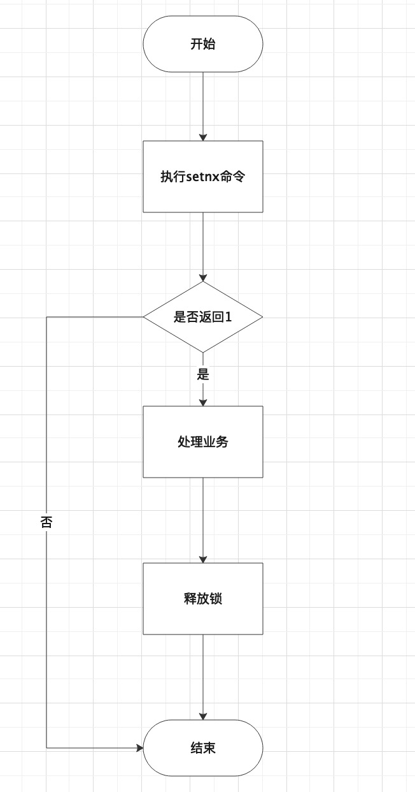
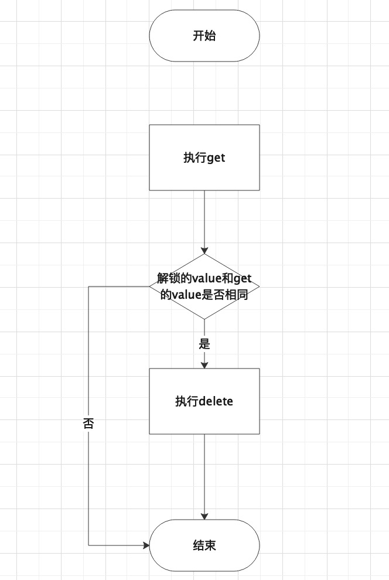

# 基于Jedis的Redis分布式锁实现

## 目标

- 我使用redis分布式锁场景
- 客户端选型
- redis分布式锁流程图
- 代码实现
- 总结

## 我使用redis分布式锁场景

&nbsp; &nbsp; 公司一个核心交易处理服务是消费MQ进行交易入库处理，该交易在入库时会进行更新交易某一个数据值，由于该交易生产者会同时生产某一条交易的两条数据，这就导致了在不处理并发的时候更新数据产生并发问题，导致数据最终不一致，为此我们打算在不改造生产者的时候在消费者进行处理，就是同时只能有一条交易被处理更新数据，然后在获取锁失败后交给交给MQ做重试处理，并且这部分交易是批量生产，并且经过对数据量的评估在规定的时间内经由消费失败MQ重试的过程中也会按时消费完数据。这里因为服务是集群部署，所以使用`redis`做分布式锁。

## 分布式锁技术选型

&nbsp; &nbsp; 目前使用`redis`做分布式锁主要几种方式，一种是基于`redssion`实现的分布式锁和红锁，还有一种是自己手动基于`setnx`命令或者`watch`命令实现的分布式锁，手动实现可以基于`jedis`使用命令和`lua`脚本配合实现，还有就是使用`spring-redis`的redisTemplate实现；由于在我的项目中已经引用了`jedis`客户端并且有使用，所以在不引入其他客户端的情况下，我这里直接选用了`jedis`+命令+`lua`脚本的方式自己实现了分布式锁

## 分布式锁流程图

- 获取锁

 

- 释放锁

 

## 代码实现

- 获取锁

```
public class RedisUtil {

    /**
     * 设置锁成功
     */
    private static final String LOCK_SUCCESS = "OK";
    /**
     * 原子设置参数，如果不存在设置锁
     */
    private static final String SET_IF_NOT_EXIT = "NX";
    /**
     * 带有过期时间参数 EX-单位是秒
     */
    private static final String SET_WITH_EXPIRE_TIME = "EX";
    /**
     * 释放锁成功
     */
    private static final Long RELEASE_SUCCESS = 1L;
    /**
     * redis分布式锁使用的db 1-db1
     */
    private static final int DB_INDEX = 1;

    /**
     * 生成分布式锁key 所用字符串 业务类型
     */
    private static final String BUSINESS = "ACC";
    /**
     * 生成分布式锁key 所用字符串 字段名
     */
    private static final String FIELD_NAME = "CARD_NUM";

    /**
     * 获取分布式锁
     * @param jedis jedis客户端连接
     * @param lockKey 锁-key
     * @param requestId 锁-value（用于释放锁）
     * @param expireTime 锁过期时间
     * @return
     */
    public static boolean tryLock(Jedis jedis, String lockKey, String requestId, int expireTime) {
        jedis.select(DB_INDEX);
        String result = jedis.set(lockKey, requestId, SET_IF_NOT_EXIT, SET_WITH_EXPIRE_TIME, expireTime);
        if (LOCK_SUCCESS.equals(result)) {
            return true;
        }
        return false;
    }

    /**
     * 生成分布式锁key 所用的唯一值
     * @param keyValue 分布式锁key 所用的唯一值
     * @return 分布式锁key
     */
    public static String getLockKey(String keyValue) {
        return BUSINESS + ":" + keyValue + ":" + FIELD_NAME;
    }
}
```

- 释放锁

&nbsp; &nbsp; 与加锁不同，释放锁需要获取key对应的value然后与传入的value进行比较，这么做的目的是检查要释放的锁是不是自己加上去的锁，这就意味着这不是一步操作，不是一步操作就有原子性问题，解决这个问题有两个，一个是使用redis的事务，保证get和delete在同一事务中操作，还有一种方式是使用lua脚本，lua脚本能够保证命令原子性执行，这里我选择了第二种方式，因为这种写起来更简单些，但是需要了解一点lua的知识，具体代码如下，核心的解锁代码是`if redis.call('get', KEYS[1]) == ARGV[1] then return redis.call('del', KEYS[1]) else return 0 end;`，这里要注意redis从2.6版本开始支持lua脚本，所以在使用的时候要注意redis版本。

```
    /**
     * 释放分布式锁
     * @param jedis jedis客户端连接
     * @param lockKey 锁-key
     * @param requestId 锁-value（用于释放锁）
     * @return
     */
    public static boolean releaseLock(Jedis jedis, String lockKey, String requestId) {
        // Lua脚本（2.6.12版本以后redis客户端支持Lua语言）
        // 首先获取锁对应的value值，检查是否与requestId相等，如果相等则删除锁(解锁)
        jedis.select(DB_INDEX);
        String script = "if redis.call('get', KEYS[1]) == ARGV[1] then return redis.call('del', KEYS[1]) else return 0 end;";
        Object result = jedis.eval(script, Collections.singletonList(lockKey), Collections.singletonList(requestId));
        if (RELEASE_SUCCESS.equals(result)) {
            return true;
        }
        return false;
    }
```

## 总结

&nbsp; &nbsp; 至此，通过使用`jedis`客户端自定义实现的redis分布式锁就讲完了，并且在我的项目中使用该实现成功的实现了我的需求，我是根据我得业务场景和项目集成进行了技术选型，如果是一个新项目我可能就会选择redssion，因为redssion的解决方案是经过大规模生产验证的，更可靠些，接下来会写一下redssion的分布式锁实现和其核心源码分析。