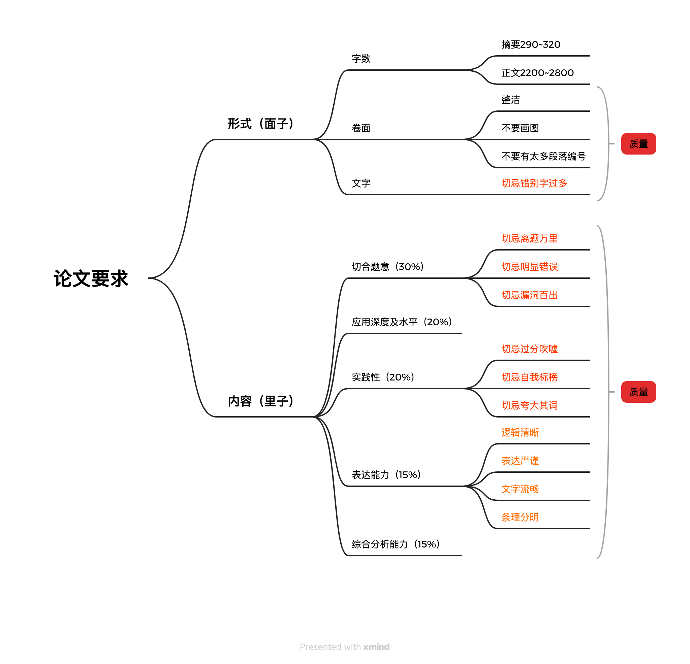
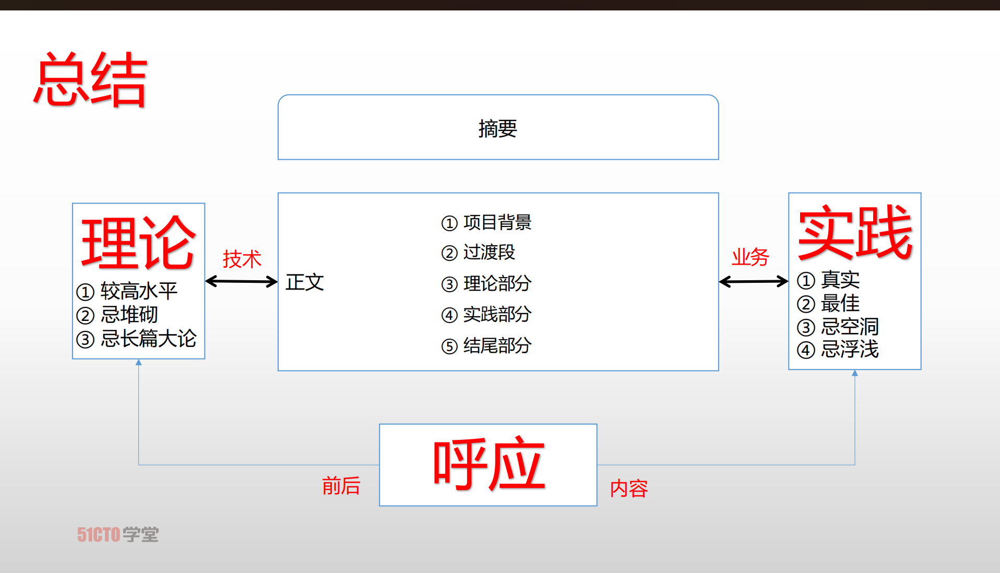

# 论文题技巧及历年出题规律分析

### 论文题技巧

##### 1、论文题考察目的

- 考察是否具备实践经验
- 考察分析问题得能力
- 考察解决分体的能力
- 考察考生的表达能力

##### 2、论文要求

##### 3、不及格红线

- `虚构`情节、文章中有较严重的`不真实`或者`不可信`的内容出现的论文；
- `没有`项目开发的`实际经验`，通篇都是浅层次的`纯理论`的论文；
- 所讨论的内容与`方法过于陈旧`，或者项目的`水准非常低下`的论文；
- 内容同不切题意，或者内容相对很空洞，基本上是泛泛而谈且没有较深入体会的论文；
- 正文与摘要的篇幅过于短小，如正文少于1200字；
- 文理很不通顺，错别字很多，调流思路不清晰，自己过于潦草等情况相对严重的论文。

##### 4、论文框架

###### 4.1、【摘要290~320字】

1. 项目介绍：时间、项目名、项目主要功能简述、作者角色及工作内容
2. 系统设计方面/项目技术的简介：正文理论和分论点的精化或结合题目要求简单介绍论文采用什么技术、方法、措施、手段等，解决了什么问题，是正文理论与实践的浓缩
3. 项目效果：实践效果

注意：摘要语言要精炼，概括，阐述要综合，浓缩，不宜详细展开，好的摘要是成功的一半。摘要不建议分段。

###### 4.2、【项目背景400~500字】

1. 背景：项目由来/缘起/定位/目标，主要介绍项目的前提和诞生的背景，注意戴帽子要适合而止
2. 项目主要内容：简要介绍，不要摘要中简单的重复，应比摘要稍详细，注意5W2H的次序，可根据行为而定

When：何时，近三年项目，工期建议半年至一年

Where：何地，脱敏，某省，某市

Who：甲方，乙方，作者，名称脱敏，乙方称“我司、我单位、我公司等”

Why：为何立项，项目建设目的

What：项目名，项目内容，作者的工作内容

How much：项目规模，项目预算，不宜太小，不宜太大，没有或不清楚的不要写

How：作者采用的技术，框架，方法，工具，措施等

###### 4.3、【过渡50~100字】

​    为了避免上下文语义断层，需要适当加入过滤语句，起承上启下作用。在项目背景介绍完毕，作者需要识别出项目的关键需求、项目特征、项目约束等主客观因素，剔除满足这些因素需采取哪些理论、技术、措施、技术、工具、手段、从而引出下文。

1. 关键需求：需求、项目特征、约束
2. 承上启下，项目介绍-》过渡-》理论-》过渡-》实践

###### 4.4、【理论/分论点400~600字】

1. 紧扣题干要求：一般是对题干2的应答，注意要写成一段我，但需要有明显的标识，分论点之间分号隔开
2. 逐点应答：分论点的基本概念，基本原理，应用场景，简单举例即可，无关内容不要赘述
3. 惜字如金：注意控制字数，不要挤占实践部分

###### 4.5、【实践部分1000~1200字】

1. 结构上：与理论部分相呼应，最好保持一致
2. 分论点标题：最好拟一个小标题，注意小标题的行文格式，标语采分
3. 分论点内容：先识别问题，阐述why，然后分析、设计、解决问题，阐述how，在阐述效果

###### 4.6、【结尾300~400字】

1. 项目效果：呼应论点，上线，稳定运行，获得好评，下一步计划...
2. 存在的问题：阐述一个小问题，且已解决的
3. 收获/反思/复盘：甲乙方、个人、团队

