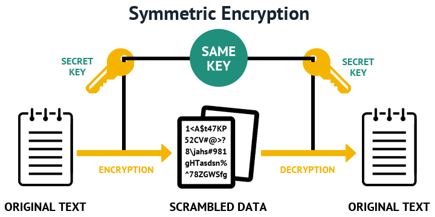
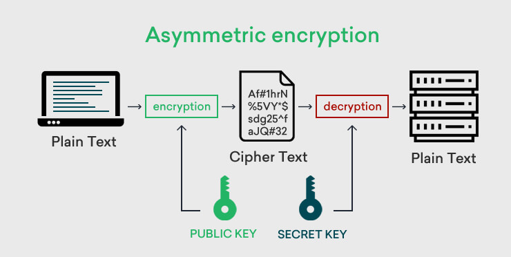
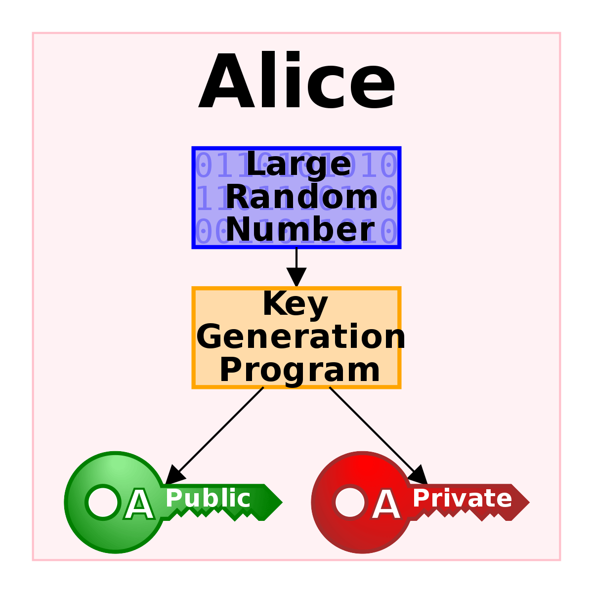
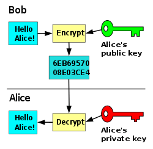
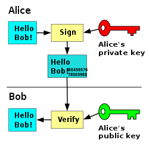

# 信息安全 - 对称加密与非对称加密 <!-- {docsify-ignore-all} -->

&nbsp; &nbsp; 作为信息安全领域的基石，数据加密算法你或多或少应该用过。可你知道数据加密分成`对称加密 ( symmetric encryption )`和`非对称加密 ( asymmetric encryption )`两种吗？对称加密与非对称加密有什么区别？各自适用于什么场景？

## 对称加密

&nbsp; &nbsp; 在对称加密中，我们需要维护一个`密钥 ( secret key )`。数据加密者根据加密算法用`密钥`对`明文`进行加密，得到不可读懂的`密文`。数据解密者根据加密算法，用同样的`密钥`对密文进行解密，得到原来的明文。

如上图，在加密和解密的过程中，我们用到了同一个的 密钥 ，这样就是 对称加密算法 中对称一词的由来。 那么，对称加密算法都有哪些呢？各自有什么特点呢？

- **AES：**高级加密标准，新一代加密算法标准，速度快，安全级别高；
- **DES：**数据加密标准，速度较快，适用于加密大量数据，但安全性较弱；
- **Blowfish：**使用变长密钥，运行速度很快，非专利算法，没有使用限制；

表-1 对称加密算法安全级别

安全级别 ( Security Level ) | 工作因素 ( Work Factor ) | 算法 ( Algorithm )
---------:|----------:|---------:
薄弱 ( Weak ) | O(264) | RC4
传统 ( Legacy ) | B2 | C2
基准 ( Baseline ) | O(280) | 3DES
标准 ( Standard ) |	O(2128) | AES-128
较高 ( High ) |	O(2192) | AES-192
超高 ( Ultra ) | O(2256) | AES-256

根据安全性，对称加密算法应该优先选择 AES ，位数尽可能大，例如 AES-256 。

由于所有参与者共享密钥，只要一人造成泄露便万劫不复，这是对称加密最大的弱点。 因此，对称加密密钥分发、保管必须严格控制，以免泄露。

## 非对称加密

&nbsp; &nbsp; 为解决对称加密共享密钥引发的问题，计算机科学家发明了一种更神奇的加密方式。 这种加密方式需要两个密钥，一个是`公钥 ( public key )`、一个是`私钥 ( private key )`。 私钥由自己保管，不能泄露；公钥分发给任何需要与自己通讯的参与者，无须保密。

&nbsp; &nbsp; 数据加密者根据加密算法，用公钥对明文进行加密，得到不可读懂的密文。 数据解密者根据加密算法，用私钥对密文进行解密，得到原来的明文。

&nbsp; &nbsp; 由于加密环节和解密环节所用的密钥不同，因此这种加密方式也称为`非对称加密 ( asymmetric encryption )`。 由于公钥可以对外公开，也就不用刻意保护了。

&nbsp; &nbsp; 此外，如果数据用私钥进行加密，那么只有用公钥才能解密。 由于公钥是公开的，这种机制一般不用于加密数据，而用于对数据进行`签名`。

### 非对称加密有哪些典型的应用场景呢？接下来，我们以一个虚构故事展开讨论：

&nbsp; &nbsp; Alice是一位帮会大佬，手下有许多小弟，Bob是其中一位。 小弟们在外行动，定期汇报成果，接受指令。 为保证通讯安全，Alice通过非对称加密算法，打造了一对密钥，Alice 小心翼翼地保管着私钥，并把公钥分发给Bob等小弟们。

#### 数据加密

小弟Bob需要向Alice汇报工作，Alice不希望汇报内容被第三方获悉，包括其他小弟。 这时，Bob用Alice给的公钥对汇报数据进行加密，再差人送给Alice。Alice收到Bob送来的数据后，用自己手中的私钥一解，就知道Bob说啥了。

由于用公钥加密的数据只有私钥能解，而私钥只有Alice有，因此汇报内容不可能被第三方知晓。 换句话讲，只要私钥不泄露，加密数据便不会被其他人获悉。

#### 数据签名

Alice给Bob下达行动指令，内容虽然可以公开，但Alice必须防止不法之徒伪造指令。

为此，Alice先借助类似`MD5`或`SHA`的哈希算法，为指令文本计算`摘要`。 同样的文本生成的摘要一定相同；不同的文本，哪怕只差一个字母，生成的摘要一定不同。

接着，Alice 用私钥对`摘要`进行`加密`，并将加密结果作为`签名`与指令一起发给Bob。

Bob接到指令后，用公钥对签名进行解密，得到Alice生成的`摘要`。 然后，他用同样的算法，重新为指令文本计算`摘要`。如果两个`摘要`吻合，便可确定指令是Alice下达的。

其他别有用心的第三方，或许已经掌握了摘要计算方法，但苦于缺少私钥，也就没有办法伪装成Alice，向Bob下达指令了。

这就是非对称加密的另一个典型使用场景 —— 数据签名 ，可归纳为两步：

1. 用私钥对数据进行签名；
2. 用公钥对数据进行验证；