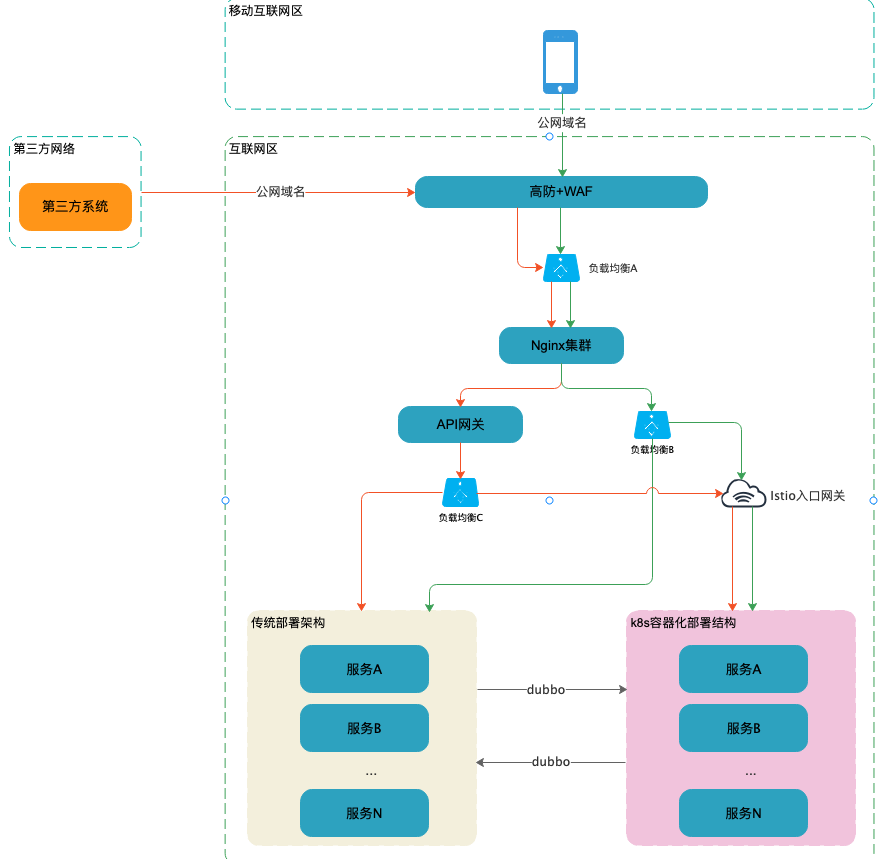
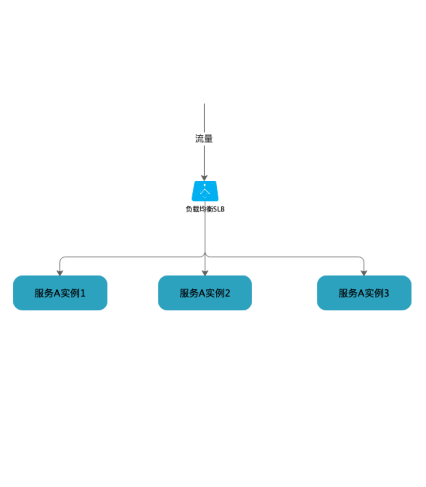
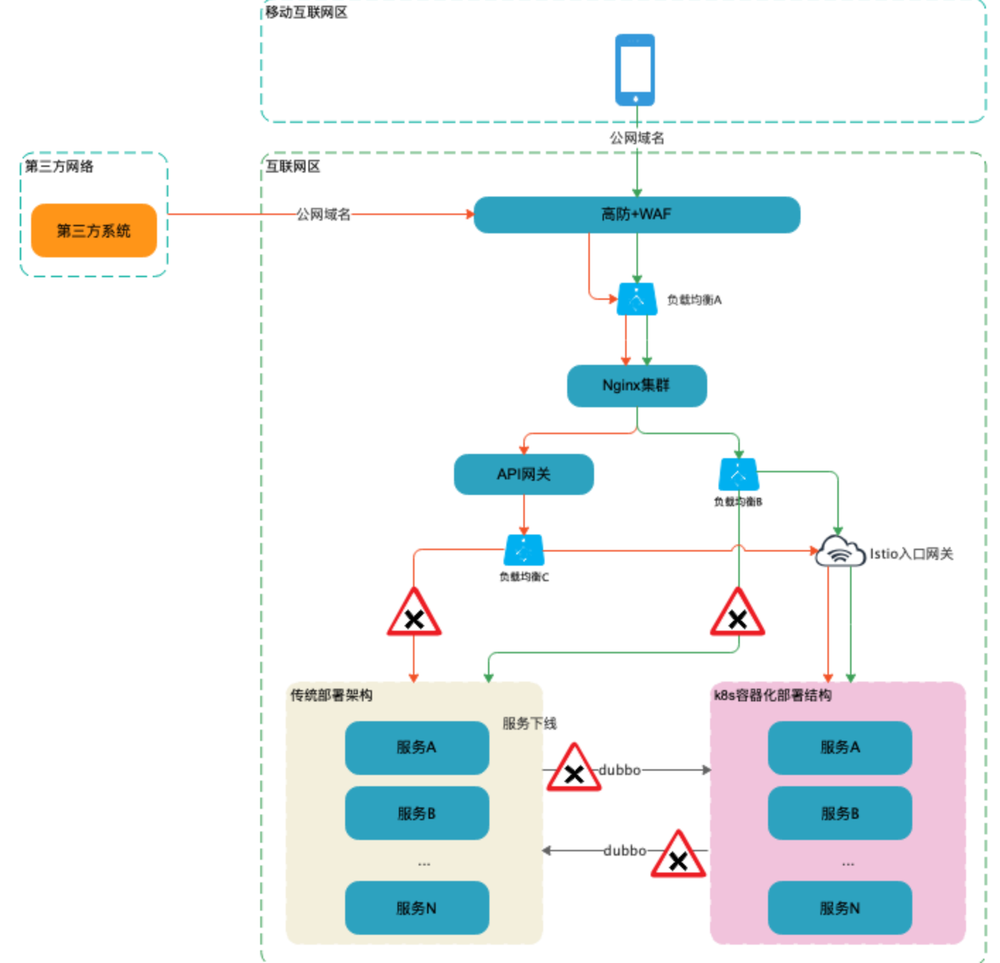

# 公司传统微服务架构切换Service Mesh架构部署方案总结 <!-- {docsify-ignore-all} -->

## 系统架构切换背景

&nbsp; &nbsp; 公司系统既有架构是传统的微服务架构，服务的部署方式也是传统的系统部署方式，并没有进行容器化部署；使用`Dubbo`作为微服务中间件，`Zookeeper`为系统的注册中心，同时使用`Elastic JOB`分布式定时任务中间件进行分布式任务处理；

&nbsp; &nbsp; 随着云原生技术的快速发展，公司系统架构也开始着手进行调整，从技术上看云原生架构可以使系统拥有更好的伸缩性，更好的观测性，更灵活的发布策略，更精细的流量控制等等，可以让开发人员更专注于业务逻辑的开发，让开发人员从一些分布式的控制逻辑上摆脱出来，从而提高生产力；从公司成本角度看，云原生架构，尤其是通过k8s对系统进行容器化部署管理能够降低硬件成本；所以基于这两点出发，公司决定逐步的对公司系统架构切换成容器化，Service Mesh的形式。

## 服务划分

&nbsp; &nbsp; 本篇主要介绍下公司某一个独立业务的服务架构由传统的部署方式切换成容器化部署，暂不介绍服务全部去掉`Dubbo`转成`Service Mesh`的方案。

&nbsp; &nbsp; 首先该业务的服务可分成以下两个类型的服务：

- **接口服务（Dubbo、Http）**：纯接口服务，分成两类接口，一类是Http协议的接口，一类是Dubbo接口，这两类接口的应用场景有些差异，Http接口主要是提供给前端（APP，H5，第三方），Dubbo接口主要用于系统内部服务之间的调用

- **分布式定时任务服务（JOB）**：分布式定时任务服务是分片处理海量数据的服务

## 切换方案

#### 系统架构

&nbsp; &nbsp; 制定架构部署切换方案之前，我们先简单画一个系统的架构图，该架构图是公司系统实际架构图的简化版，旨在为了说明切换方案。

注：该架构所用组件均为我司实际生产中应用，不一定符合其他公司架构。

&nbsp; &nbsp; &nbsp; &nbsp; &nbsp; &nbsp; &nbsp; &nbsp; &nbsp; &nbsp; &nbsp; &nbsp; &nbsp; &nbsp; &nbsp; &nbsp; &nbsp; &nbsp; &nbsp; &nbsp; &nbsp; &nbsp; &nbsp; &nbsp; &nbsp; &nbsp; &nbsp; &nbsp; &nbsp; &nbsp; &nbsp; &nbsp; &nbsp; &nbsp; &nbsp; &nbsp; 图一

&nbsp; &nbsp; 整个系统架构中的流量来源主要有两个，分别是APP和第三方的系统，架构图中用两根不同颜色的线来标识流量来源；橘色的线代表从第三方系统流入的流量，绿色的线代表从APP流入的流量，两个系统架构之间的流量通过`Dubbo`进行调用，因为两个系统架构所使用的`Dubbo`注册中心相同且两套架构所处的网络环境相同，所以，对于`Dubbo`服务来说的话两个系统架构之间的调用是完全没有问题的。

&nbsp; &nbsp; 从架构中可以看到除了应用系统之外还有几个组件，如下：

- **高防 WAF：** 安全组件，使用的阿里云产品
- **负载均衡：** 阿里云产品（SLB）
- **Nginx集群：** 公司自建的Nginx集群
- **API网关：** 公司自研API网关
- **Istio入口网关：** Service Mesh架构的流量入口网关。

注：我司系统架构基于阿里云构建，所以很多组件直接用的阿里云产品。

#### 配置中心切换

&nbsp; &nbsp; 我司的配置中心使用的是`Zookeeper`，许多业务配置，系统配置，接口地址配置都是使用的配置中心，所以在系统架构切换的过程中，我们应该做到配置隔离；即原架构使用1.0版本的配置，新架构使用2.0版本的配置，不同版本的配置主要差异在系统配置和接口地址的配置，因为这两种配置主要影响了不同架构系统的流量切换。

&nbsp; &nbsp; 所以在系统应用部署前我们先按照1.0版本的配置生成一份2.0版本的配置，然后根据系统具体情况，将需要更改成新配置的配置项进行配置修改。至此，配置中心已完成系统架构切换的准备了。

#### 系统负载均衡介绍

&nbsp; &nbsp; 在系统切换之前先着重介绍下该架构所使用的负载均衡，公司的接口服务有两种协议，一种是`Dubbo`一种是`Http`，`Dubbo`没有使用`阿里云SLB`，`Http`接口使用的负载均衡是阿里云的SLB；

&nbsp; &nbsp; 针对上面系统负载均衡的分析，容器化部署架构中`Dubbo`接口的服务的部署相当于是直接扩容；负载均衡，注册中心，RPC调用等等分布式语义的能力全有`Dubbo`提供；`Http`服务使用的负载均衡在架构边缘和架构内是不一样的，对于`Istio`入口流量网关处的流量接入需要修改负载均衡A（SLB）和负载均衡B（SLB）的负载配置即可完成流量切换，对于架构内部的服务之间的负载均衡就不需要使用阿里云SLB了，使用`Service Mesh`进行流量管理即可。

#### 容器化架构系统部署

&nbsp; &nbsp; 配置中心2.0版本的配置准备好后就可以进行容器化架构部署了，我们在系统架构的切换过程中，两个部署架构是要并存一段时间的。基于之前的负载均衡介绍，我们可以知道，直接进行系统的部署是没有问题的，对于`Dubbo`接口服务和`分布式定时任务`服务来说部署的服务在整个架构中相当于是服务扩容了；对于`Http`接口服务来说存在两种情况，第一种是容器化架构内部之间调用的`Http`接口服务相当于是扩容，第二种在架构边缘的`Http`接口服务相当于部署成功并未接入流量。这其中有一点与要注意，那就是传统架构中的服务和容器化架构中的服务之间是不能够通过`Http`协议进行通信的，如果通过ip+port其实是可以通信，但是容器化部署了，服务的不应该这么调用，所以姑且这两个架构之间`Http`接口不能通信。

&nbsp; &nbsp; 上面所说的两个架构之间`Http`接口不能通信我这里详细解释下，传统部署架构的`Http`调用是通过ip+port方式 ，只不过是经过的SLB的ip，SLB后边挂载着部署服务器ip，架构如下图：

&nbsp; &nbsp; `Service Mesh`架构的`Http`接口负载均衡则不是上边的方式，`Service Mesh`架构的`Http`接口通过`k8s`的`Service`进行的服务发现，通过`Istio`进行的负载均衡处理，包括其他分布式语义，这里不过多介绍。

&nbsp; &nbsp; 服务逐步部署调整流量并观察日志，无问题的话逐步的将容器化架构的服务全部都部署完；最终并行阶段的架构如上面的图一所示。

#### 入口流量切换

&nbsp; &nbsp; 在并行结构运行一段时间后，系统并没有问题，这时我们就可以逐步的将入口流量切换切到容器化架构中，说明下我们这边的处理流程，我们这边是在白天的时候完成了容器化架构部署和架构并行阶段的测试，然后在晚上低峰阶段进行入口流量的切换及测试工作，最后在完成测试后在逐步的将传统架构的流量关闭，入口流量的切换只需要调整负载均衡B和负载均衡C的流量配置即可。

&nbsp; &nbsp; 至此整个系统就从传统架构切换到容器化架构了，切换后的架构如下图：

## 总结

&nbsp; &nbsp; 本篇主要介绍了公司实际系统的架构切换，系统架构由传统架构切换成容器化部署架构，本文主要介绍我们公司在做此类型部署架构切换的思路并不是最优的解决方案也并不一定适用于所有系统。除此之外，本篇并没有介绍如何将`Dubbo`框架去掉全面的拥抱`Service Mesh`的方案，该方案会后续介绍；之所以先切换到如今这个半成品的`Service Mesh`架构中是考虑到各种因素，包括工期，测试成本，运维成本等，技术上并没有任何问题。