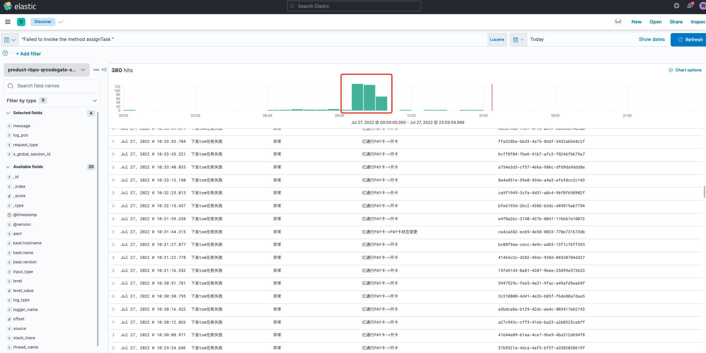
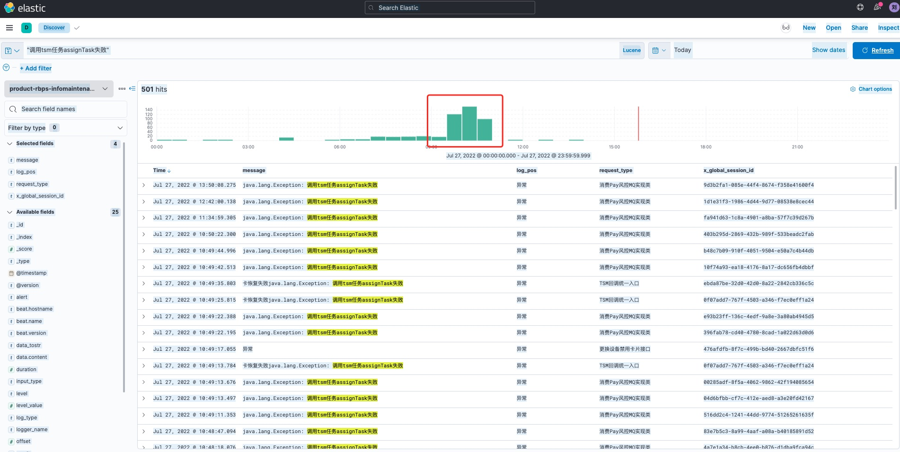
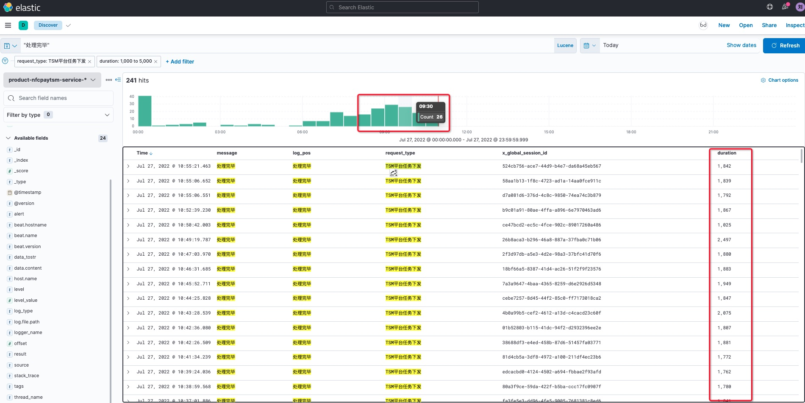
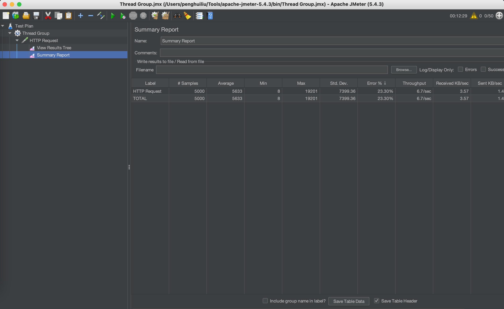
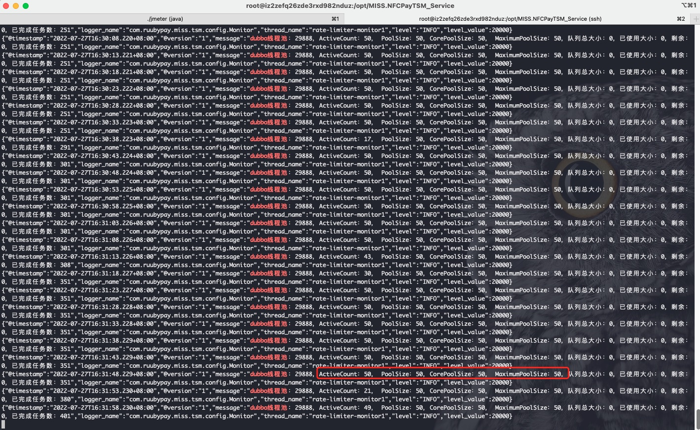
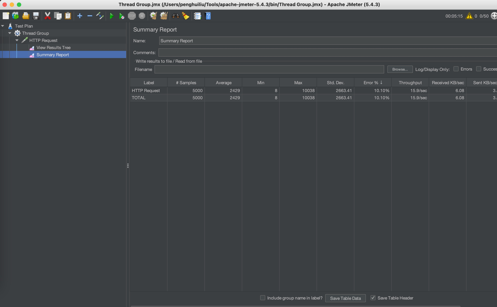

# TSM接口超时问题 <!-- {docsify-ignore-all} -->

## 现象：

    TSM对内的Dubbo接口大量超时，导致上游MISS.RBPSQRCodeGate_Service，MISS.RBPSInfoMaintenance_Service服务接口超时。

- MISS.RBPSQRCodeGate_Service服务调用TSM超时情况


- MISS.RBPSInfoMaintenance_Service服务调用TSM超时情况


问题分析：

    分析MISS.NFCPayTSM_Service服务“TSM平台任务下发”接口调用情况，出现了一些“Read Time out”和响应时间，经过分析发现调用复旦微有超时和接口响应时间长的情况，除此之外TSM系统调用复旦接口的配置参数也不很合理，上游服务调用TSM系统接口的一些配置也不是很合理。

## 压测复现

> MISS.NFCPayTSM_Service：dubbo线程数50

> 上游服务：failover策略，超时时间19s

> MISS.NFCPayTSM_Service模拟接口调用时间长，10%调用耗时60s，70%正常调用，20%调用耗时2s，上游有23.3%的超时情况



下面的图模拟调用复旦超时和MISS.NFCPayTSM_Service的dubbo线程池监控和jstack日志，可以看到dubbo线程池很快就被打满了，所有的Dubbo Server线程都是RUNNABLE

> MISS.NFCPayTSM_Service：dubbo线程数400 限流400

> 上游服务：failfast策略，超时时间10s

> MISS.NFCPayTSM_Service模拟接口调用时间长，10%调用耗时60s，70%正常调用，20%调用耗时2s，上游有10.1%的超时情况，超时情况减少了一倍多

## 结论

### MISS.NFCPayTSM_Service服务

1. Dubbo service配置：threads=50 accepts=200，这两个参数意思是dubbo服务端线程池为50个，超过200个并发会被限流，调大threads可以降级超时数量
2. HttpClient配置：Read Timout配置60s，Connect Timeout配置35s，Connection Request Timeout配置35是，超时时间过长；
3. MISS.NFCPayTSM_Service应具备熔断能力

### 上游服务

上游服务的Dubbo配置优化

1. 容错策略：推荐使用FailfastCluster策略，该策略为快速失败，目前上游服务都是Dubbo默认的FailoverCluster，该策略是失败转移，会重试其他服务器，该策略调用的写接口必须幂等，并且重试会带来更大的延迟。

2. Dubbo接口调用超时配置：结合TSM Server端的接口评估超时时间。

