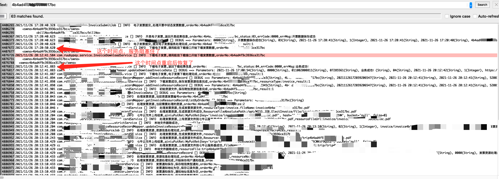
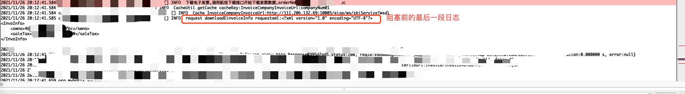
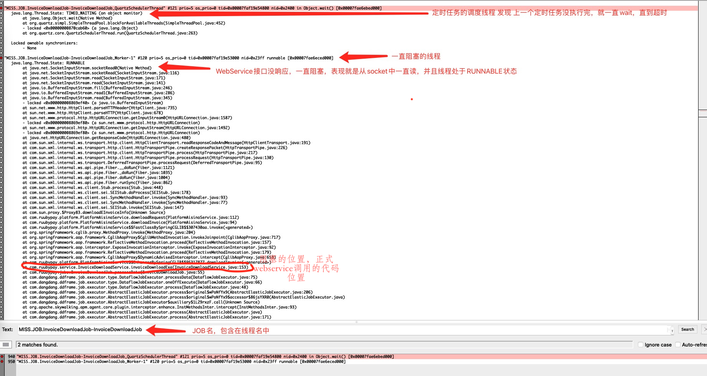

# 记一次因WebService无响应导致线程阻塞 - 生产问题定位 <!-- {docsify-ignore-all} -->


## 前言

&nbsp; &nbsp; 公司有一个开具发票的服务，线上跑一段时间就出问题，该服务是`定时任务`类型的程序，问题的症状就是定时任务貌似不执行了，无法正常处理业务了，需要重新启动才能够继续提供服务，由于这个服务并不是我负责的，也不是我组员负责的，一开始并没有太多关注，直到线上一次又一次的出问题仍没有得到解决时，我向负责的同学要了发生异常的业务日志和当时的jstack和jmap日志，并默默的将代码clone下来打算研究一番。

## 问题排查流程

&nbsp; &nbsp; 这里我主要还是想记录一下排查问题的一个流程，首先介绍一下服务的业务吧，该服务是负责去第三方开具发票机构开发票的一个服务，该服务完全提供的是定时任务的服务，大致可以分为，提交开发票定时任务和下载发票定时任务，出问题的定时任务就是下载发票定时任务。

&nbsp; &nbsp; 大致看了一下业务日志和堆转储的dump文件的情况，已经能排出堆内存溢出导致的，至于其他内存方面问题，我也确信这个服务并没有用到堆以外的内存，并且该服务下载发票定时任务出现不执行的时候，其他的定时任务还是可以执行的，说明服务并没有宕掉。

&nbsp; &nbsp; 从现象上看像是阻塞住了，一直没有释放某些资源，这个服务不是多线程，是个单线程任务，所以，我排查的方向还是先排查业务日志，通过业务日志，将导致业务阻塞的代码范围尽可能的缩小，然后在进行分析。

&nbsp; &nbsp; 下面是该服务的业务日志，可以看到以下几个问题：

- 服务在`17:20:50`的时候停掉了
- 服务在`20:12:41`重启后可以提供了服务




&nbsp; &nbsp; 该服务有个很严重的问题，就是开发人员开发时并没有对日志进行增加`tracaId`这种用于链路追踪的ID，所以业务日志追踪起来也不方便，好在这个程序是单线程操作，并且处理的数据量也不很海量，所以通过`17:20:50`的`下载电子发票,调用航信下载接口开始下载发票数据`这段日志还是能在其前后继续分析的，所以这里通过这段日志，我也找到了阻塞前所打印的最后一段日志，如下图：



&nbsp; &nbsp; 通过上面的日志可以定位到代码了，代码如下：

&nbsp; &nbsp; 可以看到阻塞在了`String responsexml = downloadRequest(requestxml, requestUrl);`这段代码了，这段代码我就贴出来，这段代码处理的业务就是从第三方下载发票，分析到这里基本问题定位还是在调用第三方的时候阻塞，这里的远程调用方式就是WebService，为了验证我的猜想，我通过jstack看一下线程的情况，因为如果阻塞，线程会一直在这个wait或者runnable。

```java
    @Override
    public ReturnDownData downloadInvoice(DownInvoiceModel downloadInvoiceInfo, String requestUrl) {
        ReturnDownData downReturnData = null;
        try {
            String requestxml = Function.convertToXml(downloadInvoiceInfo);
            logger.info("request downloadEinvoiceInfo requestxml:{}",requestxml);
            // 这是最后一条日志
            logger.info("request downloadEinvoiceInfo requestUrl:{}",requestUrl);
            String responsexml = downloadRequest(requestxml, requestUrl);
            // 这条日志就不打印了
            logger.info("response downloadEinvoiceInfo responsexml:{}",responsexml);
            //解析下载发票返回的xml
            downReturnData = Function.downParsexml(responsexml);
            //logger.info("response downloadEinvoiceInfo responsexml:{}", downReturnData.toString());
        } catch (Exception e) {
            logger.info("下载电子发票,向上游发票下载接口发起请求异常,e:{}",  e.getMessage(), e);
        }
        return downReturnData;
    }
```

&nbsp; &nbsp; 通过线程日志，我们也能定位到阻塞的代码，果真，验证了猜想，webservice的调用没有响应，程序就阻塞在那了



&nbsp; &nbsp; 接着查看WebService的调用代码发现，的确没有设置连接超时和响应超时，修改代码增加超时时间上线，解决问题，我们使用的JAX-WS进行的webservice调用，设置超时时间代码如下：

```java
    public String downloadRequest(String strxml,String requestUrl)  {
        String returnxml = "";
        try {
            AsyncInvoiceServiceService asyncInvoiceServiceService = new AsyncInvoiceServiceService(new URL(requestUrl));
            ZKInvoiceService zkInvoiceService = asyncInvoiceServiceService.getAsyncInvoiceServicePort();
            BindingProvider bindingProvider = (BindingProvider) zkInvoiceService;
            Map<String, Object> requestContext = bindingProvider.getRequestContext();
            // 连接超时
            requestContext.put("com.sun.xml.internal.ws.connection.timeout", 10 * 1000);
            // 请求超时
            requestContext.put("com.sun.xml.internal.ws.request.timeout", 15 * 1000);
            returnxml = zkInvoiceService.downloadEInvoiceInfo(strxml);
        } catch (Exception e) {
            logger.info("向上游发票下载接口发起请求异常,e:{}", e.getMessage(), e);
        }
        return returnxml;
    }
```