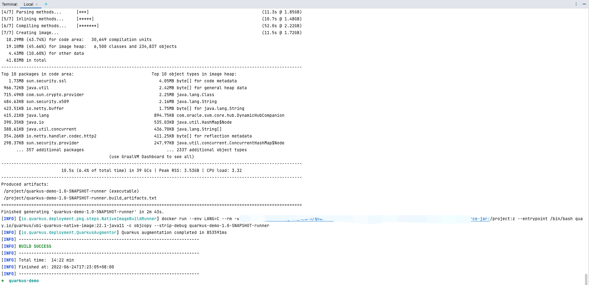

# Quarkus - 构建一个原生可执行文件 <!-- {docsify-ignore-all} -->


## 先决条件

- 大概15分钟

- 编辑器

- 安装GraalVM，并正确配置

- Apache Maven 3.8.1+

- 可以工作的容器 (Docker或者Podman)

- 一个 C语言工作开发环境

- `Quarkus`应用程序代码

    支持在C语言中进行原生编译

    拥有一个C语言工作开发者环境意味着什么？

    在Linux上，你将需要GCC，以及glibc和zlib头文件。常见发行版的例子：

    ```powershell
    # dnf (rpm-based)
    sudo dnf install gcc glibc-devel zlib-devel libstdc++-static
    # Debian-based distributions:
    sudo apt-get install build-essential libz-dev zlib1g-dev
    ```
    XCode在macOS上提供了必要的依赖性：

    ```powershell
    xcode-select --install
    ```

    在Windows上，你将需要安装 Visual Studio 2017 Visual C++构建工具

## 安装配置GraalVM

参考[实现第一个Hello World](/docs/blog/quarkus/hello-world.md)

## 安装native-image工具

```powershell
➜ gu install native-image
```

## 制作一个原生可执行文件

我们应用程序的原生可执行文件将包含应用程序代码、所需的库、Java API和一个缩小版的虚拟机。较小的虚拟机基础提高了应用程序的启动时间和最小的磁盘占用。


在应用程序工程目录下执行`maven`制作可执行文件命令

```powershell
➜ ./mvnw package -Dnative
```

制作结果：



在target文件夹下生成可执行文件`quarkus-demo-1.0-SNAPSHOT-runner`，执行该文件即可启动应用程序


