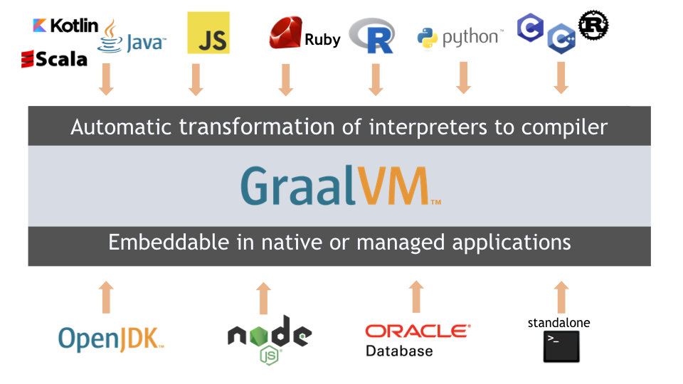
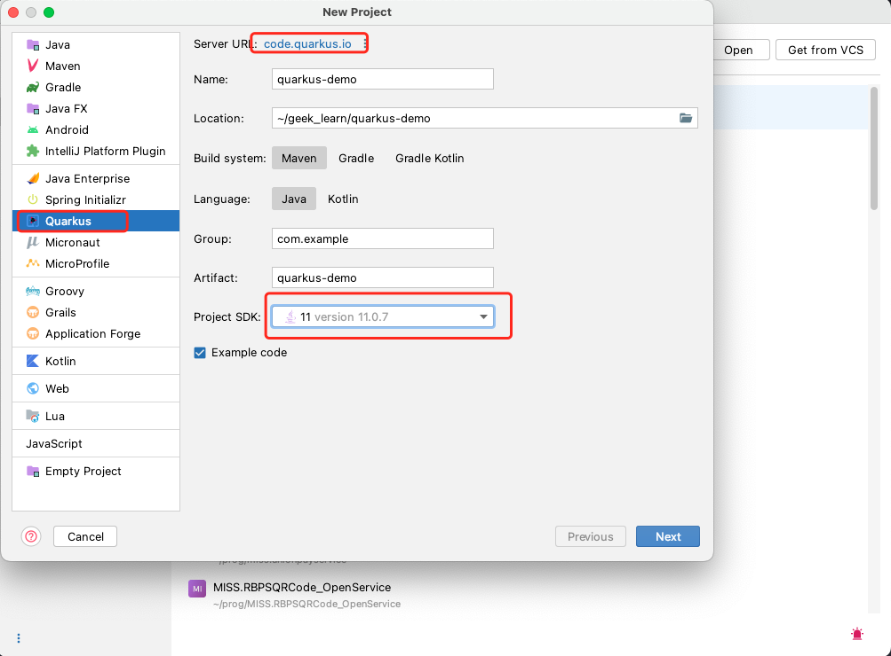
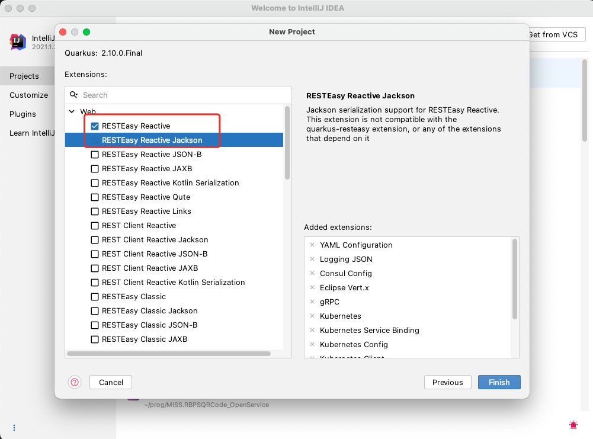
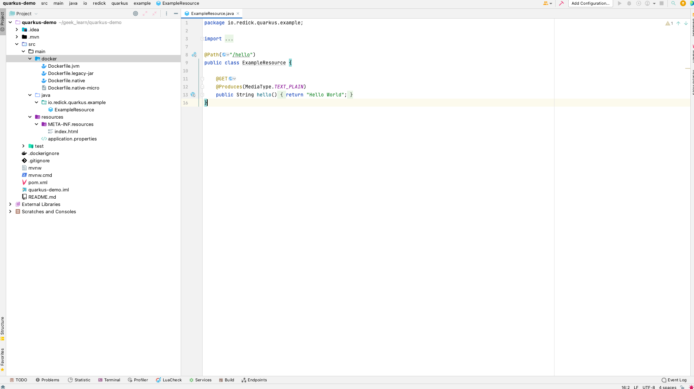
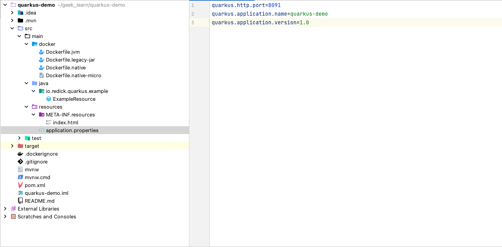
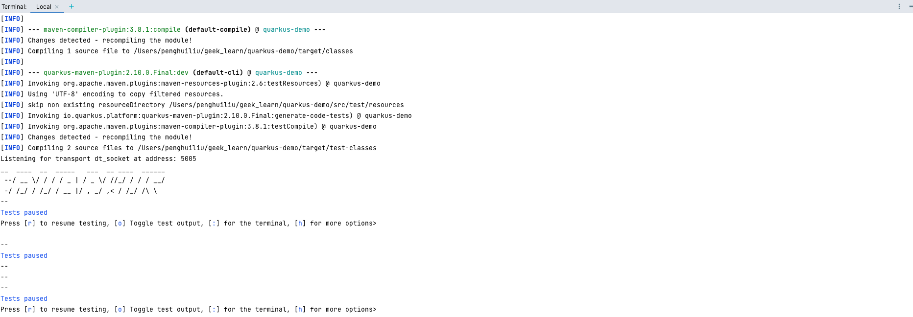
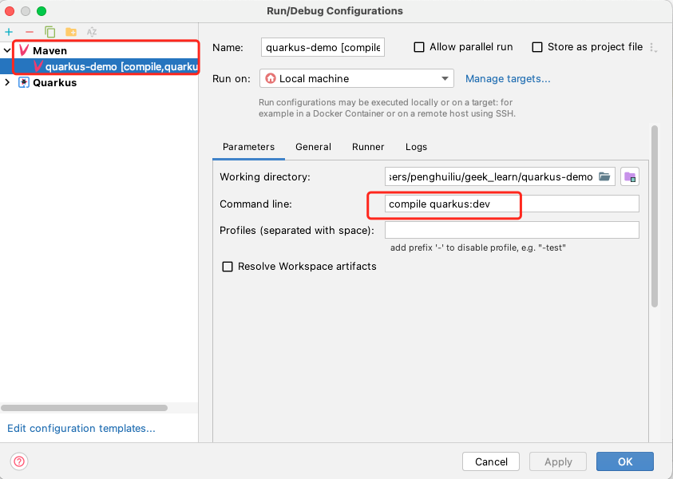

# Quarkus - 实现第一个Hello World <!-- {docsify-ignore-all} -->

## 目标

- 安装`GraalVM`
- 创建项目

## 安装GraalVM

### GraalVM简介

&nbsp; &nbsp; `GraalVM`是一种高性能的虚拟机，它可以显著的提高程序的性能和运行效率，非常适合微服务。其设计初衷是实现可以运行不同语言（Java、JavaScript、基于LLVM的语言（例如C和C ++）以及其他动态语言）编写的应用程序。它消除了不同编程语言之间的隔阂，并实现了多语言共享运行时的互操作性。它可以独立运行，也可以在OpenJDK，Node.js或Oracle数据库的上下文中运行。



&nbsp; &nbsp; 对于Java应用程序，GraalVM可以带来很多有价值的好处：更快地运行它们，通过脚本语言（JavaScript, R, Python…）提供可扩展性或创建提前编译的本机映像（native-image）。

### GraalVM安装

&nbsp; &nbsp; 本文我们使用SDKMAN来安装`GraalVM`。SDKMAN是一款用于在大多数基于Unix的系统上管理多个软件开发套件的并行版本的工具。它提供了一个方便的命令行界面（CLI）和API，用于安装，切换，删除和列出候选人。它以前被称为Groovy enVironment Manager （GVM），受到了非常有用的RVM和rbenv工具的启发，该工具在Ruby社区中广泛使用。

#### 安装SDKMAN

运行如下命令进行安装：

```shell
$ curl -s "https://get.sdkman.io" | bash
$ source "$HOME/.sdkman/bin/sdkman-init.sh"
```

运行如下命令，验证是否已安装ADKMAN：

```powershell
$ sdk version
```

#### 安装GraalVM

注：安装前把电脑上之前安装的JDK完全卸载

运行如下命令：

```shell
$ sdk list java
```

可以看到SDKMAN列出了所支持的所有Java发行版，找`GraalVM`发行版执行以下命令安装：

注：构建原生可执行文件要求的`GraalVM`版本是`22.1.0`及以上

```powershell
$ sdk install java 22.1.0.r17-grl
```

至此，`GraalVM`安装完毕！我们可以运行如下命令来判断`GraalVM`是否已安装：

```powershell
$ java -version
openjdk version "11.0.7" 2020-04-14
OpenJDK Runtime Environment GraalVM CE 20.1.0 (build 11.0.7+10-jvmci-20.1-b02)
OpenJDK 64-Bit Server VM GraalVM CE 20.1.0 (build 11.0.7+10-jvmci-20.1-b02, mixed mode, sharing)
```

## 创建项目

### 使用IDEA创建Quarkus项目

使用IDEA创建`Quarkus`项目，如下图，指定JDK为刚安装的`GraalVM`，选择完成后点击`Next`



扩展选择，选择`Web`下的`RESTEasy Reactive`等，按照需要选择扩展。



项目结构如下：



通过`resource`文件下的`application.properties`可以修改一些参数，如应用名、监听端口等等，如下图：




### 启动项目

&nbsp; &nbsp; `Quarkus`并没有像`Spring Boot`的项目启动类，有两种方式启动项目，如下：

- **命令行运行**

```powershell
➜ ./mvnw compile quarkus:dev
```

如下图代表启动成功！




- **IDEA配置项目快捷启动**




项目启动成功后可以看到监听8091端口，通过`curl`命令请求接口，结果如下：


```powershell
➜  ~ curl -X GET http://localhost:8091/hello
Hello World%
```