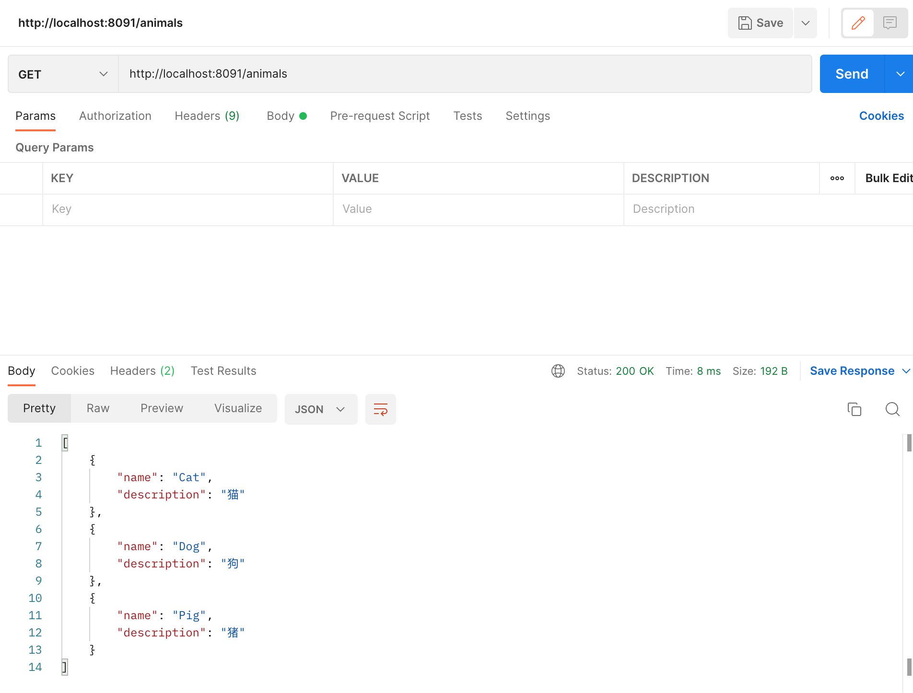

# Quarkus - 发布JSON Restful服务 <!-- {docsify-ignore-all} -->

## 目标

&nbsp; &nbsp; 基于[实现第一个Hello World](hello-world.md)发布一个JSON的Restful服务，该服务提供`GET`,`POST`,`DELETE`三个接口，分别是`获取水果列表`，`添加水果`，`根据水果名字删除水果`。


## 发布Rest服务

### POM配置

添加jackson扩展的依赖

```xml
<dependency>
    <groupId>io.quarkus</groupId>
    <artifactId>quarkus-resteasy-reactive-jackson</artifactId>
</dependency>
```

`Quarkus`也支持JSON-B，如果你喜欢`JSON-B`而不是`Jackson`，可以添加`JSON-B`的maven配置，如下：

```xml
<dependency>
    <groupId>io.quarkus</groupId>
    <artifactId>quarkus-resteasy-reactive-jsonb</artifactId>
</dependency>
```

### 代码开发

我们将创建一个应用程序来管理一个水果列表。

首先，让我们做一个Fruit javabean，如下所示：

```java
public class Fruit {

    private String name;

    private String description;

    public Fruit() {}

    public Fruit(String name, String description) {
        this.name = name;
        this.description = description;
    }

    public String getName() {
        return name;
    }

    public void setName(String name) {
        this.name = name;
    }

    public String getDescription() {
        return description;
    }

    public void setDescription(String description) {
        this.description = description;
    }
}
```
这是非常简单的。需要注意的重要一点是，JSON 序列化层需要具有默认构造函数。

接下来创建一个`FruitResouce`类来发布`Restful`接口，代码如下：

```java
@Path("/fruits")
@Produces(MediaType.APPLICATION_JSON)
@Consumes(MediaType.APPLICATION_JSON)
public class FruitResource {

    public List<Fruit> fruits = new ArrayList<>();

    public FruitResource() {
        fruits.add(new Fruit("Apple", "苹果"));
        fruits.add(new Fruit("Orange", "桔子"));
    }

    @GET
    public List<Fruit> list() {
        return fruits;
    }

    @POST
    public List<Fruit> add(Fruit fruit) {
        fruits.add(fruit);
        return fruits;
    }

    @DELETE
    public List<Fruit> del(String name) {
        fruits.forEach(e -> {
            if (name.equals(e.getName())) {
                fruits.remove(e);
            }
        });
        return fruits;
    }
}
```
非常简单，你只需要使用`JAX-RS`注解来定义你的实现节点。

### 测试

#### GET


#### POST


#### DELETE


### Reponse方式发布Restful接口

创建`Animals`类

```java
public class Animals {

    private String name;

    private String description;

    public Animals() {}

    public Animals(String name, String description) {
        this.name = name;
        this.description = description;
    }

    public String getName() {
        return name;
    }

    public void setName(String name) {
        this.name = name;
    }

    public String getDescription() {
        return description;
    }

    public void setDescription(String description) {
        this.description = description;
    }
}
```

创建`AnimalsResource`类

```java
@Path("/animals")
@Produces(MediaType.APPLICATION_JSON)
@Consumes(MediaType.APPLICATION_JSON)
public class AnimalsResource {

    private final List<Animals> list = new ArrayList<>();

    public AnimalsResource() {
        list.add(new Animals("Cat", "猫"));
        list.add(new Animals("Dog", "狗"));
        list.add(new Animals("Pig", "猪"));
    }

    @GET
    public Response list() {
        return Response.ok(list).build();
    }
}
```

测试结果：



### 响应式编程

你可以使用响应式编程，`Quarkus`推荐使用`Multi`，`RESTEasy Reactive`与`Mutiny`集成，你的接口可以返回`Uni`或`Multi`实例，代码如下：

```java
    @GET
    public Multi<List<Animals>> list() {
        return Multi.createFrom().item(list);
    }

    @GET
    @Path("/{index}")
    public Uni<Animals> getOne(Integer index) {
        return Uni.createFrom().item(list.get(index));
    }
```