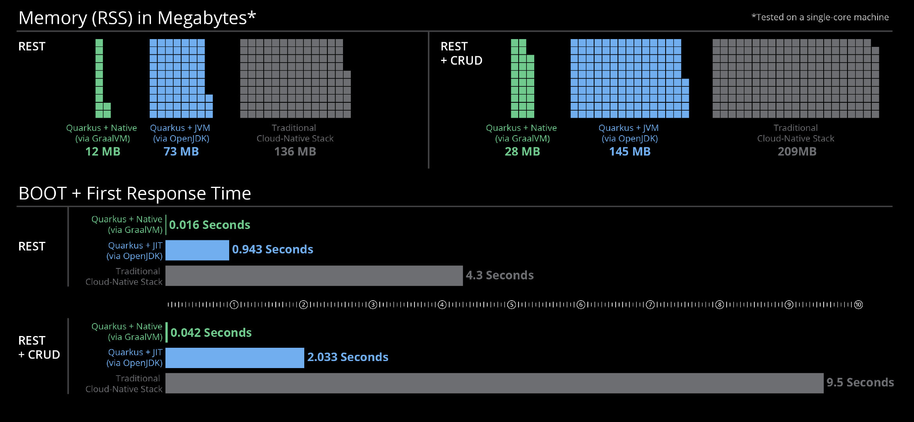

# 什么是Quarkus <!-- {docsify-ignore-all} -->

## Quarkus介绍

Quarkus 是一个为 Java 虚拟机（JVM）和原生编译而设计的全堆栈 Kubernetes 原生 Java 框架，用于专门针对容器优化 Java，并使其成为无服务器、云和 Kubernetes 环境的高效平台。

Quarkus 可与常用 Java 标准、框架和库协同工作，例如 Eclipse MicroProfile、Apache Kafka、RESTEasy（JAX-RS）、Hibernate ORM（JPA）、Spring、Infinispan、Camel 等。

Quarkus 的依赖注入解决方案基于 CDI（上下文和依赖注入），且包含一个扩展框架来扩展功能并将其配置、引导并集成到您的应用中。添加扩展就像添加依赖项一样容易；或者，您可以使用 Quarkus 工具。

此外也是引人注目的一个特点，它还向 GraalVM（一种通用虚拟机，用于运行以多种语言（包括 Java 和 JavaScript）编写的应用）提供正确信息，以便对应用进行原生编译。

## Quarkus与传统Java框架对比

### Quarkus与传统技术栈对比

来自官方的一张图，展示了使用Quarkus框架开发项目和使用传统框架开发的一些运行时数据明细对比，可以看到Quarkus项目在JVM中运行时所消耗的内存和接口响应能力要明显好于传统的Java技术栈。而将Quarkus编译成本地可执行文件（本地镜像）之后，其优势可以说非常明显了。
