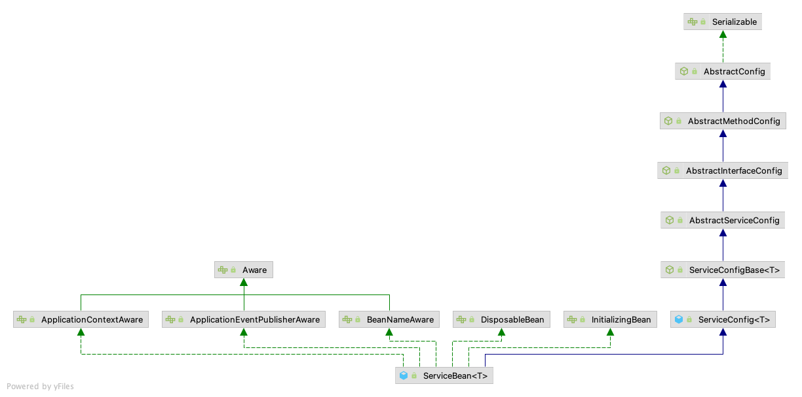
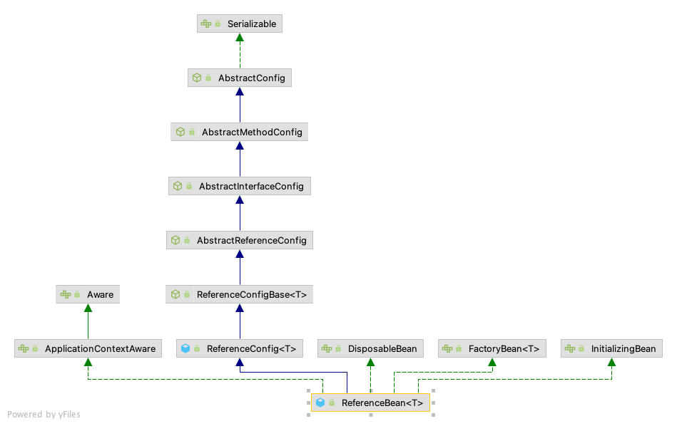

# Dubbo服务启动-Dubbo Bean加载 <!-- {docsify-ignore-all} -->


## Dubbo Bean加载

&nbsp; &nbsp; 我们使用`dubbo`都是和`Spring`进行结合使用，并且常用的方式就是通过在`xml`中配置dubbo来实现的，我们结合这种方式来看一下，spring是如何加载dubbo的bean的，下面我们来看一下一个最基本的dubbo的配置，结合配置来分析：以下示例来自于官方例子

```xml
<beans xmlns:xsi="http://www.w3.org/2001/XMLSchema-instance"
       xmlns:dubbo="http://dubbo.apache.org/schema/dubbo"
       xmlns="http://www.springframework.org/schema/beans" xmlns:context="http://www.springframework.org/schema/context"
       xsi:schemaLocation="http://www.springframework.org/schema/beans http://www.springframework.org/schema/beans/spring-beans.xsd
       http://dubbo.apache.org/schema/dubbo http://dubbo.apache.org/schema/dubbo/dubbo.xsd http://www.springframework.org/schema/context http://www.springframework.org/schema/context/spring-context.xsd">
    <context:property-placeholder/>

    <dubbo:application name="demo-provider"/>

    <dubbo:registry address="zookeeper://${zookeeper.address:127.0.0.1}:2181"/>

    <bean id="demoService" class="org.apache.dubbo.samples.serialization.impl.DemoServiceImpl"/>

    <dubbo:service interface="org.apache.dubbo.samples.serialization.api.DemoService" ref="demoService"
                   serialization="java"/>

</beans>
```

&nbsp; &nbsp; 在配置文件中配置了注册中心`<dubbo:registry`，服务的生产者`<dubbo:service`等信息，使用的的标签是dubbo的自定义标签，要继续了解dubbo自定义标签要先了解一下开发一个自定义标签的流程，下面是开发流程：

- 编写一个Java Bean；
- 编写XSD文件；
- 编写标签解析器，实现BeanDefinitionParser接口；
- 编写注册标签解析器的NamespaceHandlerSupport，继承NamespaceHandlerSupport，重写init方法，注册自定义的标签解析器；
- 编写spring.handlers和spring.schemas文件；

&nbsp; &nbsp; 开发完自定义的标签后就可以在spring配置文件中使用了，通过`dubbo`的`spring.handlers`文件找到注册标签解析器的类`com.alibaba.dubbo.config.spring.schema.DubboNamespaceHandler`。通过下面代码可以看到，dubbo注册了10个自定义标签，除了`annotation`标签，其他的标签均使用`DubboBeanDefinitionParser`解析器进行解析，解析dubbo自定义标签后就是Spring的创建对象和属性赋值。

```java
public class DubboNamespaceHandler extends NamespaceHandlerSupport {

    static {
        Version.checkDuplicate(DubboNamespaceHandler.class);
    }

    @Override
    public void init() {
        registerBeanDefinitionParser("application", new DubboBeanDefinitionParser(ApplicationConfig.class, true));
        registerBeanDefinitionParser("module", new DubboBeanDefinitionParser(ModuleConfig.class, true));
        registerBeanDefinitionParser("registry", new DubboBeanDefinitionParser(RegistryConfig.class, true));
        registerBeanDefinitionParser("monitor", new DubboBeanDefinitionParser(MonitorConfig.class, true));
        registerBeanDefinitionParser("provider", new DubboBeanDefinitionParser(ProviderConfig.class, true));
        registerBeanDefinitionParser("consumer", new DubboBeanDefinitionParser(ConsumerConfig.class, true));
        registerBeanDefinitionParser("protocol", new DubboBeanDefinitionParser(ProtocolConfig.class, true));
        registerBeanDefinitionParser("service", new DubboBeanDefinitionParser(ServiceBean.class, true));
        registerBeanDefinitionParser("reference", new DubboBeanDefinitionParser(ReferenceBean.class, false));
        registerBeanDefinitionParser("annotation", new AnnotationBeanDefinitionParser());
    }

}
```

&nbsp; &nbsp; Dubbo生产者和消费者的核心类分别是`ServiceBean`和`ReferenceBean`，在spring解析`<dubbo:service`或`<dubbo:reference`标签时进行加载，这两个类的继承结构如下：

- **ServiceBean**



- **ReferenceBean**



## Dubbo启动

&nbsp; &nbsp; 在上面的dubbo bean加载章节中我们知道dubbo通过Spring自定义标签，在程序启动时创建了实例并进行了实例赋值，接下来我们看一下Dubbo是如何启动的


### Dubbo客户端启动监听DubboBootstrapApplicationListener

> 上一章节说到了通过spring自定义标签已经创建了comsumer的bean，consumer的bean创建成功了，我们来分析下dubbo客户端启动的过程，dubbo实现了Spring的监听接口`ApplicationListener`接口，实现监听接口是为了当Spring容器refresh完成后能够接到容器刷新完成的事件。当Spring容器刷新完后通过时间监听执行dubbo客户端启动，代码如下：

```java

public class DubboBootstrapApplicationListener extends OneTimeExecutionApplicationContextEventListener
        implements Ordered {

    /**
     * The bean name of {@link DubboBootstrapApplicationListener}
     *
     * @since 2.7.6
     */
    public static final String BEAN_NAME = "dubboBootstrapApplicationListener";

    private final DubboBootstrap dubboBootstrap;

    public DubboBootstrapApplicationListener() {
        // 获取DubboBootstrap对象，会通过SPI加载Environment，ConfigManager
        this.dubboBootstrap = DubboBootstrap.getInstance();
    }

    @Override
    public void onApplicationContextEvent(ApplicationContextEvent event) {
        // 处理ContextRefreshedEvent时间，该事件是Spring容器刷新完毕时间
        if (event instanceof ContextRefreshedEvent) {
            onContextRefreshedEvent((ContextRefreshedEvent) event);
        } else if (event instanceof ContextClosedEvent) {
            // 处理ContextClosedEvent时间，spring上下文关闭事件
            onContextClosedEvent((ContextClosedEvent) event);
        }
    }

    // spring上下文刷新完毕事件
    private void onContextRefreshedEvent(ContextRefreshedEvent event) {
        dubboBootstrap.start();
    }

    // Spring上下文关闭事件
    private void onContextClosedEvent(ContextClosedEvent event) {
        dubboBootstrap.stop();
    }

    @Override
    public int getOrder() {
        return LOWEST_PRECEDENCE;
    }
}

abstract class OneTimeExecutionApplicationContextEventListener implements ApplicationListener, ApplicationContextAware {

    private ApplicationContext applicationContext;

    public final void onApplicationEvent(ApplicationEvent event) {
        if (isOriginalEventSource(event) && event instanceof ApplicationContextEvent) {
            onApplicationContextEvent((ApplicationContextEvent) event);
        }
    }

    /**
     * The subclass overrides this method to handle {@link ApplicationContextEvent}
     *
     * @param event {@link ApplicationContextEvent}
     */
    protected abstract void onApplicationContextEvent(ApplicationContextEvent event);

    /**
     * Is original {@link ApplicationContext} as the event source
     *
     * @param event {@link ApplicationEvent}
     * @return
     */
    private boolean isOriginalEventSource(ApplicationEvent event) {
        return (applicationContext == null) // Current ApplicationListener is not a Spring Bean, just was added
                // into Spring's ConfigurableApplicationContext
                || Objects.equals(applicationContext, event.getSource());
    }

    @Override
    public final void setApplicationContext(ApplicationContext applicationContext) throws BeansException {
        this.applicationContext = applicationContext;
    }

    public ApplicationContext getApplicationContext() {
        return applicationContext;
    }
}
```

> Spring容器刷新完毕发布事件代码如下：

```java

	/**
	 * Finish the refresh of this context, invoking the LifecycleProcessor's
	 * onRefresh() method and publishing the
	 * {@link org.springframework.context.event.ContextRefreshedEvent}.
	 */
	protected void finishRefresh() {
		// Initialize lifecycle processor for this context.
		initLifecycleProcessor();

		// Propagate refresh to lifecycle processor first.
		getLifecycleProcessor().onRefresh();

		// Publish the final event.发布ContextRefreshedEvent事件
		publishEvent(new ContextRefreshedEvent(this));

		// Participate in LiveBeansView MBean, if active.
		LiveBeansView.registerApplicationContext(this);
	}
```

### DubboBootstrap#start()dubbo启动


```java
    public DubboBootstrap start() {
        // 是否启动过
        if (started.compareAndSet(false, true)) {
            ready.set(false);
            // 初始化
            initialize();
            if (logger.isInfoEnabled()) {
                logger.info(NAME + " is starting...");
            }
            // 1. 发布dubbo服务
            exportServices();

            // Not only provider register，原数据发布一次
            if (!isOnlyRegisterProvider() || hasExportedServices()) {
                // 2. 发布元数据
                exportMetadataService();
                //3. Register the local ServiceInstance if required
                registerServiceInstance();
            }
            // 4. 订阅服务 
            referServices();
            if (asyncExportingFutures.size() > 0) {
                new Thread(() -> {
                    try {
                        this.awaitFinish();
                    } catch (Exception e) {
                        logger.warn(NAME + " exportAsync occurred an exception.");
                    }
                    ready.set(true);
                    if (logger.isInfoEnabled()) {
                        logger.info(NAME + " is ready.");
                    }
                }).start();
            } else {
                ready.set(true);
                if (logger.isInfoEnabled()) {
                    logger.info(NAME + " is ready.");
                }
            }
            if (logger.isInfoEnabled()) {
                logger.info(NAME + " has started.");
            }
        }
        return this;
    }
```

## 总结

&nbsp; &nbsp; Dubbo + Spring的Bean加载流程通过自定义标签进行Bean的加载处理，Dubbo基于Spring自定义标签规范实现了标签解析器`DubboBeanDefinitionParser`和`AnnotationBeanDefinitionParser`，通过标签解析完成bean的创建，赋值，初始化等生命周期的处理，然后dubbo实现了Spring的监听器`ApplicationListener`，监听spring容器刷新完毕的事件，在spring容器刷新完毕后进行dubbo客户端的启动，来进行服务的注册，发布，订阅以及远程调用的Invoker的创建发布等。


