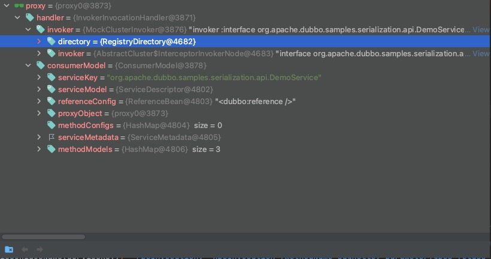

# Dubbo远程调用 - invoke <!-- {docsify-ignore-all} -->


## 例子

&nbsp; &nbsp; 示例中通过Spring上下文获取到了`DemoService`实例，在上篇文章[Dubbo Consumer引用服务]()中我们已经了解引用服务，创建invoker，创建代理对象的流程，这里的DemoService实例就是创建的代理对象，然后通过代理对象调用sayHello方法。

```java
public class DubboConsumer {

    public static void main(String[] args) {
        ClassPathXmlApplicationContext context = new ClassPathXmlApplicationContext("spring/dubbo-demo-consumer.xml");
        context.start();
        DemoService demoService = context.getBean("demoService", DemoService.class);
        String hello = demoService.sayHello("world");
        System.out.println(hello);
    }
}
```

&nbsp; &nbsp; Dubbo`InvokerInvocationHandler`实现了`InvocationHandler`接口，并且重写了`invoke`方法，当调用`sayHello`方法实际上就会调用到`InvokerInvocationHandler`的`invoke`方法。代码如下：

```java
public class InvokerInvocationHandler implements InvocationHandler {
    private static final Logger logger = LoggerFactory.getLogger(InvokerInvocationHandler.class);
    private final Invoker<?> invoker;
    private ConsumerModel consumerModel;

    public InvokerInvocationHandler(Invoker<?> handler) {
        this.invoker = handler;
        String serviceKey = invoker.getUrl().getServiceKey();
        if (serviceKey != null) {
            this.consumerModel = ApplicationModel.getConsumerModel(serviceKey);
        }
    }

    @Override
    public Object invoke(Object proxy, Method method, Object[] args) throws Throwable {
        if (method.getDeclaringClass() == Object.class) {
            return method.invoke(invoker, args);
        }
        String methodName = method.getName();
        Class<?>[] parameterTypes = method.getParameterTypes();
        // 如果没有参数走下边逻辑，会判断是否是toString，hashCode，equals，$destroy等方法，这里sayHello跳过
        if (parameterTypes.length == 0) {
            if ("toString".equals(methodName)) {
                return invoker.toString();
            } else if ("$destroy".equals(methodName)) {
                invoker.destroy();
                return null;
            } else if ("hashCode".equals(methodName)) {
                return invoker.hashCode();
            }
        } else if (parameterTypes.length == 1 && "equals".equals(methodName)) {
            return invoker.equals(args[0]);
        }
        // 创建RpcInvocation实例
        RpcInvocation rpcInvocation = new RpcInvocation(method, invoker.getInterface().getName(), args);
        // serviceKey 这里是 org.apache.dubbo.samples.serialization.api.DemoService
        String serviceKey = invoker.getUrl().getServiceKey();
        rpcInvocation.setTargetServiceUniqueName(serviceKey);
      
        if (consumerModel != null) {
            rpcInvocation.put(Constants.CONSUMER_MODEL, consumerModel);
            rpcInvocation.put(Constants.METHOD_MODEL, consumerModel.getMethodModel(method));
        }

        return invoker.invoke(rpcInvocation).recreate();
    }
}
```

&nbsp; &nbsp; 这里的代理`proxy`包含了在服务注册，订阅阶段所产生的所有配置信息以及Invoker，Invoker会被装饰成调用链，`proxy`包含了`Invoker`,`Directory`,`ConsumerModel`,`ReferenceConfig`等等，如下图：



## 执行invoker.invoke处理流程

&nbsp; &nbsp; 下面会按照代码执行流程，简单介绍一下一个请求的处理流程，所经介绍类的顺序即代表了代码所执行的流程顺序。

#### **MockClusterInvoker：** 首先会走到这个类中，因为没有mock，所以直接向下走。
#### **AbstractCluster：** 这里会添加一个ClusterInterceptor拦截器，在调用前后做一些处理，这个不细说。

```java
        @Override
        public Result invoke(Invocation invocation) throws RpcException {
            Result asyncResult;
            try {
                // 调用前
                interceptor.before(next, invocation);
                // 通过ClusterInterceptor#intercept方法执行clusterInvoker的调用，这里clusterInvoker默认的使用FailoverClusterInvoker
                asyncResult = interceptor.intercept(next, invocation);
            } catch (Exception e) {
                // onError callback
                if (interceptor instanceof ClusterInterceptor.Listener) {
                    ClusterInterceptor.Listener listener = (ClusterInterceptor.Listener) interceptor;
                    listener.onError(e, clusterInvoker, invocation);
                }
                throw e;
            } finally {
                // 调用后
                interceptor.after(next, invocation);
            }
            return asyncResult.whenCompleteWithContext((r, t) -> {
                // onResponse callback
                if (interceptor instanceof ClusterInterceptor.Listener) {
                    ClusterInterceptor.Listener listener = (ClusterInterceptor.Listener) interceptor;
                    if (t == null) {
                        listener.onMessage(r, clusterInvoker, invocation);
                    } else {
                        listener.onError(t, clusterInvoker, invocation);
                    }
                }
            });
        }

```

#### **ClusterInterceptor：** 集群调用拦截器，在拦截器的`intercept`方法中会执行`AbstractClusterInvoker#invoke`方法。

```java
@SPI
public interface ClusterInterceptor {

    void before(AbstractClusterInvoker<?> clusterInvoker, Invocation invocation);

    void after(AbstractClusterInvoker<?> clusterInvoker, Invocation invocation);

    /**
     * Does not need to override this method, override {@link #before(AbstractClusterInvoker, Invocation)}
     * and {@link #after(AbstractClusterInvoker, Invocation)}, methods to add your own logic expected to be
     * executed before and after invoke.
     *
     * @param clusterInvoker
     * @param invocation
     * @return
     * @throws RpcException
     */
    default Result intercept(AbstractClusterInvoker<?> clusterInvoker, Invocation invocation) throws RpcException {
        // 走到AbstractClusterInvoker#invoke方法
        return clusterInvoker.invoke(invocation);
    }

    interface Listener {

        void onMessage(Result appResponse, AbstractClusterInvoker<?> clusterInvoker, Invocation invocation);

        void onError(Throwable t, AbstractClusterInvoker<?> clusterInvoker, Invocation invocation);
    }
}
```

#### **AbstractClusterInvoker**

&nbsp; &nbsp; 这里有负载均衡操作暂时不关心，继续调用doInvoke，实际上就是执行子类的实现，这里默认执行子类`FailoverClusterInvoker`的`doInvoker`。

```java
    @Override
    public Result invoke(final Invocation invocation) throws RpcException {
        checkWhetherDestroyed();

        // binding attachments into invocation.
        Map<String, Object> contextAttachments = RpcContext.getContext().getObjectAttachments();
        if (contextAttachments != null && contextAttachments.size() != 0) {
            ((RpcInvocation) invocation).addObjectAttachments(contextAttachments);
        }

        List<Invoker<T>> invokers = list(invocation);
        LoadBalance loadbalance = initLoadBalance(invokers, invocation);
        RpcUtils.attachInvocationIdIfAsync(getUrl(), invocation);
        // 默认执行子类`FailoverClusterInvoker`的`doInvoker`。
        return doInvoke(invocation, invokers, loadbalance);
    }
```

#### **FailoverClusterInvoker#doInvoke**

> 执行流程 AbstractClusterInvoker#invoke  -》 FailoverClusterInvoker#doInvoke -》 AbstractClusterInvoker#select选择一个Invoker -》 执行Invoker调用链

然后会通过装饰器模式，构造一个Invoker的调用链，最终会执行`DubboInvoker`的`doInvoke`方法；

> Invoker调用链如下：

```
- ProtocolFilterWrapper
- - ListenerInvokerWrapper
- - - AsyncToSyncInvoker
- - - - DubboInvoker
```

```java
    @Override
    @SuppressWarnings({"unchecked", "rawtypes"})
    public Result doInvoke(Invocation invocation, final List<Invoker<T>> invokers, LoadBalance loadbalance) throws RpcException {
        List<Invoker<T>> copyInvokers = invokers;
        checkInvokers(copyInvokers, invocation);
        String methodName = RpcUtils.getMethodName(invocation);
        int len = getUrl().getMethodParameter(methodName, RETRIES_KEY, DEFAULT_RETRIES) + 1;
        if (len <= 0) {
            len = 1;
        }
        // retry loop.
        RpcException le = null; // last exception.
        List<Invoker<T>> invoked = new ArrayList<Invoker<T>>(copyInvokers.size()); // invoked invokers.
        Set<String> providers = new HashSet<String>(len);
        for (int i = 0; i < len; i++) {
            //Reselect before retry to avoid a change of candidate `invokers`.
            //NOTE: if `invokers` changed, then `invoked` also lose accuracy.
            if (i > 0) {
                checkWhetherDestroyed();
                copyInvokers = list(invocation);
                // check again
                checkInvokers(copyInvokers, invocation);
            }
            Invoker<T> invoker = select(loadbalance, invocation, copyInvokers, invoked);
            invoked.add(invoker);
            RpcContext.getContext().setInvokers((List) invoked);
            try {
                // 装饰器模式 装饰invoker调用链
                // - ProtocolFilterWrapper
                // - - ListenerInvokerWrapper
                // - - - AsyncToSyncInvoker
                // - - - - DubboInvoker
                Result result = invoker.invoke(invocation);
                if (le != null && logger.isWarnEnabled()) {
                    logger.warn("Although retry the method " + methodName
                            + " in the service " + getInterface().getName()
                            + " was successful by the provider " + invoker.getUrl().getAddress()
                            + ", but there have been failed providers " + providers
                            + " (" + providers.size() + "/" + copyInvokers.size()
                            + ") from the registry " + directory.getUrl().getAddress()
                            + " on the consumer " + NetUtils.getLocalHost()
                            + " using the dubbo version " + Version.getVersion() + ". Last error is: "
                            + le.getMessage(), le);
                }
                return result;
            } catch (RpcException e) {
                if (e.isBiz()) { // biz exception.
                    throw e;
                }
                le = e;
            } catch (Throwable e) {
                le = new RpcException(e.getMessage(), e);
            } finally {
                providers.add(invoker.getUrl().getAddress());
            }
        }
        throw new RpcException(le.getCode(), "Failed to invoke the method "
                + methodName + " in the service " + getInterface().getName()
                + ". Tried " + len + " times of the providers " + providers
                + " (" + providers.size() + "/" + copyInvokers.size()
                + ") from the registry " + directory.getUrl().getAddress()
                + " on the consumer " + NetUtils.getLocalHost() + " using the dubbo version "
                + Version.getVersion() + ". Last error is: "
                + le.getMessage(), le.getCause() != null ? le.getCause() : le);
    }

}
```

#### **DubboInvoker#doInvoke方法：** 敲重点，最终会通过该方法完成远程调用以及异步调用结果的封装

```java
    @Override
    protected Result doInvoke(final Invocation invocation) throws Throwable {
        RpcInvocation inv = (RpcInvocation) invocation;
        final String methodName = RpcUtils.getMethodName(invocation);
        inv.setAttachment(PATH_KEY, getUrl().getPath());
        inv.setAttachment(VERSION_KEY, version);

        ExchangeClient currentClient;
        // 如果clients数量是1 直接使用第一个，否则的话就取第用自增值与clients数量做取余运算个
        if (clients.length == 1) {
            currentClient = clients[0];
        } else {
            currentClient = clients[index.getAndIncrement() % clients.length];
        }
        try {
            boolean isOneway = RpcUtils.isOneway(getUrl(), invocation);
            int timeout = calculateTimeout(invocation, methodName);
            // 单向发送，不用关心返回值
            if (isOneway) {
                boolean isSent = getUrl().getMethodParameter(methodName, Constants.SENT_KEY, false);
                currentClient.send(inv, isSent);
                return AsyncRpcResult.newDefaultAsyncResult(invocation);
            } else {
                // 异步调用
                // 回调线程
                ExecutorService executor = getCallbackExecutor(getUrl(), inv);
                // 在requset中设置回调线程， 这里使用CompletableFuture 设置回调，thenApply的目的就是将异步结果拿过来，最后会将异步结果转成AppResponse
                CompletableFuture<AppResponse> appResponseFuture =
                        currentClient.request(inv, timeout, executor).thenApply(obj -> (AppResponse) obj);
                // save for 2.6.x compatibility, for example, TraceFilter in Zipkin uses com.alibaba.xxx.FutureAdapter
                // 这里会讲 CompletableFuture封装成FutureAdapter，并且绑定到FutureContext的futureTL中
                FutureContext.getContext().setCompatibleFuture(appResponseFuture);
                AsyncRpcResult result = new AsyncRpcResult(appResponseFuture, inv);
                result.setExecutor(executor);
                return result;
            }
        } catch (TimeoutException e) {
            throw new RpcException(RpcException.TIMEOUT_EXCEPTION, "Invoke remote method timeout. method: " + invocation.getMethodName() + ", provider: " + getUrl() + ", cause: " + e.getMessage(), e);
        } catch (RemotingException e) {
            throw new RpcException(RpcException.NETWORK_EXCEPTION, "Failed to invoke remote method: " + invocation.getMethodName() + ", provider: " + getUrl() + ", cause: " + e.getMessage(), e);
        }
    }
```

#### **AsyncToSyncInvoker#invoke获取RPC调用结果**

```java
    @Override
    public Result invoke(Invocation invocation) throws RpcException {
        Result asyncResult = invoker.invoke(invocation);

        try {
            if (InvokeMode.SYNC == ((RpcInvocation) invocation).getInvokeMode()) {
                /**
                 * NOTICE!
                 * must call {@link java.util.concurrent.CompletableFuture#get(long, TimeUnit)} because
                 * {@link java.util.concurrent.CompletableFuture#get()} was proved to have serious performance drop.
                 */
                 // 获取调用结果
                asyncResult.get(Integer.MAX_VALUE, TimeUnit.MILLISECONDS);
            }
        } catch (InterruptedException e) {
            throw new RpcException("Interrupted unexpectedly while waiting for remote result to return!  method: " +
                    invocation.getMethodName() + ", provider: " + getUrl() + ", cause: " + e.getMessage(), e);
        } catch (ExecutionException e) {
            Throwable t = e.getCause();
            if (t instanceof TimeoutException) {
                throw new RpcException(RpcException.TIMEOUT_EXCEPTION, "Invoke remote method timeout. method: " +
                        invocation.getMethodName() + ", provider: " + getUrl() + ", cause: " + e.getMessage(), e);
            } else if (t instanceof RemotingException) {
                throw new RpcException(RpcException.NETWORK_EXCEPTION, "Failed to invoke remote method: " +
                        invocation.getMethodName() + ", provider: " + getUrl() + ", cause: " + e.getMessage(), e);
            } else {
                throw new RpcException(RpcException.UNKNOWN_EXCEPTION, "Fail to invoke remote method: " +
                        invocation.getMethodName() + ", provider: " + getUrl() + ", cause: " + e.getMessage(), e);
            }
        } catch (Throwable e) {
            throw new RpcException(e.getMessage(), e);
        }
        return asyncResult;
    }

```

#### **AsyncRpcResult#get调用结果：** 通过CompletableFuture的get方法获取RPC调用的结果。

```java
    @Override
    public Result get(long timeout, TimeUnit unit) throws InterruptedException, ExecutionException, TimeoutException {
        if (executor != null && executor instanceof ThreadlessExecutor) {
            ThreadlessExecutor threadlessExecutor = (ThreadlessExecutor) executor;
            threadlessExecutor.waitAndDrain();
        }
        return responseFuture.get(timeout, unit);
    }
```

## 总结

&nbsp; &nbsp; Dubbo通过代理对象以及Invoker实现了远程调用，Dubbo实现了`InvocationHandler`接口重写了`invoke`方法，在调用代理对象方法时会调用`invoke`，远程调用分为oneWay（单向）和异步/同步；单向发送不关心发送结果，发送请求后就直接返回，异步/同步发送需要处理结果，通过Future的get取响应结果；Dubbo提供了远程调用的容错处理，包括调用策略，路由，负载均衡等