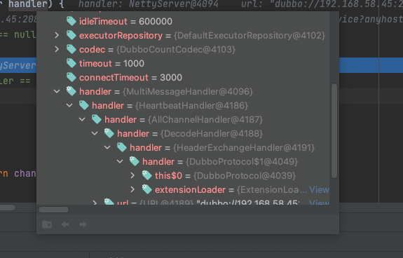

# Dubbo服务启动-底层通信 <!-- {docsify-ignore-all} -->


## Dubbo协议打开服务器

&nbsp; &nbsp; 书接上回[Dubbo Provider发布服务](../../sourcecode/dubbo/dubbo-export-service.md)Provider会通过`RegistryProtocol#export`注册服务，通过`DubboProtocol`发布服务吗，`DubboProtocol`发布服务时会打开服务器，`DubboProtocol`中有一个`serviceMap`，存储ip:port和`ExchangeServer`的映射关系，刚开始创建的时候会检查`serviceMap`，如果key对应的`ExchangeServer`不存在会调用`createServer`创建Server，代码如下：

```java
    private void openServer(URL url) {
        // ip端口
        String key = url.getAddress();
        // 客户端发布用于服务器的服务
        boolean isServer = url.getParameter(IS_SERVER_KEY, true);
        if (isServer) {
            // 从serviceMap查找Server
            ProtocolServer server = serverMap.get(key);
            // serverMap中没有Server，这里使用两次查找
            if (server == null) {
                synchronized (this) {
                    server = serverMap.get(key);
                    if (server == null) {
                        // 创建Server并放到serviceMap中
                        serverMap.put(key, createServer(url));
                    }
                }
            } else {
                // server supports reset, use together with override
                server.reset(url);
            }
        }
    }
    
    private ProtocolServer createServer(URL url) {
        // url
        url = URLBuilder.from(url)
                // send readonly event when server closes, it's enabled by default
                .addParameterIfAbsent(CHANNEL_READONLYEVENT_SENT_KEY, Boolean.TRUE.toString())
                // enable heartbeat by default
                .addParameterIfAbsent(HEARTBEAT_KEY, String.valueOf(DEFAULT_HEARTBEAT))
                .addParameter(CODEC_KEY, DubboCodec.NAME)
                .build();
        // 默认服务器采用netty
        String str = url.getParameter(SERVER_KEY, DEFAULT_REMOTING_SERVER);

        if (str != null && str.length() > 0 && !ExtensionLoader.getExtensionLoader(Transporter.class).hasExtension(str)) {
            throw new RpcException("Unsupported server type: " + str + ", url: " + url);
        }

        ExchangeServer server;
        try {
            server = Exchangers.bind(url, requestHandler);
        } catch (RemotingException e) {
            throw new RpcException("Fail to start server(url: " + url + ") " + e.getMessage(), e);
        }

        str = url.getParameter(CLIENT_KEY);
        if (str != null && str.length() > 0) {
            // 支持的传输层类型
            Set<String> supportedTypes = ExtensionLoader.getExtensionLoader(Transporter.class).getSupportedExtensions();
            if (!supportedTypes.contains(str)) {
                throw new RpcException("Unsupported client type: " + str);
            }
        }

        return new DubboProtocolServer(server);
    }   
```

### 打开服务器流程

&nbsp; &nbsp; 底层通信分为两层，信息交换层和传输层，传输层使用netty等实现。

```
|- Exchanger 信息交换层  header
	|- Transporters 传输层 netty
    	|- NettyServer
        	|- HeaderExchangeServer
```

1. 创建服务器时，`dubbo:protocol`标签中设置服务器实现类型，比如:dubbo协议的mina,netty等,http协议的jetty,servlet等，dubbo协议默认的服务器是netty。
2. `Exchangers.bind`会根据url启动服务器，首先根据url通过SPI机制获取`Exchanger`，默认的`Exchanger`是`header`，对应的是`HeaderExchanger`，`Exchanger`是信息交换层。
3. 获取到`Exchanger`调用其`bind`方法，会使用`Transporters`的`bind`。代码如下

```java
    /**
    * DubboProtocol bind方法首先根据url通过SPI机制获取`Exchanger`，默认的`Exchanger`是`header`
    *
    *
    */
    public static ExchangeServer bind(URL url, ExchangeHandler handler) throws RemotingException {
        if (url == null) {
            throw new IllegalArgumentException("url == null");
        }
        if (handler == null) {
            throw new IllegalArgumentException("handler == null");
        }
        url = url.addParameterIfAbsent(Constants.CODEC_KEY, "exchange");
        return getExchanger(url).bind(url, handler);
    }

    public static Exchanger getExchanger(URL url) {
        String type = url.getParameter(Constants.EXCHANGER_KEY, Constants.DEFAULT_EXCHANGER);
        return getExchanger(type);
    }

    public static Exchanger getExchanger(String type) {
        return ExtensionLoader.getExtensionLoader(Exchanger.class).getExtension(type);
    }

/**
 * DefaultMessenger
 *
 *
 */
public class HeaderExchanger implements Exchanger {

    public static final String NAME = "header";

    @Override
    public ExchangeClient connect(URL url, ExchangeHandler handler) throws RemotingException {
        return new HeaderExchangeClient(Transporters.connect(url, new DecodeHandler(new HeaderExchangeHandler(handler))), true);
    }

    @Override
    public ExchangeServer bind(URL url, ExchangeHandler handler) throws RemotingException {
        return new HeaderExchangeServer(Transporters.bind(url, new DecodeHandler(new HeaderExchangeHandler(handler))));
    }

}
```

4. `Transporters`的`bind`方法会`getTransporter()`获取`Transporter`的实现类，这里也是基于SPI机制，默认是`NettyTransporter`，使用的是netty3版本，也可以在配置中指定使用netty4，配置如下：

```xml
<dubbo:protocol name="dubbo" port="20881" transporter="netty4"/>
```

&nbsp; &nbsp; `Transporters`类`bind`方法

```java

    public static RemotingServer bind(URL url, ChannelHandler... handlers) throws RemotingException {
        if (url == null) {
            throw new IllegalArgumentException("url == null");
        }
        if (handlers == null || handlers.length == 0) {
            throw new IllegalArgumentException("handlers == null");
        }
        ChannelHandler handler;
        if (handlers.length == 1) {
            handler = handlers[0];
        } else {
            handler = new ChannelHandlerDispatcher(handlers);
        }
        return getTransporter().bind(url, handler);
    }

    public static Transporter getTransporter() {
        // SPI机制获取Transporter，默认是 netty，可以配置是netty4
        return ExtensionLoader.getExtensionLoader(Transporter.class).getAdaptiveExtension();
    }
```

5. 以`netty4`为例看一下`NettyTransporter`的`bind`，`bind`方法创建`NettyServer`对象。

```java
public class NettyTransporter implements Transporter {
    public static final String NAME = "netty";

    public NettyTransporter() {
    }

    public RemotingServer bind(URL url, ChannelHandler handler) throws RemotingException {
        return new NettyServer(url, handler);
    }

    public Client connect(URL url, ChannelHandler handler) throws RemotingException {
        return new NettyClient(url, handler);
    }
}
```

6. `NettyServer`构造函数中设置线程池名称，包装`ChannelHandler`链。最后`NettyServer`会被包装成`HeaderExchangeServer`

```java
    public NettyServer(URL url, ChannelHandler handler) throws RemotingException {
        // you can customize name and type of client thread pool by THREAD_NAME_KEY and THREADPOOL_KEY in CommonConstants.
        // the handler will be wrapped: MultiMessageHandler->HeartbeatHandler->handler
        super(ExecutorUtil.setThreadName(url, SERVER_THREAD_POOL_NAME), ChannelHandlers.wrap(handler, url));
    }
```

&nbsp; &nbsp; 包装`ChannelHandler`链，`Dispatcher`是线程池配置，默认是`AllDispatcher`，`AllDispatcher`内部返回`AllChannelHandler`

```java
    public static ChannelHandler wrap(ChannelHandler handler, URL url) {
        return ChannelHandlers.getInstance().wrapInternal(handler, url);
    }
    
    protected ChannelHandler wrapInternal(ChannelHandler handler, URL url) {
        return new MultiMessageHandler(new HeartbeatHandler(ExtensionLoader.getExtensionLoader(Dispatcher.class)
                .getAdaptiveExtension().dispatch(handler, url)));
    }
```

&nbsp; &nbsp; 包装后的`ChannelHandler`处理链如下：

```
|-MultiMessageHandler
	|-HeartbeatHandler
		|-AllChannelHandler
			|- DecodeHandler
				|- HeaderExchangeHandler
    				|- DubboProtocol中的requestHandler
```



7. `NettyServer`的`doOpen()`初始化并启动netty服务器，`NettyServer`构造函数会通过其父类`AbstractServer`的构造函数调用`doOpen()`，代码如下：


- **NettyServer构造函数**

```java
    public NettyServer(URL url, ChannelHandler handler) throws RemotingException {
        // you can customize name and type of client thread pool by THREAD_NAME_KEY and THREADPOOL_KEY in CommonConstants.
        // the handler will be wrapped: MultiMessageHandler->HeartbeatHandler->handler
        super(ExecutorUtil.setThreadName(url, SERVER_THREAD_POOL_NAME), ChannelHandlers.wrap(handler, url));
    }
```

- **AbstractServer构造函数**

```java
    public AbstractServer(URL url, ChannelHandler handler) throws RemotingException {
        super(url, handler);
        // 服务的ip:端口
        localAddress = getUrl().toInetSocketAddress();

        String bindIp = getUrl().getParameter(Constants.BIND_IP_KEY, getUrl().getHost());
        int bindPort = getUrl().getParameter(Constants.BIND_PORT_KEY, getUrl().getPort());
        if (url.getParameter(ANYHOST_KEY, false) || NetUtils.isInvalidLocalHost(bindIp)) {
            bindIp = ANYHOST_VALUE;
        }
        // 绑定到的ip:端口， 这里是 0.0.0.0:端口
        bindAddress = new InetSocketAddress(bindIp, bindPort);
        this.accepts = url.getParameter(ACCEPTS_KEY, DEFAULT_ACCEPTS);
        this.idleTimeout = url.getParameter(IDLE_TIMEOUT_KEY, DEFAULT_IDLE_TIMEOUT);
        try {
            // 调用NettyServer的doOpen方法启动netty服务器
            doOpen();
            if (logger.isInfoEnabled()) {
                logger.info("Start " + getClass().getSimpleName() + " bind " + getBindAddress() + ", export " + getLocalAddress());
            }
        } catch (Throwable t) {
            throw new RemotingException(url.toInetSocketAddress(), null, "Failed to bind " + getClass().getSimpleName()
                    + " on " + getLocalAddress() + ", cause: " + t.getMessage(), t);
        }
        executor = executorRepository.createExecutorIfAbsent(url);
    }
```

- **NettyServer#doOpen();启动netty服务器**

```java
    @Override
    protected void doOpen() throws Throwable {
        // 创建netty bootstrap
        bootstrap = new ServerBootstrap();
        // boss线程
        bossGroup = NettyEventLoopFactory.eventLoopGroup(1, "NettyServerBoss");
        // worker 线程
        workerGroup = NettyEventLoopFactory.eventLoopGroup(
                getUrl().getPositiveParameter(IO_THREADS_KEY, Constants.DEFAULT_IO_THREADS),
                "NettyServerWorker");
        // 处理器
        final NettyServerHandler nettyServerHandler = new NettyServerHandler(getUrl(), this);
        channels = nettyServerHandler.getChannels();

        bootstrap.group(bossGroup, workerGroup)
                .channel(NettyEventLoopFactory.serverSocketChannelClass())
                .option(ChannelOption.SO_REUSEADDR, Boolean.TRUE)
                .childOption(ChannelOption.TCP_NODELAY, Boolean.TRUE)
                .childOption(ChannelOption.ALLOCATOR, PooledByteBufAllocator.DEFAULT)
                .childHandler(new ChannelInitializer<SocketChannel>() {
                    @Override
                    protected void initChannel(SocketChannel ch) throws Exception {
                        // FIXME: should we use getTimeout()?
                        int idleTimeout = UrlUtils.getIdleTimeout(getUrl());
                        NettyCodecAdapter adapter = new NettyCodecAdapter(getCodec(), getUrl(), NettyServer.this);
                        if (getUrl().getParameter(SSL_ENABLED_KEY, false)) {
                            ch.pipeline().addLast("negotiation",
                                    SslHandlerInitializer.sslServerHandler(getUrl(), nettyServerHandler));
                        }
                        ch.pipeline()
                                .addLast("decoder", adapter.getDecoder())
                                .addLast("encoder", adapter.getEncoder())
                                .addLast("server-idle-handler", new IdleStateHandler(0, 0, idleTimeout, MILLISECONDS))
                                .addLast("handler", nettyServerHandler);
                    }
                });
        // 绑定服务器ip：端口
        ChannelFuture channelFuture = bootstrap.bind(getBindAddress());
        channelFuture.syncUninterruptibly();
        channel = channelFuture.channel();

    }
```


## 总结

&nbsp; &nbsp; 本篇主要研究了一下Dubbo底层服务器创建，打开的一个过程，dubbo服务器底层分为信息交换和数据传输两层，数据交换层默认使用netty实现，在打开服务器过程中会构造`ChannelHandler`处理链，最后将服务器包装成`HeaderExchangeServer`。