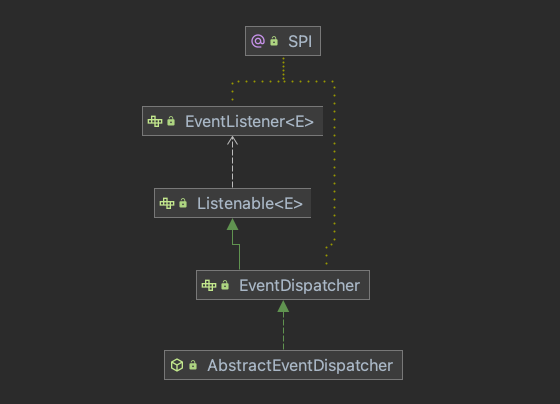

# Dubbo服务启动-初始化initialize() <!-- {docsify-ignore-all} -->

&nbsp; &nbsp; Dubbo通过监听spring是自定义标签完成了bean的加载，并且实现了spring监听接口，监听spring容器刷新完毕事件，当spring容器刷新完毕后进行dubbo的启动过程，首先就是要进行一个初始化，下面详细看一下初始化过程。

## DubboBootstrap初始化initialize();

```java
    private void initialize() {
        // 1. 校验是否初始化过
        if (!initialized.compareAndSet(false, true)) {
            return;
        }
        // 2. 初始化扩展框架
        ApplicationModel.initFrameworkExts();
        // 3. 启动配置中心 
        startConfigCenter();
        // 4. 是否需要注册中心作为配置中心
        useRegistryAsConfigCenterIfNecessary();
        // 5. 加载远程配置
        loadRemoteConfigs();
        // 6. 检查配置
        checkGlobalConfigs();
        // 7. 初始化MetaService
        initMetadataService();
        // 8. 时间监听初始化
        initEventListener();

        if (logger.isInfoEnabled()) {
            logger.info(NAME + " has been initialized!");
        }
    }
```

### ApplicationModel.initFrameworkExts();

> dubbo通过SPI机制加载三个类，分别是：Environment，ConfigManager，ServiceRepostitory；Environment是Dubbo的环境信息类，会加载配置信息，从配置文件系统参数，外部配置中心等加载配置信息。

```java
    public static void initFrameworkExts() {
        Set<FrameworkExt> exts = ExtensionLoader.getExtensionLoader(FrameworkExt.class).getSupportedExtensionInstances();
        for (FrameworkExt ext : exts) {
            ext.initialize();
        }
    }
```

> Environment会加载五种配置，PropertiesConfiguration从properties中加载配置，SystemConfiguration系统配置，EnvironmentConfiguration加载系统环境配置信息，externalConfiguration和appExternalConfiguration这两个成员变量的对象是同一种类InmemoryConfiguration，initialize()方法会获取所有配置中心的配置，将配置信息放到externalConfiguration和appExternalConfiguration，initialize()方法会在加载SPI后调用，就是上一段代码的ext.initialize();

```java
    private final PropertiesConfiguration propertiesConfiguration;
    private final SystemConfiguration systemConfiguration;
    private final EnvironmentConfiguration environmentConfiguration;
    private final InmemoryConfiguration externalConfiguration;
    private final InmemoryConfiguration appExternalConfiguration;

    
    private Map<String, String> externalConfigurationMap = new HashMap<>();
    private Map<String, String> appExternalConfigurationMap = new HashMap<>();

    

    public Environment() {
        this.propertiesConfiguration = new PropertiesConfiguration();
        this.systemConfiguration = new SystemConfiguration();
        this.environmentConfiguration = new EnvironmentConfiguration();
        this.externalConfiguration = new InmemoryConfiguration();
        this.appExternalConfiguration = new InmemoryConfiguration();
    }

    @Override
    public void initialize() throws IllegalStateException {
        ConfigManager configManager = ApplicationModel.getConfigManager();
        // 获取所有配置
        Optional<Collection<ConfigCenterConfig>> defaultConfigs = configManager.getDefaultConfigCenter();
        defaultConfigs.ifPresent(configs -> {
            // 将配置信息放到externalConfiguration和appExternalConfiguration
            for (ConfigCenterConfig config : configs) {
                this.setExternalConfigMap(config.getExternalConfiguration());
                this.setAppExternalConfigMap(config.getAppExternalConfiguration());
            }
        });

        this.externalConfiguration.setProperties(externalConfigurationMap);
        this.appExternalConfiguration.setProperties(appExternalConfigurationMap);
    }
```

> Environment会根据优先级将配置加载到CompositeConfiguration中，代码如下

```java
    public synchronized CompositeConfiguration getPrefixedConfiguration(AbstractConfig config) {
        CompositeConfiguration prefixedConfiguration = new CompositeConfiguration(config.getPrefix(), config.getId());
        Configuration configuration = new ConfigConfigurationAdapter(config);
        if (this.isConfigCenterFirst()) {
            // The sequence would be: SystemConfiguration -> AppExternalConfiguration -> ExternalConfiguration -> AbstractConfig -> PropertiesConfiguration
            // Config center has the highest priority
            prefixedConfiguration.addConfiguration(systemConfiguration);
            prefixedConfiguration.addConfiguration(environmentConfiguration);
            prefixedConfiguration.addConfiguration(appExternalConfiguration);
            prefixedConfiguration.addConfiguration(externalConfiguration);
            prefixedConfiguration.addConfiguration(configuration);
            prefixedConfiguration.addConfiguration(propertiesConfiguration);
        } else {
            // The sequence would be: SystemConfiguration -> AbstractConfig -> AppExternalConfiguration -> ExternalConfiguration -> PropertiesConfiguration
            // Config center has the highest priority
            prefixedConfiguration.addConfiguration(systemConfiguration);
            prefixedConfiguration.addConfiguration(environmentConfiguration);
            prefixedConfiguration.addConfiguration(configuration);
            prefixedConfiguration.addConfiguration(appExternalConfiguration);
            prefixedConfiguration.addConfiguration(externalConfiguration);
            prefixedConfiguration.addConfiguration(propertiesConfiguration);
        }
        return prefixedConfiguration;
    }
```

### startConfigCenter();

> startConfigCenter();启动配置中心

&nbsp; &nbsp; 如果不单独配置配置中心不会加载配置中心，配置中心是dubbo 2.7以后新增加的，承担了两个职责：（1）外部化配置。启动配置的集中式存储 （简单理解为 dubbo.properties 的外部化存储）；（2）服务治理。服务治理规则的存储与通知，可以参考参考官网[动态配置中心](https://dubbo.apache.org/zh/docsv2.7/user/configuration/config-center/)

```java
    private void startConfigCenter() {
        // 配置中心配置
        Collection<ConfigCenterConfig> configCenters = configManager.getConfigCenters();

        // configCenters是空的
        if (CollectionUtils.isEmpty(configCenters)) {
            ConfigCenterConfig configCenterConfig = new ConfigCenterConfig();
            // 从Environment刷新配置
            configCenterConfig.refresh();
            // 检查配置，配置中的address和protocol不能是空的并且address要包含"//"
            if (configCenterConfig.isValid()) {
                configManager.addConfigCenter(configCenterConfig);
                configCenters = configManager.getConfigCenters();
            }
        } else {
            for (ConfigCenterConfig configCenterConfig : configCenters) {
                configCenterConfig.refresh();
                ConfigValidationUtils.validateConfigCenterConfig(configCenterConfig);
            }
        }
        // 配置中心配置不为空，DynamicConfig处理，支持Apollo，Etcd，zookeeper，consul，nacos等动态配置
        if (CollectionUtils.isNotEmpty(configCenters)) {
            CompositeDynamicConfiguration compositeDynamicConfiguration = new CompositeDynamicConfiguration();
            for (ConfigCenterConfig configCenter : configCenters) {
                // 根据配置中心配置，创建动态配置，prepareEnvironment负责配置中心准备，比如zk就会创建基于zk的动态配置，会创建zk客户端和配置监听
                compositeDynamicConfiguration.addConfiguration(prepareEnvironment(configCenter));
            }
            environment.setDynamicConfiguration(compositeDynamicConfiguration);
        }
        // 刷新所有配置，ApplicationConfig，MonitorConfig，ModuleConfig，ProtocolConfig，RegistryConfig，ProviderConfig，ConsumerConfig
        configManager.refreshAll();
    }
```

### useRegistryAsConfigCenterIfNecessary();是否需要注册中心作为配置中心

&nbsp; &nbsp; 看方法名字就能看出来，该方法是处理是否要将注册中心也作为配置中心使用的。

```java
    private void useRegistryAsConfigCenterIfNecessary() {
        // we use the loading status of DynamicConfiguration to decide whether ConfigCenter has been initiated.
        // DynamicConfiguration加载过，ConfigCenter已经初始化了，不用将注册中心作为配置中心了
        if (environment.getDynamicConfiguration().isPresent()) {
            return;
        }
        // 已经加载过配置中心了，就不用将注册中心作为配置中心了
        if (CollectionUtils.isNotEmpty(configManager.getConfigCenters())) {
            return;
        }
        // 将注册中心配置加到配置中心配置中
        configManager.getDefaultRegistries().stream()
                .filter(registryConfig -> registryConfig.getUseAsConfigCenter() == null || registryConfig.getUseAsConfigCenter())
                .forEach(registryConfig -> {
                    String protocol = registryConfig.getProtocol();
                    String id = "config-center-" + protocol + "-" + registryConfig.getPort();
                    ConfigCenterConfig cc = new ConfigCenterConfig();
                    cc.setId(id);
                    if (cc.getParameters() == null) {
                        cc.setParameters(new HashMap<>());
                    }
                    if (registryConfig.getParameters() != null) {
                        cc.getParameters().putAll(registryConfig.getParameters());
                    }
                    cc.getParameters().put(CLIENT_KEY, registryConfig.getClient());
                    cc.setProtocol(registryConfig.getProtocol());
                    cc.setPort(registryConfig.getPort());
                    cc.setAddress(registryConfig.getAddress());
                    cc.setNamespace(registryConfig.getGroup());
                    cc.setUsername(registryConfig.getUsername());
                    cc.setPassword(registryConfig.getPassword());
                    if (registryConfig.getTimeout() != null) {
                        cc.setTimeout(registryConfig.getTimeout().longValue());
                    }
                    cc.setHighestPriority(false);
                    configManager.addConfigCenter(cc);
                });
        // 再次startConfigCenter
        startConfigCenter();
    }
```

### checkGlobalConfigs();检查配置

&nbsp; &nbsp; 校验各种配置，不展开说了

```java
    private void checkGlobalConfigs() {
        // check Application
        ConfigValidationUtils.validateApplicationConfig(getApplication());

        // 检查原数据配置
        Collection<MetadataReportConfig> metadatas = configManager.getMetadataConfigs();
        if (CollectionUtils.isEmpty(metadatas)) {
            MetadataReportConfig metadataReportConfig = new MetadataReportConfig();
            metadataReportConfig.refresh();
            if (metadataReportConfig.isValid()) {
                configManager.addMetadataReport(metadataReportConfig);
                metadatas = configManager.getMetadataConfigs();
            }
        }
        if (CollectionUtils.isNotEmpty(metadatas)) {
            for (MetadataReportConfig metadataReportConfig : metadatas) {
                metadataReportConfig.refresh();
                ConfigValidationUtils.validateMetadataConfig(metadataReportConfig);
            }
        }

        // check Provider
        Collection<ProviderConfig> providers = configManager.getProviders();
        if (CollectionUtils.isEmpty(providers)) {
            configManager.getDefaultProvider().orElseGet(() -> {
                ProviderConfig providerConfig = new ProviderConfig();
                configManager.addProvider(providerConfig);
                providerConfig.refresh();
                return providerConfig;
            });
        }
        for (ProviderConfig providerConfig : configManager.getProviders()) {
            ConfigValidationUtils.validateProviderConfig(providerConfig);
        }
        // check Consumer
        Collection<ConsumerConfig> consumers = configManager.getConsumers();
        if (CollectionUtils.isEmpty(consumers)) {
            configManager.getDefaultConsumer().orElseGet(() -> {
                ConsumerConfig consumerConfig = new ConsumerConfig();
                configManager.addConsumer(consumerConfig);
                consumerConfig.refresh();
                return consumerConfig;
            });
        }
        for (ConsumerConfig consumerConfig : configManager.getConsumers()) {
            ConfigValidationUtils.validateConsumerConfig(consumerConfig);
        }

        // check Monitor
        ConfigValidationUtils.validateMonitorConfig(getMonitor());
        // check Metrics
        ConfigValidationUtils.validateMetricsConfig(getMetrics());
        // check Module
        ConfigValidationUtils.validateModuleConfig(getModule());
        // check Ssl
        ConfigValidationUtils.validateSslConfig(getSsl());
    }
```

### initMetadataService();

&nbsp; &nbsp; 初始化元数据服务，并加载原数据服务的服务提供者

```java
    private void initMetadataService() {
        startMetadataReport();
        this.metadataService = getExtension(getMetadataType());
        this.metadataServiceExporter = new ConfigurableMetadataServiceExporter(metadataService);
    }

    private void startMetadataReport() {
        ApplicationConfig applicationConfig = getApplication();

        String metadataType = applicationConfig.getMetadataType();
        // FIXME, multiple metadata config support.
        Collection<MetadataReportConfig> metadataReportConfigs = configManager.getMetadataConfigs();
        if (CollectionUtils.isEmpty(metadataReportConfigs)) {
            if (REMOTE_METADATA_STORAGE_TYPE.equals(metadataType)) {
                throw new IllegalStateException("No MetadataConfig found, you must specify the remote Metadata Center address when 'metadata=remote' is enabled.");
            }
            return;
        }
        MetadataReportConfig metadataReportConfig = metadataReportConfigs.iterator().next();
        ConfigValidationUtils.validateMetadataConfig(metadataReportConfig);
        if (!metadataReportConfig.isValid()) {
            return;
        }

        MetadataReportInstance.init(metadataReportConfig.toUrl());
    }
```

### initEventListener();

&nbsp; &nbsp; 初始化Dubbo事件监听器，Dubbo自己实现了一套事件监听机制，这里不细说



```java
    private void initEventListener() {
        // Add current instance into listeners
        addEventListener(this);
    }

    public DubboBootstrap addEventListener(EventListener<?> listener) {
        eventDispatcher.addEventListener(listener);
        return this;
    }
```

