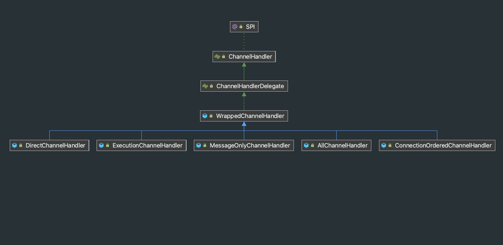

# Dubbo协议下的服务端线程模型 <!-- {docsify-ignore-all} -->

## Provider端线程模型

&nbsp; &nbsp; 在了解服务端线程模型之前，先了解一下Dubbo对Channel上的操作抽象，Dubbo将Channel上的操作成了5中行为，分别是：建立连接、断开连接、发送消息、接收消息、异常捕获，Channel上的操作的接口为`org.apache.dubbo.remoting.ChannelHandler`，该接口是`SPI`的，用户可以自己扩展，接口代码如下：

该接口抽象的五种Channel上的行为解释如下：

- 建立连接：connected，主要是的职责是在channel记录read、write的时间，以及处理建立连接后的回调逻辑，比如dubbo支持在断开后自定义回调的hook（onconnect），即在该操作中执行。
- 断开连接：disconnected，主要是的职责是在channel移除read、write的时间，以及处理端开连接后的回调逻辑，比如dubbo支持在断开后自定义回调的hook（ondisconnect），即在该操作中执行。
- 发送消息：sent，包括发送请求和发送响应。记录write的时间。
- 接收消息：received，包括接收请求和接收响应。记录read的时间。
- 异常捕获：caught，用于处理在channel上发生的各类异常。


&nbsp; &nbsp; Dubbo框架的线程模型与以上这五种行为息息相关，Dubbo协议Provider端线程模型提供了五种实现，虽说都是五种但是别把二者混淆，线程模型的顶级接口是`org.apache.dubbo.remoting.Dispatcher`，该接口也是SPI的，提供的五种实现分别是`AllDispatcher`、`DirectDispatcher`、`MessageOnlyDispatcher`、`ExecutionDispatcher`、`ConnectionOrderedDispatcher`，默认的使用的是`AllDispatcher`。


&nbsp; &nbsp; `org.apache.dubbo.remoting.ChannelHandler`作为Channel上的行为的顶级接口对应Dubbo协议Provider端的5种线程模型同样也提供了对应的5种实现，分别是`AllChannelHandler`、`DirectChannelHandler`、`MessageOnlyChannelHandler`、`ExecutionChannelHandler`、`ConnectionOrderedChannelHandler`，这里Channel上行为的具体实现不展开讨论。




&nbsp; &nbsp; Channel上行为和线程模型之间使用策略可以参考`org.apache.dubbo.remoting.transport.dispatcher.ChannelHandlers`的源代码，这里不做详细的介绍，下面的各个章节只针对5种线程模型做简单的介绍。

### AllDispatcher

- IO线程上的操作：
1. 接口响应序列化
2. sent操作

- Dubbo线程池上的操作：
1. received、connected、disconnected、caught都是在Dubbo线程池上执行
2. 服务端反序列化操作的Dubbo线程池上执行

`AllDispatcher`代码如下，`AllDispatcher`的`dispatch`方法实例化了`AllChannelHandler`，`AllChannelHandler`实现了received、connected、disconnected、caught操作在dubbo线程池中，代码如下：

```java
public class AllDispatcher implements Dispatcher {

    public static final String NAME = "all";

    @Override
    public ChannelHandler dispatch(ChannelHandler handler, URL url) {
        return new AllChannelHandler(handler, url);
    }

}
```

```java
public class AllChannelHandler extends WrappedChannelHandler {

    public AllChannelHandler(ChannelHandler handler, URL url) {
        super(handler, url);
    }

    @Override
    public void connected(Channel channel) throws RemotingException {
        ExecutorService executor = getSharedExecutorService();
        try {
            executor.execute(new ChannelEventRunnable(channel, handler, ChannelState.CONNECTED));
        } catch (Throwable t) {
            throw new ExecutionException("connect event", channel, getClass() + " error when process connected event .", t);
        }
    }

    @Override
    public void disconnected(Channel channel) throws RemotingException {
        ExecutorService executor = getSharedExecutorService();
        try {
            executor.execute(new ChannelEventRunnable(channel, handler, ChannelState.DISCONNECTED));
        } catch (Throwable t) {
            throw new ExecutionException("disconnect event", channel, getClass() + " error when process disconnected event .", t);
        }
    }

    @Override
    public void received(Channel channel, Object message) throws RemotingException {
        ExecutorService executor = getPreferredExecutorService(message);
        try {
            executor.execute(new ChannelEventRunnable(channel, handler, ChannelState.RECEIVED, message));
        } catch (Throwable t) {
            if(message instanceof Request && t instanceof RejectedExecutionException){
                sendFeedback(channel, (Request) message, t);
                return;
            }
            throw new ExecutionException(message, channel, getClass() + " error when process received event .", t);
        }
    }

    @Override
    public void caught(Channel channel, Throwable exception) throws RemotingException {
        ExecutorService executor = getSharedExecutorService();
        try {
            executor.execute(new ChannelEventRunnable(channel, handler, ChannelState.CAUGHT, exception));
        } catch (Throwable t) {
            throw new ExecutionException("caught event", channel, getClass() + " error when process caught event .", t);
        }
    }
}
```

### DirectDispatcher

&nbsp; &nbsp; 该线程模型Channel上的所有行为均在IO线程中执行，并没有在Dubbo线程池中执行


&nbsp; &nbsp; `DirectDispatcher`与`AllDispatcher`相似，实例化了`DirectChannelHandler`，`DirectChannelHandler`只实现了received行为，但是received中获取的线程池如果是`ThreadlessExecutor`才会提交task，否则也是在ChannelHandler中执行received行为，`ThreadlessExecutor`和普通线程池最大的区别是不会管理任何线程，这里不展开讨论。

```java
public class DirectDispatcher implements Dispatcher {

    public static final String NAME = "direct";

    @Override
    public ChannelHandler dispatch(ChannelHandler handler, URL url) {
        return new DirectChannelHandler(handler, url);
    }

}
```

```java
public class DirectChannelHandler extends WrappedChannelHandler {

    public DirectChannelHandler(ChannelHandler handler, URL url) {
        super(handler, url);
    }

    @Override
    public void received(Channel channel, Object message) throws RemotingException {
        ExecutorService executor = getPreferredExecutorService(message);
        if (executor instanceof ThreadlessExecutor) {
            try {
                executor.execute(new ChannelEventRunnable(channel, handler, ChannelState.RECEIVED, message));
            } catch (Throwable t) {
                throw new ExecutionException(message, channel, getClass() + " error when process received event .", t);
            }
        } else {
            handler.received(channel, message);
        }
    }

}
```


### ExecutionDispatcher

- 在IO线程中执行的操作有：
1. sent、connected、disconnected、caught操作在IO线程上执行。
2. 序列化响应在IO线程上执行。

- 在Dubbo线程中执行的操作有：
1. received都是在Dubbo线程上执行的。
2. 反序列化请求的行为在Dubbo中做的。

同样的，我们可以直接看`ExecutionChannelHandler`源码，逻辑是当message的类型是`Request`时received行为在Dubbo线程池执行。感兴趣的可以自己看源码，这里不做介绍。


### MessageOnlyDispatcher

&nbsp; &nbsp; Message Only Dispatcher所有的received行为和反序列化都是在dubbo线程池中执行的

```java
public class MessageOnlyChannelHandler extends WrappedChannelHandler {

    public MessageOnlyChannelHandler(ChannelHandler handler, URL url) {
        super(handler, url);
    }

    @Override
    public void received(Channel channel, Object message) throws RemotingException {
        ExecutorService executor = getPreferredExecutorService(message);
        try {
            executor.execute(new ChannelEventRunnable(channel, handler, ChannelState.RECEIVED, message));
        } catch (Throwable t) {
            if(message instanceof Request && t instanceof RejectedExecutionException){
                sendFeedback(channel, (Request) message, t);
                return;
            }
            throw new ExecutionException(message, channel, getClass() + " error when process received event .", t);
        }
    }

}
```

### ConnectionOrderedDispatcher

&nbsp; &nbsp; 该线程模型与`AllDispatcher`类似，sent操作和相应的序列化是在IO线程上执行；connected、disconnected、received、caught操作在dubbo线程池上执行，他们的区别是在connected、disconnected行为上`ConnectionOrderedDispatcher`做了线程池隔离，并且在Dubbo connected thread pool中提供了链接限制、告警灯能力，我们直接看`ConnectionOrderedChannelHandler`源码，代码如下：

```java
public class ConnectionOrderedChannelHandler extends WrappedChannelHandler {

    protected final ThreadPoolExecutor connectionExecutor;
    private final int queueWarningLimit;

    public ConnectionOrderedChannelHandler(ChannelHandler handler, URL url) {
        super(handler, url);
        String threadName = url.getParameter(THREAD_NAME_KEY, DEFAULT_THREAD_NAME);
        connectionExecutor = new ThreadPoolExecutor(1, 1,
                0L, TimeUnit.MILLISECONDS,
                new LinkedBlockingQueue<Runnable>(url.getPositiveParameter(CONNECT_QUEUE_CAPACITY, Integer.MAX_VALUE)),
                new NamedThreadFactory(threadName, true),
                new AbortPolicyWithReport(threadName, url)
        );  // FIXME There's no place to release connectionExecutor!
        queueWarningLimit = url.getParameter(CONNECT_QUEUE_WARNING_SIZE, DEFAULT_CONNECT_QUEUE_WARNING_SIZE);
    }

    @Override
    public void connected(Channel channel) throws RemotingException {
        try {
            checkQueueLength();
            connectionExecutor.execute(new ChannelEventRunnable(channel, handler, ChannelState.CONNECTED));
        } catch (Throwable t) {
            throw new ExecutionException("connect event", channel, getClass() + " error when process connected event .", t);
        }
    }

    @Override
    public void disconnected(Channel channel) throws RemotingException {
        try {
            checkQueueLength();
            connectionExecutor.execute(new ChannelEventRunnable(channel, handler, ChannelState.DISCONNECTED));
        } catch (Throwable t) {
            throw new ExecutionException("disconnected event", channel, getClass() + " error when process disconnected event .", t);
        }
    }

    @Override
    public void received(Channel channel, Object message) throws RemotingException {
        ExecutorService executor = getPreferredExecutorService(message);
        try {
            executor.execute(new ChannelEventRunnable(channel, handler, ChannelState.RECEIVED, message));
        } catch (Throwable t) {
            if (message instanceof Request && t instanceof RejectedExecutionException) {
                sendFeedback(channel, (Request) message, t);
                return;
            }
            throw new ExecutionException(message, channel, getClass() + " error when process received event .", t);
        }
    }

    @Override
    public void caught(Channel channel, Throwable exception) throws RemotingException {
        ExecutorService executor = getSharedExecutorService();
        try {
            executor.execute(new ChannelEventRunnable(channel, handler, ChannelState.CAUGHT, exception));
        } catch (Throwable t) {
            throw new ExecutionException("caught event", channel, getClass() + " error when process caught event .", t);
        }
    }

    private void checkQueueLength() {
        if (connectionExecutor.getQueue().size() > queueWarningLimit) {
            logger.warn(new IllegalThreadStateException("connectionordered channel handler queue size: " + connectionExecutor.getQueue().size() + " exceed the warning limit number :" + queueWarningLimit));
        }
    }
}
```