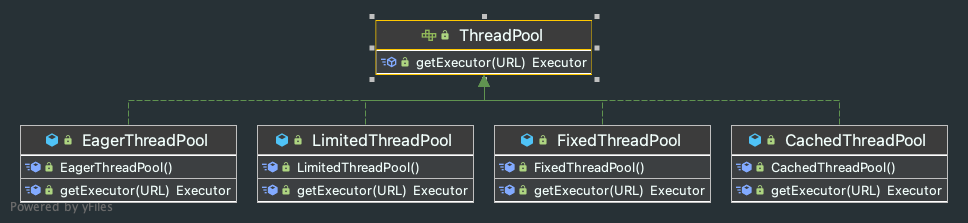

# Dubbo线程池 <!-- {docsify-ignore-all} -->

## 前言

&nbsp; &nbsp; Dubbo使用Netty作为网络调用框架，Netty是一个Reactor模型的框架，线程模型分为boss线程池和worker线程池，boss线程池负责监听、分配事件，worker线程池负责处理事件，简单说就是boss线程池负责hold请求，并分发到worker池，worker线程池负责处理具体事件。

&nbsp; &nbsp; dubbo在原本的netty中的线程（boss线程和worker）做了一些修改，将其定义为io线程，而后由实现了一套用于处理业务的业务线程池，这就和上一篇介绍的[Dubbo协议下的服务端线程模型](https://blog.csdn.net/qq_31279701/article/details/126631650)产生了关联，dubbo的io线程监听请求，业务处理由dubbo自定义的线程池处理，这里将请求分发到具体的业务线程池就是由`Dispatcher`实现的，默认是`AllDispatcher`，上一篇已经简单介绍了Dubbo协议的线程池的分发模型，这篇文章就介绍下Dubbo究竟自定义了哪几种线程池的实现，并且都是怎么实现的。


- 注：Apache Dubbo版本为3.0.7

## Dubbo线程池接口ThreadPool



&nbsp; &nbsp; Dubbo自定义的线程池的核心接口是`org.apache.dubbo.common.threadpool.ThreadPool`，并且提供了四种实现分别是`CachedThreadPool`、`FixedThreadPool`、`LimitedThreadPool`、`EagerThreadPool`，`ThreadPool`接口是`SPI`的，如果不指定线程池的具体实现默认是`fixed`，在项目中配置如下：配置线程池类型是`fixed`，线程数为100，线程模型是`all`

```xml
<dubbo:protocol name="dubbo" dispatcher="all" threadpool="fixed" threads="100" />
```

 `ThreadPool`代码如下，接下来分别简单介绍一下四种线程池的具体实现

```java
@SPI(value = "fixed", scope = ExtensionScope.FRAMEWORK)
public interface ThreadPool {

    /**
     * Thread pool
     *
     * @param url URL contains thread parameter
     * @return thread pool
     */
    @Adaptive({THREADPOOL_KEY})
    Executor getExecutor(URL url);

}
```

## CachedThreadPool缓存线程池

&nbsp; &nbsp; 该线程池是缓存类型的，当空闲到一定时间时会将线程删掉，使用时再创建，具体dubbo的实现如下，代码实现很简单，就是使用JUC的`ThreadPoolExecutor`创建了一个缓存类型的线程池，将maximumPoolSize设置成Integer.MAX_VALUE，keepAliveTime设置成60000毫秒，队列大小设置成0，当超过任务数超过corePoolSize就会直接创建worker线程，当线程空闲60s后就会被销毁。

```java
public class CachedThreadPool implements ThreadPool {

    @Override
    public Executor getExecutor(URL url) {
        String name = url.getParameter(THREAD_NAME_KEY, (String) url.getAttribute(THREAD_NAME_KEY, DEFAULT_THREAD_NAME));
        int cores = url.getParameter(CORE_THREADS_KEY, DEFAULT_CORE_THREADS);
        int threads = url.getParameter(THREADS_KEY, Integer.MAX_VALUE);
        int queues = url.getParameter(QUEUES_KEY, DEFAULT_QUEUES);
        int alive = url.getParameter(ALIVE_KEY, DEFAULT_ALIVE);
        return new ThreadPoolExecutor(cores, threads, alive, TimeUnit.MILLISECONDS,
                queues == 0 ? new SynchronousQueue<Runnable>() :
                        (queues < 0 ? new LinkedBlockingQueue<Runnable>()
                                : new LinkedBlockingQueue<Runnable>(queues)),
                new NamedInternalThreadFactory(name, true), new AbortPolicyWithReport(name, url));
    }
}
```

## FixedThreadPool固定线程数的线程池

&nbsp; &nbsp; 该线程池是固定线程数的线程池实现，具体实现也是使用JUC的`ThreadPoolExecutor`创建了一个固定线程数的线程池，通过url中配置的threads，将corePoolSize和maximumPoolSize都设置成threads的数量，并且keepAliveTime设置成0。

```java
public class FixedThreadPool implements ThreadPool {

    @Override
    public Executor getExecutor(URL url) {
        String name = url.getParameter(THREAD_NAME_KEY, (String) url.getAttribute(THREAD_NAME_KEY, DEFAULT_THREAD_NAME));
        int threads = url.getParameter(THREADS_KEY, DEFAULT_THREADS);
        int queues = url.getParameter(QUEUES_KEY, DEFAULT_QUEUES);
        return new ThreadPoolExecutor(threads, threads, 0, TimeUnit.MILLISECONDS,
                queues == 0 ? new SynchronousQueue<Runnable>() :
                        (queues < 0 ? new LinkedBlockingQueue<Runnable>()
                                : new LinkedBlockingQueue<Runnable>(queues)),
                new NamedInternalThreadFactory(name, true), new AbortPolicyWithReport(name, url));
    }
}
```

## LimitedThreadPool可伸缩线程池

&nbsp; &nbsp; 虽然叫可伸缩线程池，但是实际上只能伸不能缩，官网上说是为了突然大量的流量引起性能问题，具体实现就是将keepAliveTime设置成无限大，这样当队列满了后就会创建线程达到maximumPoolSize，新创建的这些线程因为keepAliveTime设置成无限大所以也不会销毁了。

```java
public class LimitedThreadPool implements ThreadPool {

    @Override
    public Executor getExecutor(URL url) {
        String name = url.getParameter(THREAD_NAME_KEY, (String) url.getAttribute(THREAD_NAME_KEY, DEFAULT_THREAD_NAME));
        int cores = url.getParameter(CORE_THREADS_KEY, DEFAULT_CORE_THREADS);
        int threads = url.getParameter(THREADS_KEY, DEFAULT_THREADS);
        int queues = url.getParameter(QUEUES_KEY, DEFAULT_QUEUES);
        return new ThreadPoolExecutor(cores, threads, Long.MAX_VALUE, TimeUnit.MILLISECONDS,
                queues == 0 ? new SynchronousQueue<Runnable>() :
                        (queues < 0 ? new LinkedBlockingQueue<Runnable>()
                                : new LinkedBlockingQueue<Runnable>(queues)),
                new NamedInternalThreadFactory(name, true), new AbortPolicyWithReport(name, url));
    }

}
```

## EagerThreadPool

&nbsp; &nbsp; Eager单词是渴望的，热切地的意思，这个线程池所实现的逻辑是，当任务数超过corePoolSize但小于maximumPoolSize时不是将新任务放到队列中，而是优先创建新的worker线程，当线程数已经达到maximumPoolSize，接下来新的任务才会放到阻塞队列中，阻塞队列满了会抛出`RejectedExecutionException`。

&nbsp; &nbsp; EagerThreadPool线程池就不是通过JUC的`ThreadPoolExecutor`实现的了，而是继承`ThreadPoolExecutor`自己实现一些逻辑，下面一步一步看。

- EagerThreadPool

&nbsp; &nbsp; Dubbo自己实现了阻塞队列`TaskQueue`和线程池`EagerThreadPoolExecutor`，从`EagerThreadPool`的代码中看不到该类型线程池的核心逻辑，核心逻辑是在`TaskQueue`代码中，这里跳过直接看`TaskQueue`代码。

```java
public class EagerThreadPool implements ThreadPool {

    @Override
    public Executor getExecutor(URL url) {
        String name = url.getParameter(THREAD_NAME_KEY, (String) url.getAttribute(THREAD_NAME_KEY, DEFAULT_THREAD_NAME));
        int cores = url.getParameter(CORE_THREADS_KEY, DEFAULT_CORE_THREADS);
        int threads = url.getParameter(THREADS_KEY, Integer.MAX_VALUE);
        int queues = url.getParameter(QUEUES_KEY, DEFAULT_QUEUES);
        int alive = url.getParameter(ALIVE_KEY, DEFAULT_ALIVE);

        // init queue and executor
        TaskQueue<Runnable> taskQueue = new TaskQueue<Runnable>(queues <= 0 ? 1 : queues);
        EagerThreadPoolExecutor executor = new EagerThreadPoolExecutor(cores,
                threads,
                alive,
                TimeUnit.MILLISECONDS,
                taskQueue,
                new NamedInternalThreadFactory(name, true),
                new AbortPolicyWithReport(name, url));
        taskQueue.setExecutor(executor);
        return executor;
    }
}
```

- TaskQueue

&nbsp; &nbsp; Dubbo的`EagerThreadPool`是通过`TaskQueue`的`offer`方法实现的，逻辑就是当提交到线程池任务时，如果任务数大于`corePoolSize`，会将任务`offer`到`TaskQueue`中，这时如果活跃的线程数大于等于线程池大小，并且当前线程数小于`maximumPoolSize`时就会伪装成放入到队列失败，这时线程池就会创建线程，从而实现超过`corePoolSize`不超过`maximumPoolSize`时创建worker线程而不是将任务放入到队列中。

```java
public class TaskQueue<R extends Runnable> extends LinkedBlockingQueue<Runnable> {

    private static final long serialVersionUID = -2635853580887179627L;

    private EagerThreadPoolExecutor executor;

    public TaskQueue(int capacity) {
        super(capacity);
    }

    public void setExecutor(EagerThreadPoolExecutor exec) {
        executor = exec;
    }

    @Override
    public boolean offer(Runnable runnable) {
        if (executor == null) {
            throw new RejectedExecutionException("The task queue does not have executor!");
        }

        int currentPoolThreadSize = executor.getPoolSize();
        // have free worker. put task into queue to let the worker deal with task.
        if (executor.getActiveCount() < currentPoolThreadSize) {
            return super.offer(runnable);
        }

        // 伪装放入队列失败，让线程池创建线程
        if (currentPoolThreadSize < executor.getMaximumPoolSize()) {
            return false;
        }

        // currentPoolThreadSize >= max
        return super.offer(runnable);
    }

    /**
     * retry offer task
     *
     * @param o task
     * @return offer success or not
     * @throws RejectedExecutionException if executor is terminated.
     */
    public boolean retryOffer(Runnable o, long timeout, TimeUnit unit) throws InterruptedException {
        if (executor.isShutdown()) {
            throw new RejectedExecutionException("Executor is shutdown!");
        }
        return super.offer(o, timeout, unit);
    }
}
```

- EagerThreadPoolExecutor

&nbsp; &nbsp; 当任务数大于`maximumPoolSize`时，线程池会抛出`RejectedExecutionException`，`EagerThreadPoolExecutor`捕获这个异常，并且调用`TaskQueue`的`retryOffer`方法尝试放入队列，这样就实现了当线程数已经达到maximumPoolSize，接下来新的任务才会放到阻塞队列中，阻塞队列满了会抛出`RejectedExecutionException`，代码如下：

```java
public class EagerThreadPoolExecutor extends ThreadPoolExecutor {

    public EagerThreadPoolExecutor(int corePoolSize,
                                   int maximumPoolSize,
                                   long keepAliveTime,
                                   TimeUnit unit, TaskQueue<Runnable> workQueue,
                                   ThreadFactory threadFactory,
                                   RejectedExecutionHandler handler) {
        super(corePoolSize, maximumPoolSize, keepAliveTime, unit, workQueue, threadFactory, handler);
    }

    @Override
    public void execute(Runnable command) {
        if (command == null) {
            throw new NullPointerException();
        }

        try {
            super.execute(command);
        } catch (RejectedExecutionException rx) {
            // 重新尝试将任务放到队列中.
            final TaskQueue queue = (TaskQueue) super.getQueue();
            try {
                if (!queue.retryOffer(command, 0, TimeUnit.MILLISECONDS)) {
                    throw new RejectedExecutionException("Queue capacity is full.", rx);
                }
            } catch (InterruptedException x) {
                throw new RejectedExecutionException(x);
            }
        }
    }
}
```

## 总结

&nbsp; &nbsp; Dubbo实现了自定义线程池，其核心接口是`ThreadPool`，该接口是`SPI`的默认的实现是`fixed`，Dubbo提供了四种实现，分别是`CachedThreadPool`、`FixedThreadPool`、`LimitedThreadPool`、`EagerThreadPool`。