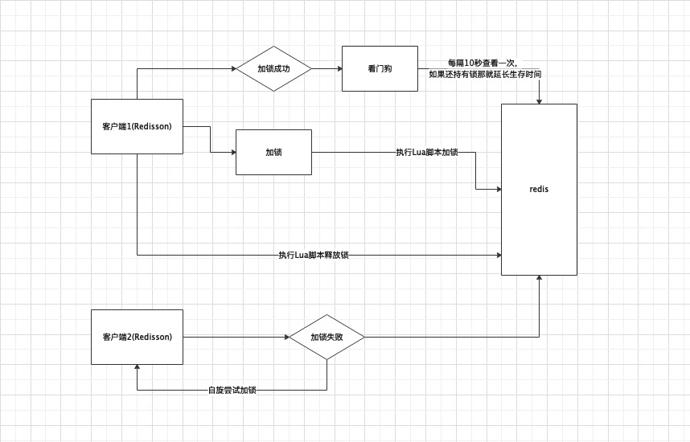

# Redisson分布式锁开门狗

## 目标

- Redisson分布式锁看门狗机制
- 源码分析

## Redisson分布式锁看门狗机制

&nbsp; &nbsp; 我们在[上篇文章](https://juejin.cn/post/6942117752198922247)中分析了`Redisson`加锁和解锁的流程，总体看逻辑还算清晰，主要是使用异步执行`lua`脚本进行加锁，但是其中有些细节，之前并没有细说，比如`RedissonLock`中的`internalLockLeaseTime`，该变量默认初始值`30000`毫秒，并且`Config`类中默认值变量的命名也很有意思`lockWatchdogTimeout`，字面上的意思`监视锁的狗`，这就引入了`Redisson`锁的看门狗机制，但是看门狗究竟是做什么的呢？我们继续思考。

&nbsp; &nbsp; 假设在一个分布式的环境中，多个服务实例都来获取锁，这个时候服务实例1获取到了锁，假设服务实例1在获取锁后挂掉、hang住、宕机会怎么样呢？回顾之前的加锁流程，在加锁时我们给锁设置了一个过期时间，所以当服务实例1宕机后，当锁达到超时时间，锁还是会释放掉的；假设，服务实例1没有宕机，而是业务执行时间过长，超过了锁的超时时间呢？这个时候就会导致，服务实例1还在执行，但是锁释放了，这时其他服务实例是能够抢占这个锁的，所以，这种情况下就需要过期时间能够延续的机制，这时`看门狗`就出现了。下面我们看一下`Redisson`可重入锁的看门狗机制实现的源码

## 源码分析

### Redisson异步加锁

&nbsp; &nbsp; 在`RedisExecutor`类中在异步执行完`Lua`脚本后会设置一个监听，代码如下：

```
            writeFuture.addListener(new ChannelFutureListener() {
                @Override
                public void operationComplete(ChannelFuture future) throws Exception {
                    checkWriteFuture(writeFuture, attemptPromise, connection);
                }
            });
```

&nbsp; &nbsp; 上面的详细的代码这里先不看了，大概逻辑是，当上锁失败时直接返回，当上锁成功后就会同步获取结果，当上锁成功后`Lua`脚本返回结果是`nil`，这个时候当获取锁成功`ttlRemaining`等于`null`，所以会走到`scheduleExpirationRenewal`方法。


```
    private <T> RFuture<Long> tryAcquireAsync(long leaseTime, TimeUnit unit, long threadId) {
        if (leaseTime != -1) {
            return tryLockInnerAsync(leaseTime, unit, threadId, RedisCommands.EVAL_LONG);
        }
        RFuture<Long> ttlRemainingFuture = tryLockInnerAsync(commandExecutor.getConnectionManager().getCfg().getLockWatchdogTimeout(), TimeUnit.MILLISECONDS, threadId, RedisCommands.EVAL_LONG);
        ttlRemainingFuture.onComplete((ttlRemaining, e) -> {
            // 如果获取锁失败，直接返回
            if (e != null) {
                return;
            }

            // 获取到锁，执行scheduleExpirationRenewal
            if (ttlRemaining == null) {
                scheduleExpirationRenewal(threadId);
            }
        });
        return ttlRemainingFuture;
    }
```

&nbsp; &nbsp; 下面是`scheduleExpirationRenewal`方法的代码，代码逻辑首先是`EXPIRATION_RENEWAL_MAP`中获取要延长过期时间的锁信息（姑且就叫锁信息吧），这个`map`是存储的是要延期过期时间的锁的信息，这里如果是第一次这个mao肯定是空的，所以会走到`else`中，执行`renewExpiration()`方法。

```
    private void scheduleExpirationRenewal(long threadId) {
        ExpirationEntry entry = new ExpirationEntry();
        ExpirationEntry oldEntry = EXPIRATION_RENEWAL_MAP.putIfAbsent(getEntryName(), entry);
        if (oldEntry != null) {
            oldEntry.addThreadId(threadId);
        } else {
            entry.addThreadId(threadId);
            renewExpiration();
        }
    }
```

&nbsp; &nbsp; 下面是`renewExpiration`方法代码，首先从`EXPIRATION_RENEWAL_MAP`获取要延期的锁信息，如果获取不到直接返回，否则的话会搞一个`TimerTask`，计算了一个timer的定时执行周期`internalLockLeaseTime / 3`按默认值算该是10秒，定时任务中的执行逻辑是先从`Map`中获取获取要进行延期的锁信息，如果获取不到就直接返回了，如果存在获取加锁的线程ID，获取不到加锁线程ID的话也会直接返回，再往后会执行到`renewExpirationAsync`方法，该方法是异步执行`Lua`这个一会儿再看，异步执行`Lua`后会执行`onComplete`，如果有异常会打印日志并返回，否则重新进行定时任务的`renewExpiration`。

```
    private void renewExpiration() {
        ExpirationEntry ee = EXPIRATION_RENEWAL_MAP.get(getEntryName());
        if (ee == null) {
            return;
        }
        
        Timeout task = commandExecutor.getConnectionManager().newTimeout(new TimerTask() {
            @Override
            public void run(Timeout timeout) throws Exception {
                ExpirationEntry ent = EXPIRATION_RENEWAL_MAP.get(getEntryName());
                if (ent == null) {
                    return;
                }
                Long threadId = ent.getFirstThreadId();
                if (threadId == null) {
                    return;
                }
                
                RFuture<Boolean> future = renewExpirationAsync(threadId);
                future.onComplete((res, e) -> {
                    if (e != null) {
                        log.error("Can't update lock " + getName() + " expiration", e);
                        return;
                    }
                    
                    if (res) {
                        // reschedule itself
                        renewExpiration();
                    }
                });
            }
        }, internalLockLeaseTime / 3, TimeUnit.MILLISECONDS);
        
        ee.setTimeout(task);
    }
```

&nbsp; &nbsp; 下面是`renewExpirationAsync`方法代码，该方法是异步执行`Lua`脚本，脚本的逻辑是首先判断这个锁key的map结构中是否存在对应的锁信息，如果存在，就直接调用pexpire命令设置锁key的过期时间,默认30000毫秒，所以，到这里思路就清晰了，在锁还没有失效，也就是服务该没有宕机的情况下，如果服务实例没有主动释放锁，看门口都会每10秒将锁的过期时间延期30秒。这样就保证了获取锁的实例即使在处理业务时超过了过期时间，锁仍然掌握在自己手中。

```
    protected RFuture<Boolean> renewExpirationAsync(long threadId) {
        return commandExecutor.evalWriteAsync(getName(), LongCodec.INSTANCE, RedisCommands.EVAL_BOOLEAN,
                "if (redis.call('hexists', KEYS[1], ARGV[2]) == 1) then " +
                    "redis.call('pexpire', KEYS[1], ARGV[1]); " +
                    "return 1; " +
                "end; " +
                "return 0;",
            Collections.<Object>singletonList(getName()), 
            internalLockLeaseTime, getLockName(threadId));
    }
```

## 总结

&nbsp; &nbsp; 通过上一篇文章和本篇文章，大致能够理清Redisson可重入锁的加锁/解锁和看门狗的机制了，画了下面一张图，描述下这个流程。

  