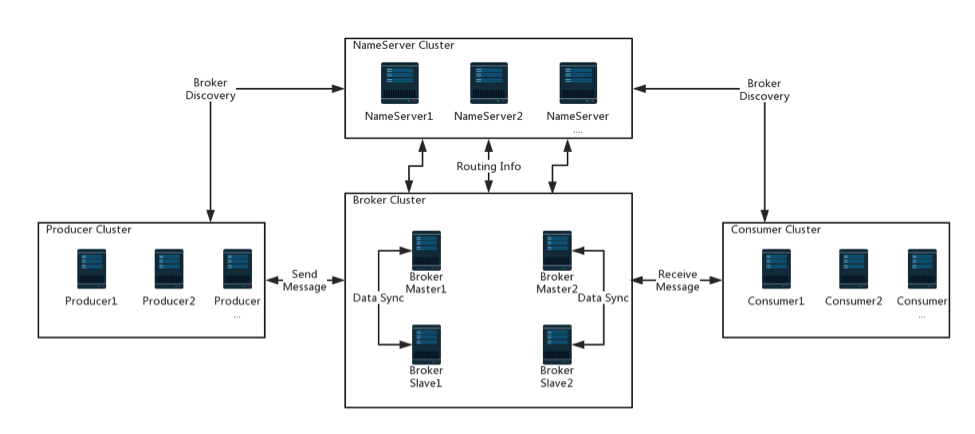
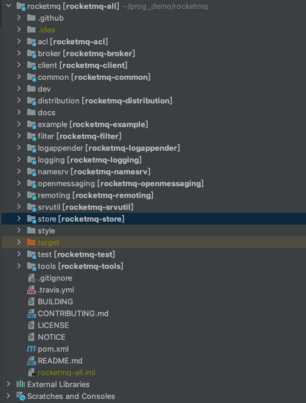

# RocketMQ源码解析-本地环境搭建


## 目标

- RocketMQ简介及架构
- 源码获取和编译
- 核心源码结构
- 启动Namesrv
- 启动Broker
- 启动Producer
- 启动Consumer

## RocketMQ简介及架构

### RocketMQ简介

RocketMQ是一个开源的分布式消息中间件，由阿里开源，现已成为apache的顶级开源项目，具有高性能，高可靠，高实时，分布式等特点，其应用场景如下

1. 异步通信：异步通信，减少线程等待，特别是处理批量等大事务、耗时操作。 
2. 系统解耦：系统不直接调用，降低依赖，特别是不在线也能保持通信最终完成。 
3. 削峰平谷：压力大的时候，缓冲部分请求消息，类似于背压处理。 
4. 可靠通信：提供多种消息模式、服务质量、顺序保障等。

### RocketMQ架构



- NameServer：NameServer是一个功能齐全的服务器，其角色类似dubbo中的zookeeper，支持Broker的动态注册与发现。主要包括两个功能：

 Broker管理：NameServer接受Broker集群的注册信息并且保存下来作为路由信息的基本数据。然后提供心跳检测机制，检查Broker是否还存活。

 路由信息管理：每个NameServer将保存关于Broker集群的整个路由信息和用于客户端查询的队列信息。然后Producer和Conumser通过NameServer就可以知道整个Broker集群的路由信息，从而进行消息的投递和消费。NameServer通常也是集群的方式部署，各实例间相互不进行信息通讯。Broker是向每一台NameServer注册自己的路由信息，所以每一个NameServer实例上面都保存一份完整的路由信息。当某个NameServer因某种原因下线了，Broker仍然可以向其它NameServer同步其路由信息，Produce,Consumer仍然可以动态感知Broker的路由的信息。
- Producer：消息发布的角色，支持分布式集群方式部署。producer通过MQ的负载均衡模块选择相应的Broker集群队列进行消息投递。投递的过程支持快速失败并且低延迟。
- Consumer：消息消费者的角色，支持分布式集群方式部署。支持以push推，pull拉两种模式对消息进行消费。同时也支持集群方式和广播形式的消费，它提供实时消息订阅机制，可以满足大多数用户的需求。
- Broker：负责消息存储，投递，查询已经保证高可用等功能。

## 源码获取和编译

### 依赖工具

- JDK：1.8+
- Maven
- IDEA

### 源码拉取

1. `fork`源码到自己的`github`
2. `clone`自己GitHub的源码到本地
3. IDEA打开项目
4. 执行`mvn clean install`编译源码，此过程较慢，如果想快速编译可以选择跳过单元测试，doc，checkstyle等

## 核心源码结构



源码的核心模块有

- broker：核心消息处理
- client：客户端
- common：一些通用配置，数据结构等的封装
- namesrv：rocketmq注册中心
- remoting：通信模块
- store：存储

## 启动Namesrv

&nbsp; &nbsp; 为了方便调试代码，我们直接仿照单元测试，在单元测试中编写启动代码，打开`org.apache.rocketmq.namesrv.NameServerInstanceTest`，参考`startup()`方法编写一个`main`方法。代码如下：

```
    public static void main(String[] args) throws Exception {
        final NettyServerConfig config = new NettyServerConfig();
        config.setListenPort(9876);
        final NamesrvController controller = new NamesrvController(new NamesrvConfig(), config);
        controller.initialize();
        controller.start();
    }
```
控制台打印以下日志启动成功

```
16:05:03.447 [main] INFO  RocketmqRemoting - Using OpenSSL provider
16:05:03.786 [main] INFO  RocketmqRemoting - SSLContext created for server
16:05:03.802 [main] DEBUG i.n.u.i.JavassistTypeParameterMatcherGenerator - Generated: io.netty.util.internal.__matchers__.io.netty.buffer.ByteBufMatcher
16:05:03.806 [main] DEBUG i.n.u.i.JavassistTypeParameterMatcherGenerator - Generated: io.netty.util.internal.__matchers__.org.apache.rocketmq.remoting.protocol.RemotingCommandMatcher
16:05:03.863 [main] DEBUG io.netty.util.NetUtil - Loopback interface: lo0 (lo0, 0:0:0:0:0:0:0:1%lo0)
16:05:03.883 [main] INFO  RocketmqCommon - Try to start service thread:FileWatchService started:false lastThread:null
16:05:03.883 [NettyEventExecutor] INFO  RocketmqRemoting - NettyEventExecutor service started
16:05:03.883 [FileWatchService] INFO  RocketmqCommon - FileWatchService service started
```

## 启动Broker

&nbsp; &nbsp; 打开`org.apache.rocketmq.broker.BrokerControllerTest`编写启动代码，代码如下：

```
    public static void main(String[] args) throws Exception {
        // 设置版本号
        System.setProperty(RemotingCommand.REMOTING_VERSION_KEY, Integer.toString(MQVersion.CURRENT_VERSION));
        // NettyServer 配置
        NettyServerConfig serverConfig = new NettyServerConfig();
        // broker监听端口
        serverConfig.setListenPort(10990);
        // Broker配置
        BrokerConfig brokerConfig = new BrokerConfig();
        // broker名字
        brokerConfig.setBrokerName("broker-test-1");
        // NameServer地址
        brokerConfig.setNamesrvAddr("127.0.0.1:9876");
        // 消息存储配置
        MessageStoreConfig messageStoreConfig = new MessageStoreConfig();
        messageStoreConfig.setDeleteWhen("04");
        messageStoreConfig.setFileReservedTime(48);
        // 异步刷盘
        messageStoreConfig.setFlushDiskType(FlushDiskType.ASYNC_FLUSH);
        messageStoreConfig.setDuplicationEnable(false);

        // 启动Broker
        BrokerController controller = new BrokerController(brokerConfig, serverConfig, new NettyClientConfig(), messageStoreConfig);
        controller.initialize();
        controller.start();
    }
```

启动`BrokerControllerTest`，打开`Namesrv`控制台，可以看到`broker`注册的日志，日志如下：

```
19:17:56.785 [RemotingExecutorThread_1] DEBUG RocketmqNamesrv - receive request, 103 127.0.0.1:55208 RemotingCommand [code=103, language=JAVA, version=373, opaque=0, flag(B)=0, remark=null, extFields={brokerId=0, bodyCrc32=461442696, clusterName=DefaultCluster, brokerAddr=192.168.3.78:10990, haServerAddr=192.168.3.78:10912, compressed=false, brokerName=broker-test-1}, serializeTypeCurrentRPC=JSON]
19:17:56.821 [RemotingExecutorThread_1] INFO  RocketmqNamesrv - new topic registered, SCHEDULE_TOPIC_XXXX QueueData [brokerName=broker-test-1, readQueueNums=18, writeQueueNums=18, perm=6, topicSynFlag=0]
19:17:56.821 [RemotingExecutorThread_1] INFO  RocketmqNamesrv - new topic registered, DefaultCluster_REPLY_TOPIC QueueData [brokerName=broker-test-1, readQueueNums=1, writeQueueNums=1, perm=6, topicSynFlag=0]
19:17:56.821 [RemotingExecutorThread_1] INFO  RocketmqNamesrv - new topic registered, BenchmarkTest QueueData [brokerName=broker-test-1, readQueueNums=1024, writeQueueNums=1024, perm=6, topicSynFlag=0]
19:17:56.821 [RemotingExecutorThread_1] INFO  RocketmqNamesrv - new topic registered, OFFSET_MOVED_EVENT QueueData [brokerName=broker-test-1, readQueueNums=1, writeQueueNums=1, perm=6, topicSynFlag=0]
19:17:56.821 [RemotingExecutorThread_1] INFO  RocketmqNamesrv - new topic registered, TopicTest QueueData [brokerName=broker-test-1, readQueueNums=4, writeQueueNums=4, perm=6, topicSynFlag=0]
19:17:56.821 [RemotingExecutorThread_1] INFO  RocketmqNamesrv - new topic registered, TBW102 QueueData [brokerName=broker-test-1, readQueueNums=8, writeQueueNums=8, perm=7, topicSynFlag=0]
19:17:56.821 [RemotingExecutorThread_1] INFO  RocketmqNamesrv - new topic registered, SELF_TEST_TOPIC QueueData [brokerName=broker-test-1, readQueueNums=1, writeQueueNums=1, perm=6, topicSynFlag=0]
19:17:56.821 [RemotingExecutorThread_1] INFO  RocketmqNamesrv - new topic registered, DefaultCluster QueueData [brokerName=broker-test-1, readQueueNums=16, writeQueueNums=16, perm=7, topicSynFlag=0]
19:17:56.821 [RemotingExecutorThread_1] INFO  RocketmqNamesrv - new topic registered, broker-test-1 QueueData [brokerName=broker-test-1, readQueueNums=1, writeQueueNums=1, perm=7, topicSynFlag=0]
19:17:56.822 [RemotingExecutorThread_1] INFO  RocketmqNamesrv - new broker registered, 192.168.3.78:10990 HAServer: 192.168.3.78:10912
```

## 启动Producer

&nbsp; &nbsp; 打开`org.apache.rocketmq.example.quickstart.Producer`，添加`NameServer`的代码，代码如下：
```
public class Producer {
    public static void main(String[] args) throws MQClientException, InterruptedException {

        /*
         * Instantiate with a producer group name.
         */
        DefaultMQProducer producer = new DefaultMQProducer("please_rename_unique_group_name");

        /*
         * Specify name server addresses.
         * <p/>
         *
         * Alternatively, you may specify name server addresses via exporting environmental variable: NAMESRV_ADDR
         * <pre>
         * {@code
         * producer.setNamesrvAddr("name-server1-ip:9876;name-server2-ip:9876");
         * }
         * </pre>
         */

        /*
         * Launch the instance.
         */
        // 指定NameServer
        producer.setNamesrvAddr("127.0.0.1:9876");
        producer.start();

        for (int i = 0; i < 1000; i++) {
            try {

                /*
                 * Create a message instance, specifying topic, tag and message body.
                 */
                Message msg = new Message("TopicTest" /* Topic */,
                    "TagA" /* Tag */,
                    ("Hello RocketMQ " + i).getBytes(RemotingHelper.DEFAULT_CHARSET) /* Message body */
                );

                /*
                 * Call send message to deliver message to one of brokers.
                 */
                SendResult sendResult = producer.send(msg);

                System.out.printf("%s%n", sendResult);
            } catch (Exception e) {
                e.printStackTrace();
                Thread.sleep(1000);
            }
        }

        /*
         * Shut down once the producer instance is not longer in use.
         */
        producer.shutdown();
    }
}
```

生产消息日志：

```
...省略掉的日志
SendResult [sendStatus=SEND_OK, msgId=7F000001733818B4AAC25BB09DEF03E7, offsetMsgId=C0A8034E00002AEE0000000000063049, messageQueue=MessageQueue [topic=TopicTest, brokerName=broker-test-1, queueId=3], queueOffset=499]
19:18:21.433 [NettyClientSelector_1] INFO  RocketmqRemoting - closeChannel: close the connection to remote address[192.168.3.78:10990] result: true
19:18:21.434 [NettyClientSelector_1] INFO  RocketmqRemoting - closeChannel: close the connection to remote address[127.0.0.1:9876] result: true
```


## 启动Consumer

&nbsp; &nbsp; 

打开`org.apache.rocketmq.example.quickstart.Consumer`，添加`NameServer`的代码，代码如下：

```
public class Consumer {

    public static void main(String[] args) throws InterruptedException, MQClientException {

        /*
         * Instantiate with specified consumer group name.
         */
        DefaultMQPushConsumer consumer = new DefaultMQPushConsumer("please_rename_unique_group_name_4");

        /*
         * Specify name server addresses.
         * <p/>
         *
         * Alternatively, you may specify name server addresses via exporting environmental variable: NAMESRV_ADDR
         * <pre>
         * {@code
         * consumer.setNamesrvAddr("name-server1-ip:9876;name-server2-ip:9876");
         * }
         * </pre>
         */

        /*
         * Specify where to start in case the specified consumer group is a brand new one.
         */
        consumer.setConsumeFromWhere(ConsumeFromWhere.CONSUME_FROM_FIRST_OFFSET);

        /*
         * Subscribe one more more topics to consume.
         */
        consumer.subscribe("TopicTest", "*");

        /*
         *  Register callback to execute on arrival of messages fetched from brokers.
         */
        consumer.setNamesrvAddr("127.0.0.1:9876");
        consumer.registerMessageListener(new MessageListenerConcurrently() {

            @Override
            public ConsumeConcurrentlyStatus consumeMessage(List<MessageExt> msgs,
                ConsumeConcurrentlyContext context) {
                System.out.printf("%s Receive New Messages: %s %n", Thread.currentThread().getName(), msgs);
                return ConsumeConcurrentlyStatus.CONSUME_SUCCESS;
            }
        });

        /*
         *  Launch the consumer instance.
         */
        consumer.start();

        System.out.printf("Consumer Started.%n");
    }
}
```
消费日志

```
...省略日志
ConsumeMessageThread_1 Receive New Messages: [MessageExt [brokerName=broker-test-1, queueId=0, storeSize=203, queueOffset=490, sysFlag=0, bornTimestamp=1618744701398, bornHost=/192.168.3.78:55276, storeTimestamp=1618744701398, storeHost=/192.168.3.78:10990, msgId=C0A8034E00002AEE000000000006115C, commitLogOffset=397660, bodyCRC=1481448304, reconsumeTimes=0, preparedTransactionOffset=0, toString()=Message{topic='TopicTest', flag=0, properties={MIN_OFFSET=0, MAX_OFFSET=500, CONSUME_START_TIME=1618744822257, UNIQ_KEY=7F000001733818B4AAC25BB09DD603C0, CLUSTER=DefaultCluster, WAIT=true, TAGS=TagA}, body=[72, 101, 108, 108, 111, 32, 82, 111, 99, 107, 101, 116, 77, 81, 32, 57, 54, 48], transactionId='null'}]] 
ConsumeMessageThread_12 Receive New Messages: [MessageExt [brokerName=broker-test-1, queueId=0, storeSize=203, queueOffset=489, sysFlag=0, bornTimestamp=1618744701395, bornHost=/192.168.3.78:55276, storeTimestamp=1618744701395, storeHost=/192.168.3.78:10990, msgId=C0A8034E00002AEE0000000000060E30, commitLogOffset=396848, bodyCRC=436465030, reconsumeTimes=0, preparedTransactionOffset=0, toString()=Message{topic='TopicTest', flag=0, properties={MIN_OFFSET=0, MAX_OFFSET=500, CONSUME_START_TIME=1618744822257, UNIQ_KEY=7F000001733818B4AAC25BB09DD303BC, CLUSTER=DefaultCluster, WAIT=true, TAGS=TagA}, body=[72, 101, 108, 108, 111, 32, 82, 111, 99, 107, 101, 116, 77, 81, 32, 57, 53, 54], transactionId='null'}]] 
ConsumeMessageThread_5 Receive New Messages: [MessageExt [brokerName=broker-test-1, queueId=0, storeSize=203, queueOffset=488, sysFlag=0, bornTimestamp=1618744701393, bornHost=/192.168.3.78:55276, storeTimestamp=1618744701393, storeHost=/192.168.3.78:10990, msgId=C0A8034E00002AEE0000000000060B04, commitLogOffset=396036, bodyCRC=493758879, reconsumeTimes=0, preparedTransactionOffset=0, toString()=Message{topic='TopicTest', flag=0, properties={MIN_OFFSET=0, MAX_OFFSET=500, CONSUME_START_TIME=1618744822257, UNIQ_KEY=7F000001733818B4AAC25BB09DD103B8, CLUSTER=DefaultCluster, WAIT=true, TAGS=TagA}, body=[72, 101, 108, 108, 111, 32, 82, 111, 99, 107, 101, 116, 77, 81, 32, 57, 53, 50], transactionId='null'}]] 
ConsumeMessageThread_6 Receive New Messages: [MessageExt [brokerName=broker-test-1, queueId=0, storeSize=203, queueOffset=487, sysFlag=0, bornTimestamp=1618744701391, bornHost=/192.168.3.78:55276, storeTimestamp=1618744701391, storeHost=/192.168.3.78:10990, msgId=C0A8034E00002AEE00000000000607D8, commitLogOffset=395224, bodyCRC=1688269248, reconsumeTimes=0, preparedTransactionOffset=0, toString()=Message{topic='TopicTest', flag=0, properties={MIN_OFFSET=0, MAX_OFFSET=500, CONSUME_START_TIME=1618744822257, UNIQ_KEY=7F000001733818B4AAC25BB09DCF03B4, CLUSTER=DefaultCluster, WAIT=true, TAGS=TagA}, body=[72, 101, 108, 108, 111, 32, 82, 111, 99, 107, 101, 116, 77, 81, 32, 57, 52, 56], transactionId='null'}]] 
ConsumeMessageThread_2 Receive New Messages: [MessageExt [brokerName=broker-test-1, queueId=0, storeSize=203, queueOffset=486, sysFlag=0, bornTimestamp=1618744701389, bornHost=/192.168.3.78:55276, storeTimestamp=1618744701389, storeHost=/192.168.3.78:10990, msgId=C0A8034E00002AEE00000000000604AC, commitLogOffset=394412, bodyCRC=1830206955, reconsumeTimes=0, preparedTransactionOffset=0, toString()=Message{topic='TopicTest', flag=0, properties={MIN_OFFSET=0, MAX_OFFSET=500, CONSUME_START_TIME=1618744822256, UNIQ_KEY=7F000001733818B4AAC25BB09DCD03B0, CLUSTER=DefaultCluster, WAIT=true, TAGS=TagA}, body=[72, 101, 108, 108, 111, 32, 82, 111, 99, 107, 101, 116, 77, 81, 32, 57, 52, 52], transactionId='null'}]] 
ConsumeMessageThread_14 Receive New Messages: [MessageExt [brokerName=broker-test-1, queueId=0, storeSize=203, queueOffset=485, sysFlag=0, bornTimestamp=1618744701387, bornHost=/192.168.3.78:55276, storeTimestamp=1618744701387, storeHost=/192.168.3.78:10990, msgId=C0A8034E00002AEE0000000000060180, commitLogOffset=393600, bodyCRC=1786477042, reconsumeTimes=0, preparedTransactionOffset=0, toString()=Message{topic='TopicTest', flag=0, properties={MIN_OFFSET=0, MAX_OFFSET=500, CONSUME_START_TIME=1618744822256, UNIQ_KEY=7F000001733818B4AAC25BB09DCB03AC, CLUSTER=DefaultCluster, WAIT=true, TAGS=TagA}, body=[72, 101, 108, 108, 111, 32, 82, 111, 99, 107, 101, 116, 77, 81, 32, 57, 52, 48], transactionId='null'}]] 

```