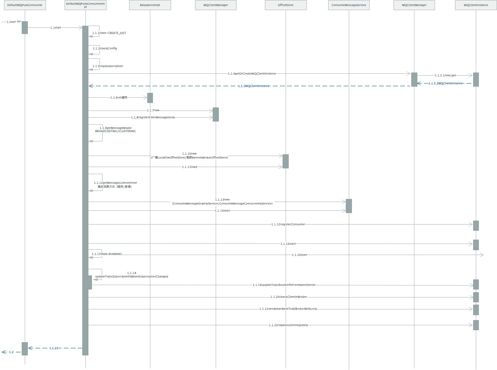

# RocketMQ源码解析-Consumer启动流程分析

## 消费者Demo，参考官方源码`org.apache.rocketmq.example.quickstart.Consumer`

```
public class Consumer {

    public static void main(String[] args) throws InterruptedException, MQClientException {

        /*
         * Instantiate with specified consumer group name.
         */
        DefaultMQPushConsumer consumer = new DefaultMQPushConsumer("please_rename_unique_group_name_4");

        /*
         * Specify name server addresses.
         * <p/>
         *
         * Alternatively, you may specify name server addresses via exporting environmental variable: NAMESRV_ADDR
         * <pre>
         * {@code
         * consumer.setNamesrvAddr("name-server1-ip:9876;name-server2-ip:9876");
         * }
         * </pre>
         */

        /*
         * Specify where to start in case the specified consumer group is a brand new one.
         */
        consumer.setConsumeFromWhere(ConsumeFromWhere.CONSUME_FROM_FIRST_OFFSET);

        /*
         * Subscribe one more more topics to consume.
         * 订阅topic
         */
        consumer.subscribe("TopicTest", "*");

        /*
         *  Register callback to execute on arrival of messages fetched from brokers.
         */
        consumer.setNamesrvAddr("127.0.0.1:9876");
        // 消息监听
        consumer.registerMessageListener(new MessageListenerConcurrently() {

            @Override
            public ConsumeConcurrentlyStatus consumeMessage(List<MessageExt> msgs,
                ConsumeConcurrentlyContext context) {
                System.out.printf("%s Receive New Messages: %s %n", Thread.currentThread().getName(), msgs);
                return ConsumeConcurrentlyStatus.CONSUME_SUCCESS;
            }
        });

        /*
         *  Launch the consumer instance.
         */
        consumer.start();

        System.out.printf("Consumer Started.%n");
    }
}
```

## 启动流程分析

### 根据指定的消费组名称实例化DefaultMQPushConsumer

```
    public DefaultMQPushConsumer(final String namespace, final String consumerGroup, RPCHook rpcHook,
        AllocateMessageQueueStrategy allocateMessageQueueStrategy) {
        this.consumerGroup = consumerGroup;
        this.namespace = namespace;
        this.allocateMessageQueueStrategy = allocateMessageQueueStrategy;
        // 实例化DefaultMQPushConsumerImpl
        defaultMQPushConsumerImpl = new DefaultMQPushConsumerImpl(this, rpcHook);
    }
```

### 订阅Topic

DefaultMQPushConsumerImpl#subscribe
```
    public void subscribe(String topic, String subExpression) throws MQClientException {
        try {
            SubscriptionData subscriptionData = FilterAPI.buildSubscriptionData(this.defaultMQPushConsumer.getConsumerGroup(),
                topic, subExpression);
            // 更新订阅信息
            this.rebalanceImpl.getSubscriptionInner().put(topic, subscriptionData);
            if (this.mQClientFactory != null) {
                this.mQClientFactory.sendHeartbeatToAllBrokerWithLock();
            }
        } catch (Exception e) {
            throw new MQClientException("subscription exception", e);
        }
    }
```

### 消息监听初始化

DefaultMQPushConsumer#registerMessageListener
```
    @Override
    public void registerMessageListener(MessageListenerConcurrently messageListener) {
        this.messageListener = messageListener;
        this.defaultMQPushConsumerImpl.registerMessageListener(messageListener);
    }
```

DefaultMQPushConsumerImpl#registerMessageListener
```
    public void registerMessageListener(MessageListener messageListener) {
        this.messageListenerInner = messageListener;
    }
```

### 消费者start

DefaultMQPushConsumer#start

```
    @Override
    public void start() throws MQClientException {
        // 初始化消费者组
        setConsumerGroup(NamespaceUtil.wrapNamespace(this.getNamespace(), this.consumerGroup));
        // 消费者start
        this.defaultMQPushConsumerImpl.start();
        if (null != traceDispatcher) {
            try {
                traceDispatcher.start(this.getNamesrvAddr(), this.getAccessChannel());
            } catch (MQClientException e) {
                log.warn("trace dispatcher start failed ", e);
            }
        }
    }
```

DefaultMQPushConsumerImpl#start

```
    public synchronized void start() throws MQClientException {
        switch (this.serviceState) {
            case CREATE_JUST:
                log.info("the consumer [{}] start beginning. messageModel={}, isUnitMode={}", this.defaultMQPushConsumer.getConsumerGroup(),
                    this.defaultMQPushConsumer.getMessageModel(), this.defaultMQPushConsumer.isUnitMode());
                this.serviceState = ServiceState.START_FAILED;

                this.checkConfig();

                this.copySubscription();
                // 集群消费
                if (this.defaultMQPushConsumer.getMessageModel() == MessageModel.CLUSTERING) {
                    this.defaultMQPushConsumer.changeInstanceNameToPID();
                }

                // MQ Client
                this.mQClientFactory = MQClientManager.getInstance().getOrCreateMQClientInstance(this.defaultMQPushConsumer, this.rpcHook);

                // rebalance模块初始化属性
                this.rebalanceImpl.setConsumerGroup(this.defaultMQPushConsumer.getConsumerGroup());
                this.rebalanceImpl.setMessageModel(this.defaultMQPushConsumer.getMessageModel());
                this.rebalanceImpl.setAllocateMessageQueueStrategy(this.defaultMQPushConsumer.getAllocateMessageQueueStrategy());
                this.rebalanceImpl.setmQClientFactory(this.mQClientFactory);

                this.pullAPIWrapper = new PullAPIWrapper(
                    mQClientFactory,
                    this.defaultMQPushConsumer.getConsumerGroup(), isUnitMode());
                this.pullAPIWrapper.registerFilterMessageHook(filterMessageHookList);

                if (this.defaultMQPushConsumer.getOffsetStore() != null) {
                    this.offsetStore = this.defaultMQPushConsumer.getOffsetStore();
                } else {
                    switch (this.defaultMQPushConsumer.getMessageModel()) {
                        // 广播模式
                        case BROADCASTING:
                            // offset存储初始化，广播模式采用文件方式
                            this.offsetStore = new LocalFileOffsetStore(this.mQClientFactory, this.defaultMQPushConsumer.getConsumerGroup());
                            break;
                        // 集群模式
                        case CLUSTERING:
                            // offset存储初始化，集群模式采用远程broker存储方式
                            this.offsetStore = new RemoteBrokerOffsetStore(this.mQClientFactory, this.defaultMQPushConsumer.getConsumerGroup());
                            break;
                        default:
                            break;
                    }
                    this.defaultMQPushConsumer.setOffsetStore(this.offsetStore);
                }
                this.offsetStore.load();
                // 顺序消费
                if (this.getMessageListenerInner() instanceof MessageListenerOrderly) {
                    this.consumeOrderly = true;
                    this.consumeMessageService =
                        new ConsumeMessageOrderlyService(this, (MessageListenerOrderly) this.getMessageListenerInner());
                // 非顺序的，并发消费
                } else if (this.getMessageListenerInner() instanceof MessageListenerConcurrently) {
                    this.consumeOrderly = false;
                    this.consumeMessageService =
                        new ConsumeMessageConcurrentlyService(this, (MessageListenerConcurrently) this.getMessageListenerInner());
                }

                this.consumeMessageService.start();
                // 注册consumer到namesrv
                boolean registerOK = mQClientFactory.registerConsumer(this.defaultMQPushConsumer.getConsumerGroup(), this);
                // 注册失败，消费者已存在
                if (!registerOK) {
                    this.serviceState = ServiceState.CREATE_JUST;
                    // shutdown消费消息线程
                    this.consumeMessageService.shutdown(defaultMQPushConsumer.getAwaitTerminationMillisWhenShutdown());
                    throw new MQClientException("The consumer group[" + this.defaultMQPushConsumer.getConsumerGroup()
                        + "] has been created before, specify another name please." + FAQUrl.suggestTodo(FAQUrl.GROUP_NAME_DUPLICATE_URL),
                        null);
                }
                // netty客户端启动
                mQClientFactory.start();
                log.info("the consumer [{}] start OK.", this.defaultMQPushConsumer.getConsumerGroup());
                // 服务状态设置为运行中
                this.serviceState = ServiceState.RUNNING;
                break;
            case RUNNING:
            case START_FAILED:
            case SHUTDOWN_ALREADY:
                throw new MQClientException("The PushConsumer service state not OK, maybe started once, "
                    + this.serviceState
                    + FAQUrl.suggestTodo(FAQUrl.CLIENT_SERVICE_NOT_OK),
                    null);
            default:
                break;
        }

        // 更新topic订阅信息
        this.updateTopicSubscribeInfoWhenSubscriptionChanged();
        // 确认该实例已经在broker注册成功，否则抛异常
        this.mQClientFactory.checkClientInBroker();
        // 向所有Broker上报心跳
        this.mQClientFactory.sendHeartbeatToAllBrokerWithLock();
        // 重新负载
        this.mQClientFactory.rebalanceImmediately();
    }
```

## 时序图



- DefaultMQPushConsumerImpl标记当前状态为START_FAILED，初始状态为CREATE_JUST
- 1.1.3 同步设置RebalanceImpl的topic(Map</*topic*/String,/*sub expression*/String>)信息
- 1.1.4 为每一个客户端实例化一个MQClientInstance实例，MQClientInstance实例由MQClientManager管理，MQClientManager内部使用Map来维护客户端和MQClientInstance的对应关系，初始化MQClientInstance会初始化MQClientAPIImpl、NettyRemoteClient等，集群模式消费只有一台消费者客户端消费，广播模式所有客户端都会有消费
- 1.1.6 设置RebalanceImpl属性
- 1.1.7 初始化PlullAPIWrapper,设置消息过滤器钩子列表
- 1.1.10 初始化OffsetStore，设置offset的存储模式，广播模式使用本地存储；集群模式使用远程存储
- 1.1.13 初始化ConsumeMessageService，根据监听器类型设定消息消费模式(顺序消费/并行消费)，pull模式需要自己指定offset，push不需要设定。
- 1.1.15 注册消费者客户端。实现上是客户端放入client实例缓存中，定时器定时上报
- 1.1.16 调用MQClientInstance的start方法，启动客户端的后台任务
- 1.1.17 标记客户端当前状态为RUNNING
- 1.1.18 判断监听信息是否发生改变，从namesrv更新topic的路由信息
- 1.1.19 调用MQClientInstance的checkClientInBroker方法，确认该实例已经在broker注册成功，否则抛异常
- 1.1.21 调用MQClientInstance的sendHeartbeatToAllBrokerWithLock方法，向所有Broker上报心跳
- 1.1.22 调用MQClientInstance的rebalanceImmediately方法，触发一次rebalance

DefaultMQPushConsumer为推模式，RocketMQ还提供了拉模式来消费消息，实现类为DefaultMQPullConsumer，启动过程类似，推模式是用拉模式来实现的，重点实现都在MQClientInstace中。