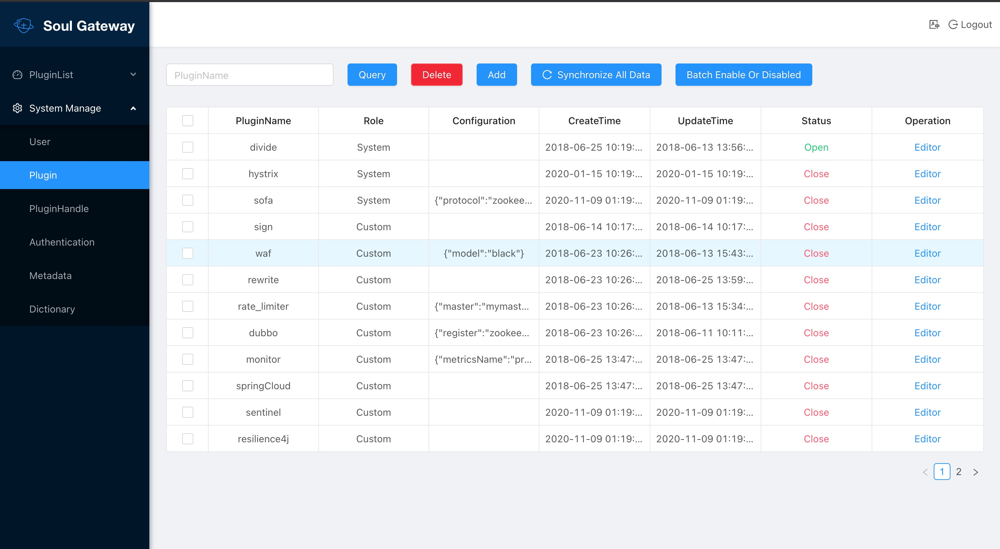
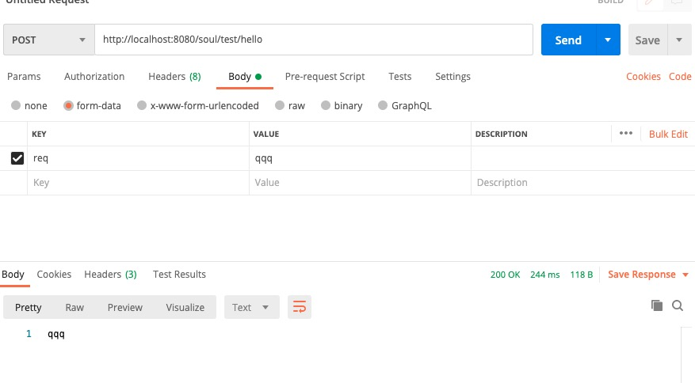
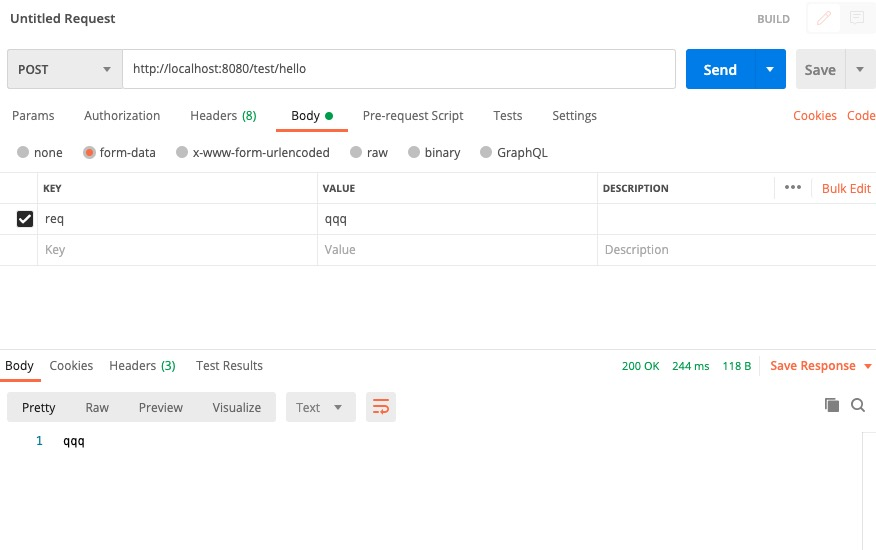

# Soul网关初探

## 目标

- Soul网关简介
- Soul网关特点
- Soul网关架构图
- 本地搭建Soul网关环境
- 使用Soul代理Http接口
- 总结

## Soul网关简介

&nbsp; &nbsp;这是一个`异步的`,`高性能的`,`跨语言的`,`响应式`的API网关。我希望能够有一样东西像灵魂一样，保护您的微服务。参考了Kong，Spring-Cloud-Gateway等优秀的网关后，站在巨人的肩膀上，Soul由此诞生！

## Soul网关特点

- 支持`各种语言(http协议)`，支持 dubbo，springcloud协议。

- 插件化设计思想，`插件热插拔`,`易扩展`。

- 灵活的`流量筛选`，能满足各种`流量控制`。

- 内置丰富的`插件支持`，`鉴权`，`限流`，`熔断`，`防火墙`等等。

- 流量配置动态化，性能极高，网关消耗在 1~2ms。

- 支持`集群部署`，`支持 A/B Test`, `蓝绿发布`。

## Soul网关架构图

  

## 本地搭建Soul网关环境

- **从github拉代码，本地编译**

```
> git clone https://github.com/Dromara/soul.git

> cd soul

> mvn -DskipTests clean install -U
```
&nbsp; &nbsp;由于项目比较大，执行上面install可能会花比较长的时间，所以install时候要跳过一些代码检查，单元测试等，执行下面命令即可

```
mvn clean package install -Dmaven.test.skip=true -Dmaven.javadoc.skip=true -Drat.skip=true -Dcheckstyle.skip=true
```

- **idea打开soul项目**

- **修改application.yml文件**

1.主要修改数据库配置的地址，用户名，密码
```
datasource:
    url: jdbc:mysql://你的地址:你的端口/soul?useUnicode=true&characterEncoding=utf-8&zeroDateTimeBehavior=CONVERT_TO_NULL&failOverReadOnly=false&autoReconnect=true&useSSL=false
    username: 你的用户名
    password: 你的密码
```

- **启动**

```
启动soul-admin项目SoulAdminBootstrap
启动soul-bootstrap项目SoulBootstrapApplication
```

- **访问 soul-admin**

```
http://localhost:9095/index.html

用户名：admin
密码：123456
```
启动成功，如丝般顺滑
 

## 使用Soul代理Http接口

### 基于springboot搭建自己soul网关

- **pom**

```
    <properties>
        <maven.compiler.source>8</maven.compiler.source>
        <maven.compiler.target>8</maven.compiler.target>
        <soul-version>2.2.1</soul-version>
    </properties>
    <dependencies>
        <dependency>
            <groupId>org.springframework.boot</groupId>
            <artifactId>spring-boot-starter-webflux</artifactId>
            <version>2.2.2.RELEASE</version>
        </dependency>
        <dependency>
            <groupId>org.springframework.boot</groupId>
            <artifactId>spring-boot-starter-actuator</artifactId>
            <version>2.2.2.RELEASE</version>
        </dependency>
        <!--soul gateway start-->
        <dependency>
            <groupId>org.dromara</groupId>
            <artifactId>soul-spring-boot-starter-gateway</artifactId>
            <version>${soul-version}</version>
        </dependency>
        <!--soul data sync start use websocket-->
        <dependency>
            <groupId>org.dromara</groupId>
            <artifactId>soul-spring-boot-starter-sync-data-websocket</artifactId>
            <version>${soul-version}</version>
        </dependency>
        <!--if you use http proxy start this-->
        <dependency>
            <groupId>org.dromara</groupId>
            <artifactId>soul-spring-boot-starter-plugin-divide</artifactId>
            <version>${soul-version}</version>
        </dependency>
        <dependency>
            <groupId>org.dromara</groupId>
            <artifactId>soul-spring-boot-starter-plugin-httpclient</artifactId>
            <version>${soul-version}</version>
        </dependency>
    </dependencies>
```

- **编写启动类**

```
@SpringBootApplication
public class SoulBootstrapApplication {

    public static void main(String[] args) {
        SpringApplication.run(SoulBootstrapApplication.class, args);
    }
}
```

- **启动soul-admin和SoulBootstrapApplication**

### 创建基于SpringBoot的SpringMvc工程，集成Soul网关

- **pom依赖**

```
        <!-- 启动springbootstarter支持 -->
        <dependency>
            <groupId>org.springframework.boot</groupId>
            <artifactId>spring-boot-starter</artifactId>
        </dependency>
        <!-- springboot web启动 -->
        <dependency>
            <groupId>org.springframework.boot</groupId>
            <artifactId>spring-boot-starter-web</artifactId>
            <scope>compile</scope>
        </dependency>
        <dependency>
            <groupId>org.dromara</groupId>
            <artifactId>soul-spring-boot-starter-client-springmvc</artifactId>
            <version>${soul-version}</version>
        </dependency>
```

- **yml配置**

```
server:
  port: 8085
soul:
  http:
    adminUrl: http://localhost:9095
    port: 8085
    contextPath: /soul
    appName: http
    full: false
```

- **Controller编写**

/test/** 代表当前类所有接口都会被代理
```
@RestController
@RequestMapping("/test")
@SoulSpringMvcClient(path = "/test/**")
public class SoulTestController {

    @PostMapping("/hello")
    public String hello(String req) {

        return req;
    }
}
```

- **启动访问**

- - 直连访问URL：http://localhost:8085/test/hello

  


- - soul代理URL：http://localhost:8080/soul/test/hello

  


## 总结

- Soul网关是一个`异步的`,`高性能的`,`跨语言的`,`响应式`的API网关；
- Soul网关支持协议丰富对于Http协议支持各种语言，对于Java常用的RPC调用也能狗支持；
- Soul网关采用插件化，热插拔的思想提供了丰富的插件，并且可以自己开发定制化插件；
- Soul网关性能很高；
- Soul集成简便，API自动发布。