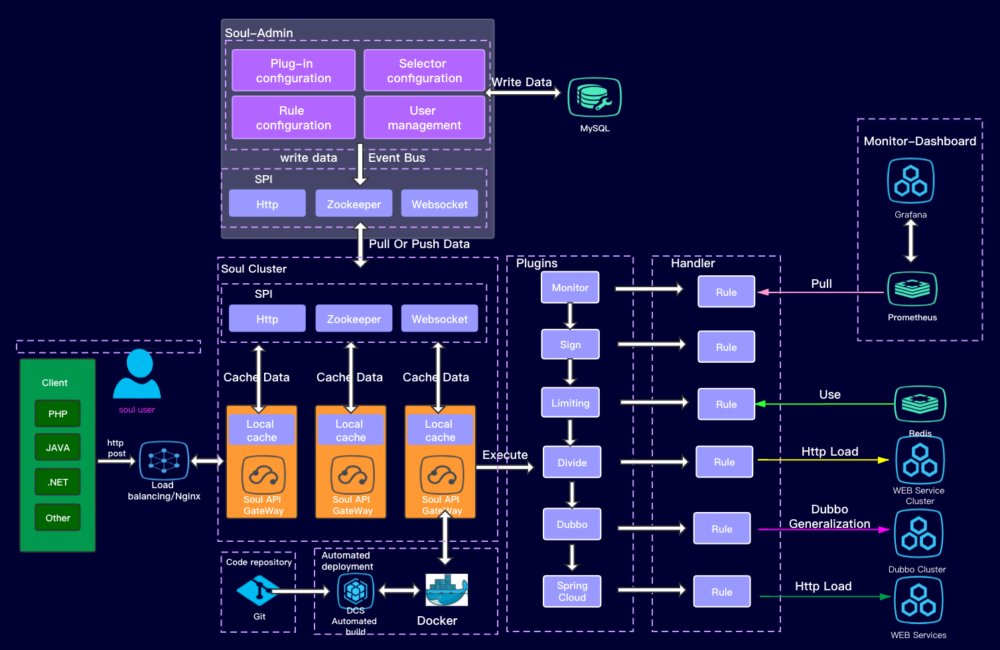

# Soul之搭建soul网关

## Soul网关简介

&nbsp; &nbsp;这是一个异步的,高性能的,跨语言的,响应式的API网关。我希望能够有一样东西像灵魂一样，保护您的微服务。参考了Kong，Spring-Cloud-Gateway等优秀的网关后，站在巨人的肩膀上，Soul由此诞生！

## Soul网关特点

- 支持各种语言(http协议)，支持 dubbo，springcloud协议。

- 插件化设计思想，插件热插拔,易扩展。

- 灵活的流量筛选，能满足各种流量控制。

- 内置丰富的插件支持，鉴权，限流，熔断，防火墙等等。

- 流量配置动态化，性能极高，网关消耗在 1~2ms。

- 支持集群部署，支持 A/B Test, 蓝绿发布。

## 架构图

  

 ## 本地启动

 - 从github拉代码，本地编译

```
> git clone https://github.com/Dromara/soul.git

> cd soul

> mvn -DskipTests clean install -U
```
&nbsp; &nbsp;由于项目比较大，执行上面install可能会花比较长的时间，所以install时候要跳过一些代码检查，单元测试等，执行下面命令即可

```
mvn clean package install -Dmaven.test.skip=true -Dmaven.javadoc.skip=true -Drat.skip=true -Dcheckstyle.skip=true
```

- idea打开soul项目

- 修改application.yml文件

主要修改数据库配置的地址，用户名，密码
```
datasource:
    url: jdbc:mysql://你的地址:你的端口/soul-open?useUnicode=true&characterEncoding=utf-8&zeroDateTimeBehavior=CONVERT_TO_NULL&failOverReadOnly=false&autoReconnect=true&useSSL=false
    username: 你的用户名
    password: 你的密码
```

- 启动

```
启动soul-admin项目SoulAdminBootstrap
启动soul-bootstrap项目SoulBootstrapApplication
```

- 访问 soul-admin

```
http://localhost:9095/index.html

用户名：admin
密码：123456
```
启动成功
 
