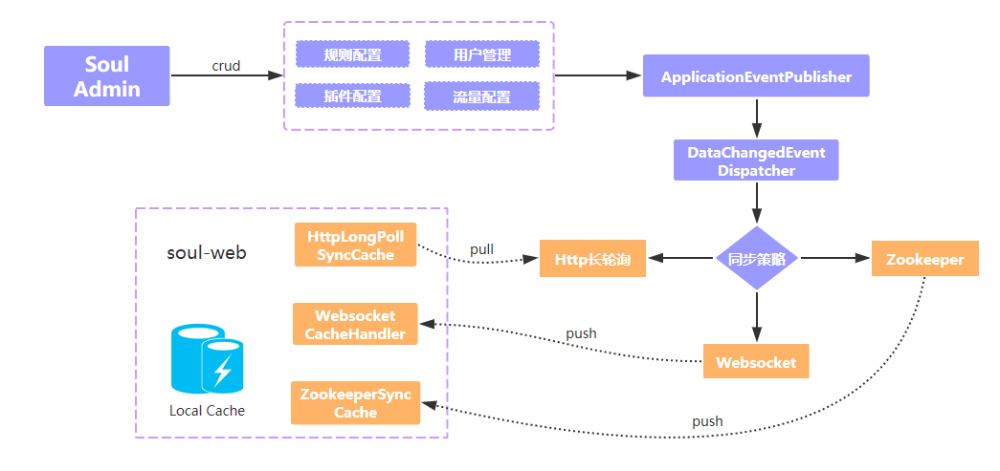
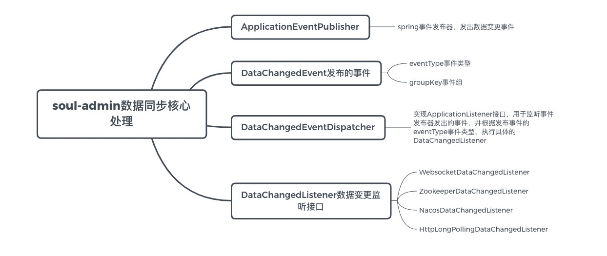
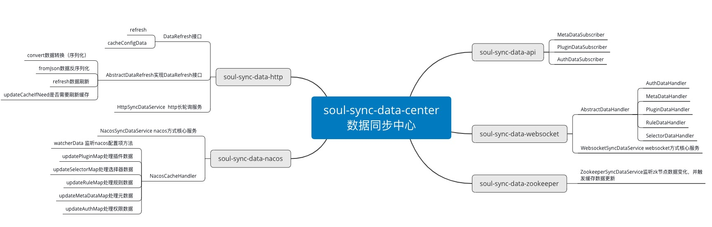
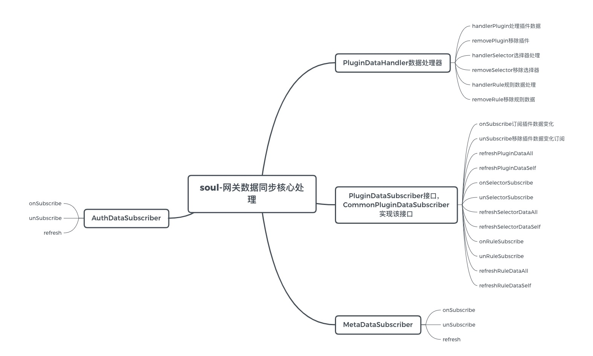

# soul网关源码分析之网关数据同步总结

## 目标

- 何为数据同步
- soul网关数据同步方式总结
- soul网关同步数据的类型总结
- soul网关数据同步流程总结
- soul网关数据同步核心处理接口总结

## 何为数据同步

&nbsp; &nbsp; 在具体总结之前，先来说一下，什么是soul网关的数据同步，soul网关又是同步的什么数据，我们知道soul网关实现了插件热插拔的方式，插件的数据，插件的选择器数据，规则数据可以选择持久化存储到数据库，但是对于网关来说，如果，每一次匹配数据的时候都要去数据库捞，那显然是不合适的，既然网关要做到高性能，那肯定不能每次都去数据库查数据，所以网关会将数据放在内存中，这里soul网关选择直接将数据缓存到JVM内存中。

&nbsp; &nbsp; 既然应用到了内存缓存，那就又产生了一个问题，就是当网关管理员在soul网关管理控制台（soul-admin）中变更插件、选择器、规则等数据时网关就要实时的能够感知到数据的变化，并通过某种方式将缓存刷新，对于一个业务网关来说，缓存数据的实时性要求是很高的，比如在soul网关控制台更新一个配置，网关一定要及时的就能够应用到变更的数据，针对于此，soul网关实现了一套网关数据刷新的机制，在写这篇总结的文章之前我是提前先对soul网关支持zookeeper，websocket，nacos方式的数据刷新进行了源码级别的分析，可以参考[websocket数据同步](https://juejin.cn/post/6918348851527188493)，[zookeeper数据同步](https://juejin.cn/post/6920630287202254855)，[nacos数据同步](https://juejin.cn/post/6920972242318786573)

## soul网关数据同步方式总结

&nbsp; &nbsp; soul网关支持的数据同步方式目前是有四种，分别是，基于websocket，基于zoookeeper，基于nacos，基于Http长轮训，这里简单介绍一下各种数据同步方式的特点

- websocket：使用websocket是基于websocket的全双工通信的特点，在数据产生变更的时候，直接通过websocket将变更数据和变更类型推送到soul网关，soul网关就可以对缓存进行更新，websocket的方式的缓存刷新是增量的
- zookeeper：zookeeper的方式是利用其临时节点的特性，soul-admin端变更数据同事在zookeeper上进行数据变更，soul网关watch节点的变化，在接收到节点变化的时候，通过拿到变化节点的数据进行缓存刷新，zookeeper也是增量的刷新缓存
- nacos：nacos实际上也是通过监听配置数据的变化实现的缓存刷新，在nacos上是每个类型一条配置数据，由于结构如此，所以nacos的方式进行数据同步时是全量的数据同步
- Http长轮询：Http长轮询的方式是soul网关主动发起http请求抓去配置数据变更，当soul-admin端没有数据变更时这条请求会被阻塞，如果超过60s没有响应，会响应为空，之后soul网关继续发起请求，http长轮询的方式也是全量的刷新缓存的

## soul网关同步数据的类型总结

&nbsp; &nbsp; soul网关同步的数据类型有以下五种

- AuthData：请求权限类参数，如验签，加签的参数
- PluginData：插件数据缓存，如，divide插件（处理Http请求）、Dubbo插件、限流、熔断、监控，高可用，防火强，sofa，springcloud等插件
- SelectorData：选择器数据，官网上是这么说的，选择器和规则是soul网关最灵魂的东西，掌握好它，可以对任何流量进行管理，的确，选择器相当于是对流量的第一次筛选
- RuleData：规则数据，对流量的最终筛选
- MetaData：元数据，元数据设计，目前最主要的是对dubbo的泛化调用上进行使用。

## soul网关数据同步流程总结

&nbsp; &nbsp; 这里先总体说一下数据同步流程，然后在根据支持的四种数据同步方式进行分别描述，数据同步首先是从soul-admin发起的，我们这里先不考虑代理接口的上线下线造成的数据同步，从soul-admin发起的数据变更，soul-admin会先将数据库中的数据进行变更，然后通过spring的时间发布机制将数据变动进行分发出去，根据配置的数据同步方式，执行使用对应的Listener将数据同步到中间件或者网关。

&nbsp; &nbsp; 网关层根据不同的数据同步方式，通过不同的机制拿到变更的数据，然后根据变更的类型，进行缓存的更新或删除

数据同步流程图解如下

## soul网关数据同步核心处理接口总结

- **soul-admin端数据同步核心**

- **soul网关端数据同步核心**

- - ***处理soul-admin网关数据同步通知***

- - ***网关缓存处理***

- - ***总结***

&nbsp; &nbsp; 网关缓存处理的核心是其实就是`soul-sync-data-api`中的`PluginDataSubscriber`，`AuthDataSubscriber`，`MetaDataSubscriber`，接收数据同步通知则是有不同的方式的模块的核心Service处理，例如WebSocket是`soul-sync-data-websocket`项目的`WebsocketSyncDataService`。