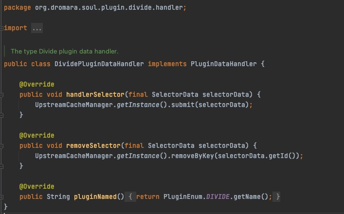

# soul网关源码分析之负载均衡，ip端口探活

## 目标

- divide插件底层原理，负载均衡，ip端口探活介绍
- 负载均衡原理分析
- ip端口探活端口分析
- 总结

## divide插件底层原理，负载均衡，ip端口检测介绍

&nbsp; &nbsp; `divide插件`是网关处理`http协议`请求的核心处理插件，divide插件是进行http正向代理的插件，所有http类型的请求，都是由该插件进行负载均衡的调用，所说的负载均衡就是divide插件根据负责均衡算法将请求转发到具体的一台后端机器上。soul-admin提供ip+端口的检测功能，在soul-admin 会有一个定时任务来扫描 配置的ip端口，如果发现下线，则会除该 ip + port。

&nbsp; &nbsp; 在之前的一篇文章中介绍过一个[http请求是如何被网关代理的](./soul_7.md)，在那篇文章中介绍了http协议的请求是通过divide插件处理的以及divide插件源码的分析，并且也对原理进行了一定的阐述（责任链）。

&nbsp; &nbsp; 所以本篇文章就对负载均衡以及ip端口探活方面进行进行更进一步的探讨

## soul网关负载均衡源码分析

首先，我们来看一下divide插件负载均衡模块，以及各个模块的概要介绍


- **LoadBalance接口**

&nbsp; &nbsp; 这是一个`SPI`的接口，所以soul网关的负载均衡实现是可扩展的，开发者可以根据自己的业务需求，系统情况来实现自己的负载均衡，该接口提供了一个select方法，返回一个`DivideUpstream`对象，该对象包含一下属性：
- upstreamHost：存活的ip
- protocol：协议
- upstreamUrl：请求地址
- weight：权重
- status：状态，默认是true
- timestamp：时间戳
- warmup：热度

```
@SPI
public interface LoadBalance {

    /**
     * this is select one for upstream list.
     *
     * @param upstreamList upstream list
     * @param ip ip
     * @return divide upstream
     */
    DivideUpstream select(List<DivideUpstream> upstreamList, String ip);
}
```

- **AbstractLoadBalance类**

&nbsp; &nbsp; 该类是soul网关支持的负载均衡算法的基类，实现了LoadBalance接口，重写select方法，提供了抽象方法doSelect，负载均衡的具体实现类会重写doSelect方法，doSelect方法才是具体的负载均衡算法的实现，还提供了一个`getWeight`方法，这里特别注意一下`calculateWarmupWeight`方法，该方法是根据时间差，接口热度，权重计算实际权重的方法。


- **HashLoadBalance**

&nbsp; &nbsp; 哈希算法的负载均衡的实现


- **RandomLoadBalance**

&nbsp; &nbsp; 随机算法的负载均衡的实现


- **RoundRobinLoadBalance**

&nbsp; &nbsp; 轮询算法的负载均衡的实现，这块


- **总结**

&nbsp; &nbsp; 看了soul网关负载均衡的设计，那么divide插件是怎么应用负载均衡的呢，其实仔细看之前的文章应该是可以发现额，在`DividePlugin`的`doExecute`中有这样一断代码，这其实就是divide插件在进行负载均衡了`DivideUpstream divideUpstream = LoadBalanceUtils.selector(upstreamList, ruleHandle.getLoadBalance(), ip);`

## soul网关divide插件的ip端口探活

&nbsp; &nbsp; 在soul-admin 会有一个定时任务来扫描 配置的ip端口，如果发现下线，则会除该 ip + port，不只是在soul-admin端会有定时的探活，在soul网关侧也有ip+端口的探活

soul-admin端是否开启ip端口探活和探活的频率是可以配置的如果不配置的默认是检查的，并且频率就是十秒，配置如下：
```
soul.upstream.check:true  默认为 ture，设置为false，不检测
soul.upstream.scheduledTime:10
```

&nbsp; &nbsp; soul网关侧是在divide插件的handler（DividePluginDataHandler）初始化的时候就初始化了，可以参考这个代码`DividePluginConfiguration`，这里看一下`DividePluginDataHandler`



&nbsp; &nbsp; 下面我们就分别看一下soul-admin侧和soul网关端探活的处理

- **soul-admin侧**

&nbsp; &nbsp; 在soul-admin端是通过`UpstreamCheckService`进行的探活的处理，下面这段代码可以看到`@PostConstruct`注解，该注解的作用是在spring项目启动容器初始化时候会被执行他的执行顺序是`Constructor >> @Autowired >> @PostConstruct`，下面代码是`UpstreamCheckService`，处理细节参考注释

```
    @PostConstruct
    public void setup() {
        // 获取divide插件
        PluginDO pluginDO = pluginMapper.selectByName(PluginEnum.DIVIDE.getName());
        if (pluginDO != null) {
            List<SelectorDO> selectorDOList = selectorMapper.findByPluginId(pluginDO.getId());
            for (SelectorDO selectorDO : selectorDOList) {
                List<DivideUpstream> divideUpstreams = GsonUtils.getInstance().fromList(selectorDO.getHandle(), DivideUpstream.class);
                if (CollectionUtils.isNotEmpty(divideUpstreams)) {
                    // 初始化要探活的选择器内容，UPSTREAM_MAP是一个全局的map
                    UPSTREAM_MAP.put(selectorDO.getName(), divideUpstreams);
                }
            }
        }
        // 是否要进行探活，一会说这个check
        if (check) {
            // 创建一个定时处理的线程池，这个线程池执行scheduled方法
            new ScheduledThreadPoolExecutor(Runtime.getRuntime().availableProcessors(), SoulThreadFactory.create("scheduled-upstream-task", false))
                    .scheduleWithFixedDelay(this::scheduled, 10, scheduledTime, TimeUnit.SECONDS);
        }
    }
```

```

    private void check(final String selectorName, final List<DivideUpstream> upstreamList) {
        List<DivideUpstream> successList = Lists.newArrayListWithCapacity(upstreamList.size());
        for (DivideUpstream divideUpstream : upstreamList) {
            // 根据URL，进行ip+端口探活
            final boolean pass = UpstreamCheckUtils.checkUrl(divideUpstream.getUpstreamUrl());
            if (pass) {
                // 如果状态是false，那么更新状态
                if (!divideUpstream.isStatus()) {
                    divideUpstream.setTimestamp(System.currentTimeMillis());
                    divideUpstream.setStatus(true);
                    log.info("UpstreamCacheManager check success the url: {}, host: {} ", divideUpstream.getUpstreamUrl(), divideUpstream.getUpstreamHost());
                }
                // 将存活的插件divideUpstream，存放到存活列表
                successList.add(divideUpstream);
            } else {
                // 设置divideUpstream状态为false
                divideUpstream.setStatus(false);
                log.error("check the url={} is fail ", divideUpstream.getUpstreamUrl());
            }
        }
        if (successList.size() == upstreamList.size()) {
            return;
        }
        if (successList.size() > 0) {
            // 更新探活的内容
            UPSTREAM_MAP.put(selectorName, successList);
            // 更新选择器
            updateSelectorHandler(selectorName, successList);
        } else {
            // 移除探活内容
            UPSTREAM_MAP.remove(selectorName);
            updateSelectorHandler(selectorName, null);
        }
    }
```

```
    private void updateSelectorHandler(final String selectorName, final List<DivideUpstream> upstreams) {
        SelectorDO selector = selectorService.findByName(selectorName);
        if (Objects.nonNull(selector)) {
            SelectorData selectorData = selectorService.buildByName(selectorName);
            if (upstreams == null) {
                selector.setHandle("");
                selectorData.setHandle("");
            } else {
                String handler = GsonUtils.getInstance().toJson(upstreams);
                selector.setHandle(handler);
                selectorData.setHandle(handler);
            }
            // 更新数据库数据
            selectorMapper.updateSelective(selector);
            // 发布数据变动通知
            eventPublisher.publishEvent(new DataChangedEvent(ConfigGroupEnum.SELECTOR, DataEventTypeEnum.UPDATE,
                    Collections.singletonList(selectorData)));
        }
    }
```

- **soul网关侧**

&nbsp; &nbsp; 在soul网关侧的探活代码主要是在`UpstreamCacheManager`，这个类是一个单例的，是通过`DividePluginDataHandler`的动作初始化的，代码处理逻辑和soul-admin侧类似，具体参考下面代码注释：

```
@Slf4j
public final class UpstreamCacheManager {
    // UpstreamCacheManager实例初始化
    private static final UpstreamCacheManager INSTANCE = new UpstreamCacheManager();

    private static final Map<String, List<DivideUpstream>> UPSTREAM_MAP = Maps.newConcurrentMap();

    private static final Map<String, List<DivideUpstream>> UPSTREAM_MAP_TEMP = Maps.newConcurrentMap();


    /**
     * 构造函数，初始化定时线程池执行scheduled
     */
    private UpstreamCacheManager() {
        boolean check = Boolean.parseBoolean(System.getProperty("soul.upstream.check", "false"));
        if (check) {
            new ScheduledThreadPoolExecutor(1, SoulThreadFactory.create("scheduled-upstream-task", false))
                    .scheduleWithFixedDelay(this::scheduled,
                            30, Integer.parseInt(System.getProperty("soul.upstream.scheduledTime", "30")), TimeUnit.SECONDS);
        }
    }

    /**
     * 返回单例的UpstreamCacheManager实例
     */
    public static UpstreamCacheManager getInstance() {
        return INSTANCE;
    }

    /**
     * 根据选择器ID，获取要探活的的选择器数据
     */
    public List<DivideUpstream> findUpstreamListBySelectorId(final String selectorId) {
        return UPSTREAM_MAP_TEMP.get(selectorId);
    }

    /**
     * 移除掉选择器数据
     */
    public void removeByKey(final String key) {
        UPSTREAM_MAP_TEMP.remove(key);
    }

    /**
     * 将要探活的数据存储或移除到全局缓存中
     */
    public void submit(final SelectorData selectorData) {
        final List<DivideUpstream> upstreamList = GsonUtils.getInstance().fromList(selectorData.getHandle(), DivideUpstream.class);
        if (null != upstreamList && upstreamList.size() > 0) {
            UPSTREAM_MAP.put(selectorData.getId(), upstreamList);
            UPSTREAM_MAP_TEMP.put(selectorData.getId(), upstreamList);
        } else {
            UPSTREAM_MAP.remove(selectorData.getId());
            UPSTREAM_MAP_TEMP.remove(selectorData.getId());
        }
    }

    private void scheduled() {
        if (UPSTREAM_MAP.size() > 0) {
            UPSTREAM_MAP.forEach((k, v) -> {
                List<DivideUpstream> result = check(v);
                if (result.size() > 0) {
                    UPSTREAM_MAP_TEMP.put(k, result);
                } else {
                    UPSTREAM_MAP_TEMP.remove(k);
                }
            });
        }
    }

    private List<DivideUpstream> check(final List<DivideUpstream> upstreamList) {
        List<DivideUpstream> resultList = Lists.newArrayListWithCapacity(upstreamList.size());
        for (DivideUpstream divideUpstream : upstreamList) {
            // 根据URL，进行ip+端口探活
            final boolean pass = UpstreamCheckUtils.checkUrl(divideUpstream.getUpstreamUrl());
            if (pass) {
                if (!divideUpstream.isStatus()) {
                    divideUpstream.setTimestamp(System.currentTimeMillis());
                    divideUpstream.setStatus(true);
                    log.info("UpstreamCacheManager detect success the url: {}, host: {} ", divideUpstream.getUpstreamUrl(), divideUpstream.getUpstreamHost());
                }
                resultList.add(divideUpstream);
            } else {
                // 设置divideUpstream状态为false
                divideUpstream.setStatus(false);
                log.error("check the url={} is fail ", divideUpstream.getUpstreamUrl());
            }
        }
        return resultList;

    }
}
```

**UpstreamCheckUtils探活代码分析**


## 总结

&nbsp; &nbsp; 该篇文章介绍了divide插件负载均衡和ip+端口探活的内容，soul网关divide插件提供了基于轮询、hash、随机三种算法的负载均衡实现，并且提供了SPI机制能够让开发者扩展实现负载均衡；soul网关divide插件和soul-admin提供了基于ip+端口的探活，当有机器上线或下线时会更新存活服务列表，实现了精准的负载均衡